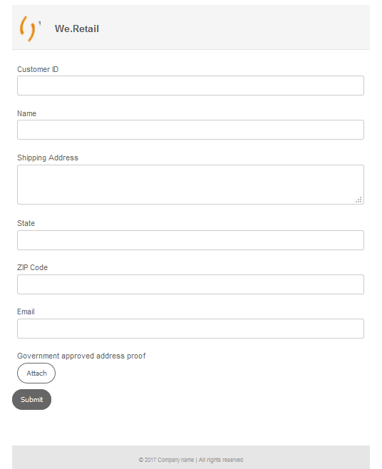

# 设置自适应表单的样式 {#do-not-publish-style-your-adaptive-form}

了解如何创建自定义主题、设计各个组件的样式以及在主题中使用Web字体

本教程是创建第一个自 [适应表单系列中的一个步骤](create-your-first-adaptive-form.md) 。 建议按照时间顺序按照系列来了解、执行和演示完整的教程用例。

## 关于教程  {#about-the-tutorial}

您可以使用主题为自适应表单提供独特的外观和样式。 您可以应用随自适应表单编辑器提供的现成主题，或创建您自己的自定义主题。 AEM Forms提供一 [个主题编辑](themes.md) ，以创建自定义主题。 单个主题可以为在手机、平板电脑或桌面上打开的同一自适应表单提供不同的外观。 使用主题编辑器不需要任何CSS或LESS知识，但是是需要的。

在教程结束时，您将学习：

* 将开箱即用主题应用于自适应表单
* 使用主题编辑器创建自适应表单的主题
* 设置单个组件的样式
* 奖励部分： 在自定义主题中使用Web字体

完成教程后，表单的外观将类似于以下内容：

## Before you start {#before-you-start}

在您的本地机器上下载标题样式和徽标图像，如下所示。 自适应表单 `shipping-address-add-update-form` 的标题使用标题样式和徽标图像。 标题样式图像显示在标题的右侧。

[获取文件](assets/header-style.png)

[获取文件](assets/logo-1.png)

## 第1步： 将主题应用于自适应表单 {#step-apply-a-theme-to-your-adaptive-form}

自适应表单编辑器提供多种现成主题。 如果您计划不为自适应表单使用自定义样式，则还可以使用现成的主题发布自适应表单。 主题独立于自适应表单。 您可以将同一主题应用于多个自适应表单。 要将主题应用于自适应表单，请执行以下操作：

1. 打开自适应表单进行编辑。

   [http://localhost:4502/editor.html/content/forms/af/shipping-address-add-update-form.html](http://localhost:4502/editor.html/content/forms/af/shipping-address-add-update-form.html)

1. 打开自适应表 **单容器的属性**。 在属性浏览器中，导航到“基 **本** ”> **“自适应表单主题”**。 自 **适应表单** “主题”字段列表所有现成的主题和自定义主题。 默认情况下，将应用画布主题。
1. 从自适应表单主题 **字段中选择一个主** 题。 例如， **调查主题**。 点  ，应用选定主题。

**图：** *具有默认主题的自适应表单*

**图：** *具有调查主题的自适应表单*

## 第2步： 更新自适应表单 {#step-update-your-adaptive-form}

上面显示的设计需要更改现有自适应表单的占位符文本和徽标。 执行以下步骤以进行所需的更改：

1. 更改标题的现有徽标和文本。 删除标志：

   1. 在表单编辑器中打开表单。

      [http://localhost:4502/editor.html/content/forms/af/shipping-address-add-update-form.html](http://localhost:4502/editor.html/content/forms/af/shipping-address-add-update-form.html)

   1. 点按标题组件中的徽标图像，然后点  cmppr属性。 在图像属性中，点按X以删除现有的徽标图像。
   1. 点按上传，选择logo.png，然  ，以保存更改。 图像已下载到“开始 [前”部分](/help/forms/using/style-your-adaptive-form.md#before-you-start) 。
   1. 点按标题文 `We.Retail`本，然 **编辑**。 将标题文本更改为 `we retail`。 仅在中应用粗 `we`体格 `we retail`式。

   

1. 删除标题并添加占位符文本：

   1. 点按客户ID字段，然后点按  属性。
   1. 将标题字段的内 **容复** 制到占 **位符文本字段** 。
   1. 删除标题字 **段的内** 容，然 。
   1. 对表单中的所有文本框、数字框和电子邮件字段重复前三个步骤。

   

## 第3步： 为自适应表单创建自定义主题 {#step-create-a-custom-theme-for-your-adaptive-form}

您可以使用 [主题编辑器](/help/forms/using/themes.md) ，创建自定义主题。 主题编辑器是功能强大的WYSIWYG编辑器。 将CSS应用于自适应表单的各个组件是一种可视方法。 它为自适应表单的组件和面板提供了更精细的控制。

主题是独立的实体，如自适应表单。 它包含自适应表单的组件和面板的样式(CSS)。 样式包括CSS属性，如背景颜色、状态颜色、透明度、对齐方式和大小。 应用主题时，指定的样式将应用于自适应表单的相应组件。

在本教程中，您将设置页眉和页脚、文本和数字组件、附件组件和按钮的样式。 让我们开始创建主题：

### 创建主题 {#create-a-theme}

1. 登录到AEM作者实例，并导航到 **Adobe Experience Manager** > **Forms** > **主题**。 默认URL为 [http://localhost:4502/aem/forms.html/content/dam/formsanddocuments-themes](http://localhost:4502/aem/forms.html/content/dam/formsanddocuments-themes)。
1. 点按 **[!UICONTROL 创建]** ，然后选 **[!UICONTROL 择主题]**。 此时将显示“创建主题”页，其中包含创建主题所需的字段。 “标题”和“名称”字段为必填字段：

   * **标题：** 指定主题的标题。 例如，全 **局主题。** 标题可帮助您从主题的列表中识别主题。
   * **名称：** 指定主题的名称。 例如， **Global-Theme。** 在存储库中创建具有指定名称的节点。 当您开始键入标题时，将自动生成名称字段的值。 您可以更改建议的值。 名称字段只能包含字母数字字符、连字符和下划线。 所有无效输入都替换为连字符。

1. 点按&#x200B;**创建**。将创建一个主题并显示一个用于打开表单进行编辑的对话框。 点按 **打开** ，在新选项卡中打开新创建的主题。 主题在主题编辑器中打开。 对于样式，主题编辑器使用随AEM Forms一起提供的现成自适应表单。

   有关使用主题编辑器UI的信息，请参 [阅关于主题编辑器](/help/forms/using/themes.md#aboutthethemeeditor)。

1. 点按 **主题选** 项  > **配**&#x200B;置。 在“ **预览表** ”字段中，选 **择shipping-address-add-update-form自适应表单，点按** aem_6_3_forms_save ****&#x200B;保存。 现在，主题编辑器已配置为使用您自己的自适应表单而不是默认的自适应表单。 点按 **取消** ，以返回主题编辑器。

   

   **图：** *带有shipping-add-update-form自适应表单的主题编辑器*

   

   **图：** *具有默认表单的自适应表单*

### 样式页眉和页脚 {#style-header-and-footer}

页眉和页脚为自适应表单提供了一致且独特的外观。 通常，页眉包含组织的徽标和名称，页脚包含版权信息，并且这些信息在组织的多种形式中保持不变。 要设置shipping-add-update-form自适应表单的页眉和页脚的样式，请执行以下操作：

1. 在“选择 **器** ”面板 **中导** 航“Header > Text”选项。 “选择器”面板位于主题编辑器的左侧。 如果该面板不可见，请点按“切  ”“切换侧面板”。

1. 在“文本”折叠 **面板中** ，设置以 。

   | 属性 | 值 |
   |---|---|
   | 字体系列 | Arial |
   | 字体颜色 | FFFFFF |
   | 字体大小 | 54px |

1. 点按标题构件并点 **按标题**。 用于设置标题构件样式的选项显示在左侧。 展开 **Dimension和位置** ，将Height设置为 **，然** 后点 `120px`按aem_6_3_forms_save 。
1. 展开标题构件的“背景”折叠面板，将“背 **景颜色** ”设置为 `F6921E.`

   将鼠标悬 **停在“图像和渐变** ” > **+添加**，点 **按图像**。 设置以下属性， 。

   | 属性 | 值 |
   |---|---|
   | 图像 | 上传header-style.png。 图像已下载到“开始 [前”部分](/help/forms/using/style-your-adaptive-form.md#before-you-start) 。 |
   | 位置 | 右下 |
   | 并排显示 | 不重复 |

1. 在主题编辑器中，点按标题中的标志，然后点按标 **题标志**。 展开“Dimension和位置”折叠面板，设置以下属 。

<table> 
 <tbody> 
  <tr> 
   <td>边距</td> 
   <td>值</td> 
  </tr> 
  <tr> 
   <td>边距</td> 
   <td> 
    <ul> 
     <li>顶部： 1.5rem</li> 
     <li>底部： -35px</li> 
     <li>左： 1rem<strong>  </strong></li> 
    </ul> 
<strong>提示：</strong> 点按链  接图标，为每个字段提供不同的值。  
 </td> 
  </tr> 
  <tr> 
   <td>高度</td> 
   <td>4.75rem</td> 
  </tr> 
 </tbody> 
</table>

1. 点按页脚构件并点 **按页脚**。 展开 **Background** accordion，将Background Color **设置为** ，然 `F6921E`后点按 。

### 设置数据捕获组件的样式并将背景应用于自适应表单 {#style-the-data-capture-component-and-apply-a-background-to-the-adaptive-form}

您可以在自适应表单中使用多个组件来捕获数据。 例如，文本框和数字框。 您可以为所有数据捕获组件提供相同的样式，或为每个组件提供单独的样式。 在本教程中，相同的样式将应用于数字框（客户ID、邮政编码）和文本框（客户ID、名称、送货地址、状态、电子邮件）。 设置数据捕获组件的样式：

1. 点按客户ID字段，然后点按字 **段构件** 选项。 设置以下属性， 。

<table> 
 <tbody> 
  <tr> 
   <td>折叠</td> 
   <td>属性</td> 
   <td>值</td> 
  </tr> 
  <tr> 
   <td>边框</td> 
   <td>边框颜色</td> 
   <td>A7A9AC</td> 
  </tr> 
  <tr> 
   <td>边框</td> 
   <td>边框半径 </td> 
   <td> 
    <ul> 
     <li>顶部： 7px  </li> 
     <li>对： 7px  </li> 
     <li>底部： 7px  </li> 
     <li>左： 7px  </li> 
    </ul> </td> 
  </tr> 
  <tr> 
   <td>文本</td> 
   <td>字体系列</td> 
   <td>Arial</td> 
  </tr> 
  <tr> 
   <td>文本</td> 
   <td>字体颜色</td> 
   <td>939598  </td> 
  </tr> 
  <tr> 
   <td>文本</td> 
   <td>字体大小</td> 
   <td>18px</td> 
  </tr> 
  <tr> 
   <td>Dimension和位置</td> 
   <td>宽度</td> 
   <td>60%</td> 
  </tr> 
  <tr> 
   <td>Dimension和位置</td> 
   <td>边距</td> 
   <td> 
    <ul> 
     <li>左： 10rem</li> 
    </ul> </td> 
  </tr> 
 </tbody> 
</table>

1. 点按客户ID字段上方的空白区域，然后点按响 **应式面板容器**。 将“背 **景** ”> **“背景颜色** ”设置为F1F2F2。 点 。

   

### 设置按钮样式 {#style-the-buttons}

您可以使用自定义主题将相同的样式应用于自适应表单的所有按钮，并 [使用内联样式](/help/forms/using/inline-style-adaptive-forms.md) 将样式应用于特定按钮。 设置按钮样式：

1. 点按提 **交按** 钮，然后点 **按按钮** 。 设置以下属性， 。

<table> 
 <tbody> 
  <tr> 
   <td>折叠</td> 
   <td>属性</td> 
   <td>值</td> 
  </tr> 
  <tr> 
   <td>背景</td> 
   <td>背景颜色</td> 
   <td>F6921E</td> 
  </tr> 
  <tr> 
   <td>边框  </td> 
   <td>边框颜色</td> 
   <td>F6921E</td> 
  </tr> 
  <tr> 
   <td>边框</td> 
   <td>边框半径 </td> 
   <td> 
    <ul> 
     <li>顶部： 7px  </li> 
     <li>对： 7px  </li> 
     <li>底部： 7px  </li> 
     <li>左： 7px</li> 
    </ul> </td> 
  </tr> 
  <tr> 
   <td>文本  </td> 
   <td>字体系列</td> 
   <td>Arial</td> 
  </tr> 
  <tr> 
   <td>文本</td> 
   <td>字体颜色</td> 
   <td>FFFFFF</td> 
  </tr> 
  <tr> 
   <td>文本</td> 
   <td>字体大小</td> 
   <td>18px</td> 
  </tr> 
 </tbody> 
</table>

1. [将自定义主题](/help/forms/using/style-your-adaptive-form.md#step-apply-a-theme-to-your-adaptive-form)“全局主题”应用于您的自适应表单。 如果样式未反映在自适应表单上，请清除浏览器缓存，然后重试。

   

## 第4步： 设置单个组件的样式 {#step-style-individual-components}

某些样式仅适用于特定组件。 此类组件采用自适应表单编辑器设置样式。

1. 打开自适应表单进行编辑。 [http://localhost:4502/editor.html/content/forms/af/shipping-address-add-update-form.html](http://localhost:4502/editor.html/content/forms/af/change-billing-shipping-address.html)
1. 在顶栏上，选择“样 **式** ”选项。

   

1. 点按 **附加** 按钮，然 editicon。 在Dimension和位置折叠面 **板中设置以** 下属性：

   | 属性 | 值 |
   |---|---|
   | 浮点数 | 左 |
   | 宽度 | 10% |

1. 点按政 **府批准的地址验证** ，然后点 editicon。 设置以下属性：

<table> 
 <tbody> 
  <tr> 
   <td>折叠</td> 
   <td>属性</td> 
   <td>值</td> 
  </tr> 
  <tr> 
   <td>尺寸及位置</td> 
   <td>浮点数</td> 
   <td>左</td> 
  </tr> 
  <tr> 
   <td>尺寸及位置</td> 
   <td>宽度</td> 
   <td>73%</td> 
  </tr> 
  <tr> 
   <td>尺寸及位置</td> 
   <td>边距</td> 
   <td> 
    <ul> 
     <li>左： 10px</li> 
    </ul> </td> 
  </tr> 
  <tr> 
   <td>尺寸及位置</td> 
   <td>高度</td> 
   <td>40px</td> 
  </tr> 
  <tr> 
   <td>尺寸及位置  </td> 
   <td>边距</td> 
   <td>  
    <ul> 
     <li>对： 2rem</li> 
     <li>左： 10rem </li> 
    </ul> </td> 
  </tr> 
  <tr> 
   <td>背景</td> 
   <td>背景颜色</td> 
   <td>FFFFFF</td> 
  </tr> 
  <tr> 
   <td>边框</td> 
   <td>边框宽度</td> 
   <td>1px</td> 
  </tr> 
  <tr> 
   <td>边框</td> 
   <td>边框样式</td> 
   <td>实线</td> 
  </tr> 
  <tr> 
   <td>边框</td> 
   <td>边框颜色</td> 
   <td>A7A9AC</td> 
  </tr> 
  <tr> 
   <td>边框</td> 
   <td>边框半径</td> 
   <td>7px</td> 
  </tr> 
  <tr> 
   <td>文本</td> 
   <td>字体系列</td> 
   <td>Arial</td> 
  </tr> 
  <tr> 
   <td>文本</td> 
   <td>字体颜色</td> 
   <td>BCBEC0</td> 
  </tr> 
  <tr> 
   <td>文本</td> 
   <td>字体大小</td> 
   <td>18px</td> 
  </tr> 
  <tr> 
   <td>文本</td> 
   <td>行高</td> 
   <td>2</td> 
  </tr> 
 </tbody> 
</table>

1. 点按 **提交** 按钮，然后  。 设置以下属性：

<table> 
 <tbody> 
  <tr> 
   <td>折叠</td> 
   <td>属性</td> 
   <td>值</td> 
  </tr> 
  <tr> 
   <td>Dimension和位置</td> 
   <td>浮点数</td> 
   <td>右</td> 
  </tr> 
  <tr> 
   <td>Dimension和位置</td> 
   <td>边距</td> 
   <td> 
    <ul> 
     <li>顶部： 5rem</li> 
     <li>对： 14rem</li> 
     <li>底部： 20px</li> 
     <li>左： 20px  </li> 
    </ul> </td> 
  </tr> 
  <tr> 
   <td>背景</td> 
   <td>背景颜色</td> 
   <td>F6921E</td> 
  </tr> 
  <tr> 
   <td>边框</td> 
   <td>边框颜色</td> 
   <td>F6921E</td> 
  </tr> 
 </tbody> 
</table>

## 第5步： 奖励部分： 在自定义主题中使用Web字体 {#step-bonus-section-using-web-fonts-in-a-custom-theme}

您可以使用各种字体来设计自适应表单。 在查看自适应表单的所有设备可能没有用于设计自适应表单的字体。 您可以使用Web字体服务将所需的字体交付到目标设备。

Adobe Typekit是一种Web字体服务。 您可以配置和使用带有自适应表单的服务。 以自适应形式使用Adobe Typekit:

>[!NOTE]
>
> “Adobe Fonts”，包含在Creative Cloud和其他订阅中。 [了解更多](https://fonts.adobe.com/).

1. 创建 [Adobe Typekit](https://typekit.com/) 帐户、创建工具包、将字体MyriadPro添加到工具包、发布工具包并获取工具包ID。 需要以自适应形式使用Adobe Typekit字体（Web字体）。
1. 在AEM Forms服务器中，导  **** Adobe Experience Manager **>** Hammer Tools  Deployment ********>Cloud Services>。 在Cloud Services页面上，导航到 **第三方服务** > **Typekit**，然后单击Typekit下 **的“立即配** 置”。 如果某个配置已可用，请单击+按钮以创建新实例。

   在创建配置对话框中，为配 **置指** 定标题，然后单 **击创建**。 您将被重定向到配置页面。 在出现的编辑组件对话框中，提供您的 **工具包ID** ，然后单 **击确定**。

1. 配置主题以使用TypeKit配置。 在创作实例中，在主 **题编辑器中** ，打开全局主题。 在主题编辑器中，导航到“主题选项”  配置”。 在“ **Typekit配置** ”字段中，选择工具包，然后单击 **保存**。

   添加到Typekit的字体可在所有组件的“文 **本** ”折叠面板中进行选择。

