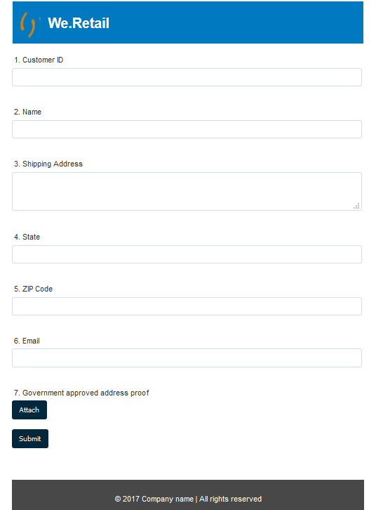
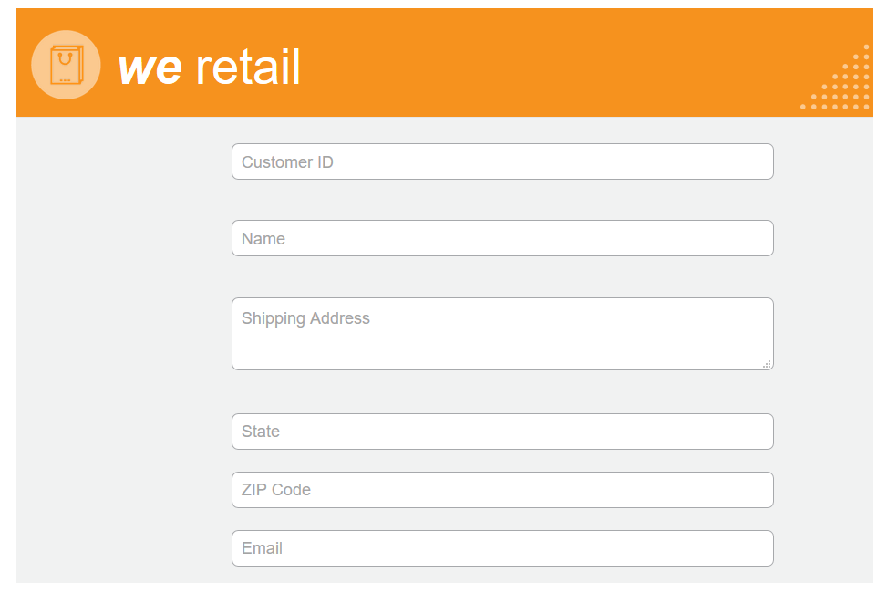

# 设置自适应表单的样式 {#do-not-publish-style-your-adaptive-form}

>[!CAUTION]
>
>AEM 6.4已结束扩展支持，本文档将不再更新。 有关更多详细信息，请参阅 [技术支助期](https://helpx.adobe.com/cn/support/programs/eol-matrix.html). 查找支持的版本 [此处](https://experienceleague.adobe.com/docs/).

了解如何创建自定义主题、设置单个组件的样式，以及在主题中使用Web字体

本教程是 [创建您的第一个自适应表单](create-your-first-adaptive-form.md) 系列。 建议按照时间顺序排列系列，以了解、执行和演示完整的教程用例。

## 关于教程  {#about-the-tutorial}

您可以使用主题为自适应表单提供独特的外观和样式。 您可以应用随自适应表单编辑器提供的开箱即用主题，也可以创建您自己的自定义主题。 AEM Forms提供 [主题编辑器](themes.md) 创建自定义主题。 单个主题可以为在移动设备、平板电脑或桌面上打开的同一自适应表单提供不同的外观。 使用主题编辑器不需要任何有关CSS或LESS的先前知识，但需要它。

在教程结束时，您将学习：

* 将现成主题应用于自适应表单
* 使用主题编辑器创建自适应表单的主题
* 设置单个组件的样式
* 附加部分：在自定义主题中使用Web字体

完成教程后，表单将类似于以下内容：

## 开始之前 {#before-you-start}

在本地计算机上下载标题样式和徽标图像（如下所示）。 标题 `shipping-address-add-update-form` 自适应表单使用标题样式和徽标图像。 标题样式图像显示在标题的右侧。

[获取文件](assets/header-style.png)

[获取文件](assets/logo-1.png)

## 步骤1:将主题应用于自适应表单 {#step-apply-a-theme-to-your-adaptive-form}

自适应表单编辑器提供了多个现成主题。 如果您计划不对自适应表单使用自定义样式，则还可以使用现成的主题发布自适应表单。 主题与自适应表单无关。 您可以将同一主题应用于多个自适应表单。 要将主题应用到自适应表单，请执行以下操作：

1. 打开自适应表单进行编辑。

   [http://localhost:4502/editor.html/content/forms/af/shipping-address-add-update-form.html](http://localhost:4502/editor.html/content/forms/af/shipping-address-add-update-form.html)

1. 的打开属性 **自适应表单容器**. 在属性浏览器中，导航到 **基本** > **自适应表单主题**. 的 **自适应表单主题** 字段中列出了所有现成主题和自定义主题。 默认情况下，将应用画布主题。
1. 从 **自适应表单主题** 字段。 例如， **调查主题**. 点按  以应用所选主题。

**图：** *具有默认主题的自适应表单*

**图：** *具有调查主题的自适应表单*

## 步骤2:更新自适应表单 {#step-update-your-adaptive-form}

上面显示的设计需要更改现有自适应表单的占位符文本和徽标。 执行以下步骤以进行所需的更改：

1. 更改标题的现有徽标和文本。 要删除徽标，请执行以下操作：

   1. 在表单编辑器中打开表单。

      [http://localhost:4502/editor.html/content/forms/af/shipping-address-add-update-form.html](http://localhost:4502/editor.html/content/forms/af/shipping-address-add-update-form.html)

   1. 点按标题组件中的徽标图像，然后点按  属性。 在图像属性中，点按X以删除现有徽标图像。
   1. 点按上传，选择logo.png，然后点按  以保存更改。 图像已在 [开始之前](/help/forms/using/style-your-adaptive-form.md#before-you-start) 中。
   1. 点按标题文本， `We.Retail`，然后点按  **编辑**. 将标题文本更改为 `we retail`. 仅对应用粗体格式 `we`in `we retail`.

   

1. 删除标题并添加占位符文本：

   1. 点按客户ID字段，然后点按  属性。
   1. 复制 **标题** 字段 **占位符文本** 字段。
   1. 删除 **标题** 字段和点按 .
   1. 对表单中的所有文本框、数字框和电子邮件字段重复上述三个步骤。

   

## 步骤3:为自适应表单创建自定义主题 {#step-create-a-custom-theme-for-your-adaptive-form}

您可以使用 [主题编辑器](/help/forms/using/themes.md) 创建自定义主题。 主题编辑器是功能强大的WYSIWYG编辑器。 将CSS应用于自适应表单的各种组件是一种可视化方法。 它为自适应表单的组件和面板的样式提供了更精细的控制。

主题是与自适应表单类似的单独实体。 它包含自适应表单的组件和面板的样式(CSS)。 样式包括CSS属性，如背景颜色、状态颜色、透明度、对齐方式和大小。 应用主题时，指定的样式将应用于自适应表单的相应组件。

在本教程中，您将设计页眉和页脚、文本和数字组件、附件组件和按钮的样式。 让我们从创建主题开始：

### 创建主题 {#create-a-theme}

1. 登录到AEM创作实例，然后导航到 **Adobe Experience Manager** > **Forms** > **主题**. 默认URL为 [http://localhost:4502/aem/forms.html/content/dam/formsanddocuments-themes](http://localhost:4502/aem/forms.html/content/dam/formsanddocuments-themes).
1. 点按 **[!UICONTROL 创建]** 选择 **[!UICONTROL 主题]**. 此时会出现“创建主题”页面，其中包含创建主题所需的字段。 标题和名称字段是必填字段：

   * **标题：** 指定主题的标题。 例如， **全球主题。** 标题可帮助您从主题列表中识别主题。
   * **名称：** 指定主题的名称。 例如， **全球主题。** 在存储库中创建具有指定名称的节点。 开始键入标题时，将自动生成名称字段的值。 您可以更改建议的值。 名称字段只能包含字母数字字符、连字符和下划线。 所有无效输入都将替换为连字符。

1. 点按 **创建**. 随即会创建主题，并显示一个用于打开表单进行编辑的对话框。 点按 **打开** 在新选项卡中打开新创建的主题。 主题在主题编辑器中打开。 对于样式，主题编辑器使用AEM Forms附带的现成自适应表单。

   有关使用主题编辑器UI的信息，请参阅 [关于主题编辑器](/help/forms/using/themes.md#aboutthethemeeditor).

1. 点按 **主题选项**  > **配置**. 在 **预览表单** 字段，选择 **shipping-add-add-update-form** 自适应表单，点按 ，点按 **保存**. 现在，主题编辑器配置为使用您自己的自适应表单，而不是默认的自适应表单。 点按 **取消** 返回主题编辑器。

   

   **图：** *带有shipping-add-update-form自适应表单的主题编辑器*

   

   **图：** *使用默认表单的自适应表单*

### 样式页眉和页脚 {#style-header-and-footer}

页眉和页脚为自适应表单提供了一致且独特的外观。 通常，页眉包含组织的徽标和名称，页脚包含版权信息，并且这些信息在组织的多种形式中保持相同。 要设置shipping-add-update-form自适应表单的页眉和页脚的样式，请执行以下操作：

1. 导航 **标题** > **文本** 选项。 “选择器”面板位于主题编辑器的左侧。 如果面板不可见，请点按  切换侧面板。

1. 在 **文本** 折叠面板和点按 .

   | 属性 | 价值 |
   |---|---|
   | 字体系列 | Arial |
   | 字体颜色 | FFFFFF |
   | 字体大小 | 54px |

1. 点按标题小组件，然后点按 **标题**. 用于设置标题小组件样式的选项将显示在左侧。 展开 **Dimension和位置** 折叠面板，设置 **高度** to `120px`，然后点按 .
1. 展开标题小组件的背景折叠面板，将 **背景颜色** to `F6921E.`

   将鼠标悬停在 **图像和渐变** > **+添加**，点按 **图像**. 设置以下属性并点按 .

   | 属性 | 价值 |
   |---|---|
   | 图像 | 上传header-style.png。 图像已在 [开始之前](/help/forms/using/style-your-adaptive-form.md#before-you-start) 中。 |
   | 位置 | 右下 |
   | 并排显示 | 不重复 |

1. 在主题编辑器中，点按标题中的徽标，然后点按 **标题徽标**. 展开Dimension和位置折叠面板，设置以下属性并点按 .

<table> 
 <tbody> 
  <tr> 
   <td>边距</td> 
   <td>价值</td> 
  </tr> 
  <tr> 
   <td>边距</td> 
   <td> 
    <ul> 
     <li>顶部：1.5rem</li> 
     <li>底部：-35px</li> 
     <li>左：1rem<strong>  </strong></li> 
    </ul> 
<strong>提示：</strong> 点按  链接图标，以便为每个字段提供不同的值。  
 </td> 
  </tr> 
  <tr> 
   <td>高度</td> 
   <td>4.75rem</td> 
  </tr> 
 </tbody> 
</table>

1. 点按页脚小组件，然后点按 **页脚**. 展开 **背景** 折叠面板，设置 **背景颜色** to `F6921E`，然后点按 .

### 设置数据捕获组件的样式，并将背景应用到自适应表单 {#style-the-data-capture-component-and-apply-a-background-to-the-adaptive-form}

您可以在自适应表单中使用多个组件来捕获数据。 例如，文本框和数字框。 您可以提供与所有数据捕获组件相同的样式，也可以为每个组件提供单独的样式。 在本教程中，数字框（客户ID、邮政编码）和文本框（客户ID、名称、送货地址、状态、电子邮件）应用了相同的样式。 要设置数据捕获组件的样式，请执行以下操作：

1. 点按客户ID字段，然后点按 **字段小组件** 选项。 设置以下属性并点按 .

<table> 
 <tbody> 
  <tr> 
   <td>折叠</td> 
   <td>属性</td> 
   <td>价值</td> 
  </tr> 
  <tr> 
   <td>边框</td> 
   <td>边框颜色</td> 
   <td>A7A9AC</td> 
  </tr> 
  <tr> 
   <td>边框</td> 
   <td>边框半径 </td> 
   <td> 
    <ul> 
     <li>顶部：7px  </li> 
     <li>对：7px  </li> 
     <li>底部：7px  </li> 
     <li>左：7px  </li> 
    </ul> </td> 
  </tr> 
  <tr> 
   <td>文本</td> 
   <td>字体系列</td> 
   <td>Arial</td> 
  </tr> 
  <tr> 
   <td>文本</td> 
   <td>字体颜色</td> 
   <td>939598  </td> 
  </tr> 
  <tr> 
   <td>文本</td> 
   <td>字体大小</td> 
   <td>18px</td> 
  </tr> 
  <tr> 
   <td>Dimension和位置</td> 
   <td>宽度</td> 
   <td>60%</td> 
  </tr> 
  <tr> 
   <td>Dimension和位置</td> 
   <td>边距</td> 
   <td> 
    <ul> 
     <li>左：10rem</li> 
    </ul> </td> 
  </tr> 
 </tbody> 
</table>

1. 点按客户ID字段上方的空区域，然后点按 **响应式面板容器**. 设置 **背景** > **背景颜色** 到F1F2F2。 点按 .

   

### 设置按钮的样式 {#style-the-buttons}

您可以使用自定义主题将相同的样式应用于自适应表单和 [内嵌样式](/help/forms/using/inline-style-adaptive-forms.md) 将样式应用到特定按钮。 要设置按钮的样式，请执行以下操作：

1. 点按 **提交** 按钮，然后点按 **按钮** 选项。 设置以下属性并点按 .

<table> 
 <tbody> 
  <tr> 
   <td>折叠</td> 
   <td>属性</td> 
   <td>价值</td> 
  </tr> 
  <tr> 
   <td>背景</td> 
   <td>背景颜色</td> 
   <td>F6921E</td> 
  </tr> 
  <tr> 
   <td>边框  </td> 
   <td>边框颜色</td> 
   <td>F6921E</td> 
  </tr> 
  <tr> 
   <td>边框</td> 
   <td>边框半径 </td> 
   <td> 
    <ul> 
     <li>顶部：7px  </li> 
     <li>对：7px  </li> 
     <li>底部：7px  </li> 
     <li>左：7px</li> 
    </ul> </td> 
  </tr> 
  <tr> 
   <td>文本  </td> 
   <td>字体系列</td> 
   <td>Arial</td> 
  </tr> 
  <tr> 
   <td>文本</td> 
   <td>字体颜色</td> 
   <td>FFFFFF</td> 
  </tr> 
  <tr> 
   <td>文本</td> 
   <td>字体大小</td> 
   <td>18px</td> 
  </tr> 
 </tbody> 
</table>

1. [应用自定义主题](/help/forms/using/style-your-adaptive-form.md#step-apply-a-theme-to-your-adaptive-form)，转到自适应表单。 如果样式未反映在自适应表单上，请清理浏览器缓存，然后重试。

   

## 步骤4:设置单个组件的样式 {#step-style-individual-components}

某些样式仅适用于特定组件。 此类组件在自适应表单编辑器中设置样式。

1. 打开自适应表单进行编辑。 [http://localhost:4502/editor.html/content/forms/af/shipping-address-add-update-form.html](http://localhost:4502/editor.html/content/forms/af/change-billing-shipping-address.html)
1. 在顶部栏中，选择 **样式** 选项。

   

1. 点按 **附加** 按钮，然后点按 图标。 在 **Dimension和位置** 折叠面板：

   | 属性 | 价值 |
   |---|---|
   | 浮点数 | 左 |
   | 宽度 | 10% |

1. 点按 **政府批准的地址证明** 选项，然后点按 图标。 设置以下属性：

<table> 
 <tbody> 
  <tr> 
   <td>折叠</td> 
   <td>属性</td> 
   <td>价值</td> 
  </tr> 
  <tr> 
   <td>尺寸及位置</td> 
   <td>浮点数</td> 
   <td>左</td> 
  </tr> 
  <tr> 
   <td>尺寸及位置</td> 
   <td>宽度</td> 
   <td>73%</td> 
  </tr> 
  <tr> 
   <td>尺寸及位置</td> 
   <td>边距</td> 
   <td> 
    <ul> 
     <li>左：10px</li> 
    </ul> </td> 
  </tr> 
  <tr> 
   <td>尺寸及位置</td> 
   <td>高度</td> 
   <td>40px</td> 
  </tr> 
  <tr> 
   <td>尺寸及位置  </td> 
   <td>边距</td> 
   <td>  
    <ul> 
     <li>对：2rem</li> 
     <li>左：10rem </li> 
    </ul> </td> 
  </tr> 
  <tr> 
   <td>背景</td> 
   <td>背景颜色</td> 
   <td>FFFFFF</td> 
  </tr> 
  <tr> 
   <td>边框</td> 
   <td>边框宽度</td> 
   <td>1px</td> 
  </tr> 
  <tr> 
   <td>边框</td> 
   <td>边框样式</td> 
   <td>实线</td> 
  </tr> 
  <tr> 
   <td>边框</td> 
   <td>边框颜色</td> 
   <td>A7A9AC</td> 
  </tr> 
  <tr> 
   <td>边框</td> 
   <td>边框半径</td> 
   <td>7px</td> 
  </tr> 
  <tr> 
   <td>文本</td> 
   <td>字体系列</td> 
   <td>Arial</td> 
  </tr> 
  <tr> 
   <td>文本</td> 
   <td>字体颜色</td> 
   <td>BCBEC0</td> 
  </tr> 
  <tr> 
   <td>文本</td> 
   <td>字体大小</td> 
   <td>18px</td> 
  </tr> 
  <tr> 
   <td>文本</td> 
   <td>行高</td> 
   <td>2</td> 
  </tr> 
 </tbody> 
</table>

1. 点按 **提交** 按钮，然后点按  图标。 设置以下属性：

<table> 
 <tbody> 
  <tr> 
   <td>折叠</td> 
   <td>属性</td> 
   <td>价值</td> 
  </tr> 
  <tr> 
   <td>Dimension和位置</td> 
   <td>浮点数</td> 
   <td>右</td> 
  </tr> 
  <tr> 
   <td>Dimension和位置</td> 
   <td>边距</td> 
   <td> 
    <ul> 
     <li>顶部：5rem</li> 
     <li>对：14rem</li> 
     <li>底部：20px</li> 
     <li>左：20px  </li> 
    </ul> </td> 
  </tr> 
  <tr> 
   <td>背景</td> 
   <td>背景颜色</td> 
   <td>F6921E</td> 
  </tr> 
  <tr> 
   <td>边框</td> 
   <td>边框颜色</td> 
   <td>F6921E</td> 
  </tr> 
 </tbody> 
</table>

## 步骤5:附加部分：在自定义主题中使用Web字体 {#step-bonus-section-using-web-fonts-in-a-custom-theme}

您可以使用各种字体来设计自适应表单。 查看自适应表单的所有设备可能没有设计自适应表单所使用的字体。 您可以使用Web字体服务将所需的字体交付到目标设备。

Adobe Typekit是一项web字体服务。 您可以对自适应表单配置并使用该服务。 要在自适应表单中使用Adobe Typekit，请执行以下操作：

>[!NOTE]
>
> Typekit现在称为Adobe Fonts，包含在Creative Cloud和其他订阅中。 [了解详情](https://fonts.adobe.com/).

1. 创建 [Adobe Typekit](https://typekit.com/) 帐户、创建工具包、将字体Myriad Pro添加到工具包、发布工具包并获取工具包ID。 在自适应表单中使用Adobe Typekit字体（Web字体）是必需的。
1. 在AEM Forms服务器中，导航到  **Adobe Experience Manager** > **工具**  > **部署** > **Cloud Services**. 在“Cloud Services”页面上，导航到 **第三方服务** > **Typekit**，然后单击 **配置** 在Typekit下。 如果配置已可用，请单击+按钮以创建新实例。

   在创建配置对话框中，指定 **标题** ，然后单击 **创建**. 系统会将您重定向到配置页面。 在显示的编辑组件对话框中，提供 **套件ID** 单击 **确定**.

1. 配置主题以使用TypeKit配置。 在创作实例上，打开 **全球主题** 在主题编辑器中。 在主题编辑器中，导航到主题选项  >配置。 在 **Typekit配置** 字段，选择工具包，然后单击 **保存**.

   添加到Typekit的字体可在 **文本** 折叠面板。
