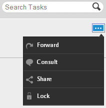

# 使用待办事项列表 {#working-with-to-do-lists}

>[!CAUTION]
>
>AEM 6.4已结束扩展支持，本文档将不再更新。 有关更多详细信息，请参阅 [技术支助期](https://helpx.adobe.com/cn/support/programs/eol-matrix.html). 查找支持的版本 [此处](https://experienceleague.adobe.com/docs/).

在查看待办事项列表时，您可能会看到业务流程中分配给您的任务，或者分配给您所属的任何组的任务，或者分配给其他用户的共享任务。 您可以根据需要打开、处理和完成任务，例如批准或拒绝请求或添加更多信息。 完成任务后，该任务将发送给业务流程中的下一个人，

## 关于待办事项列表 {#about-todo-lists}

AEM Forms工作区有以下三种类型的待办事项列表：

* 单个列表，其中包含直接分配给您的任务。
* 组列表，其中包含分配给组的任务。 组的任何成员都可以打开并完成任务。 要打开任务，组成员必须首先声明该任务。
* 共享列表，其中包含分配给与您共享其待办事项列表的用户（可能还包括其他用户）的任务。 任何共享列表的用户都可以声明、打开和完成共享任务。

通过单击将指针悬停在任务上时显示的图标，可以执行某些操作，而无需打开任务。

>[!NOTE]
>
>感叹号图标表示任务具有高优先级。

## 典型任务 {#typical-tasks}

打开并处理任务时，您可用的工具取决于该任务。 不同的任务要求您执行不同的操作，因此，某些工具可能可供您使用，也可能不可用。 您可能会收到的典型任务如下所述。

**提供信息**:您会收到一项任务，要求您填写并提交表单。

**审阅信息**:您会收到一项任务，该任务要求您查看信息并注销内容。

**多用户审阅**:您会在其他用户收到任务的同时收到任务。 您和其他用户必须提供信息或查看内容，或同时查看两者。 此类任务可以使用以下工具：

* 查看任务的说明
* 查看已分配任务的所有用户的完成状态
* 查看分配了任务的所有用户的评论
* 自行向任务添加注释

可用于上述任何任务的其他工具包括：

* 转发
* 共享
* 咨询
* 返回
* 注释
* 附件

## 打开任务 {#opening-tasks}

您可以从待办事项列表中打开和锁定任务，或声明，并从组或共享待办事项列表中打开任务。 打开任务时，该任务将显示在主窗格中。 其他任务显示在待办事项列表旁的任务列表中。

如果存在“任务摘要URL”，则默认情况下会打开“任务摘要”视图，而不是与任务关联的表单。 即使用户在“分配任务”中启用“在最大化模式下打开表单”选项，表单也不会在最大化模式下打开。

>[!NOTE]
>
>在打开任务时，根据任务默认值，关联的表单可能会以完整视图显示。

### 从列表中打开并锁定任务 {#open-and-lock-a-task-from-your-list}

从待办事项列表中打开任务时，如果您的列表已共享，则可以锁定该任务，以阻止有权访问您列表的其他用户处理该任务。

1. 在待办事项页面的左窗格中，选择您的待办事项列表。 所有任务都显示在中间窗格中。

   >[!NOTE]
   >
   >您可以通过在待办事项列表中选择流程类型来筛选任务。 您可以选择待办事项列表，以再次查看待办事项列表中的所有任务。

1. 如有必要，请锁定任务。 要锁定任务，请单击任务上的“所有选项”图标，然后选择“锁定”。 将指针悬停在任务上，可使选项可用。

   >[!NOTE]
   >
   >在任务打开后，您还可以在任意选项卡上锁定或解锁任务。

   

   任务上的“所有选项”菜单

1. 单击以打开任务。

### 从共享或组列表中打开并声明任务 {#open-and-claim-a-task-from-a-shared-or-group-list}

当您打开并从组或共享列表声明任务时，该任务会从组或共享列表移入您的单个待办事项列表。 有权访问该列表的其他用户无法处理该任务。

1. 在待办事项页面的左窗格中，选择组或共享待办事项列表。 所有任务都显示在中间窗格中。
1. 执行以下步骤之一：

   * 要从组或共享的待办事项列表中声明任务（不打开任务），请单击 **索赔** 将指针悬停在任务上。 或者，当任务打开时，“声明”按钮在任务窗格下方的操作栏中可用。 申请后，任务会从组或共享的待办事项列表移动到您的列表。
   * 要从组或共享待办事项列表中声明并打开任务，请单击 **声明和打开**.

## 处理任务 {#working-with-tasks}

打开任务后，主窗格中显示的选项卡以及可供您使用的工具取决于任务。 您可能看到的选项卡如下所示：

**任务摘要**:当任务打开时，“任务摘要”窗格允许您使用在分配任务步骤的流程中指定的URL来显示有关任务的信息（如果存在）。 使用任务摘要窗格可以显示任务的其他相关信息，以便为AEM Forms工作区的最终用户添加更多价值。 如果任务摘要URL不存在，则此选项卡不可用。

**详细信息**:提供有关当前任务及其所属进程的一些信息。

**表单**:显示与任务关联的表单。 表单可以包含多种文件类型，包括PDF、HTML、指南和SWF文件。 该表单看起来类似于常规的可打印或基于Web的表单，或指导您完成一系列向导式面板以收集信息。

**历史**:列出属于流程实例的任务以及每个任务的关联表单、任务分配和附件。

**附件**:显示与任务关联的现有附件，并在必要时添加附件。

**注释**:显示与任务关联的现有注释，并根据需要添加注释。

处理任务时，您可能看到的工具以及可以执行的操作如下所述。

### 转发、共享或咨询任务 {#forward-share-or-consult-on-a-task}

您可以将任务连同任何注释或附件一起转发给其他用户，或共享该任务或与其他用户协商该任务。 如果更改与任务关联的表单数据，请在转发、共享或查阅任务之前，将表单另存为草稿。 否则，将在不更新表单的情况下发送任务。 转发并共享任务后，接收任务的用户可以声明并完成任务或将任务返回给您。 如果您查阅某项任务，用户只能将该任务返回给您。

1. 如果更改了与要保留的任务关联的表单，请单击 **保存**. 保存选项位于每个选项卡底部的操作栏中。 否则，将在不更新表单的情况下发送任务。

   >[!NOTE]
   >
   >保存按钮对于某些表单不可用，具体取决于您正在处理的任务。

1. 在任意选项卡上，单击以下按钮之一：

   * **转发**
   * **共享**
   * **咨询**

   >[!NOTE]
   >
   >根据任务，您还可以从待办事项列表中执行这些操作，而无需打开任务。

1. 在弹出对话框窗口中，搜索并选择要转发、共享或查阅任务的用户名称。

### 返回任务 {#return-a-task}

1. 在任意选项卡上，单击 **返回**. 该任务将返回到先前将任务转发给您、与您共享或咨询任务的用户的待办事项列表。

### 使任务脱机 {#take-a-task-offline}

您可以脱机处理任务，稍后从Adobe®Reader®或Adobe®Acrobat®专业或Adobe®Acrobat®标准中提交其表单。 提交表单后，您的电子邮件客户端将使用相应的服务器电子邮件地址启动。 然后，您可以通过电子邮件将填写好的表单发送到服务器。

1. 在任意选项卡上，单击 **脱机**.
1. 指定要在下保存表单的文件名，然后单击 **保存**. 与任务关联的表单将保存在本地，并且该任务会一直保留在待办事项列表中，直到提交表单为止。

### 处理附件 {#work-with-attachments}

您可以在本地添加、更新、删除或保存任何附件。

**添加附件**

1. 在 **附件** ，单击 **浏览** 来选择要附加的文件。
1. 选择 **权限** 参与流程的其他用户的附件级别。 如果您选择 **读取**，则其他用户可以将文件保存在本地。 如果您选择其中一个编辑权限，其他用户也可以上传新文件以替换您的附件。

   >[!NOTE]
   >
   >您还可以在附件旁边添加注释。

1. 单击 **上传**. 文件已附加到表单。

**查看附件**

1. 在 **附件** 选项卡上，单击要查看的附件的文件名。

**在本地保存附件**

1. 单击附件以将其打开。 在本地保存打开的附件。

**更新附件**

1. 单击 **编辑** 中。 通过单击 **浏览**.

**删除附件**

1. 单击 **删除** 附件。

### 保存您的工作而不完成任务 {#save-your-work-without-completing-the-task}

1. 在任意选项卡上，点按 **保存**.

   出现“另存为草稿”对话框。 草稿的默认名称是任务模板中的任务名称。

   

   >[!NOTE]
   >
   >您可以将工作区配置为定期自动保存用户输入的信息作为草稿。 如果启用了自动保存并且用户正在处理草稿，则会定期保存草稿。 如果自动保存，则会自动获取任务的默认名称。
   >
   >有关更多信息，请参阅定期保存草稿(位于 [管理首选项](/help/forms/using/getting-started-livecycle-html-workspace.md).

1. 在另存为草稿对话框中，为任务指定唯一的名称，然后点按 **确定**.

   

   草稿将使用指定的名称保存。 任务将保留在“待办事项”列表中，并且您在表单中所做的任何更改都将保存在“草稿”文件夹中。 此外，在待办事项列表中，您可以使用草稿名称搜索草稿以继续处理该草稿。

   

## 完成任务 {#completing-tasks}

任务的完成方式取决于任务本身以及您在过程中的角色。 系统可能会要求您批准或拒绝请求、提供内容、审核和验证信息，或者指示您已采取行动。

您可以通过各种方式完成任务：

* 使用任何选项卡中可用的操作
* 使用表单本身中构建的操作
* 从待办事项列表中，不打开任务

   注意：如果 `isMustOpenToComplete` 字段 `Assign Task` 步骤（在Workbench中）。

* 通过电子邮件，如果您收到电子邮件通知

完成任务后，根据任务的不同，可能会显示确认对话框，重申您的操作。 例如，您可能会看到一个对话框，提示您验证所提供信息的有效性。

>[!NOTE]
>
>如果您更改了某个任务，但尚未准备好完成该任务，则可以单击“保存”将您的工作另存为草稿，稍后再返回到该草稿。

### 完成任务 {#complete-a-task}

1. 执行以下步骤之一：

   * 选择该任务，然后单击相应按钮以执行该流程中列表底部所需的下一步。
   * 如果表单没有按钮，并且AEM Forms工作区中的“完成”按钮可用，请单击 **完成**.
   * 如果表单包含按钮且AEM Forms工作区中的“完成”按钮不可用，请单击表单上的相应按钮，以完成该过程中需要的下一步。

   如果表单没有按钮，并且AEM Forms工作区中的“完成”按钮不可用，则会显示一条消息，指示无法提交表单。

1. 如果出现“确认”对话框，请执行以下操作之一：

   * 单击 **确定** 如果您已完成任务并准备好注销该任务。
   * 单击 **取消** 如果您希望返回任务，但尚未准备好在其上签名。

>[!NOTE]
>
>在表单中使用流程属性时，您可能会在HTML表单中看到“提交”按钮。 当同一表单呈现为PDF时，此按钮不可见。 要完成任务，请单击位于AEM Forms工作区底部的“提交”按钮，该按钮位于表单外，而不位于表单内的“提交”按钮上。

### 批量批准任务 {#bulk-approve-tasks}

您可以从待办事项列表中提交多个任务。 只能同时提交具有相同任务名称和相同路由选项的同一进程的任务。

>[!NOTE]
>
>如果在设计流程时未在Workbench的“分配任务”步骤中选择isMustOpenToComplete字段，则此选项可用。

1. 在待办事项页面的左窗格中，选择您的待办事项列表。 所有任务都显示在中间窗格中。
1. 选择 **启用批量模式**. 列表中任务前面会显示复选框。

   >[!NOTE]
   >
   >在设计流程时，此选项不适用于在Workbench的“分配任务”步骤中为其选择了isMustOpenToComplete字段的任务。 “待办事项”列表中此类任务的复选框始终处于禁用状态。

1. 选择要批量审批的任务。 可以选择同一进程、具有相同任务名称和相同路由选项的多个任务。 选择一项任务进行审批后，将只启用具有相同进程、具有相同任务名称和相同路由选项的任务。 其余部分则被禁用。

   

1. 单击可用的提交选项。 将提交所选任务。

   

## 通过电子邮件参与任务 {#participating-in-tasks-through-email}

您可以通过电子邮件接收和完成任务。 通过电子邮件参与任务，无需定期检查待办事项列表以查找新任务，也无需检查跟踪页面以了解任务的状态。

首先，设置AEM Forms工作区首选项以接收电子邮件通知。 AEM Forms工作区可以为“待办事项”列表或您所属的任何组“待办事项”列表中的任务发送电子邮件通知。 管理员可确定何时发送电子邮件通知消息以及接收者。

电子邮件可能包含在AEM Forms工作区中打开任务的链接、用于任务的表单的附件或通过电子邮件完成任务的操作。 如果电子邮件中包含表单，则可以打开表单并完成任务（如果表单中包含用于完成任务的按钮）。 如果完成任务的操作包含在电子邮件中，您可以通过单击电子邮件中的操作或通过回复电子邮件来完成任务，该操作键入为电子邮件正文中的第一行。

>[!NOTE]
>
>要将工作区配置为使用相应的电子邮件模板，请参阅 [AEM Forms JEE管理员指南](https://help.adobe.com/en_US/AEMForms/6.1/AdminHelp/).

通过电子邮件完成任务时，该任务会从AEM Forms工作区的“待办事项”列表中删除。

>[!NOTE]
>
>如果用户未在浏览器的AEM Forms工作区中登录，并打开指向待办事项任务的链接，则直接待办事项链接无法打开，并显示异常。 在单击电子邮件中的链接之前，先登录AEM Forms工作区。

>[!NOTE]
>
>您无法转发电子邮件通知以将任务分配给其他人。 您只能从AEM Forms工作区内将任务转发给其他用户。

### 接收电子邮件通知消息 {#receive-email-notification-messages}

1. 单击 **首选项**.
1. 在 **通过电子邮件通知任务事件** 列表，选择 **是**.
1. 要将表单和数据包含在电子邮件中，请在 **在电子邮件中附加Forms** 列表，选择 **是**.

## 通过移动设备参与任务 {#participating-in-tasks-through-mobile-devices}

您可以使用AEM Forms工作区应用程序从移动设备参与任务。 在安装应用程序之前，请与系统管理员联系，以确保您的组织支持使用AEM Forms工作区应用程序。

## 关于截止时间和提醒 {#about-deadlines-and-reminders}

A *截止时间* 确定必须完成任务的日期和时间。 当截止时间过后，服务器将任务路由到进程中的下一步（可以是其他用户的待办事项列表），然后任务上会显示截止时间图标。 无论与流程关联的规则如何，都会显示截止日期图标。

A *提醒* 通知您需要您注意的任务。 提醒会在预定时间发生，然后会定期发生，直到您完成相关任务为止。 当您收到提醒时，任务上会显示提醒图标。

业务流程决定截止时间和提醒的行为和时间。 并非所有流程都有截止日期和提醒。 管理员指定是否发送电子邮件通知以指定截止日期和提醒。 您可以设置是否接收电子邮件通知的首选项。

## 处理组和共享队列中的任务 {#working-with-tasks-from-group-and-shared-queues}

分配给您的所有任务都会显示在待办事项列表（队列）中。

您有权访问的任何组和共享的待办事项列表也会显示在待办事项页面的左侧窗格中。 您可以从您有权访问的任何待办事项列表中完成任务。

组待办事项列表可能有多个成员。 管理员可根据贵组织的特定要求设置组待办事项列表。 “待办事项组”列表提供了一种方法，可以将工作分发给具有类似职责的几位人员。

例如，您团队的每位成员都会处理贷款申请表。 所有这些任务都会发送到您组中每个成员都有权访问的待办事项组列表。 您组的每个成员都可以从该待办事项列表中访问任务。

当其他用户与您共享其待办事项列表，或明确与您共享任务时，将显示共享待办事项列表。 然后，您可以查看该用户的待办事项列表中的任务，并代表该用户完成这些任务。 例如，如果您休假，可以选择与在您不在时完成任务的同事共享待办事项列表。

>[!NOTE]
>
>您还可以指定不在办公室的设置，以在您离开时将任务转发给其他用户。

要处理组或共享待办事项列表中的任务，请先声明该任务。 然后，您成为任务的所有者，直到您完成该任务或将其转发给其他用户为止。

### 共享队列 {#sharing-queues}

您可以与其他用户共享待办事项列表，用户随后可以查看待办事项列表中的新任务并为您执行这些任务。 如果在共享待办事项列表之前，待办事项列表中存在任务，则其他用户无法查看这些任务。 用户只能查看和声明在您授予对待办事项列表的访问权限后，到达待办事项列表的任务。

请记住，对于用户要在共享队列中查看任务，流程设计人员必须在用户服务的“任务访问控制列表”(ACL)选项卡上启用“为共享队列添加ACL”选项。

>[!NOTE]
>
>如果您计划远离办公室，还可以指定“不在办公室”设置，在您离开时将任务转发给其他用户，而不是共享整个待办事项列表。

**共享队列**

1. 在 **队列** 选项卡 **首选项** 选项卡上，单击“用户当前共享我的队列”的“+”图标。
1. 搜索并选择用户的名称。
1. 单击 **共享** 按钮与选定用户共享队列。
1. 选择用户的名称并单击 **共享**.

   >[!NOTE]
   >
   >您可以通过单击将用户从共享待办事项列表中删除 **X** 图标。

### 访问其他队列 {#accessing-other-queues}

您可以请求访问其他用户的待办事项列表，以在用户的待办事项列表中查看和声明任何新任务。

当您请求访问其他用户的待办事项列表时，用户在其待办事项列表中会收到一项任务，以批准或拒绝您的请求。 用户完成任务后，您会在“待办事项”列表中收到通知。

如果您被授予了对其他用户待办事项列表的访问权限，则在您被授予访问权限之前，将无法查看用户待办事项列表中存在的任何任务。 您只能查看在被授予“待办事项”列表的访问权限后，到达用户“待办事项”列表的任务。

**访问其他队列**

1. 在 **首选项** ，打开 **队列** 选项卡。
1. 单击“+”，查看“我有权访问的用户队列”。 在弹出对话框中搜索用户的名称。
1. 选择用户的名称并单击 **请求**.

   >[!NOTE]
   >
   >您可以删除对另一个待办事项列表的访问权限，方法是从“我有权访问的用户队列”列表中选择用户名，然后单击 **X** 行末提到了用户的名称。 当访问待办事项列表的请求仍处于待处理状态时，您无法删除对另一个待办事项列表的访问权限。

## 设置不在办公室的首选项 {#setting-out-of-office-preferences}

如果您计划不在办公室，则可以指定在该期间分配给您的任务会发生什么情况。

您可以选择指定开始日期和时间以及结束日期和时间，以使“不在办公室”设置生效。 如果您位于与服务器不同的时区，则使用的时区是服务器的时区。

您可以设置一个默认人员，所有任务都将发送到该人员。 您还可以为特定进程中的任务指定例外，这些任务将发送给其他用户或保留在待办事项列表中，直到您返回。 如果指定的人员也不在办公室，则任务将交给他们指定的用户。 如果任务无法分配给不在办公室的用户，则任务将保留在待办事项列表中。

>[!NOTE]
>
>当您不在办公室时，之前在待办事项列表中的任何任务都将保留在该位置，并且不会转发给其他用户。

### 设置外设首选项 {#set-out-of-office-preferences}

1. 单击 **首选项** 单击 **不在办公室**.
1. 要指定您何时离开办公室，请执行以下步骤之一：

   * 要指定您现在不在办公室，请在 **我现在** 列表，选择 **外出办公室** 但不要添加日期范围。
   * 要指定您不在办公室的开始日期和时间，请单击“+”， **不在办公时间表**. 使用日历和时间列表指定开始日期和时间。 如果您没有指定结束日期和时间，则会从开始日期和时间开始，无限期地被视为外出，直到您更改首选项为止。

1. 要指定默认处理任务的方式，请从 **外出时：“外出”任务的默认用户** 列表：

   * 选择 **不分配** 将任务保留在待办事项列表中，直到您返回。
   * 选择 **查找用户** 搜索要将任务分配到的用户。 当您选择某个用户时，您还可以查看其离职计划。

1. 要将例外设置为默认值，请单击+表示 **流程例外**，选择创建例外的流程，然后选择其他用户或选择 **不分配** 从 **分配给** 列表。

   >[!NOTE]
   >
   >流程设计者可以指定将某些流程中的任务始终保持为私有，而不转发给其他用户。 此设置将覆盖您所做的任何设置。

1. 完成设置首选项后，单击 **保存**. 如果您的设置表明您当前不在办公室，则您的更改将立即生效。 否则，这些规则将在指定的开始日期和时间生效。 如果您在外出时登录，则在更改设置之前不会考虑在办公室中登录。
