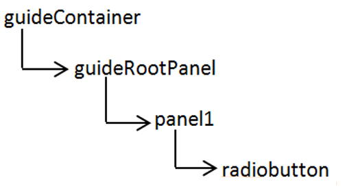
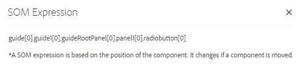

# 在自适应表单{#using-som-expressions-in-adaptive-forms}中使用SOM表达式

自适应表单建模为AEM页面，在AEM存储库中以JCR内容结构表示。 内容结构的关键元素是guideContainer节点。 在guideContainer下，有可能包含嵌套面板和字段的rootPanel。

您可以使用脚本对象模型(SOM)来引用特定文档对象模型(DOM)中的值、属性和方法。 DOM将内存对象和属性组织在树层次结构中。 SOM表达式引用字段/绘制元素和面板。

下图描述了在向表单添加组件时，自适应表单会转换为的节点结构。 例如，您可以在根面板中添加一个面板，并在面板中添加一个在运行时转换为DOM的单选按钮。 自适应表单中单选按钮字段的SOM表达式指定为`guide[0].guide1[0].guideRootPanel[0].panel1[0].radiobutton[0]`。

自适应表单中任何元素的SOM表达式以`guide[0].guide1[0]`为前缀。 组件在节点结构层次中的位置用于导出其SOM表达式。

当您更改自适应表单中单选按钮的位置时，SOM表达式会发生更改。 在创作模式下，您可以使用查看SOM表达式选项在AEM Forms中查看字段或元素的SOM表达式。 当您右键单击该字段或元素时，面板上会显示选项。

在面板中，您可以从面板工具栏访问该功能。 该功能便于自适应表单作者编写脚本。

[GuideBridge](https://helpx.adobe.com/aem-forms/6/javascript-api/GuideBridge.md)中列出的某些API使用元素的SOM表达式。 例如，要将焦点放在自适应表单中的特定字段，请将相应的SOM表达式传递到`guideBridge`中的`getFocus`API。
