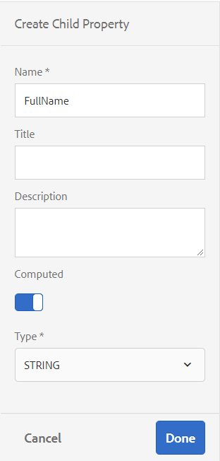
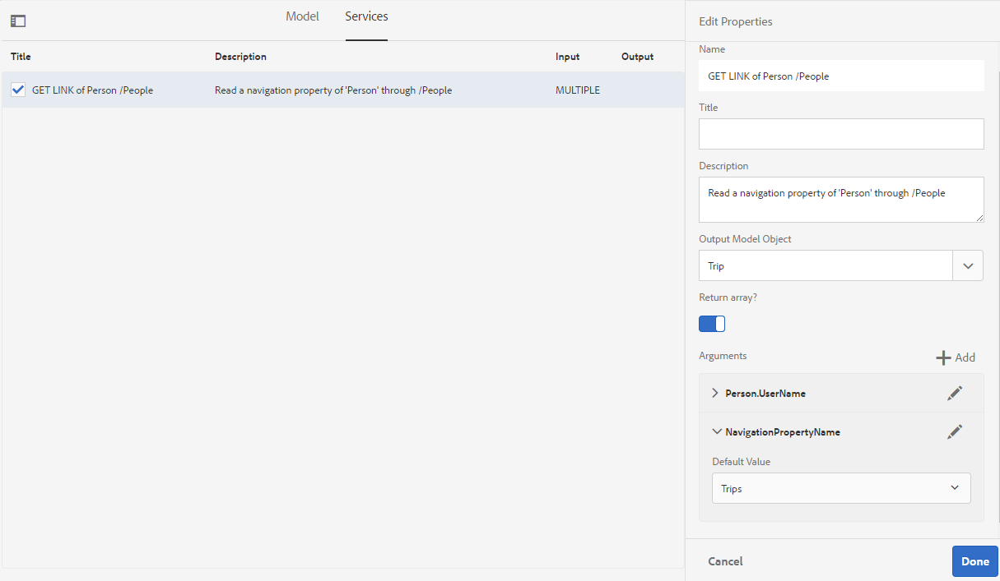

# 使用表单数据模型{#work-with-form-data-model}

数据集成提供表单数据模型编辑器，用于配置和使用表单数据模型。


表单数据模型编辑器提供了用于编辑和配置表单数据模型的直观用户界面和工具。 使用编辑器，您可以在表单数据模型中添加和配置来自关联数据源的数据模型对象、属性和服务。 此外，它允许您创建数据模型对象和属性（无需数据源），并在以后将它们与相应的数据模型对象和属性绑定。 您还可以为数据模型对象属性生成和编辑示例数据，在预览时可以使用这些数据预填自适应表单和交互式通信。 您可以测试在表单数据模型中配置的数据模型对象和服务，以确保它与数据源正确集成。

如果您是Forms数据集成的新手，但尚未配置数据源或创建表单数据模型，请参阅以下主题：

* [AEM Forms数据集成](/help/forms/using/data-integration.md)
* [配置数据源](/help/forms/using/configure-data-sources.md)
* [创建表单数据模型](/help/forms/using/create-form-data-models.md)

阅读有关各种任务和配置的详细信息，您可以使用表单数据模型编辑器执行这些操作。

>[!NOTE]
>
>您必须是&#x200B;**fdm-author**&#x200B;和&#x200B;**forms-user**&#x200B;组的成员才能创建和使用表单数据模型。 请与AEM管理员联系，成为组的成员。

## 添加数据模型对象和服务{#add-data-model-objects-and-services}

如果您使用数据源创建了表单数据模型，则可以使用表单数据模型编辑器添加数据模型对象和服务、配置其属性、在数据模型对象之间构建关联以及测试表单数据模型和服务。

您可以在表单数据模型中添加来自可用数据源的数据模型对象和服务。 当添加的数据模型对象显示在“模型”选项卡中时，添加的服务显示在“服务”选项卡中。

要添加数据模型对象和服务，请执行以下操作：

1. 登录AEM作者实例，导航到&#x200B;**[!UICONTROL Forms>数据集成]**，然后打开要在其中添加数据模型对象的表单数据模型。
1. 在“数据源”窗格中，展开数据源以视图可用的数据模型对象和服务。
1. 选择要添加到表单数据模型的数据模型对象和服务，然后点按&#x200B;**[!UICONTROL 添加选定项]**。

   

   “模型”(Model)选项卡显示所有数据模型对象及其添加到表单数据模型的属性的图形表示。 每个数据模型对象由表单数据模型中的框表示。

   

   >[!NOTE]
   >
   >您可以按住并拖动数据模型对象框以在内容区域中组织它们。 在“数据源”窗格中，在表单数据模型中添加的所有数据模型对象都灰显。

   “服务”选项卡列表添加了服务。

   

   >[!NOTE]
   >
   >除了数据模型对象和服务外，OData服务元数据文档还包括定义两个数据模型对象之间的关联的导航属性。 有关详细信息，请参阅[使用OData服务的导航属性](#navigation-properties-odata)。

1. 点按&#x200B;**[!UICONTROL 保存]**&#x200B;以保存表单模型对象。

   >[!NOTE]
   >
   >您可以使用自适应表单规则调用在表单数据模型的“服务”选项卡中配置的服务。 配置的服务在规则编辑器的调用服务操作中可用。有关在自适应表单规则中使用这些服务的详细信息，请参阅[规则编辑器](/help/forms/using/rule-editor.md)中的调用服务和设置规则值。

## 创建数据模型对象和子属性{#create-data-model-objects-and-child-properties}

### 创建数据模型对象{#create-data-model-objects}

您可以从配置的数据源添加数据模型对象，也可以创建没有数据源的数据模型对象或实体。 这非常有用，如果您尚未在表单数据模型中配置数据源。

要创建没有数据源的数据模型对象，请执行以下操作：

1. 登录AEM作者实例，导航到&#x200B;**[!UICONTROL Forms>数据集成]**，然后打开要在其中创建数据模型对象或实体的表单数据模型。
1. 点按&#x200B;**[!UICONTROL 创建实体]**。
1. 在“创建数据模型”对话框中，指定数据模型对象的名称，然后点按&#x200B;**[!UICONTROL 添加]**。 数据模型对象被添加到表单数据模型。 请注意，新添加的数据模型对象未绑定到数据源，并且没有任何属性，如下图所示。

   

接下来，可以在未绑定数据模型对象中添加子属性。

### 添加子属性{#child-properties}

表单数据模型编辑器允许您在数据模型对象中创建子属性。 创建时的属性不绑定到数据源中的任何属性。 您以后可以将子属性与包含数据模型对象中的其他属性绑定。

要创建子属性，请执行以下操作：

1. 在表单数据模型中，选择数据模型对象，然后点按&#x200B;**[!UICONTROL 创建子属性]**。
1. 在&#x200B;**[!UICONTROL 创建子属性]**&#x200B;对话框中，分别在&#x200B;**[!UICONTROL 名称]**&#x200B;和&#x200B;**[!UICONTROL 类型]**&#x200B;字段中为属性指定名称和数据类型。 您可以选择指定属性的标题和说明。
1. 启用计算（如果属性是计算属性）。 计算属性的值基于规则或表达式。 有关详细信息，请参阅[编辑属性](#edit-properties)。
1. 如果数据模型对象绑定到数据源，则添加的子属性将自动绑定到具有相同名称和数据类型的父数据模型对象的属性。

   要使用数据模型对象属性手动绑定子属性，请点按&#x200B;**[!UICONTROL 绑定引用]**&#x200B;字段旁边的浏览图标。 **[!UICONTROL 选择对象]**&#x200B;对话框将列表父数据模型对象的所有属性。 选择要绑定的属性，然后点按勾号图标。 请注意，您只能选择与子属性数据类型相同的属性。

1. 点按&#x200B;**[!UICONTROL 完成]**&#x200B;以保存子属性，然后点按&#x200B;**[!UICONTROL 保存]**&#x200B;以保存表单数据模型。 子属性现已添加到数据模型对象。

创建数据模型对象和属性后，您可以继续创建基于表单数据模型的自适应表单和交互式通信。 以后，当您有可用的数据源并进行配置时，您可以将表单数据模型与数据源绑定。 绑定将在相关的自适应表单和交互式通信中自动更新。 有关使用表单数据模型创建自适应表单和交互式通信的详细信息，请参阅[使用表单数据模型](/help/forms/using/using-form-data-model.md)。

### 绑定数据模型对象和属性{#bind-data-model-objects-and-properties}

当要与表单数据模型集成的数据源可用时，可以将它们添加到表单数据模型，如[更新数据源](/help/forms/using/create-form-data-models.md#update)中所述。 然后，执行以下操作以绑定未绑定的数据模型对象和属性：

1. 在表单数据模型中，选择要与数据源绑定的未绑定数据源。
1. 点按&#x200B;**[!UICONTROL 编辑属性]**。
1. 在&#x200B;**[!UICONTROL 编辑属性]**&#x200B;窗格中，点按&#x200B;**[!UICONTROL 绑定]**&#x200B;字段旁边的浏览图标。 它打开&#x200B;**[!UICONTROL 选择对象]**&#x200B;对话框，列表在表单数据模型中添加的数据源。

   

1. 展开数据源树，选择要与其绑定的数据模型对象，然后点按勾号图标。
1. 点按&#x200B;**[!UICONTROL 完成]**&#x200B;以保存属性，然后点按&#x200B;**[!UICONTROL 保存]**&#x200B;以保存表单数据模型。 数据模型对象现在与数据源绑定。 请注意，数据模型对象不再标记为“未绑定”。

   

## 配置服务{#configure-services}

要读取和写入数据模型对象的数据，请执行以下操作以配置读取和写入服务：

1. 选中数据模型对象顶部的复选框以将其选中，然后点按&#x200B;**[!UICONTROL 编辑属性]**。

   

   编辑属性以为数据模型对象配置读和写服务

   此时将打开编辑属性对话框。

   

   编辑属性对话框

   >[!NOTE]
   >
   >除了数据模型对象和服务外，OData服务元数据文档还包括定义两个数据模型对象之间的关联的导航属性。 将OData服务数据源添加到表单数据模型时，表单数据模型中有可用于数据模型对象中所有导航属性的服务。 您可以使用此服务读取相应数据模型对象的导航属性。
   >
   >有关使用服务的详细信息，请参阅[使用OData服务的导航属性](#navigation-properties-odata)。

1. 切换&#x200B;**[!UICONTROL 顶级对象]**&#x200B;以指定数据模型对象是否为顶级模型对象。

   在表单数据模型中配置的数据模型对象可用于基于表单数据模型的自适应表单的内容浏览器中的“数据模型对象”选项卡。 在两个数据模型对象之间添加关联时，您要关联的数据模型对象嵌套在您要从“数据模型对象”(Data Model Objects)选项卡中关联的数据模型对象下。 如果嵌套数据模型是顶级对象，它也将单独显示在“数据模型对象”(Data Model Objects)选项卡中。 因此，您将看到它的两个条目，一个在嵌套层次结构内部，另一个在嵌套层次结构外部，这可能会使表单作者感到困惑。 要使关联的数据模型对象仅显示在嵌套层次结构中，请禁用“顶级对象”属性。

1. 为所选数据模型对象选择“读取和写入”服务。 出现服务的参数。

   

   为员工数据源配置的读写服务

1. 点按以获取读取服务参数，将该参数绑定到“用户用户档案属性”、“请求属性”或“文本”值，然后指定绑定值。 它将服务参数绑定到指定的绑定属性或文本值，该值作为参数传递给服务以从数据源获取与指定值关联的详细信息。

   在此示例中，`id`参数将采用用户用户档案的`empid`属性的值，并将它作为参数传递给读取服务。 它将从指定`empid`的`employee`数据模型对象读取并返回相关属性的值。 因此，如果在表单的`empid`字段中指定00250，则读取服务将读取员工id为00250的详细信息。

   此外，您还可以将参数设为必填或可选。

   

   将id参数绑定到AEM用户用户档案的empid属性

1. 点按&#x200B;**[!UICONTROL 完成]**&#x200B;以保存参数，点按&#x200B;**[!UICONTROL 完成]**&#x200B;以保存属性，然后点按&#x200B;**[!UICONTROL 保存]**&#x200B;以保存表单数据模型。

## 添加关联{#add-associations}

通常，在数据源中的数据模型对象之间构建关联。 关联可以是一对一或一对多。 例如，可以有多个与某个员工关联的依赖项。 它称为一对多关联，由`1:n`在连接相关数据模型对象的线上进行描述。 但是，如果关联为给定的员工ID返回唯一的员工名称，则它称为一对一关联。

在数据源中向表单数据模型添加关联数据模型对象时，它们的关联会保留并显示为通过箭头线连接。 您可以在表单数据模型中跨不同数据源添加数据模型对象之间的关联。

>[!NOTE]
>
>JDBC数据源中的预定义关联不会保留在表单数据模型中。 您必须手动创建它们。

添加关联：

1. 选中数据模型对象顶部的复选框以将其选中，然后点按&#x200B;**[!UICONTROL 添加关联]**。 此时将打开添加关联对话框。

   

   >[!NOTE]
   >
   >除了数据模型对象和服务外，OData服务元数据文档还包括定义两个数据模型对象之间的关联的导航属性。 在表单数据模型中添加关联时，可以使用这些导航属性。 有关详细信息，请参阅[使用OData服务的导航属性](#navigation-properties-odata)。

   此时将打开添加关联对话框。

   

   “添加关联”对话框

1. 在“添加关联”窗格中：

   * 指定关联的标题。
   * 选择关联类型——一到一或一到多。
   * 选择要关联的数据模型对象。
   * 选择读取服务以从选定的模型对象读取数据。 将显示读取服务参数。 编辑以根据需要更改参数，并将其绑定到要关联的数据模型对象的属性。

   在以下示例中，Dependents数据模型对象的读取服务的默认参数为`dependentid`。

   

   依赖项读取服务的默认参数是dependentid

   但是，该参数必须是关联数据模型对象之间的公用属性，在本例中为`Employeeid`。 因此，`Employeeid`参数必须绑定到Employee数据模型对象的`id`属性，才能从Dependents数据模型对象中获取相关的依赖项详细信息。

   

   更新了参数和绑定

   点按&#x200B;**[!UICONTROL 完成]**&#x200B;以保存参数。

1. 点按&#x200B;**[!UICONTROL 完成]**&#x200B;以保存关联，然后点按&#x200B;**[!UICONTROL 保存]**&#x200B;以保存表单数据模型。
1. 重复这些步骤以根据需要创建更多关联。

>[!NOTE]
>
>添加的关联会以指定的标题出现在数据模型对象框中，并且显示一条连接相关数据模型对象的线。
>
>通过选中关联对应的复选框并点按&#x200B;**[!UICONTROL 编辑关联]**，可以编辑关联。


## 编辑属性 {#properties}

您可以编辑数据模型对象的属性、其属性以及在表单数据模型中添加的服务。

要编辑属性，请执行以下操作：

1. 选中表单数据模型中数据模型对象、属性或服务旁的复选框。
1. 点按&#x200B;**[!UICONTROL 编辑属性]**。 此时将打开选定模型对象、属性或服务的&#x200B;**[!UICONTROL 编辑属性]**&#x200B;窗格。

   * **数据模型对象**:指定读写服务和编辑参数。
   * **属性**:指定属性的类型、子类型和格式。您还可以指定选定属性是否是数据模型对象的主键。
   * **服务**:指定服务的输入模型对象、输出类型和参数。对于Get服务，您可以指定它是否应返回阵列。

   

   获取服务的“编辑属性”对话框

1. 点按&#x200B;**[!UICONTROL 完成]**&#x200B;以保存属性，然后点按&#x200B;**[!UICONTROL 保存]**&#x200B;以保存表单数据模型。

### 创建计算属性{#computed}

计算属性是根据规则或表达式计算其值的属性。 使用规则，您可以将计算属性的值设置为文本字符串、数字、数学表达式的结果或表单数据模型中其他属性的值。

例如，可以创建计算属性&#x200B;**FullName**，其值是现有&#x200B;**FirstName**&#x200B;和&#x200B;**LastName**&#x200B;属性串联的结果。 为此，请执行以下操作：

1. 创建一个名为`FullName`且数据类型为String的新属性。
1. 启用&#x200B;**[!UICONTROL Computed]**&#x200B;并点按&#x200B;**[!UICONTROL 完成]**&#x200B;以创建属性。

   

   将创建FullName计算属性。 请注意属性旁边的图标以描述计算属性。

   

1. 选择FullName属性，然后点按&#x200B;**[!UICONTROL 编辑规则]**。 将打开规则编辑器窗口。
1. 在规则编辑器窗口中，点按&#x200B;**[!UICONTROL 创建]**。 将打开&#x200B;**[!UICONTROL 设置值]**&#x200B;规则窗口。

   从选择选项下拉框中，选择&#x200B;**[!UICONTROL 数学表达式]**。 其他可用选项有&#x200B;**[!UICONTROL 表单数据模型对象]**&#x200B;和&#x200B;**[!UICONTROL 字符串]**。

1. 在数学表达式中，分别选择第一个和第二个对象中的&#x200B;**[!UICONTROL FirstName]**&#x200B;和&#x200B;**[!UICONTROL LastName]**。 选择&#x200B;**[!UICONTROL 加号]**&#x200B;作为运算符。

   点按&#x200B;**[!UICONTROL 完成]**，然后点按&#x200B;**[!UICONTROL 关闭]**&#x200B;以关闭规则编辑器窗口。 该规则类似于以下内容。

   

1. 在表单数据模型上，点按&#x200B;**[!UICONTROL 保存]**。 已配置计算属性。

## 使用OData服务{#work-with-navigation-properties-of-odata-services}的导航属性

在OData服务中，导航属性用于定义两个数据模型对象之间的关联。 这些属性是在实体类型或复杂类型上定义的。 例如，在从示例[TripPin](https://www.odata.org/blog/trippin-new-odata-v4-sample-service/) OData示例服务的元数据文件中提取的以下内容中，人物实体包含三个导航属性——朋友、最佳朋友和旅行。

有关导航属性的详细信息，请参阅[OData文档](https://docs.oasis-open.org/odata/odata/v4.0/errata03/os/complete/part3-csdl/odata-v4.0-errata03-os-part3-csdl-complete.html#_Toc453752536)。

```xml
<edmx:Edmx xmlns:edmx="https://docs.oasis-open.org/odata/ns/edmx" Version="4.0">
<script/>
<edmx:DataServices>
<Schema xmlns="https://docs.oasis-open.org/odata/ns/edm" Namespace="Microsoft.OData.Service.Sample.TrippinInMemory.Models">
<EntityType Name="Person">
<Key>
<PropertyRef Name="UserName"/>
</Key>
<Property Name="UserName" Type="Edm.String" Nullable="false"/>
<Property Name="FirstName" Type="Edm.String" Nullable="false"/>
<Property Name="LastName" Type="Edm.String"/>
<Property Name="MiddleName" Type="Edm.String"/>
<Property Name="Gender" Type="Microsoft.OData.Service.Sample.TrippinInMemory.Models.PersonGender" Nullable="false"/>
<Property Name="Age" Type="Edm.Int64"/>
<Property Name="Emails" Type="Collection(Edm.String)"/>
<Property Name="AddressInfo" Type="Collection(Microsoft.OData.Service.Sample.TrippinInMemory.Models.Location)"/>
<Property Name="HomeAddress" Type="Microsoft.OData.Service.Sample.TrippinInMemory.Models.Location"/>
<Property Name="FavoriteFeature" Type="Microsoft.OData.Service.Sample.TrippinInMemory.Models.Feature" Nullable="false"/>
<Property Name="Features" Type="Collection(Microsoft.OData.Service.Sample.TrippinInMemory.Models.Feature)" Nullable="false"/>
<NavigationProperty Name="Friends" Type="Collection(Microsoft.OData.Service.Sample.TrippinInMemory.Models.Person)"/>
<NavigationProperty Name="BestFriend" Type="Microsoft.OData.Service.Sample.TrippinInMemory.Models.Person"/>
<NavigationProperty Name="Trips" Type="Collection(Microsoft.OData.Service.Sample.TrippinInMemory.Models.Trip)"/>
</EntityType>
```

在表单容器模型中配置OData服务时，实体数据中的所有导航属性都可以通过表单数据模型中的服务提供。 在此TripPin OData服务示例中，可以使用表单容器模型中的一个`GET LINK`服务读取`Person`实体中的三个导航属性。

下面突出显示了表单数据模型中的`GET LINK of Person /People`服务，它是TripPin OData服务`Person`实体中三个导航属性的组合服务。


将`GET LINK`服务添加到表单数据模型中的“服务”选项卡后，可以编辑属性以选择输出模型对象和要在服务中使用的导航属性。 例如，以下示例中的以下`GET LINK of Person /People`服务使用Trip作为输出模型对象，使用导航属性作为Trips。



>[!NOTE]
>
>**NavigationPropertyName**&#x200B;参数的&#x200B;**[!UICONTROL 默认值]**&#x200B;字段中的可用值取决于&#x200B;**[!UICONTROL Return数组的状态。]** 切换按钮。启用后，将显示集合类型的导航属性。

在此示例中，您还可以选择输出模型对象作为Person，选择导航属性参数作为Friends或BestFriend(取决于&#x200B;**[!UICONTROL Return数组？]** 启用或禁用)。


同样，在表单数据模型中添加关联时，您可以选择`GET LINK`服务并配置其导航属性。 但是，要能够选择导航属性，请确保将&#x200B;**[!UICONTROL “绑定到”字段]**&#x200B;设置为&#x200B;**[!UICONTROL Literal]**。


## 生成并编辑示例数据{#sample}

表单数据模型编辑器允许您为表单数据模型中的所有数据模型对象属性（包括计算属性）生成示例数据。 它是一组随机值，它们符合为每个属性配置的数据类型。 您还可以编辑和保存数据，即使重新生成示例数据，数据也会保留。

执行以下操作以生成和编辑示例数据：

1. 打开表单数据模型，然后点按&#x200B;**[!UICONTROL 编辑示例数据]**。 它会在“编辑示例数据”窗口中生成并显示示例数据。

   

1. 在&#x200B;**[!UICONTROL 编辑示例数据]**&#x200B;窗口中，根据需要编辑数据，然后点按&#x200B;**[!UICONTROL 保存]**。

接下来，您可以使用范例数据基于表单数据模型预填和测试交互式通信。 有关详细信息，请参阅[使用表单数据模型](/help/forms/using/using-form-data-model.md)。

## 测试数据模型对象和服务{#test-data-model-objects-and-services}

您的表单数据模型已配置，但在投入使用之前，您可能希望测试配置的数据模型对象和服务是否按预期工作。 要测试数据模型对象和服务：

1. 以数据模型的形式选择数据模型对象或服务，然后分别点按&#x200B;**[!UICONTROL 测试模型对象]**&#x200B;或&#x200B;**[!UICONTROL 测试服务]**。

   “测试表单数据模型”窗口将打开。

   

1. 在“测试表单数据模型”窗口中，从“输入”窗格中选择要测试的数据模型对象或服务。

1. 在测试代码中指定参数值，然后点按&#x200B;**[!UICONTROL 测试]**。 成功的测试将返回“输出”窗格中的输出。

   

同样，您还可以测试表单数据模型中的其他数据模型对象和服务。

## 后续步骤{#next-steps}

您有一个工作表单数据模型，现在可以在自适应表单和交互式通信工作流中使用。 有关详细信息，请参阅[使用表单数据模型](/help/forms/using/using-form-data-model.md)。
