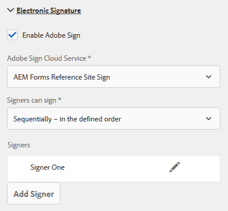

# 在自适应表单中使用Adobe Sign {#using-adobe-sign-in-an-adaptive-form}

为自适应表单启用电子签名(Adobe Sign)工作流程，以自动签署工作流程、简化单一和多签名流程，以及从移动设备以电子方式签署表单。

Adobe Sign支持自适应表单的电子签名工作流程。 电子签名改进了处理法律、销售、工资单、人力资源管理等方面的文档的工作流程。

在典型的Adobe sign和自适应表单场景中，用户填充自适应表单以申请服务。 例如，抵押和信用卡申请要求所有借款人和共同申请人提供合法的签名。 要为类似情况启用电子签名工作流程，您可以将Adobe Sign与AEM Forms集成。 还有一些示例是，您可以使用Adobe sign执行以下操作：

* 借助完全自动化的建议书、报价和合同流程，从任何设备达成交易。
* 更快地完成人力资源流程并为员工提供数字体验。
* 缩短合同周期并加快供应商的投放速度。
* 创建可自动处理常见流程的数字工作流程。

与AEM Forms的Adobe sign集成支持：

* 单用户和多用户签名工作流程
* 连续和并行签名工作流程
* 表单内和表单外签名体验
* 以匿名或登录用户身份对表单进行签名
* 动态签名流程（与AEM Forms工作流程集成）
* 通过知识库、电话和社交配置文件进行身份验证

## 前提条件 {#prerequisites}

在自适应表单中使用Adobe Sign之前：

* 确保将AEM Forms云服务配置为使用Adobe Sign。 有关详细信息，请 [参阅将Adobe Sign与AEM Forms集成](/help/forms/using/adobe-sign-integration-adaptive-forms.md)。
* 让签名者列表准备好。 您至少需要为每位签署方提供一个电子邮件地址。

## 为自适应表单配置Adobe Sign {#configure-adobe-sign-for-an-adaptive-form}

执行以下步骤为自适应表单配置Adobe Sign:

1. [编辑Adobe Sign的自适应表单属性](/help/forms/using/working-with-adobe-sign.md#main-pars-header-46741052)
1. [将Adobe sign字段添加到自适应表单](/help/forms/using/working-with-adobe-sign.md#main-pars-header-868561487)
1. [为自适应表单启用Adobe Sign](/help/forms/using/working-with-adobe-sign.md#main-pars-header-1414119828)
1. [为自适应表单选择Adobe Sign云服务](/help/forms/using/working-with-adobe-sign.md#main-pars-header-473098029)

1. [将Adobe sign签名者添加到自适应表单](/help/forms/using/working-with-adobe-sign.md#main-pars-header-1374317451)
1. [为自适应表单选择提交操作](/help/forms/using/working-with-adobe-sign.md#main-pars-header)

### 编辑Adobe sign的自适应表单属性 {#enableadobesign}

为现有或新的自适应表单配置Adobe sign的自适应表单属性。

[为Adobe sign创建自适应表单](/help/forms/using/working-with-adobe-sign.md#create-an-adaptive-form-for-adobe-sign) ，介绍创建基本自适应表单的步骤。 请参 [阅创建自适应表单](/help/forms/using/creating-adaptive-form.md) ，了解创建自适应表单时可用的其他选项。

#### 为Adobe sign创建自适应表单 {#create-an-adaptive-form-for-adobe-sign}

请执行以下步骤以创建Adobe sign的自适应表单：

1. 导航到 **[!UICONTROL Adobe Experience Manager]** > **[!UICONTROL Forms]** > **[!UICONTROL Forms &amp; Documents]**。
1. 点按 **[!UICONTROL 创建]** ，然后选择 **[!UICONTROL 自适应表单]**。 此时将显示模板列表。 选择模板，然后点按 **[!UICONTROL 下一步]**。
1. 在“基 **[!UICONTROL 本]** ”选项卡中：

   1. 指定自 **适应表** 单的 **“名** 称”和“标题”。
   1. 选择在 [使用AEM Forms配置Adobe Sign时](/help/forms/using/adobe-sign-integration-adaptive-forms.md#configure-adobe-sign-with-aem-forms) ，创建的配置容器。

1. 在“表 **[!UICONTROL 单模型]** ”选项卡中，选择以下选项之一：

   * 选择“ [!UICONTROL 关联表单模板”作为“记录文档模板]”**选项，然后选择“记录文档”模板。 如果您使用基于表单模板的自适应表单，则发送用于签名的文档将仅显示基于关联表单模板的那些字段。 它不显示自适应表单的所有字段。
   * 选择“ **[!UICONTROL 生成记录文档]** ”选项。 如果使用启用了“记录文档”选项的自适应表单，则发送以供签名的文档将显示自适应表单的所有字段。

1. 点按&#x200B;**[!UICONTROL 创建。]** 将创建支持签名的自适应表单，该表单可用于添加Adobe Sign字段。

#### 编辑Adobe sign的自适应表单 {#editafsign}

执行以下步骤以在现有自适应表单中使用Adobe Sign:

1. 导航到 **[!UICONTROL Adobe Experience Manager]** > **[!UICONTROL Forms]**> **[!UICONTROL Forms &amp; Documents]**。
1. 选择自适应表单并点按 **[!UICONTROL 属性]**。
1. 在“基 **[!UICONTROL 本]** ”选项卡中，选择在  使用AEM Forms配置Adobe Sign时创建的配置容器。
1. 在**表[!UICONTROL 单模式]**l选项卡中，选择以下选项之一：

   * 选择“ **[!UICONTROL 关联表单模板”作为“记录文档”模板]** ，然后选择“记录文档”模板。 如果您使用基于表单模板的自适应表单，则发送用于签名的文档将仅显示基于关联表单模板的那些字段。 它不显示自适应表单的所有字段。
   * 选择“ **[!UICONTROL 生成记录文档]** ”选项。 如果使用启用了“记录文档”选项的自适应表单，则发送以供签名的文档将显示自适应表单的所有字段。

1. 点按 **[!UICONTROL 保存并关闭]**。 Adobe sign启用了自适应表单。

### 将Adobe sign字段添加到自适应表单 {#addadobesignfieldstoanadaptiveform}

Adobe sign具有可放置在自适应表单上的各种字段。 这些字段接受各种类型的数据（如签名、姓名首字母、公司或职务），并帮助在签名过程中收集额外信息以及签名。 您可以使用Adobe Sign块组件将Adobe Sign字段放在自适应表单的不同位置。

执行以下步骤将字段添加到自适应表单并自定义与这些字段相关的各种选项：

1. 将 **Adobe Sign块组件从组件浏览器拖放到自适应表单中** 。 Adobe sign块组件具有所有支持的Adobe sign字段。 默认情况下，它会向自适应表单添加一个**签名**字段。

   

   默认情况下，Adobe Sign块在已发布的自适应表单中不可见。 它仅在签名文档中可见。 您可以从Adobe Sign Block组件的属性中更改Adobe Sign Block的可见性。

   >[!NOTE]
   >
   >* 在自适应表单中使用Adobe Sign并非强制性的使用Adobe Sign块。 如果您不使用Adobe sign块并为签名者添加字段，则默认签名字段将显示在签名文档的底部。
   >* 仅将Adobe sign块用于自动生成记录文档的自适应表单。 如果您使用自定义XDP生成记录文档或基于表单模板的自适应表单，则不需要Adobe Sign块。

1. 选择 **Adobe Sign块组件** ，然后点 **按** Edit  _6_3_edit图标。 它显示用于添加字段和设置字段外观格式的选项。

   

   **** 答：选择并添加Adobe sign字段。 **** B.将Adobe sign块展开为全屏视图

1. 点按 **Adobe Sign字段** 。 它显示用于选择和添加Adobe sign字段的选项。

   展开 **类型** (Type)下拉字段以选择Adobe Sign字段，然后点按完成  aem_6_3_forms_save图标，将选定字段添加到Adobe sign块。 “类 **型** ”下拉字段包括“签名”、“签名者信息”和“数据”字段类型。 Adobe sign与AEM Forms支持字段的集成仅在“类型”下拉框中列出。 有关Adobe sign字段的详细信息，请参阅 [Adobe sign文档](https://helpx.adobe.com/sign/help/field-types.html)。

   

   必须为字段提供唯一的名称。 您还可以选择所需的选项来将字段标记为必填。 除“名称”和“ **必需****”选项外** ，某些Adobe Sign字段还有更多选项。 例如，蒙版和多行。 此外，无论字段位于相同还是不同的Adobe sign块中，都可为每个Adobe sign字段指定唯一的名称。

### 为自适应表单启用Adobe Sign {#enableadobsignforanadaptiveform}

开箱即用，自适应表单未启用Adobe Sign。 执行以下步骤以启用它：

1. 在内容浏览器中，点按表 **单容器**，然后点按配 **置** 。 它打开属性浏览器并显示自适应表单容器属性。
1. 在属性浏览器中，展开“ **电子签名** ”折叠面板，然后选择“ **启用Adobe Sign** ”选项。 它使Adobe sign能够生成自适应表单。

### 选择Adobe Sign cloud服务和签名顺序 {#selectadobesigncloudserviceforanadaptiveform}

您可以为AEM Forms的一个实例配置多个Adobe Sign服务。 建议为每个功能（人力资源、财务等）单独提供一组服务。 它使跟踪和报告已签名文档变得更简单。 例如，银行有多个部门。 您可以为每个部门单独配置以更好地跟踪文档。

一个文档还可以有多个签名者。 例如，信用卡申请可以有多个申请人。 在开始处理申请之前，银行要求所有申请人的签名。 对于多签署方方案，您可以选择按顺序或同时顺序对文档进行签名。

执行以下步骤以选择云服务和签名顺序：

1. 在内容浏览器中，点按表 **单容器**，然后点按配 **置** 。 它打开属性浏览器并显示自适应表单容器属性。
1. 在属性浏览器中，展开“ **电子签名** ”折叠面板，然后选择“ **启用Adobe Sign** ”选项。 它使Adobe sign能够生成自适应表单。
1. 从Adobe Sign云服务的已配置列表中选择云服务。

   如果 **Adobe Sign云服务列表为空** ，请按照使用AEM Forms  文章配置Adobe Sign以配置服务。

1. 从“签名者可以签名”对 **话框中选择签名** 顺序。 Adobe sign歌手可以按顺序签署自 **适应表单** -依次签署，或 **同时签署** -按任何顺序。

   按顺序，一位签署者一次收到用于签名的表单。 签署方完成对文档的签名后，表单将发送给下一位签署方，依此类推。

   按照同时顺序，多个签名者一次可以对表单进行签名。

1. [将签名者添加到自适应表单](/help/forms/using/working-with-adobe-sign.md#main-pars-header-1374317451) ，然后点按完成图标以保存更改。

### 将签名者添加到自适应表单 {#addsignerstoanadaptiveform}

对于自适应表单，只能有一个或多个签署者。 添加签名者时，您还可以为签署者配置身份验证详细信息。 您还可以选择表单填写者和歌手是否是同一人。 执行以下步骤以添加和提供有关签署方的各种详细信息：

1. 在内容浏览器中，点按表 **单容器**，然后点按配 **置** 。 它打开具有自适应表单容器属性的属性浏览器。
1. 在属性浏览器中，展开“ **电子签名** ”折叠面板，然后选择“ **启用Adobe Sign** ”选项。 它使Adobe sign能够生成自适应表单。
1. 在“签 **名者配置”下** ，点 **击“添加签署者”。** 它会向自适应表单中添加签名者。 您可以向自适应表单中添加多个Adobe sign签名者。
1. 

   单击 **Edit** （编辑）图标以指定有关签署方的以下信息：

   * **** 标题：指定标题以唯一标识签署方。
   * **** 签署方和填写表单的人员是否相同？如果 ****&#x200B;表单填写人和第一位签署人是同一人，请选择“是”。 如果选项设置为 **否，** 则请勿在自适应表单中使用签名步骤组件。 如果表单包含签名步骤组件，则字段将自动设置为是。
   * **** 签署方电子邮件地址：指定签署方的电子邮件地址。 签署方会收到指定电子邮件地址上的待签名文档／表单。 您可以选择使用在表单字段中提供的电子邮件地址、在登录用户的AEM用户配置文件中或手动输入电子邮件地址。 这是必须采取的步骤。 另请注意，如果您只配置了一位签署方，请确保签署方的电子邮件地址与用于配置AEM云服务的Adobe sign帐户不相同。
   * **** 签署方身份验证方法：指定在打开表单进行签名之前对用户进行身份验证的方法。 您可以在电话、知识库和基于社交身份的身份验证之间进行选择。
   >[!NOTE]
   >
   >* 默认情况下，基于社交身份的身份验证提供了使用Facebook、Google和LinkedIn进行身份验证的选项。 您可以联系Adobe sign支持以启用其他社交身份验证提供商。

   * **** 要填写或签名的Adobe Sign字段：为签署方选择Adobe Sign字段。 自适应表单可以有多个Adobe sign字段。 您可以选择为签署方启用特定字段。 该字段显示所有可用的Adobe签名块。 选择块时，该块的所有字段都将被选中。 您可以使用X图标取消选择字段。
   

   以上图像有两个Adobe Sign块示例：个人信息和办公室详细信息

   点按完  。 签署方已添加并配置。

### 为自适应表单选择提交操作 {#selectsubmitactionforanadaptiveform}

在您将Adobe sign字段添加到自适应表单、从表单容器启用Adobe Sign、选择Adobe Sign云服务并添加Adobe sign签名者后，为自适应表单选择适当的提交操作。 有关自适应表单提交操作的详细信息，请参 [阅配置提交操作](/help/forms/using/configuring-submit-actions.md)。

此外，仅当所有签名者对表单进行签名后，才会提交启用Adobe sign的自适应表单。 您可以在表单门户的“待签名”部分找到部分签名的表单。 Adobe Sign Configuration service会定期轮询Adobe Sign服 [务器](/help/forms/using/adobe-sign-integration-adaptive-forms.md) ，以验证签名状态。 如果所有签名者都完成了表单的签名，则会启动提交操作服务并提交表单。 如果您使用自定义提交操作，而表单使用Adobe Sign，请更新您的自定义提交操作以使用提交操作服务。

>[!NOTE]
>
>自适应表单的数据临时存储在Forms Portal上。 建议将自定义存 [储用于Forms Portal](/help/forms/using/configuring-draft-submission-storage.md)。 它可确保PII（个人识别信息）数据不存储在AEM服务器上。

您的表单签名体验已准备就绪。 您可以预览表单以验证签名体验。 在已发布的表单上，当签署者通过电子邮件收到用于签名的表单时，将显示Adobe Sign Block字段。 此体验也称为表外签名体验。 您还可以为第一位签署者配置表单内签名体验，有关详细步骤，请参 [阅创建表单内签名体验](/help/forms/using/working-with-adobe-sign.md#create-in-form-signing-experience)。

## 为自适应表单配置云签名 {#configure-cloud-signatures-for-an-adaptive-form}

基于云的数字签名或远程签名是跨桌面、移动设备和Web工作的新一代数字签名。 并达到签署方身份验证的最高级别的合规性和保证。 您可以使用基于云的数字签名对自适应表单进行签名。

编辑 [Adobe签名的自适应表单属性后](/help/forms/using/working-with-adobe-sign.md#main-pars-header-46741052)，请执行以下步骤将云签名字段添加到自适应表单：

1. 将 **Adobe Sign块组件从组件浏览器拖放到自适应表单中** 。 Adobe sign块组件具有所有支持的Adobe sign字段。 默认情况下，它会向自适 **应表单** 添加签名字段。

   

1. 选择 **Adobe Sign块组件** ，然后点 **按** Edit  _6_3_edit图标。 它显示用于添加字段和设置字段外观格式的选项。

   

   **** 答：选择并添加Adobe sign字段。 **** B.将Adobe sign块展开为全屏视图

1. 点按 **Adobe Sign字段** 。 它显示用于选择和添加Adobe sign字段的选项。

   展开“ **类型** ”下拉字段以选择“数字签名 **”，然后点按“完成** aem_6_3_forms_save  ”图标，将选定字段添加到Adobe sign块。

   

   必须为字段提供唯一的名称。

   使用以下方式将数字签名应用到自适应表单：

   * 云签名：使用由信任 [服务提供商托管的](https://helpx.adobe.com/sign/kb/digital-certificate-providers.html) “数字ID”进行签名。
   * Adobe Acrobat或Reader:下载并打开包含Adobe Acrobat或Reader的文档，以使用智能卡、USB令牌或基于文件的数字ID进行签名。
   在将云签名字段添加到自适应表单后，请执行以下步骤以完成配置过程：

   * [为自适应表单启用Adobe Sign](/help/forms/using/working-with-adobe-sign.md#main-pars-header-1414119828)
   * [为自适应表单选择Adobe Sign云服务](/help/forms/using/working-with-adobe-sign.md#main-pars-header-473098029)
   * [将Adobe sign签名者添加到自适应表单](/help/forms/using/working-with-adobe-sign.md#main-pars-header-1374317451)
   * [为自适应表单选择提交操作](/help/forms/using/working-with-adobe-sign.md#main-pars-header)

## 创建表单内签名体验 {#create-in-form-signing-experience}

用户还可以在填写表单时对自适应表单进行签名。 此体验也称为表单内签名体验。 表单内签名体验仅对多签署方环境中的第一个歌手可用。 执行以下步骤为自适应表单创建表单内签名体验：

1. [添加和配置签名步骤组件](/help/forms/using/working-with-adobe-sign.md#main-pars-header-1414119828)。
1. [添加摘要步骤组件](/help/forms/using/working-with-adobe-sign.md#main-pars-header-473098029)。

### 添加和配置签名步骤组件 {#add-and-configure-the-signature-step-component}

使用签名步骤组件提供一个区域以电子方式对填写的表单进行签名。 呈现包含签名步骤组件的部分时，将显示已填写表单的可签名PDF版本。 签名步骤组件占用表单的全宽。 建议在包含签名步骤组件的部分上不要包含任何其他组件。

执行以下步骤以配置签名步骤组件：

1. 将签名步骤组件从组 **件浏览器拖放到表单** 。
1. 选择新添加的签名步骤组件，然后点按配 **置** 。 它打开属性浏览器并显示签名步骤属性。 配置以下属性：

   * **元素名称**:指定组件的名称。
   * **** 标题：指定组件的唯一标题。
   * **** 模板消息：指定加载签名PDF时要显示的消息。 Adobe sign服务需要一些时间来准备和加载签名PDF。
   * **** 签名服务：选择 **Adobe Sign** 选项。
   * **使用旧版电子签名组件**:如果您正在 [AEM Forms Workspace](/help/forms/using/introduction-html-workspace.md)、AEM Forms应用程序中使用相应的自适应表单，或者基础自适应表单具有传统的电子签名组件，请选择 **使用传统电子签名组件选项** 。
   * **配置**:选择配置（Adobe Sign云服务）。 仅当启用了“使用旧版电子签名 **组件”选项时** ，下拉框才可用。
   点按完  ，以保存更改。

   

   >[!NOTE]
   >
   >* 将签名步骤组件拖放到表 **[!UICONTROL 单时]** ，签 **[!UICONTROL 署者和填写表单的人员是否相同？]** 选项将自动设置为 **是**。 需要使表单继续工作。
   >* 支持Adobe sign的自适应表单不支持使用签名步骤组件在章节或面板上的“提交”按钮。 您可以在手动提交的签名步骤后添加摘要步骤，或在使用 [Adobe Sign配置服务设置的间隔后触发自动提交](/help/forms/using/adobe-sign-integration-adaptive-forms.md#configure-adobe-sign-scheduler-to-sync-the-signing-status)。

### 配置感谢页面或摘要步骤组件 {#configure-the-thank-you-page-or-summary-step-component}

“摘 **要步骤** ”组件自动提交表单，在自定义的“摘要”页面中填充信息，并显示已提交表单的摘要。 它还会在返回图中获得所需的信息。 摘要步骤组件具有表单可用的全宽。 建议在包含摘要步骤组件的部分上不要包含任何其他组件。

现在，表单签名体验就绪。 您可以预览表单以验证签名体验。

## Frequently asked questions {#frequently-asked-questions}

**** 安：否，AEM表单不支持使用自适应表单，该表单嵌入支持Adobe sign的自适应表单进行签名

**** 安：使用高级模板创建的自适应表单配置为使用Adobe Sign。 要解决该错误，请创建并选择Adobe sign云配置，并为自适应表单配置Adobe sign签名者。

**** 安：是的，您可以使用文本组件中的文本标记将Adobe sign字段添加到支持 [Document of Record](/help/forms/using/generate-document-of-record-for-non-xfa-based-adaptive-forms.md) （仅限自动生成的记录文档选项）的自适应表单。 要了解创建文本标记的过程和规则，请参阅 [Adobe Sign文档](https://helpx.adobe.com/sign/help/text-tags.html)。 另请注意，自适应表单对文本标记的支持有限。 您可以使用文本标记仅创建 [Adobe Sign块支持的字段](/help/forms/using/working-with-adobe-sign.md#main-pars-header-1373840282) 。

**** 安：您可以在表单中同时使用这两个组件。 以下是使用这些组件的一些建议：

**** Adobe Sign Block:您可以使用Adobe Sign块在自适应表单的任意位置添加Adobe Sign字段。 它还有助于为签名者分配特定字段。 当预览或发布自适应表单时，默认情况下，Adobe Sign块不可见。 这些块仅在签名文档中启用。 在签名文档中，仅为签署方分配的字段处于启用状态。 Adobe Sign块可以与第一个和后续签名者一起使用。

**** 签名步骤组件：您可以使用签名步骤组件创建表单内签名体验。 它仅允许第一个签署方在填写表单时进行签名。 当呈现包含签名步骤组件的部分时，它会显示表单的可签名PDF版本。 它通常是表单的最后一个或倒数第二个部分，后面是摘要组件。

