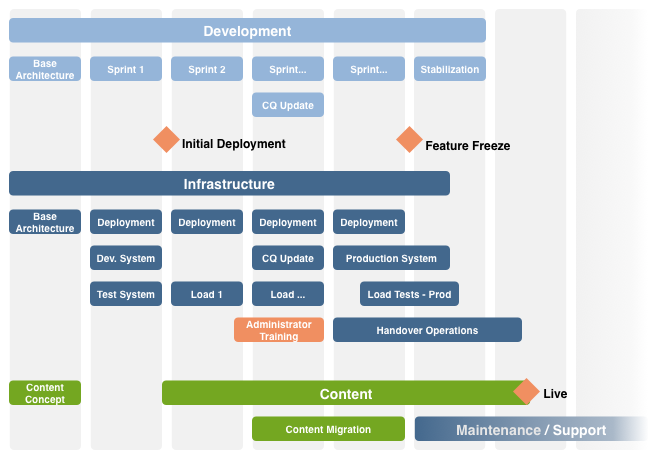

# 清单——进一步参考{#the-checklist-further-reference}

本页提供了更多详细信息，以详细阐述和／或补充管理项目——最佳实 [践清单所涵盖的文档和原则](/help/managing/best-practices.md)。

## AEM —— 您将使用什么？ {#aem-what-will-you-be-using}

>[!CAUTION]
>
>本分节中的列表并非详尽无遗，而是作为介绍。

### AEM中的功能 {#features-within-aem}

实施AEM（尤其是首次实施）时，您需要检查AEM [的功能和工作流](https://www.adobe.com/cn/marketing/experience-manager.html) ，以确定您需要／需要哪些方面。

考虑您将使用的AEM的功能以及对您的设计的影响； 例如：

* [商务](/help/sites-administering/ecommerce.md)
* [屏幕](https://docs.adobe.com/content/help/en/experience-manager-screens/user-guide/aem-screens-introduction.html)
* [资产](/help/assets/assets.md)
* [标记](/help/sites-administering/tags.md)
* [多站点管理与翻译](/help/sites-administering/msm-and-translation.md)
* [表单](/help/forms/home.md)
* [社区](/help/communities/deploy-communities.md)
* [Livefyre](https://answers.livefyre.com/product/livefyre-for-adobe-experience-manager-aem/livefyre-for-adobe-experience-manager/)

此外，请查 [看发行说](/help/release-notes/release-notes.md)明，了解AEM的不同版本，以查看何时添加了任何新功能。

### 集成 {#integrations}

AEM可以与其他Adobe产品和／或第三方服务集成。 这些功能可以提高您的使用能力和功能。

有关完 [整信息](/help/sites-administering/integration.md) ，请参阅解决方案集成。

## 迁移还是升级？ {#migrate-or-upgrade}

一个主要考虑是您是否希望：

* 升级现有安装。
* 将内容从当前系统迁移到全新安装。

从先前版本移动到当前版本时，有两个选项：

* 使用包 [管理器](/help/sites-administering/package-manager.md) ，将旧系统中的所有内容和应用程序代码导出到新系统。
* [就地](/help/sites-deploying/upgrade.md) ，升级旧系统。 在大多数情况下，这是推荐的选择。

## 基本基本准则 {#basic-ground-rules}

与任何项目一样，尽快建立基本规则至关重要。 这些 Cookie 包括：

>[!NOTE]
>
>这些要点是通用的， [最佳实践清单](/help/managing/best-practices.md) (Best Practices Checklist)涉及与AEM相关的具体信息。

* **角色**

   这些内容应该得到明确界定，并向参与该项目的所有人公布。 此外，最好突出显示：

   * 决策者
   * 联系人

* **职责**

   * 对于每个角色，明确定义与项目相关的责任有助于避免混淆。

* **参与**

   通过尽快让相关方参与，您可以鼓励他们成 *为项目* 的利益相关者，从而增加他们对项目成功的承诺。

   * 在客户方面，这包括作者——他们将不得不每天与系统一起工作。
   * 在您自己的项目团队中，这还将包括负责质量保证的人员。 他们越了解客户的要求，就越能规划测试。

* **通信路径**

   * 虽然这些定义不应过于正式化，但具体定义应确保关键人员始终得到通知，因此保持最新。 应特别注意与外部方的沟通。

* **进程**

   要定义的流程取决于您的单个项目。 再次尝试保持这些简单，同时考虑：

   * 为与任何第三方的交互定义流程（和通信路径）; 例如，设计机构和第三方软件供应商等。
   * 客户通常会拥有自己的项目管理和报告流程和工具。

* **跟踪工具**

   有许多工具可用于跟踪有关项目缺陷、任务和其他方面的信息——有关详细 [信息，请参阅潜在工具](#overview-of-potential-tools) 概述。

   * 此处需要注意的要点是只保留信息的一个副本，并共享信息（因此可访问正在使用的工具）。 这将简化维护，并有助于防止出现差异。

* **范围**

   明确各级项目应涵盖的内容：

   * 单个版本（如果使用迭代版本流程，则无论它们是交付给客户还是您的内部测试团队）。
   * AEM项目。
   * 整个项目； 包括任何第三方软件、其对测试的影响、组织问题等。
   * 对于某些方面，说明项目范围 *内* 的内容也很有用。 这有助于防止混淆和错误假设，尽管它应仅限于基本问题。

* **报告**

   明确定义您将以何种形式报告哪些信息、报告频率和报告对象。

* **术语**

   * 定义要使用的任何缩写和／或客户特定术语。

* **假设**

   * 定义所做的任何假设。

这些信息可在项目手册中定义； 使用Wiki还有助于确保有效处理正在进行的更改。 无论这些定义在哪里，关键因素都是：

* 信息已定义并维护
* 向所有相关人员清楚传达信息。 尽管标准的项目管理实践，但明确的角色定义和良好的沟通无法让项目成为或中断项目，这种做法的重复频率也不够高。
* 跟踪的任何信息只保留一个版本； 例如，错误跟踪、问题跟踪等。

## 关键绩效指标和目标指标 {#key-performance-indicators-and-target-metrics}

组织使用关键绩效指标(KPI)来评估其在触及目标方面的成功。 这些指标是可衡量的价值，可用来证明具体目标如何有效实现。

这些指标可以是：

* 企业:

   * 用于衡量关键业务目标。
   * 选择适合您的业务／方案的KPI非常重要，它们的定义明确，如何衡量、如何使用以及由谁使用。

* 演出:

   * 定义如何衡量系统的性能。
   * 一些示例包括页面加载时间、服务器响应时间和数据库查询性能。

某些指标可以基于您识别和定义的目标指标。

### 目标指标 {#target-metrics}

指标用于定义网站质量的定量指标——它们基本上是您要实现的绩效目标的定义，可用于定义 [KPI（关键绩效指标）](#key-performance-indicators-and-target-metrics)。

可以定义许多指标，但您定义的指标通常涵盖性能和并发性目标。 尤其是难以量化、往往容易进行情绪评估的 *因素* :

* “我们的网 *站现在太慢* ”- slow何时 *符合* ?

* “当我 *的同事登录时* ，一切都停了下来”-系统支持多少个并发用户？
* “当我搜索时，系 *统会停止* ” —— 哪类搜索请求会影响系统？
* “下载文 *件* 需要花费很长时间”-什么是可接受的下载时间（在正常网络条件下）?

目标量度在项目开始定义为：

* 指示要优惠的网站的预期维度
* 指明要达到的最低质量
* 定义这些因素的实际衡量方式
* 用作关键绩效指标 [的基础](#key-performance-indicators-and-target-metrics)

定义目标量度时必须始终注意：

* 如果设置得太高，它们可能完全无法实现
* 如果设置为过低，则不能突出显示
* 确保它们能够反复、一致地衡量
* 以便在不同因素之间取得平衡
* 某些指标将与测试环境相关，但某些指标应反映真实场景，因为它们必须在您的制作网站上可测量且可复制
* 根据指标对网站的重要性排定指标的优先级
* 将度量限制在可以实际监视的集合中

在项目开发过程中，可以根据需要更新和调整它们。 项目成功实施后，它们可以帮助您控制安装并监控／维护持续操作所需的服务级别。

如果使用得当，这些指标可以提供有用的工具； 如果不负责任地使用，它们可能会浪费时间分散注意力。 和往常一样，你需要了解你在衡量什么，你如何衡量它，以及为什么。

>[!NOTE]
>
>本节将讨论基本原则和应审议的问题。 每个安装都不同，因此要测量的实际值会有所不同。

### 一切都取决于您的项目设计 {#everything-rests-on-your-project-design}

所有要衡量的指标都将在某种程度上受到项目设计的影响。 反之，许多问题最好通过设计更改来解决。

因此，您应在决定设计之 *前* 定义目标指标。 这使您能够根据这些因素优化您的设计。 项目一旦开发，将很难对基本设计原则做出任何更改。

创建网站结构时，请遵循AEM网站的推荐结构。 确保您了解以下问题和／或原则：

* 如何构建网站内容。
* 模板和组件的工作方式。
* 缓存的工作方式。
* 个性化内容的影响。
* 搜索功能的工作方式。
* 如何使用CSS和相关技术创建紧凑的非冗余HTML代码。

如果您认为您的设计不符合准则，或者您不确定其中的某些含义，请在开始编程阶段或填写内容之前先阐明这些问题。

### 基础架构 {#infrastructure}

要定义或评估基础架构，它将帮助定义目标值，例如：

* 访客/日； 平均和峰值
* 点击量／天； 平均和峰值
* 提供的网页数
* web内容量

这将根据您的情况和网站的战略重要性，帮助您评估和选择您的基础架构：

* 服务器数
* AEM实例数（作者和发布）

### 演出 {#performance}

可以评估以下几个性能因素：

* 单个页面的响应时间，请考虑：

   * 作者环境的响应时间
   * 发布环境的响应时间

* 搜索请求的响应时间

本节可与性能优化结合阅读 [，该优化](/help/sites-deploying/configuring-performance.md) 扩展了实际测量性能的技术细节。

#### 单个页面的响应时间 {#response-times-for-individual-pages}

关键问题是您的网站响应访客请求所花费的时间。

尽管此值会因每个请求而异，但可以定义平均目标值。 一旦这一价值被证明是可实现的和可维护的，它就可以用于监控网站的性能并指示潜在问题的发展

创作和发布目标的不同环境

您将针对的响应时间在创作和发布环境上会有所不同，反映目标受众:

* **创作环境**

   此环境由输入和更新内容的作者使用，因此它必须：

   * 满足在更新内容页面和这些页面上的单个元素时生成大量请求的少数用户的需求
   * 尽可能快地最大限度地提高将内容发布到网站的工作效率

* **发布环境**

   此环境包含您提供给用户的内容：

   * 速度仍然至关重要，但往往比作者环境慢
   * 通常采用其他性能增强机制：

      * 内容已缓存
      * 应用负载平衡

#### 设置目标响应时间 {#setting-target-response-times}

那么，如何确定可实现（平均）响应时间？ 这通常是经验问题：

* 网站的过去体验
* AEM的经验
* 识别响应时间高于平均值的复杂页面（如果可能，应单独优化这些页面）

但是，（在受控情况下）可以应用以下准则：

* 70%的页面请求应在100毫秒内回复。
* 25%的页面请求应在100毫秒至300毫秒内作出响应。
* 4%的页面请求应在300ms-500ms内响应。
* 1%的页面请求应在500ms-1000ms内响应。
* 任何页面的响应速度都不应低于1秒。

上述数字假设以下条件：

* 在发布时衡量(无创作环境和／或CFC开销)
* 在服务器上测量（无网络开销）
* 未缓存(没有AEM输出缓存，没有调度程序缓存)
* 仅适用于具有多个依赖关系(HTML、JS、PDF...)的复杂项目
* 系统上没有其他负载

您可以使用多种机制来监视响应时间：

* **使用AEM request.log监视响应时间**

   性能分析的一个好起点是请求日志。 除其他信息外，您还可以使用它查看单个请求的响应时间。 有关更 [多详细信息](/help/sites-deploying/configuring-performance.md) ，请参阅性能优化。

* **使用HTML注释监视响应时间**

   `*HTML comments* can be used to include response time information within the source of each page:`

   `</body> </html>v <-- Page took 58 milliseconds to be rendered by the server --> Response times for search requests`

#### 搜索请求 {#search-requests}

在以下两方面，搜索请求可能会对您的网站产生重大影响：

* 实际搜索的响应时间

   * 快速搜索功能是网站的质量目标

* 对一般性能的影响

   * 由于搜索函数必须扫描（可能较大）内容部分或特别提取的索引，因此，如果不优化，这可能会影响整个系统的性能

为搜索请求设置目标同样是一个体验问题，具体取决于：

* AEM体验
* 评估与其他目标相比使用搜索的频率
* 您的持久性管理器
* 您的搜索索引
* 搜索功能的复杂性； 只允许输入1个搜索词的基本搜索功能将比高级搜索更快，该高级搜索允许用户使用AND/OR/NOT建立复杂的搜索语句。

这些内容应当从您项目的开始进行规划和集成。 可用于监控的机制包括：

* **使用AEM request.log监视搜索响应时间**

   同样，request.log可用于监视搜索请求的响应时间； 有关更 [多详细信息](/help/sites-deploying/configuring-performance.md) ，请参阅性能优化。

* **用于测量搜索响应时间的编程机构**

   要自定义您收集的有关搜索请求及其性能的信息，建议将信息收集包含在您的项目源代码中； 有关更 [多详细信息](/help/sites-deploying/configuring-performance.md) ，请参阅性能优化。

### 并发 {#concurrency}

您的网站将提供给许多用户/访客，无论是作者还是发布环境。 测试时，数字通常比您使用的要多，但也会波动，难以预测。 您的网站需要针对平均数的并发用户/访客进行设计，而不必注意到负面的性能影响。 同样， `request.log` 还可以用于进行并发测试； 有关更 [多详细信息](/help/sites-deploying/configuring-performance.md) ，请参阅性能优化。

并发用户数的目标取决于环境类型：

* **创作环境**

   * 通常可以准确估计并发用户数。 您将知道您总共有多少个作者，但（可能）并非所有作者都同时处于活动状态。

* **发布环境**

   * 这更难预测，因此必须选择目标值。 同样，这应基于您当前网站的体验以及对新网站的现实期望。
   * 特殊事件（例如，当您发布新的、非常受欢迎的内容时）可能超出预期，甚至超出功能(如某些事件的票证可供销售时，有时媒体会报道)。

### 容量和卷 {#capacity-and-volume}

在讨论相关指标之前，请快速定义以下术语：

* **卷**

   * 系统处理和传送的输出量。

* **容量**

   * 系统交付卷的能力。
   * 在每个步骤中，容量和卷的测量都各不相同，如下表所示。 为获得最佳性能，请确保每个步骤的容量与卷相匹配，并确保所有步骤都共享容量和卷。 例如，您可以在客户端计算机上计算导航，或将其放入缓存中，而不是在服务器上计算每个请求的导航。

* **容量和卷**

   | 什么／位置 | 容量 | 卷 |
   |---|---|---|
   | 客户端 | 用户计算机的计算能力。 | 页面布局的复杂性。 |
   | 网络 | 网络带宽。 | 页面大小（代码、图像等）。 |
   | 调度程序缓存 | Web服务器的服务器内存（主内存和硬盘）。 | Web服务器（主内存和硬盘）。 缓存页数和大小。 |
   | 输出缓存 | AEM服务器的服务器内存（主内存和硬盘）。 | 输出缓存中的页数和大小，每页的依赖关系数。 调度程序缓存会降低此卷。 |
   | Web 服务器 | Web服务器的计算能力。 | 请求数。 缓存会降低此卷。 |
   | 模板 | Web服务器的计算能力。 | 模板的复杂性。 |
   | 存储库 | 存储库的性能。 | 从存储库加载的页数。 |

### 其他指标 {#other-metrics}

前面几节详细介绍了要定义的主要指标。

根据您的特定要求，单独定义其他指标或将上述分类纳入考虑可能会很有用。

但是，最好使用一套简单可靠的精确核心指标，而不是尝试测量和定义网站的各个方面。 仅凭其性质，您的网站一旦移交给您的用户，就会开始改变和发展。

## 安全 {#security}

安全至关重要，也是一个日益严峻的挑战。 必须 ***从您*** 项目的最初阶段考虑并计划它。

安 [全核对清单](/help/sites-administering/security-checklist.md) (Security Checklist)详细说明了您应采取的步骤，以确保AEM安装在部署时是安全的。 安全性（开发时）和用 [户管理和安全性](/help/sites-developing/security.md) 下 [涵盖其他安全方面](/help/sites-administering/security.md)。

## 并行和迭代任务 {#parallel-and-iterative-tasks}

>[!NOTE]
>
>以下内容：
>
>* 优惠与AEM项目的 *第* 一次实施相关的概述。
>* 作为抽象概述； 有关特定 [阶段／里程碑](/help/managing/best-practices.md) /任务，请参阅项目核对清单。
>* 任何时间尺度都是理论上的。

>

对于标准AEM项目的新实施，您需要考虑任务，例如：

* 从销售流程移交。
* 客户应用程序的实施(**开发**)。
* 在客户站点（基础架构）上安装和配置基础架构(及相关&#x200B;**流程**)。
* 创建（或迁移）内容(**内容**)。
* 移交到操作(**维护／支持**)。
* 后续版本。

在所有方面，建议使用迭代方法：

>[!NOTE]
>
>将项目启动拆分 **为软启动** （降低可用性、多次迭代）和硬启动( **** 完全可用性——实时)，以允许在生产环境的真实条件下进行调整、优化和用户培训。

>[!NOTE]
>
>请参 [阅项目核对清单](/help/managing/best-practices.md) ，了解在项目的生命周期中应执行（或评估）的任务示例。

每个类别需要注意的一点是：

* **开发**

   * 首先定义基本架构。
   * 使用多个迭代(Sprint)进行开发：

      * 首次冲刺等于第一个完整开发周期。
      * 首次冲刺会导致首次部署到测试环境。
      * 每次冲刺都有可跑的结果。
      * 每个冲刺都会得到客户的认可（带有反馈的结构化测试的最小值）。
   * 计划在项目期间是否更新可用的AEM版本。
   * 在Sprint期间规划测试和优化。
   * 计划稳定化和优化阶段。
   * 创建要计划用于进一步发行的项目日志。
   * 计划合作伙伴参与和移交。

* **基础架构**

   * 首先定义基本架构：

      * 定义性能要求。
      * 定义绩效目标（即明确定义预期）。
      * 定义硬件和基础架构架构； 包括大小调整。
      * 定义部署。
   * 使用多个迭代； 对于第一个sprint和初始配置准备：

      * 开发环境。
      * 开发流程。
      * 测试环境。
      * 部署过程（包括配置管理）。
   * 计划多个负载测试。
   * 在Sprint期间规划测试和优化。
   * 计划稳定和优化阶段。
   * 尽早部署到生产环境（让运营团队设置系统以获得体验）。
   * 尽早使用指定用户和定义的角色。
   * 计划培训（例如，管理员培训）。
   * 计划移交到行动。

* **内容**

   * 基本架构：
      * 推动内容层次结构。
      * 帮助定义内容概念。
      * 定义MSM的使用和布局。
      * 定义角色、组、工作流和权限。
   * 考虑脱机页面创建是否有用。
   * 计划早期创建首页和内容（用于测试和反馈）。
   * 规划现有内容的迁移。
   * 重构后的“in-sprint-migration”计划。
   * 计划“内容燃放”（上线内容的站点地图）。

## 估计时间和工作 {#estimating-time-and-effort}

根据您生成的任务列表，您随后可以对（高级）任务定义的时间和精力进行初步估计。 其中应包括指明将由谁（客户或合作伙伴）执行什么和何时执行什么。

以下列表显示了标准近似和所涉及工作的相互关系，因此也包括成本：

>[!CAUTION]
>
>这些数字只能用于初步估计。 经验丰富的AEM开发人员必须制作详细的分析。

| 相位 | 努力 |
|---|---|
| 开发 | 对每个组件节点粗略估计2 - 4小时将涵盖所有开发要求。 |
| 开发人员测试 | 15%的发展 |
| 随访 | 10%的开发 |
| 文档 | 15%的发展 |
| JavaDoc文档 | 10%的开发 |
| 错误修复 | 15%的发展 |
| 项目管理 | 20%的项目成本用于进行中的项目管理和治理 |

然后，详细的规划可以将可用或必需的资源与截止日期和成本相关联。

## 参考体系结构 {#reference-architecture}

给出了参考体系结构，为AEM体系结构提供了模板解决方案。 该参考体系结构解决了企业系统经常遇到的问题，包括扩展、可靠性和安全性。

应定义以下网站指标：

| 分类 | 定义 |
|---|---|
| Internet站点数 |  |
| 内部网站点数 |  |
| 代码库的数量（例如，如果Internet和Intranet不同） |  |
| 单个页面数 |  |
| 网站访问次数／天 |  |
| 页面视图数／天 |  |
| 数据传输量（以GB为单位）/天 |  |
| 并发用户数（已关闭的用户组） |  |
| 并发访客数（发布） |  |
| 并发作者数 |  |
| 注册作者数 |  |
| 页面激活数／工作日 |  |
| 部署期间的页面激活数 |  |

## 潜在工具概述 {#overview-of-potential-tools}

提供以下列表以通知您可以使用的工具。 它旨在作为介绍，而不是广泛的推荐列表，并且当然不应阻止您使用您喜欢的任何其他工具。

<table>
 <tbody>
  <tr>
   <td><strong>产品</strong></td>
   <td><strong>描述</strong></td>
  </tr>
  <tr>
   <td>AEM</td>
   <td>
AEM本身提供了各种机制，帮助您监视、测试、调查和调试应用程序； 包括：

    <ul>
     <li><a href="/help/sites-developing/developer-mode.md">开发人员模式</a></li>
     <li>测试 <a href="/help/sites-developing/hobbes.md">控制台</a></li>
     <li><a href="/help/sites-administering/operations-dashboard.md">操作仪表板</a></li>
     <li><a href="/help/sites-authoring/content-insights.md">内容分析</a></li>
     <li>内 <a href="/help/sites-authoring/author-environment-tools.md#content-tree">容树</a></li>
    </ul> </td>
  </tr>
  <tr>
   <td> </td>
   <td> </td>
  </tr>
  <tr>
   <td>硒</td>
   <td><a href="https://docs.seleniumhq.org/">Selenium</a> 是Open Source测试工具。 测试直接在浏览器中运行——模拟用户的工作方式。</td>
  </tr>
  <tr>
   <td>Microsoft Project</td>
   <td>常用的项目管理工具。</td>
  </tr>
  <tr>
   <td>吉拉</td>
   <td><a href="https://www.atlassian.com/software/jira">Jira</a> 是一个开放源码工具，用于跟踪和管理软件错误的详细信息。 工作流可以根据需要强加到错误详细信息上。</td>
  </tr>
  <tr>
   <td>Git</td>
   <td><a href="https://git-scm.com/">Git</a> 是一款修订控制软件。</td>
  </tr>
  <tr>
   <td>Eclipse</td>
   <td>
Eclipse是一个开放源码IDE，由各种项目组成。 这些解决方案侧重于构建一个由可扩展框架、工具和运行时组成的开放式开发平台，用于在整个生命周期内构建、部署和管理软件。
 
有关 <a href="/help/sites-developing/howto-projects-eclipse.md">更多信息，请参阅如何使用Eclipse开发AEM</a> 项目。
 </td>
  </tr>
  <tr>
   <td>IntelliJ</td>
   <td>
专业（因此需要承担许可费用）IDE提供全面的功能。 
 
有关 <a href="/help/sites-developing/ht-intellij.md">更多信息，请参阅如何使用IntelliJ IDEA</a> 开发AEM项目。
 </td>
  </tr>
  <tr>
   <td>马文</td>
   <td><a href="https://maven.apache.org/">Maven</a> 是一种软件项目管理和理解工具，可以管理项目的构建过程（软件和文档）。</td>
  </tr>
 </tbody>
</table>

## 进一步阅读 {#further-reading}

此外，以下各节特别关注：

* [入门](/help/sites-deploying/deploy.md#getting-started)
* [技术要求](/help/sites-deploying/technical-requirements.md)
* [监视和维护实例](/help/sites-deploying/monitoring-and-maintaining.md)

### 最佳实践 {#best-practices}

Adobe为所有阶段和受众提供进一步的最佳实践：

* [部署](/help/sites-deploying/best-practices.md)
* [创作](/help/sites-authoring/best-practices.md)
* [管理](/help/sites-administering/administer-best-practices.md)
* [开发](/help/sites-developing/best-practices.md)
* [项目管理](/help/managing/best-practices.md)