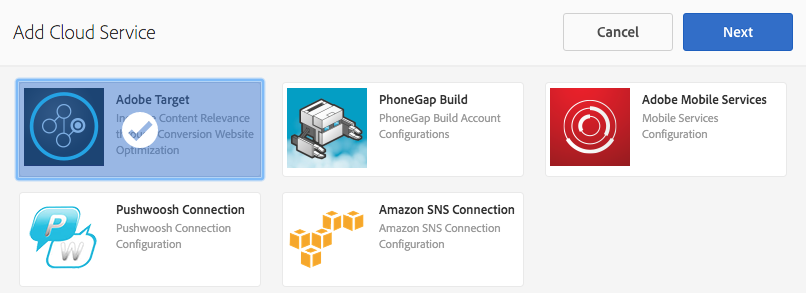

# 配置Adobe TargetCloud Service{#configuring-adobe-target-cloud-service}

>[!NOTE]
>
>Adobe建议对需要基于单页应用程序框架的客户端渲染（例如React）的项目使用SPA编辑器。 [了解更多](/help/sites-developing/spa-overview.md)。

>[!NOTE]
>
>本文档是[AEM Mobile快速入门](/help/mobile/getting-started-aem-mobile.md)指南的一部分，该指南是AEM Mobile参考的推荐起点。

在内容作者开始为移动设备应用程序生成目标内容之前，需要先完成许多步骤：我们将为用户和组获取正确的权限集，创建云服务，配置活动的应用程序，最后生成内容。

今后的假设是[AEM Mobile混合参考应用程序](https://github.com/Adobe-Marketing-Cloud-Apps/aem-mobile-hybrid-reference)已成功部署并可通过AEM Mobile功能板访问。

## 权限 {#permissions}

需要访问个性化控制台的用户必须属于`target-activity-authors`组。 建议在用户和组设置中，将target-activity-group添加到apps-admins组。 通过添加target-activity-authors组，用户将能够查看个性化导航菜单条目。

忘记将您希望有权访问个性化管理控制台的用户或组添加到target-activity-authors组将阻止用户看到个性化控制台。

## 云服务 {#cloud-services}

要使目标内容适用于移动设备应用程序，需要配置两项服务：Adobe Target服务和AdobeMobile Services服务。 Adobe Target服务提供用于处理客户请求和返回个性化内容的引擎。 AdobeMobile Services服务通过ADBMobileConfig.json文件（AMS Cordova插件使用该文件）提供Adobe服务与移动应用程序之间的连接。 在AEM Mobile功能板中，您可以通过添加这两项服务来配置应用程序。

## Adobe TargetCloud Service{#adobe-target-cloud-service}

在AEM Mobile功能板中找到管理Cloud Services，然后单击+按钮。

从添加Cloud Service向导中，选择“Adobe Target”云服务卡，然后单击下一步。

从选择配置下拉列表中，您可以创建新配置或从现有配置中进行选择。 要创建新配置，请从下拉菜单中选择“创建配置”。 输入Target配置的标题。 输入与您的Target帐户关联的客户端代码、电子邮件和密码。 如果您不知道这些字段的值，请联系Adobe Target支持。 单击“验证”按钮以验证凭据。 验证后，单击提交按钮以创建云服务。

创建的云服务将通过向导自动与移动应用程序关联。 在应用程序组节点的jcr:content节点上设置cq:cloudserviceconfigs属性值。 对于混合应用程序示例，将在/content/mobileapps/hybrid-reference-app/jcr:content中设置，其值指向位于/etc/cloudservices/testandtarget/adobe-target—aem-apps/framework的自动生成框架节点。 框架节点默认设置两个属性，即性别和年龄。 框架仅供AEM预览使用，对设备没有任何影响。

完成向导后，管理Cloud Service拼贴将包含Target云服务，但是它包含有关缺少AdobeMobile Service帐户的警告。

## AdobeMobile Service {#adobe-mobile-service}

还必须将AdobeMobile Services(AMS)帐户关联到应用程序，AMS服务会提供所需的ADBMobileConfig.json文件，其中包含Target客户端代码信息。 在创建与AMS帐户的关联之前，AMS帐户需要由具有AMS权限的用户修改。

### 客户代码 {#client-code}

要登录AMS服务，请访问[https://mobilemarketing.adobe.com](https://mobilemarketing.adobe.com/)，选择移动应用程序并单击设置。 找到“SDK目标选项”字段，并将客户端代码放入该字段中，然后单击保存。

现在，客户端代码已与移动设备应用程序关联，在通过Adobe移动设备功能板配置AMS云服务后，服务设置的设置将通过ADBMobileConfig.json文件交付。

### AdobeMobile Service可以服务{#adobe-mobile-service-could-service}

配置AMS后，应将移动应用程序与Adobe移动功能板中的移动应用程序关联。 在AEM Mobile功能板中找到管理Cloud Services，然后单击+按钮。

选择AdobeMobile Services卡片，然后单击下一步。

从创建或选择向导步骤中，选择Mobile Service下拉列表，然后选择创建配置条目。 提供标题、公司、用户名、密码，并选择相应的数据中心。 如果您不知道这些值，请联系AdobeMobile Service管理员以获取它们。 填写完所有字段后，单击“Verify（验证）”按钮。 验证过程将转到AMS并验证帐户的凭据，成功验证后，将填充移动应用程序列表，您从下拉菜单中选择关联的移动应用程序。 单击提交按钮以完成向导。 该过程可能需要一些时间才能获取配置数据以及与应用程序关联的任何分析。 流程完成后，单击模式中的完成按钮以返回至Adobe移动设备功能板。

返回到Mobile Dashboard时，“管理Cloud Services”拼贴将包含AMS云服务。 您还会注意到分析量度拼贴将填充生命周期报表。

## 目标内容同步处理程序{#target-content-sync-handlers}

向用户的设备内容交付内容是通过渲染由AEM内容作者创建的选件来生成的。 要处理目标选件的渲染，有一个新的内容同步处理程序将处理选件。 以混合引用应用程序为例， en（英语）内容包包含带有[mobileappoffers](https://github.com/Adobe-Marketing-Cloud-Apps/aem-mobile-hybrid-reference/blob/master/aem-package/content-author/src/main/content/jcr_root/content/mobileapps/hybrid-reference-app/en/_jcr_content/pge-app/app-config-dev/targetOffers/.content.xml)处理程序的ContentSyncConfig。 下一步对于向设备渲染选件至关重要。 mobileappoppers处理程序具有path属性，该属性用于标识要用于应用程序的个性化活动的路径。

例如，如果存在位于&#x200B;*/content/campaigns/hybridref*&#x200B;的活动，请复制此路径并将其作为值粘贴到mobileappoffers处理程序的&#x200B;*path*&#x200B;属性中。

对于混合引用应用程序，有两个mobileappopfers处理程序，一个用于开发，一个用于生产。

在mobileapporfers处理程序的路径属性中设置活动路径后，保存处理程序。 处理程序现在可以开始为我们的移动设备渲染选件。

### 呈现模式{#render-mode}

对于发布和开发设置，mobileappoppers处理程序的配置方式有所不同。 对于发布设置，在cq:ContentSyncConfig节点上设置了名为&#x200B;*renderMode*&#x200B;的属性，其值为&#x200B;*publish*。 mobileappopfers处理程序引用renderMode，如果设置为发布，则将修改创建的mbox ID。 默认情况下，由AEM创建的mbox具有一个 — author值，附加到mbox ID。 这表示该活动尚未发布，应使用未发布的营销活动解决选件问题。

通过Adobe移动设备功能板暂存内容时，暂存内容会被视为生产就绪内容，并通过非开发内容同步配置进行渲染。 以这种方式渲染将导致 — author从所有mbox ID中删除，并预期Target服务器上会有发布的活动可用。 在测试暂存内容之前，请确保活动已发布。

## 创建内容{#creating-content}

现在，已创建云服务并配置了mobileappoppers处理程序，内容作者可以开始生成目标体验。
