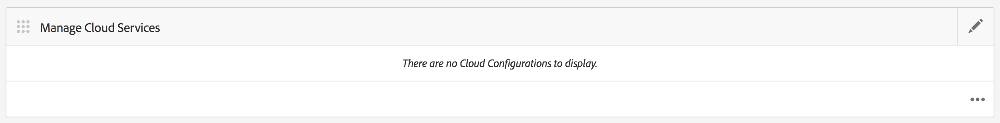

# 配置AdobeMobile ServicesCloud Service {#configure-your-adobe-mobile-services-cloud-service}

>[!NOTE]
>
>Adobe建议对需要基于单页应用程序框架的客户端渲染（如React）的项目使用SPA编辑器。 [了解更多](/help/sites-developing/spa-overview.md).

命 **令中心的** “移动度量拼贴”为您的移动应用程序提供实时分析。

[AdobeMobile](https://www.adobe.com/ca/solutions/digital-analytics/mobile-web-apps-analytics.html) Analytics SDK可通过PhoneGap插件获得。 在设备上收集和缓存度量，直到连接设备，此时数据将推送到AdobeMobile Services Cloud进行报告和分析。

Adobe移动分析SDK提供以下内容：

1. **针对移动渠道的收集** -在所有主要操作系统上为您的移动网站和应用程序收集全面的数据。
1. **移动互动分析** -了解移动应用、网站或视频中的用户互动，包括消费者启动渠道的频率、是否从中购买等。
1. **移动App仪表板和报告** -获取包含应用程序生命周期指标和App商店指标的使用情况报告，查看用户趋势、启动次数、平均会话长度、保留时间和崩溃情况。
1. **移动活动分析** -量化特定于移动的活动（如SMS、移动搜索广告、移动展示广告和QR码）的有效性。
1. **地理位置分析** -根据GPS定位或兴趣点，查找您的App用户启动您的移动体验并与之交互的位置。
1. **寻路分析** -查看用户如何在您的应用程序中导航以确定哪些屏幕和UI元素是吸引用户的，哪些屏幕和UI元素会导致用户放弃。

>[!CAUTION]
>
>只有在 **您配置了云服务** 后，仪表板中才会显示分析度量拼贴。

AEM命令中心度量拼贴

## 配置Cloud Service {#configuring-the-cloud-service}

为了利用AdobeMobile Services Analytics，您需要使用您的Adobe Analytics帐户信息配置AEM MobileAnalytics Cloud服务。

1. 单击右上角的图标，从应用程序Cloud Services的“管理Cloud Services”拼 **贴中添加** 或编辑仪表板。

   

1. 将显 **示“添加或编辑Cloud Services** ”屏幕。 选择 **AdobeMobile Services** ，然后单击 **下一步**。

   

1. 从Mobile Services中选择现 **有配置** ，或 **选择“创建配** 置”以创建新配置。

   对于新配置，输入Mobile **Services属性，**&#x200B;然后单击&#x200B;**“验证”。**

   

   如果验证了凭据，则“验 **证** ”按钮将变 **为Verified**。 您可以从“选择移动应用程序服务” **中选择移动服务应用程序**。

   单击 **“提交** ”以设置配置。

   

1. 设置云配置后，您可以在仪表板中视图相同的配置。

   

   >[!NOTE]
   >
   >设置云配置后，您可以在应用程序视图 **中仪表板** “分析指标”拼贴。

   

