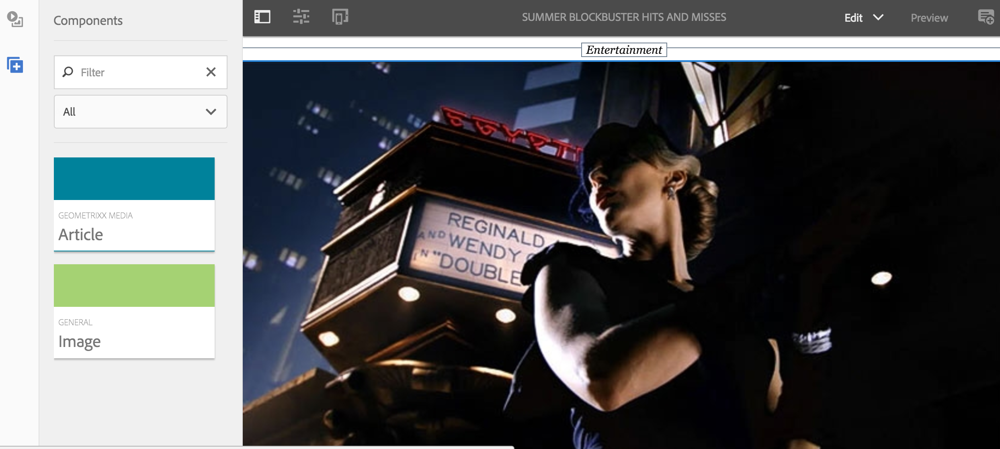

# 创建和添加模板和组件{#creating-and-adding-templates-and-components}

>[!NOTE]
>
>Adobe建议对需要基于单页应用程序框架的客户端渲染（例如React）的项目使用SPA编辑器。 [了解更多](/help/sites-developing/spa-overview.md)。

AEM Mobile On-Demand提供了完全配置的应用程序模板、文章模板和文章组件。

We.Unlimited App是一个示例模板，它代表一个完全可配置且可管理的AEM Mobile On-Demand应用程序的外壳。

创建新应用程序时选择此示例模板可提供AEM Mobile功能丰富的功能板。

>[!NOTE]
>
>要从AEM Mobile应用程序控制中心管理您的应用程序和移动设备应用程序内容，请参阅[AEM Mobile应用程序功能板](/help/mobile/mobile-apps-ondemand-application-dashboard.md)。

## 创建应用程序模板{#creating-app-templates}

应用程序模板用于创建新应用程序，并充当页面模板和组件的集合，这些模板和组件表示应用程序的基线或基础。 该模板会标记一些基本属性，以便以适当的方式引导应用程序。 通常，客户总体上不会创建太多应用程序。

应用程序模板提供了一种轻松的方法来利用开发人员创建的现有设计，这些设计用于在AEM中创建新应用程序。

根据其他应用程序的模板创建新应用程序时，您将获得一个具有起点代表的应用程序，该应用程序是从中创建该应用程序的。

基于应用程序模板创建新应用程序的步骤：

1. 导航到AEM Mobile应用程序目录：*&lt;server-url>/aem/apps.html/content/mobileapps*
1. 选择&#x200B;**创建** —> **应用程序**，如下所示

使用此模板创建应用程序后，您可以向应用程序添加文章、横幅和收藏集。 要重新访问、创建文章、横幅和收藏集，请参阅[内容管理操作](/help/mobile/mobile-apps-ondemand-manage-content-ondemand.md)。

>[!NOTE]
>
>或者，您也可以选择由AEM开发人员提供的示例应用程序模板，例如&#x200B;**We.Unlimited**&#x200B;应用程序。 如果将此示例模板用于应用程序，则会获得一些可用的示例文章和收藏集。 您将可以选择使用示例模板和组件、自定义现有模板和组件，或为应用程序创建新模板和组件。

>[!CAUTION]
>
>设置&#x200B;***redirectTarget***&#x200B;属性
>
>使用其中一个应用程序模板时，开发人员定义应用程序的内容。 但是，开发人员必须了解在jcr中创建应用程序的位置以及&#x200B;***redirectTarget***&#x200B;属性的值。
>
>在创建应用程序操作中，会计算&#x200B;***redirectTarget*** ，并尝试解析路径（如果存在作为应用程序模板一部分提供的redirectTarget属性，且redirectTarget的值定义为相对值）。 当创建应用程序进程在应用程序模板中找到redirectTarget的相对值时，该值会附加到创建应用程序的解析位置。
>
>例如，如果应用程序模板定义了值为“*lanugage-masters/en*”的&#x200B;***redirectTarget***，并且该应用程序是在“*/content/mobileapps/fooApp*”中创建的，则创建应用程序后的redirectTarget最终值将为“*/content/mobileapps/fooApp/language-masters/en*”。

## 创建内容模板{#creating-content-templates}

每个实体类型都有两个现成的模板。 这四个关键原则分别是：

* **默认模板：** 用于创建具有适用默认属性/结构的内容
* **导入的模板：** 用于从具有适用默认属性/结构的AEM Mobile导入内容

### 文章模板{#article-templates}

无限制文章是代表典型AEM Mobile On-Demand文章布局的示例模板。

1. 单击&#x200B;**管理文章**&#x200B;中的&#x200B;**+**&#x200B;以创建新文章。 您可以选择&#x200B;**无限制文章**&#x200B;或&#x200B;**富文本文章**。 下图显示了选项，允许您从这两篇文章模板中的任意模板进行选择。

1. 单击&#x200B;**Next**&#x200B;以定义文章元数据，如文章名称/标题、描述、作者、摘要、部门、缩略图、文章访问次数等。
1. 单击&#x200B;**Next**&#x200B;以填写广告属性。
1. 单击&#x200B;**Next**&#x200B;以输入文章图像或社交媒体图像
1. 单击&#x200B;**Next**&#x200B;以选择此新文章到的集合链接。
1. 单击&#x200B;**Next**&#x200B;以输入社交共享的详细信息。
1. 单击&#x200B;**创建**&#x200B;以完成使用示例创建文章的过程。 单击&#x200B;**Done**&#x200B;或&#x200B;**Edit Articles**&#x200B;以编辑本文的属性。

### 将组件添加到文章{#adding-components-to-article}

创建后，作者可以通过添加文本和图像等组件来编辑文章的内容。 文章是AEM页面模板的扩展。

选择一篇文章，要编辑并单击&#x200B;**Edit**&#x200B;以将组件添加到文章中。

 

选择左侧面板中的“**+**”以向文章添加组件。

### 创建现成模板{#creating-out-of-the-box-templates}

没有现成的文章模板，但是自定义模板应该扩展的默认模板，请参阅Geometrixx Unlimited应用程序的[文章模板示例](http://localhost:4502/crx/de/index.jsp#/apps/geometrixx-unlimited-app/templates/article)。

常规AEM模板以外需要属性的关键属性包括；

***dps-resourceType=&quot;dps:Article&quot;***

此属性可确保将AEM页面识别为AEM Mobile目标文章页面。

根据AEM模板，您可以向模板的&#x200B;***jcr:content***&#x200B;添加任何默认属性或子节点。

### 横幅和收藏集模板{#banner-and-collection-templates}

>[!CAUTION]
>
>横幅和收藏集没有内容，因此其创建不支持自定义模板。

## 创建和添加组件{#creating-and-adding-components}

组件使用并允许访问小组件，这些组件用于呈现内容。

代码存储库中包含一个简单的组件，其源可在AEM中找到。 随后，也可以在本地以CRXDE Lite打开。

>[!NOTE]
>
>目前没有为AEM Mobile提供现成的组件。

您可以向页面中添加组件。 任何组件都可以在AEM Mobile应用程序中使用，但在应用时，可能无法正确呈现。

但是，如果没有在AEM中呈现的自定义导出内容同步处理程序，自定义组件可能无法正确导出并上传到AEM Mobile On-demand Services。

在AEM页面中包含组件以及其他一些构建基块组件后，您可以向页面添加其他组件或编辑现有组件。

**要向页面添加其他组件，请执行以下操作：**

1. 选择该页面，并通过编辑器标题右上角的下拉菜单确保您处于编辑模式
1. 使用编辑器标题中最左侧的图标切换侧面板
1. 选择&#x200B;**Components**&#x200B;选项卡
1. 将其中一个可用组件拖放到页面上

**要编辑现有组件，请执行以下操作：**

1. 选择该页面，并确保您处于&#x200B;**编辑**&#x200B;模式，然后选择组件
1. 点按扳手图标以配置组件

>[!NOTE]
>
>您可以在AEM中创建组件，并使用[使用CRXDE Lite](/help/sites-developing/developing-with-crxde-lite.md)进行开发来自定义组件。 根据需要自定义现有组件后，可以使用&#x200B;**管理文章**&#x200B;下的&#x200B;**编辑**&#x200B;选项将其添加到页面中，如上图所示。

>[!NOTE]
>
>请参阅AEM Mobile中的[模板和组件开发最佳实践](/help/mobile/best-practices-aem-mobile.md)。

### 后续步骤 {#the-next-steps}

* [使用内容属性导出内容](/help/mobile/on-demand-content-properties-exporting.md)
* [具有内容同步的移动设备](/help/mobile/mobile-ondemand-contentsync.md)
