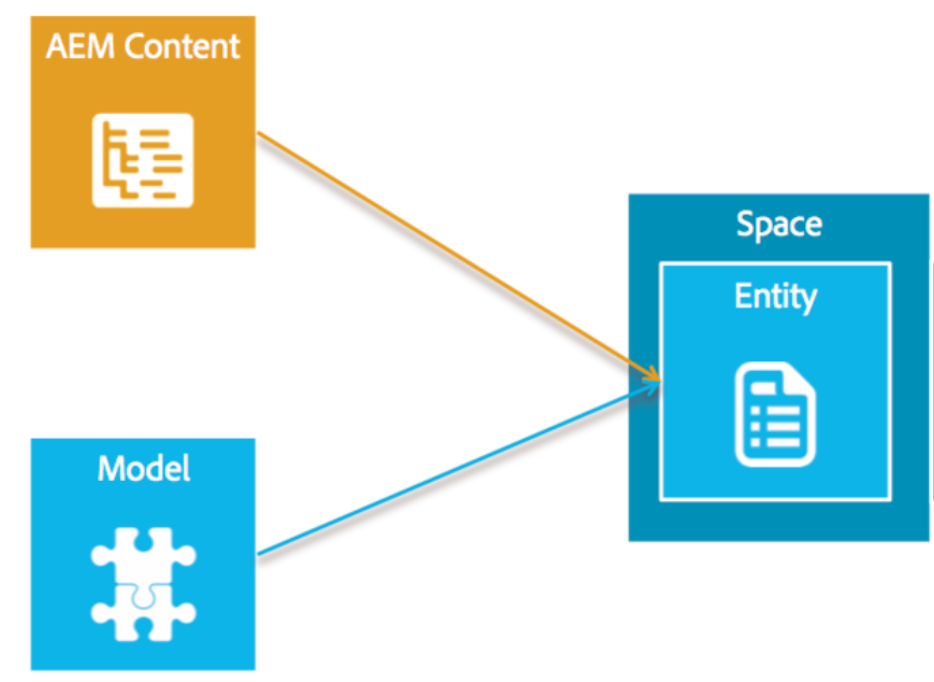

# 模型概述{#models-overview}

>[!CAUTION]
>
>AEM 6.4已结束扩展支持，本文档将不再更新。 有关更多详细信息，请参阅 [技术支助期](https://helpx.adobe.com/cn/support/programs/eol-matrix.html). 查找支持的版本 [此处](https://experienceleague.adobe.com/docs/).

>[!NOTE]
>
>Adobe建议对需要基于单页应用程序框架的客户端渲染（例如React）的项目使用SPA编辑器。 [了解详情](/help/sites-developing/spa-overview.md).

模型管理包括创建和管理模型，以便与最终数据对象关联。 每个模型都将包括为便于创建和渲染对象而需要的所有属性和字段定义。

模型管理涉及创建 **模型**, **实体**&#x200B;和 **空格**. 下图说明了AEM内容与模型之间的关系。

## 内容模型 {#the-content-model}

模型描述内容类型，并指示本机应用程序可使用哪些信息。 它是对构成某段内容的内容的描述。 内容模型是如何构建一段内容的规则。 内容模型包括可用数据、可使用资产、资产与数据之间的关系、与其他内容模型的关系以及可用元数据。

模型还可用作将现有AEM内容转换为本机移动设备应用程序可轻松使用的对象的方法。

内容服务将为常见对象(如资产、资产收藏集、HTML页面、应用程序配置和与渠道无关的页面)提供一些现成的模型。 这些配置是可配置的，因此它们将满足特定客户需求，而无需进行AEM开发工作。

用户可以创建自己的模型。 这样可创建尚未由AEM管理的新内容类型。 模型创建是通过使用现有基元类型的UI完成的。

下图说明了AEM Mobile应用程序的内容模型以及如何将实体、文件夹和空格分配给应用程序。

### 模型 {#the-models}

模型用于确定图元的创建方式。 它们定义实体中可用的内容，以及如何从AEM内容生成该数据。 在开始使用空格、文件夹和实体之前，您应该熟悉如何创建和管理模型。

>[!NOTE]
>
>模型存在于应用程序外部，因为多个应用程序可以使用它。

请参阅 **[模型](/help/mobile/administer-mobile-apps.md)** 在功能板和存储库中创建和管理模型。

### 内容模型中的实体 {#entities-in-content-model}

实体是内容模型的实例。 实体通过内容服务API公开到客户端库，并为本机应用程序提供了一种以独立于渠道的方式访问内容的方式。

对于现有AEM内容，使用模型和AEM内容源生成实体。 例如，页面实体是从AEM页面和页面模型生成的与渠道和布局无关的对象。

对实体的引用内容所做的更改将导致实体发生更改。 例如，如果 *cq:page* 更新后，则基于该页面的所有实体也将进行更新。

请参阅 **[使用实体](/help/mobile/spaces-and-entities.md)** 从模型创建自定义实体。

>[!NOTE]
>
>如果模型与现有AEM内容不对应，例如客户创建了新模型，则将有一个UI，以便客户可以创建新实体。

### 内容模型中的空格 {#spaces-in-content-model}

空间用于组织实体以便轻松访问。 空间可以包含一个或多个实体类型，也可以包含子文件夹。

在AEM方面，空间是管理相关实体的一种便捷方式。 它还可用于分配授权权限。 可以对空间进行授权，然后该空间将保护该空间中的实体。

*例如*,

用户有三个实体的常规分类。 一个仅供内部使用，另一个则获准供公众使用，三分之一则适用于许多应用程序使用的常见实体。 为便于管理，用户创建了三个空间，即 *内部*, *公共* （包含英语和法语内容）和 *公共* 管理下列相应实体：

* /content/entities/internal
* /content/entities/public/en
* /content/entities/public/fr
* /content/entities/common

将向空间提供服务端点，以便本机客户端库可以请求空间内容的列表。 此“列表”将作为JSON对象返回。

请参阅 **[空间和实体](/help/mobile/spaces-and-entities.md)** 创建和发布空间。

>[!NOTE]
>
>一个空间可供许多应用程序使用，而一个应用程序可使用多个空间。

### 内容模型中的文件夹 {#folders-in-content-model}

文件夹允许用户根据需要组织实体，并便于进行更精细的ACL控制。 空间可以包含文件夹，以帮助进一步组织空间的内容和资产。 用户可以在空格下创建自己的层次结构。

请参阅 **[在空间中使用文件夹](/help/mobile/spaces-and-entities.md)** 创建和管理空间中的文件夹。
