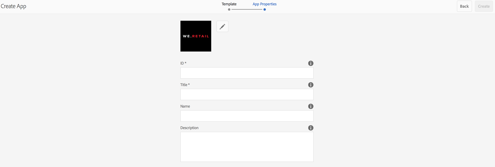

# 使用创建向导创建新的AEM Mobile应用程序{#creating-a-new-aem-mobile-app-using-create-wizard}

>[!NOTE]
>
>Adobe建议对需要基于单页应用程序框架的客户端渲染（例如React）的项目使用SPA编辑器。 [了解更多](/help/sites-developing/spa-overview.md)。

AEM Mobile应用程序基于定义页面结构和属性的蓝图。 您可以配置以下应用程序属性：

* **标题：** 应用程序标题。
* **目标路径：** 存储应用程序的存储库中的位置。 将保留默认设置，以便根据应用程序名称创建路径。

* **名称：** 默认值是删除空格字符的标题属性值。 该名称在AEM中用来引用应用程序，例如表示应用程序的存储库节点。
* **描述：** 应用程序的描述。
* **服务器URL:** 为应用程序提供空中(OTA)内容更新的URL。 默认值是用于创建应用程序（从外部器服务获取）的实例的发布服务器URL。 请注意，这必须是发布服务器实例，而不是需要身份验证的作者。

您还可以提供要用作应用程序缩略图的图像文件，选择要使用的PhoneGap Build配置，然后选择要使用的移动设备应用程序分析配置。 此图像仅用作缩略图，用于在Experience Manager的移动设备应用程序控制台中表示您的移动设备应用程序。

内部版本云服务以及将AdobeMobile Services SDK插件集成到您的应用程序中，还存在其他（可选）选项卡。

* 内部版本：单击此处管理配置并设置build.phonegap.com构建服务。 然后，从下拉列表中，您将能够选择新创建的PhoneGap内部版本云服务。
* Analytics:单击管理配置并设置 [AdobeMobile Services SDK](https://experienceleague.adobe.com/docs/mobile-services/using/manage-app-settings-ug/configuring-app/download-sdk.html) 云服务。 然后，您将能够从下拉菜单中选择新创建的Mobile Service，以将其集成到您的移动设备应用程序中。

## 使用应用程序模板 {#using-app-templates}

应用程序模板提供了一种轻松的方法来利用开发人员创建的现有设计，这些设计用于在AEM中创建新应用程序。

什么是应用程序模板？ 可将其视为页面模板和组件的集合，这些模板和组件代表应用程序的基线或基础。
根据其他应用程序的模板创建新应用程序时，您将获得一个具有起点代表的应用程序，该应用程序是从中创建该应用程序的。

您必须拥有现有的移动设备应用程序模板（或安装了应用程序模板的应用程序）才能使用此功能。

最新的AEM应用程序示例包中包含带有应用程序模板的Geometrixx应用程序的更新版本。 或者，您也可以安装 [StarterKit](https://github.com/Adobe-Marketing-Cloud-Apps/aem-phonegap-starter-kit) 还提供了模板。

基于应用程序模板创建新应用程序的步骤：

1. 导航到AEM Mobile应用程序目录：&lt;*server-url*>aem/apps.html/content/mobileapps
1. 选择 **创建** 然后选择 **应用程序** 如下所示

选择由AEM开发人员提供的应用程序模板。 请参阅 [AEM Mobile应用程序的结构](/help/mobile/phonegap-structure-an-app.md) ，以获取开发人员帮助。

根据需要填写新应用程序的详细信息，包括（可选）更改其缩略图。 这些值稍后可从 **管理应用程序** 拼贴。

## 后续步骤 {#the-next-steps}

请参阅以下资源，了解有关其他创作角色的更多信息：

* [管理应用程序拼贴](/help/mobile/phonegap-app-details-tile.md)
* [编辑应用程序元数据](/help/mobile/phonegap-editmetadata.md)
* [应用程序定义](/help/mobile/phonegap-app-definitions.md)
* [导入现有混合应用程序](/help/mobile/phonegap-adding-content-to-imported-app.md)
* [Content Services](/help/mobile/develop-content-as-a-service.md)

## 其他资源 {#additional-resources}

要了解管理员和开发人员的角色和职责，请参阅以下资源：

* [使用AEM为Adobe PhoneGap企业进行开发](/help/mobile/developing-in-phonegap.md)
* [使用AEM管理Adobe PhoneGap Enterprise的内容](/help/mobile/administer-phonegap.md)
