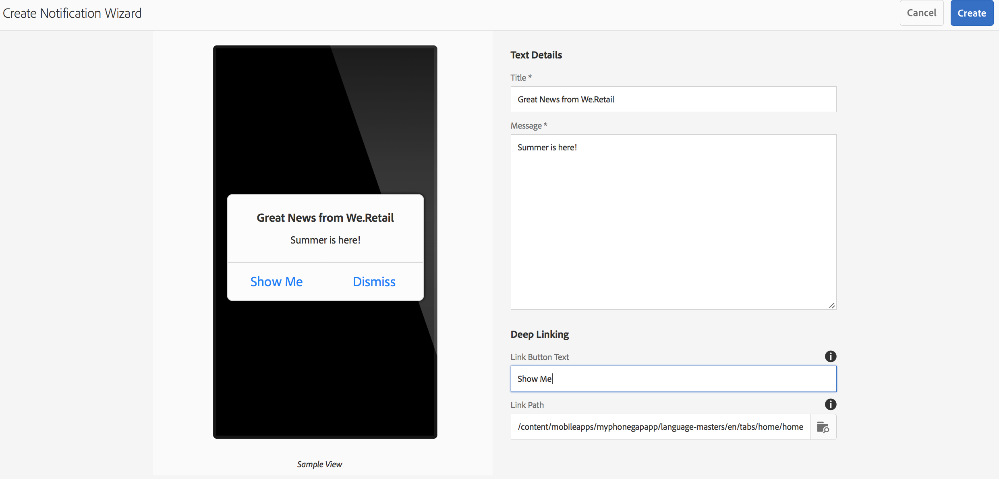

# 推送通知{#push-notifications}

>[!NOTE]
>
>Adobe建议对需要基于单页应用程序框架的客户端渲染（例如React）的项目使用SPA编辑器。 [了解更多](/help/sites-developing/spa-overview.md)。

通过重要通知立即提醒AEM Mobile应用程序用户，对于移动设备应用程序及其营销活动的价值至关重要。 在本例中，我们将介绍需要采取哪些步骤来允许您的应用程序接收推送通知，以及如何配置推送消息并将其从AEM Mobile发送到手机上安装的应用程序。 此外，本节还介绍如何将[深层链接](#deeplinking)功能配置为推送通知。

>[!NOTE]
>
>*推送通知无法得到保证；更像是公告。尽最大努力确保每个人都收到这些文件，但它们并不是有保证的交付机制。 此外，发送推送的时间可能会从不到1秒变化到长达半小时。*

在AEM中使用推送通知需要一些不同的技术。 首先，必须使用推送通知服务提供商来管理通知和设备(AEM尚未提供)。 使用AEM开箱即用配置了两个提供程序：[Amazon Simple Notification Service](https://aws.amazon.com/sns/)（或SNS）和[Pushwoosh](https://www.pushwoosh.com/)。 其次，针对给定移动操作系统的推送技术必须通过相应的服务 — 适用于iOS设备的Apple推送通知服务（或APNS）；和适用于Android设备的Google Cloud Messaging（或GCM）。 尽管AEM不会直接与这些特定于平台的服务通信，但AEM必须随通知一起提供一些相关配置信息，以便这些服务执行推送。

安装和配置后（如下所述），它的工作方式如下：

1. 在AEM中创建推送通知，并将其发送给服务提供商(Amazon SNS或Pushwoosh)。
1. 服务提供商将收到该数据集，并将其发送到核心提供商（APNS或GCM）。
1. 核心提供商将通知推送到为该推送注册的所有设备。 对于每个设备，它都使用蜂窝数据网络或WiFi（以设备上当前可用的值为准）。
1. 如果为其注册的应用程序未运行，则通知会显示在设备上。 点按通知的用户将启动应用程序并在应用程序中显示通知。 如果应用程序已在运行，则只会显示应用程序内通知。

此版本的AEM支持iOS和Android移动设备。

## 概述和过程{#overview-and-procedure}

要在AEM Mobile应用程序中使用推送通知，必须执行以下高级步骤。

通常，AEM开发人员将：

1. 在Apple和Google报文传送服务中注册
1. 使用推送消息服务注册并配置
1. 向应用程序添加推送支持
1. 准备电话以进行测试

而AEM管理员将：

1. 在AEM应用程序上配置推送
1. 构建和部署应用程序
1. 发送推送通知
1. 配置深层链接&#x200B;*（可选）*

### 步骤1:在Apple和Google报文传送服务中注册{#step-register-with-apple-and-google-messaging-services}

#### 使用Apple推送通知服务(APNS){#using-the-apple-push-notification-service-apns}

转到Apple页面[此处](https://developer.apple.com/library/ios/documentation/NetworkingInternet/Conceptual/RemoteNotificationsPG/Chapters/ApplePushService.html)，以熟悉Apple推送通知服务。

要使用APNS，您需要Apple的&#x200B;**证书**&#x200B;文件（.cer文件）、推送&#x200B;**私钥**（.p12文件）和&#x200B;**私钥密码**。 有关如何执行此操作的说明，请参见[此处](https://developer.apple.com/library/ios/documentation/NetworkingInternet/Conceptual/RemoteNotificationsPG/Chapters/ProvisioningDevelopment.html)。

#### 使用Google Cloud Messaging(GCM)服务{#using-the-google-cloud-messaging-gcm-service}

>[!NOTE]
>
>Google正在将GCM替换为一项名为Firebase Cloud Messaging(FCM)的类似服务。 有关FCM的更多信息，请单击[此处](https://developers.google.com/cloud-messaging/faq)。

转到Google页面[此处](https://developer.android.com/google/gcm/index.html)，以熟悉Android版Google云消息传送。

您需要按照以下步骤操作： [此处](https://developer.android.com/google/gcm/gs.html)到&#x200B;**创建Google API项目**、 **启用GCM服务**&#x200B;和&#x200B;**获取API密钥**。 您需要&#x200B;**API密钥**&#x200B;才能将推送通知发送到Android设备。 另外，请记录您的&#x200B;**项目编号**，该编号有时也称为&#x200B;**GCM发件人Id**。

以下步骤显示了创建GCM API密钥的不同方法：

1. 登录google，然后转到[Google的开发人员页面](https://developers.google.com/mobile/add?platform=android&amp;cntapi=gcm)。
1. 从列表中选择您的应用程序（或创建一个新应用程序）。
1. 在Android包名称下，输入您的应用程序ID，即`com.adobe.cq.mobile.weretail.outdoorsapp`。 （如果这不起作用，请使用“test.test”重试。）
1. 单击&#x200B;**继续选择并配置服务**
1. 选择“云消息”，然后单击&#x200B;**启用Google Cloud Messaging**。
1. 随后将显示新的服务器API密钥和（新的或现有的）发件人ID。

>[!NOTE]
>
>记录服务器API密钥。 此值在您的推送提供商的网站上输入。

### 步骤2:注册和配置推送消息服务{#step-register-and-configure-a-push-messaging-service}

AEM配置为使用三种服务之一进行推送通知：

* Amazon SNS
* Pushwoosh
* Adobe Mobile Services

*Amazon* SNS和 ** Pushwooshconfigurations允许您从AEM屏幕内发送推送。

*AdobeMobile* Services配置允许您使用Adobe Analytics帐户从AdobeMobile Services中配置和发送推送通知（但需要使用此配置集构建应用程序以启用AMS推送通知）。

#### 使用Amazon SNS报文传送服务{#using-the-amazon-sns-messaging-service}

>[!NOTE]
>
>*有关Amazon SNS的信息以及创建新AWS帐户的链接，请访问 [此处](https://aws.amazon.com/sns/)。您可以获得一年的免费帐户。*

如果您不想使用Amazon SNS，可以跳过这些步骤。

请按照以下步骤设置Amazon SNS进行推送通知：

1. **在Amazon SNS中注册**

   1. 记录您的帐户ID。 格式应为12位数字，无空格或短划线，即&quot;123456789012&quot;。
   1. 确保您位于“美国东部”或“欧盟”地区，因为后续步骤（身份池创建）需要其中一个步骤。
   1. 注册后，登录到管理控制台并选择[SNS](https://console.aws.amazon.com/sns/)（推送通知服务）。 如果显示“Get Started”（快速入门），请单击。

1. **创建访问密钥和ID**

   1. 单击屏幕右上方的登录名，然后从菜单中选择“安全凭据”。
   1. 单击访问密钥，然后在下面的空格中，单击&#x200B;**创建新访问密钥**。
   1. 单击&#x200B;**显示访问密钥**，然后复制并保存显示的访问密钥ID和密钥访问密钥。 如果选择下载密钥的选项，您将获得一个包含这些相同值的csv文件。
   1. 此页面上可以管理其他与安全相关的证书和其他一些证书。

   >[!NOTE]
   >
   >访问密钥可用于多个应用程序。

   对于使用“AWS沙盒”帐户的组织，这些步骤非常相似，如下所述：

   1. 单击屏幕右上方的登录名，然后从菜单中选择“My Security Credentials（我的安全凭据）”。
   1. 单击操作左侧列表中的用户，然后选择您的用户名。
   1. 单击安全凭据选项卡。
   1. 从此处，您可以看到密钥并创建新密钥。 保存密钥供以后使用。

1. **创建主题**

   1. 单击&#x200B;**创建主题**&#x200B;并选择主题名称。 记录所有字段，如“主题ARN”、“主题所有者”、“区域”、“显示名称”。
   1. 单击&#x200B;**其他主题操作** > **编辑主题策略**。 在&#x200B;**允许这些用户订阅此主题**&#x200B;下，选择&#x200B;**Everyone.**
   1. 单击&#x200B;**更新策略**。

   >[!NOTE]
   >
   >您可以为不同的场景（如开发、测试、演示等）创建多个主题。 SNS配置的其余部分可以保持不变。 使用不同的主题构建应用程序；只有使用该主题构建的应用程序才会接收发送到该主题的推送通知。

1. **创建平台应用程序**

   1. 单击“应用程序”，然后单击“创建平台应用程序”。 选择一个名称并选择一个平台（用于iOS的APNS，用于Android的GCM）。 根据平台的不同，需要填写其他字段：

      1. 对于APNS，必须输入P12文件、密码、证书和私钥。 应该已在上面的使用Apple推送通知服务(APNS)*步骤中获取这些内容。*
      1. 对于GCM，必须输入API密钥。 应该已在上面的使用Google Cloud Messaging(GCM)服务&#x200B;*步骤中获取此信息。*
   1. 对要支持的每个平台重复上述步骤一次。 要能够同时推送到iOS和Android，必须创建两个平台应用程序。

1. **创建身份池**

   1. 使用[Cognito](https://console.aws.amazon.com/cognito)创建身份池，该池将存储未经身份验证的用户的基本数据。 请注意，目前只有“美国东部”和“欧盟”地区受Amazon Cognito支持。
   1. 为其命名，并选中“启用对未验证身份的访问”复选框。
   1. 在下一页（“*Your Cognito identities需要访问您的资源*”）中，单击允许。
   1. 在页面的右上方，单击链接“*编辑标识池”*。 将显示身份池Id。 保存此文本以备以后使用。
   1. 在同一页面上，选择“未验证角色”旁边的下拉列表，并确保该角色已选中Cognito_&lt;池名称>UnauthRole。 保存更改。

1. **配置访问权限**

   1. 登录[Identity and Access Management](https://console.aws.amazon.com/iam/home)(IAM)
   1. 选择角色
   1. 单击在上一步中创建的角色，称为Cognito_&lt;yourIdentityPoolName>Unauth_Role。 记录显示的“角色ARN”。
   1. 打开“内联策略”（如果尚未打开）。 您应会在此处看到一个名为oneClick_Cognito_&lt;yourIdentityPoolName>Unauth_Role_1234567890123的策略。
   1. 单击“编辑策略”。 将策略文档的内容替换为以下JSON代码片段：

   <table> 
    <tbody> 
     <tr> 
     <td>
 
 
{
 
 "版本":"2012-10-17",
 
 "语句": [
 
 {
 
 "操作": [
 
 "mobileanalytics:PutEvents",
 
 "cognito sync:*",
 
 "SNS:CreatePlatformEndpoint",
 
 "SNS：订阅"
 
 ],
 
 “效果”："允许",
 
 "资源": [
 
 "*"
 
 _
 
 }
 
 _
 
}
 
 
 </td> 
     </tr> 
    </tbody> 
    </table>

   1. 单击&#x200B;**Apply Policy**

#### 使用Pushwoosh消息服务{#using-the-pushwoosh-messaging-service}

如果不想使用Pushwoosh，可以跳过此步骤。

要使用Pushwoosh，请执行以下操作：

1. **在Pushwoosh注册**

   1. 转到pushwoosh.com并创建新帐户。

1. **创建API访问令牌**

   1. 在Pushwoosh网站上，转到API访问菜单项，以生成API访问令牌。 您需要安全地记录此内容。

1. **创建新应用程序**

   1. 要获得Android支持，您需要提供GCM API密钥。
   1. 配置应用程序时，选择Cordova作为框架。
   1. 要支持iOS，您需要提供证书文件(.cer)、推送证书(.p12)和私钥密码；这些应该是从苹果的APNS网站获取的。 对于“框架”，选择“Cordova”。
   1. Pushwoosh将为该应用程序生成一个应用程序ID，格式为“XXXXX-XXXX”，其中每个X是一个十六进制值（0到F）。

>[!NOTE]
>
>*如果在AEM中为第二个应用程序配置了相同的应用程序ID(和其他相关值：API访问令牌和GCM ID)，则通过AEM上的第二个应用程序发送的任何推送通知都将转到具有该应用程序ID的任何其他应用程序。*

### 步骤3:向应用程序{#step-add-push-support-to-the-app}添加推送支持

#### 添加ContentSync配置{#add-contentsync-configuration}

创建两个内容节点（一个在app-config中，一个在app-config-dev中），称为notificationsConfig :

* /content/`<your app>`/shell/jcr:content/pge-app/app-config-dev/notificationsConfig
* /content/`<your app>`/shell/jcr:content/pge-app/app-config/notificationsConfig

使用以下属性（.content.xml文件）：\
&lt;jcr:root xmlns:jcr=&quot; [https://www.jcp.org/jcr/1.0](https://www.jcp.org/jcr/1.0)&quot; xmlns:nt=&quot; [https://www.jcp.org/jcr/nt/1.0](https://www.jcp.org/jcr/nt/1.0)&quot;>\
jcr:primaryType=&quot;nt:unstructured&quot;\
excludeProperties=&quot;[appAPIAccessToken]&quot;\
路径=&quot;../../../..&quot;\
targetRootDirectory=&quot;www&quot;\
type=&quot;notificationsconfig&quot;/>

>[!NOTE]
>
>内容同步处理程序会查找这些节点，如果它们不在该节点，则不会写出pge-notifications-config.json文件。

#### 添加客户端库{#add-client-libraries}

必须按照以下步骤将推送通知客户端库添加到应用程序：

在CRXDE Lite中：

1. 导航到&#x200B;*/etc/designs/phonegap/&lt;应用程序名称>/clientlibsall.*
1. 双击属性窗格中的嵌入部分。
1. 在显示的对话框中，单击+按钮以添加新的客户端库。
1. 在新文本字段中，添加“cq.mobile.push”，然后单击“确定”。
1. 再添加一个名为cq.mobile.push.amazon的页面，然后单击“确定”。
1. 保存更改。

>[!NOTE]
>
>如果出于应用程序上的空间考虑因素而删除或不使用推送通知，并避免出现控制台错误消息，请从应用程序中删除这些clientlib。

### 步骤4:准备电话测试{#step-prepare-a-phone-for-testing}

>[!NOTE]
>
>*对于推送通知，您需要在实际设备上进行测试，因为模拟器无法接收推送通知。*

#### IOS {#ios}

对于iOS，您需要使用Mac OS计算机，并且需要加入[iOS开发人员程序](https://developer.apple.com/programs/ios/)。 有些公司拥有公司许可证，所有开发人员都可使用这些许可证。

对于XCode 8.1，在使用推送通知之前，您必须转到项目的功能选项卡，然后切换推送通知切换开关。

#### Android {#android}

要使用CLI在Android手机上安装应用程序，请参阅以下内容：**步骤6 — 构建和部署应用程序**)，您必须首先将手机置于“开发人员模式”。 有关执行此操作的详细信息，请参阅[启用设备上开发人员选项](https://developer.android.com/tools/device.html#developer-device-options)。

### 步骤5:在AEM应用程序{#step-configure-push-on-aem-apps}上配置推送

在构建并部署到已配置的移动设备之前，您必须为决定使用的消息传送服务配置通知设置。

1. 为推送通知创建相应的授权组。
1. 以相应用户身份登录AEM，单击应用程序选项卡。
1. 单击应用程序。
1. 找到“管理Cloud Services”拼贴并单击铅笔，以修改云配置。
1. 选择Amazon SNS连接、Pushwoosh连接或AdobeMobile Services作为通知配置。
1. 输入提供程序属性，然后单击提交以保存它们，然后单击完成。 除AMS外，在此阶段不会远程验证它们。
1. 此时，您应会看到您刚刚在“管理Cloud Services”拼贴中输入的配置。

### 步骤6:构建和部署应用程序{#step-build-and-deploy-the-app}

**注意：** 另请参阅此处有关构  建PhoneGap应用程序的说明。

使用PhoneGap构建和部署应用程序的方法有两种。

**注意：** 对于推送通知测试，模拟器是不够的，因为推送通知在推送提供程序（Apple或Google）和设备之间使用不同的协议。当前的Mac/PC硬件和模拟器不支持此功能。

1. *PhoneGap Buildir* 是PhoneGap提供的一项服务，将在您的服务器上为您构建应用程序，并允许您直接将其下载到设备。请参阅[PhoneGap Build文档](https://build.phonegap.com/) ，了解如何设置和使用PhoneGap Build。

1. *PhoneGap命令行界面* (CLI)允许您在命令行中使用丰富的PhoneGap命令集来构建、调试和部署应用程序。请参阅[PhoneGap开发人员文档](https://docs.phonegap.com/en/edge/guide_cli_index.md.html#The%20Command-Line%20Interface)，了解如何设置和使用PhoneGap CLI。

### 步骤7:发送推送通知{#step-send-a-push-notification}

要创建并发送新通知，请执行以下步骤。

1. 创建新通知

   * 在AEM Mobile应用程序的功能板中，找到推送通知拼贴。
   * 在右上方的菜单中，选择“创建”。 请注意，在首次设置云配置之前，此按钮将不可用。
   * 在创建通知向导中，输入标题和消息，然后单击“创建”按钮。 您的通知现已准备就绪，可立即发送或稍后发送。 可以编辑消息和/或标题，并更改和保存。

1. 发送通知

   * 在“应用程序”功能板中，找到推送通知拼贴。
   * 选择通知，或单击右下方的详细信息按钮(...)以显示通知列表。 此列表还指示通知是否已准备好发送、是否已发送，或是否在发送过程中出错。
   * 选中一个通知的复选框（仅限），然后单击列表上方的“发送通知”按钮。 您将有一次机会在显示的对话框中“取消”或“发送”通知。

1. 处理结果

   * 如果推送通知服务(Amazon SNS或Pushwoosh)收到发送请求，确认该请求有效，并将其成功发送到本机提供程序（APNS和GCM），则“发送”对话框将关闭，且不显示任何消息。 在通知列表中，该通知的状态将列为已发送。
   * 如果推送发送失败，对话框将显示一条消息，指示问题。 在通知列表中，该通知的状态将列为“错误”，但如果问题得到纠正，则可以再次发送通知。 发生错误时，服务器错误日志中应显示其他错误信息。
   * 请注意，iOS和Android推送通知之间存在一些平台差异。 其中包括：

      * 在Android上部署应用程序后，使用CLI进行构建将启动该应用程序。 在iOS上，您必须手动启动它。 由于推送注册步骤在启动时执行，因此Android应用程序可以立即接收推送通知（因为该通知将已启动并注册），而iOS应用程序则不会。
      * 在Android中，“确定”按钮文本全部大写（以及在应用程序内通知中添加的任何其他按钮中），而在iOS中则不全部大写。

对于AMS推送通知，必须从AMS服务器撰写并发送通知。 AMS提供的推送通知功能超出了AEM通知与AWS和Pushwoosh提供的功能。

>[!NOTE]
>
>*推送通知无法得到保证；更像是公告。尽最大努力确保每个人都听到这一消息，但它们并不是一个有保证的交付机制。 此外，发送推送的时间可能会从不到1秒变化到长达半小时。*

### 配置包含推送通知的深层链接{#configuring-deep-linking-with-push-notifications}

什么是深层链接？ 在推送通知的上下文中，这是一种允许将应用程序打开或定向（如果打开）到应用程序内指定位置的方法。

它是如何工作的？ 推送通知的作者可以选择添加按钮标签(例如，“给我看看！”) ，并通过可视路径浏览器选择要在通知中链接的页面。 发送后，推送会正常进行，但应用程序内消息中的“确定”按钮会被替换为“关闭”按钮，并指定新按钮（“显示我！”） 。 单击新按钮将使应用程序转到应用程序中的指定页面。 单击“取消”将只是关闭消息。

如果应用程序未打开，则阴影将正常显示。 对阴影中的通知执行操作将打开应用程序，然后根据推送通知中配置的内容向用户显示深层链接按钮。

创建通知、添加按钮文本和可选深层链接的链接路径：

>[!CAUTION]
>
>。要访问功能板中的“推送通知”拼贴，请执行以下步骤。

1. 单击&#x200B;**管理Cloud Services**&#x200B;区块右上角的编辑。

   

1. 选择&#x200B;**Pushwoosh连接**。 单击&#x200B;**下一步**。

   

1. 输入属性的详细信息，然后单击&#x200B;**Submit**。

   

   提交配置后，功能板中会显示&#x200B;**推送通知**&#x200B;拼贴。

   

### 创建通知向导 {#create-notification-wizard}

在功能板中显示&#x200B;**推送通知**&#x200B;拼贴后，使用创建通知向导添加内容：

1. 单击&#x200B;**推送通知**&#x200B;拼贴右上角的添加符号以打开&#x200B;**创建通知向导**。

   

1. 单击链接路径中的浏览图标，可向用户显示应用程序的内容结构。

   选择路径后，单击复选图标。

   

   >[!NOTE]
   >
   >链接按钮文本限制为20个字符。
   >
   >如果最终用户没有应用程序的最新版本并且链接的路径不可用，则确认深层链接的操作会将用户引导至应用程序的主页。

1. 在&#x200B;**创建通知向导**&#x200B;中输入&#x200B;**文本详细信息**，然后单击&#x200B;**创建**。

   

   单击从&#x200B;**推送通知**&#x200B;拼贴中创建的推送通知以打开详细信息。

   您可以编辑属性、发送通知或删除通知。

   

>[!NOTE]
>
>**附加信息**:
>
>在6.4版本发布后，将不支持Pushwoosh和Amazon SNS，它们将作为包共享的附加组件提供。

### 后续步骤 {#the-next-steps}

了解有关应用程序推送通知的详细信息后，请参阅[AEM Mobile内容个性化](/help/mobile/phonegap-aem-mobile-content-personalization.md)。
