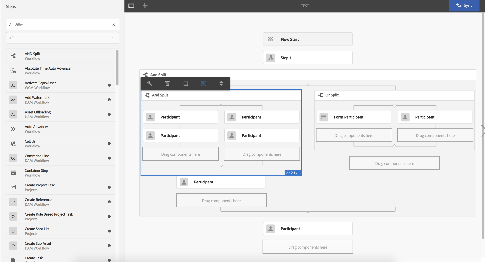
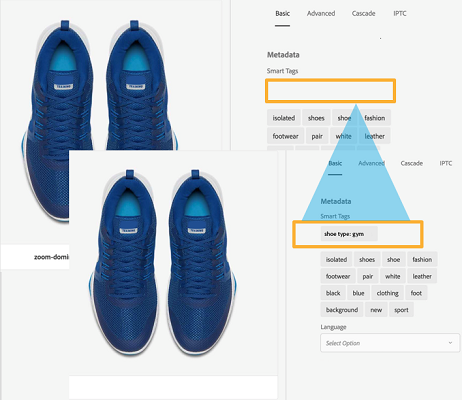

# Adobe Experience Manager 6.4 的一般发行说明 {#general-release-notes-for-adobe-experience-manager}

## 版本信息 {#release-information}

| 产品 | Adobe Experience Manager |
|---|---|
| 版本 | 6.4 |
| 类型 | 主要版本 |
| 公开发行日期 | 2018 年 4 月 4 日 |
| 推荐更新 | 请参阅[AEM发行版和更新](https://helpx.adobe.com/cn/experience-manager/aem-releases-updates.html) |

### 相关事项 {#trivia}

此版本的Adobe Experience Manager的发布周期从2017年4月27日开始，经过22次质量保证和错误修复迭代，于2018年3月22日结束。 此版本中修复的客户相关问题（包括增强功能和新增功能）总数为 704。

Adobe Experience Manager 6.4 自 2018 年 4 月 4 日起正式发行。

>[!NOTE]
>
>Adobe建议安装最新的Service Pack，因为所有新功能包仅通过[Service Pack](https://helpx.adobe.com/cn/experience-manager/maintenance-releases-roadmap.html)提供。

## 新增功能 {#what-s-new}

Adobe Experience Manager 6.4 是 Adobe Experience Manager 6.3 代码库的升级版本。它提供了一些新功能和增强功能、重要的客户修复、高优先级的客户增强功能，以及针对产品稳定性的一般错误修复。它还包括大部分Adobe Experience Manager 6.3功能包、热修复程序和Service Pack版本。

下面的列表提供了概述 — 而后续页面则列出了完整的详细信息。

### Experience Manager Foundation {#experience-manager-foundation}

[AEM Foundation](wcm-platform.md) 中提供了完整的更改列表。

Adobe Experience Manager 6.4 的平台建立在基于 OSGi 的框架（Apache Sling 和 Apache Felix）和 Java 内容存储库 (Apache Jackrabbit Oak 1.8.2) 的更新版本之上。

快速入门使用 Eclipse Jetty 9.3.22 作为 servlet 引擎。

#### 用户界面 {#user-interface}

对 UI 进行了各种增强，使其更高效，更易于使用。

* [新建内容树](/help/sites-authoring/basic-handling.md#content-tree) 栏可快速导航层级。与列表视图结合使用，可恢复经典UI交互模型。
* 改善了大型文件夹的卡片视图和列表视图中的滚动体验。
* [改进了与搜索结果的交互](/help/sites-authoring/search.md)  — 返回按钮可恢复之前的搜索结果。
* [其他键盘快捷键](/help/sites-authoring/keyboard-shortcuts.md)，用于大多数常用操作，例如打开特定边栏、编辑、移动和删除项目，或打开属性。
* [能够禁用键盘快捷键](/help/sites-authoring/user-properties.md) （在“首选项”中启用/禁用）。
* [在7天后停止显示所有UI](/help/sites-authoring/user-properties.md) 相对的时间戳（在“首选项”中设置默认值）。

有关这些功能的更多信息，请参阅[创作文档](/help/sites-authoring/home.md) 。

>[!CAUTION]
>
>Adobe 不打算进一步增强经典 UI。AEM 6.4 包含经典 UI，从早期发行版升级的客户可以继续按原样使用它。请注意，经典 UI 在弃用期间仍完全受支持。[了解更多](/help/sites-deploying/ui-recommendations.md)。

#### 内容存储库 {#content-repository}

* 通过在线修订清理，更快、更高效地压缩。 内部测试显示，新的尾部压缩速度比AEM 6.3快10倍，并且与运行在线修订清理时相比，IOPS更少，可以节约更多磁盘空间。这会降低对性能的影响。 有关详细信息，请参阅[文档页面](/help/sites-deploying/revision-cleanup.md#full-and-tail-compaction-modes)。

* MongoMK的连续修订版清理取代了计划清理维护
* 提高了文档节点上修订清理的效率

#### 搜索和索引 {#search-indexing}

* 通过oak-run(CLI)增强了对索引操作的支持：

   * 索引一致性检查
   * 索引统计信息
   * 索引配置导入或导出
   * 重新索引

* 降低了与Lucene相关的存储库增长，以提高系统整体性能

有关详细信息，请访问[本文档页面](/help/sites-deploying/indexing-via-the-oak-run-jar.md)。

#### 监测 {#monitoring}

* 新的[系统概述](/help/sites-administering/operations-dashboard.md#system-overview)提供了所有与性能相关的系统状态和活动的快照视图。
* 一组新的[运行状况检查](/help/sites-administering/operations-dashboard.md#health-checks)，涉及索引、查询和维护

#### 项目和工作流 {#projects-and-workflows}

* 全新[用于创建和编辑工作流模型的工作流编辑器](/help/sites-developing/workflows-models.md)。

#### 从早期版本升级 {#upgrade-from-earlier-version}

* [向后兼容性](/help/sites-deploying/backward-compatibility.md):6.4中的向后兼容功能有助于在大多数情况下保持自定义代码的兼容性，并减少升级工作。
* [升级复杂性评估](/help/sites-deploying/pattern-detector.md):新的模式检测器工具，可在升级之前评估升级的复杂性。
* [存储库重组](/help/sites-deploying/repository-restructuring.md):进行重大重组（主要是/etc），以便于更轻松地升级和促进实施最佳做法
* 有关升级的更多常规信息，请参阅[此页面](/help/sites-deploying/upgrade.md)以获取更多详细信息。

### Experience Manager Sites {#experience-manager-sites}

[AEM Sites和加载项](sites.md)中的更改的完整列表。

#### 流畅体验 {#fluid-experiences}

在2017年初推出以内容片段、体验片段和内容服务为后盾的流畅体验，是我们逐步演变为多渠道优先内容管理的开端。 AEM 6.4显着扩展了每个区域：

**[内容片段](/help/assets/content-fragments.md)**

6.4中的新增功能包括可视化的[内容模型](/help/assets/content-fragments-models.md)编辑器和新的[可配置组件](https://docs.adobe.com/content/help/zh-Hans/experience-manager-core-components/using/components/content-fragment-component.html)，可提供灵活的HTML输出和要包含在内容服务中的JSON。

**体验片段**

由于构建基块功能，现在使用相同内容但不同布局在片段中创建变体的效率更高。 除了将体验片段发送到Facebook和Pinterest之外，现在还可以将它们作为选件发送到Adobe Target。

**Content Services**

包含对Sling模型导出程序和核心组件的各种增强功能，可提供强大的JSON输出，以将内容嵌入到移动设备应用程序中，并使用单页应用程序构建体验。

#### 更快构建站点 {#gettings-sites-built-quicker}

AEM 6.4完成对下一代组件模型的转换。 AEM 6.3中引入的核心组件概念，现在与样式系统结合使用，为构建新站点和扩展现有站点提供了一种有效的方法。

建议的教程，用于了解如何充分利用新的组件模型：[AEM Sites入门 — WKND教程](https://docs.adobe.com/content/help/zh-Hans/experience-manager-learn/getting-started-wknd-tutorial-develop/overview.html)

#### Screens 加载项 {#screens-add-on}

AEM Screens代表的是在所有营销渠道（包括数字标牌和亭亭网络）中提供一致的信息。 AEM 6.4新增了对在Microsoft Windows和Google Chrome OS硬件上运行标牌播放器的支持。 此外，还增强了远程设备管理和计划（渠道组）。

有关Screens更新的更多信息，请参阅[AEM Screens用户指南](https://docs.adobe.com/content/help/zh-Hans/experience-manager-screens/user-guide/aem-screens-introduction.html)。

### Experience Manager Communities {#experience-manager-communities}

AEM 6.4为Communities添加了许多新增功能和增强功能。 [AEM Communities](communities-release-notes.md)中提供了完整的更改列表。 此版本的亮点包括：

#### 对审核的增强 {#enhancements-to-moderation}

**自动垃圾邮件检测**

已提供新的垃圾邮件检测引擎，用于过滤掉社区站点和组上不需要的用户生成的内容。 从系统/控制台/configMgr启用后，它会根据预定义的一组垃圾邮件词语，将用户生成的内容标记为垃圾邮件。 要了解有关垃圾邮件检测引擎的更多信息，请参阅[自动化社区用户生成内容](/help/communities/moderate-ugc.md#spam-detection)。

**针对QnA的新筛选器**

已将名为“已回答”和“未回答”的新过滤器添加到批量审核控制台，以过滤QnA问题。 要了解“已应答”和“未应答”状态筛选器的工作方式，请参阅[批量审核用户生成的内容](/help/communities/moderation.md#main-pars-note-521961797)。

**书签审核过滤器**

提供了在审核控制台上为预定义的审核过滤器添加书签的功能。 这些过滤器会附加到URL字符串的末尾，因此可以共享、重复使用，稍后还会重新查看。 了解如何在[批量审核控制台](/help/communities/moderation.md#main-pars-note-429176623)中为过滤器添加书签。

#### 删除UGC和用户配置文件 {#delete-ugc-and-user-profiles}

AEM 6.4 Communities公开了[现成的API](/help/communities/user-ugc-management-service.md)和示例[servlet](https://github.com/Adobe-Marketing-Cloud/aem-communities-ugc-migration/tree/master/bundles/communities-ugc-management-servlet) ，以使最终用户能够控制其数据。 这些API还允许数据处理和数据控制组织为欧盟GDPR合规请求提供服务。

#### 站点和组管理增强功能 {#enhancements-to-site-and-group-management}

**通过单步创建多区域设置组**

提供了在单次操作中创建多语言组的功能。 要创建此类群组，用户可以从站点控制台导航到所需社区站点的群组集合。 创建群组，并在“社区组模板”页面中指定所需的语言。 要了解有关此功能的更多信息，请参阅[社区组控制台](/help/communities/groups.md)。

**[一键删除社区站点和群组](/help/communities/groups.md)**

从全局导航中导航时，删除图标现在在相应的网站和群组上可用。 使用此图标可删除与网站或群组关联的所有项目和内容，并删除所有用户关联。 要了解有关此功能的更多信息，请参阅[管理社区站点](/help/communities/create-site.md#main-pars-text-fe17)和[管理社区组](/help/communities/groups.md#main-pars-text-5e8c)。

#### 对启用的增强 {#enhancements-to-enablement}

分配和目录功能现在在组中可用。 这样，就可以为一组特定目标社区成员创建、管理和发布学习内容。 要了解有关启用社区组的更多信息，请参阅[管理启用资源](/help/communities/resource.md)。

### Experience Manager Assets {#experience-manager-assets}

AEM 6.4为资产引入了多项新功能和增强功能，包括经过改进的新Creative Cloud集成、关键的人工智能创新、改进的元数据管理、报表增强功能以及总体用户体验改进。 [AEM Assets](assets.md)中可用更改的完整列表。 此版本的亮点包括：

**Adobe Asset Link**

企业Creative Cloud中的Adobe资产链接可简化内容创建过程中创意人员和营销人员之间的协作。 它是企业Creative Cloud中的一项新本机功能，可将Photoshop CC、Illustrator CC和InDesignCC连接到AEM，而创意人员无需离开自己选择的工具。

要了解有关此功能、先决条件以及如何访问此功能的更多信息，请参阅[Adobe资产链接](https://www.adobe.com/cn/creativecloud/business/enterprise/adobe-asset-link.html)。

**AEM 桌面应用程序**

AEM桌面应用程序已更新到版本1.8，该版本与AEM 6.4兼容。AEM桌面应用程序的完整更改列表在专用的[AEM桌面应用程序发行说明](https://docs.adobe.com/content/help/zh-Hans/experience-manager-desktop-app/using/release-notes.html)文档中提供。

自AEM 6.3版本以来引入的改进包括能够在后台上传分层文件夹，新增了用于监视资产后台操作的UI，增强了缓存、联网和登录功能，以及总体稳定性改进。 文档还包含[最佳实践指南](https://docs.adobe.com/content/help/en/experience-manager-desktop-app/using/using.html)。

**Adobe Sensei服务**

新增功能包括增强型智能标记、学习客户业务分类、使用客户特定标记自动标记数字资产以及智能翻译搜索，后者通过即时翻译搜索词来改进多语言中的可发现性。 要了解有关此功能的更多信息，请参阅[增强型智能标记](/help/assets/enhanced-smart-tags.md)。

**元数据**

各种增强功能包括能够同时导入和导出大量资产的元数据以及高级元数据结构，例如[级联元数据](/help/assets/cascading-metadata.md)。

**报告**

在AEM 6.4中，资产报表进行了大幅修改，新的报表框架、用户体验以及更多适用于客户用例的OOTB报表。 要了解如何生成各种报表，请参阅[资产报表](/help/assets/asset-reports.md)。

**用户体验**

增强了多项功能，可改进资产用户的浏览、搜索和管理体验，如滚动体验、搜索回按钮、改进的搜索过滤器等。 [AEM Assets](assets.md)中提供的完整列表。

**Brand Portal**

在元数据、报表、数字权限、登录体验和发布资产分发性能等方面进行了各种增强。 要了解新增的增强功能和功能，请参阅[AEM Assets Brand Portal的新增功能](https://docs.adobe.com/content/help/zh-Hans/experience-manager-brand-portal/using/introduction/whats-new.html)。

#### Dynamic Media附加组件 {#dynamic-media-add-on}

AEM 6.4包含许多Dynamic Media的新增功能和增强功能。 [AEM Assets](assets.md)中提供了完整列表。 主要亮点包括：

**智能裁剪**

由Adobe Sensei提供支持的智能裁剪可自动提供图像的无损裁剪，从而保留响应式设计的目标点。 您可以预览裁剪的图像建议，并在必要时手动调整它们。 此功能还支持为产品图像自动生成色板。

请参阅[图像配置文件](/help/assets/image-profiles.md)文档，了解有关使用智能裁剪的更多信息。

请参阅[将Dynamic Media资产添加到页面](/help/assets/adding-dynamic-media-assets-to-pages.md) ，了解有关在Dynamic Media组件中使用智能裁剪的更多信息。

**智能图像处理**

智能成像功能利用每个用户的独特查看特性自动为针对其体验优化的图像提供服务，从而提高性能和参与度。

请参阅[智能成像](/help/assets/imaging-faq.md)文档，以了解更多信息。

**新兴媒体和查看器增强功能**

全景和VR等新查看器让您提供更沉浸式体验。

请参阅[全景图像](/help/assets/panoramic-images.md)文档，以了解更多信息。

### Experience Manager Forms {#experience-manager-forms}

AEM 6.4 Forms 中引入了一些新增功能和增强功能。主要功能包括：

* 多渠道交互式通信
* 从业务应用程序预填交互式通信
* 工作流现代化和移动工作人员支持
* 延迟加载片段
* 从LiveCycle到Experience ManagerForms 6.4的单跳升级

有关[AEM Forms](forms.md)发行说明页面的更多详细信息。 另请参阅AEM 6.4 Forms中的[新增功能和增强功能摘要](/help/forms/using/whats-new.md) ，以了解有关新增和改进功能及文档资源的信息。

### Experience Manager Livefyre {#experience-manager-livefyre}

您可以将 Livefyre 与 AEM 6.4 实例集成。有关如何将 Livefyre 与 AEM 集成的信息位于此处：

* [集成 Livefyre](https://docs.adobe.com/content/help/en/experience-manager-64/administering/integration/livefyre.html)

### 利用以客户为中心的开发 {#leverage-customer-focused-development}

Adobe 正在使用以客户为中心的开发模型，借助该模型，客户可以在规范、开发和测试期间对开发流程的所有阶段做出贡献。我们衷心感谢在这一流程中做出贡献的所有客户和合作伙伴。

Adobe 实施了多种规程和流程来对以客户为中心的错误解决方案和增强请求开发进行收集、优先级排序和跟踪。[Adobe Marketing Cloud支持门户](https://helpx.adobe.com/cn/contact/enterprise-support.ec.html)与Adobe增强和缺陷跟踪系统集成。 在可能的情况下，客户关怀可以识别并解决客户问题。升级到 R&amp;D 时，将捕获所有客户信息，并将这些信息用于确定优先级和报告。在开发过程中，优先考虑付费支持和保修问题以及付费客户增强。

这一确定优先级的流程已经产生了 500 多个以客户为中心的更改，并已在 AEM 6.4 中进行了修复。

## 作为发布一部分的文件列表 {#list-of-files-that-are-part-of-the-release}

**Foundation**

* 独立的快速入门：cq-quickstart-6.4.0.jar
* 应用程序服务器快速启动：cq-quickstart-6.4.0.war
* 适用于各种Web服务器和平台的Dispatcher 4.3.1或更高版本。 请参阅[下载链接](https://docs.adobe.com/content/help/en/experience-manager-dispatcher/using/getting-started/release-notes.html)。
* Eclipse IDE的插件。 [阅读更多并下载](/help/sites-developing/aem-eclipse.md)。

* Brackets代码编辑器的扩展。[阅读更多并下载](/help/sites-developing/aem-brackets.md)。
* Maven/Gradle依赖关系。 请参阅[下载链接](https://repo.adobe.com/nexus/content/repositories/releases/com/adobe/aem/uber-jar/6.1.0/)。

**站点**

* 核心组件（[GitHub 项目](https://github.com/Adobe-Marketing-Cloud/aem-core-wcm-components)）
* We.Retail 参考实施（[了解更多](/help/sites-developing/we-retail.md)）
* 项目Blueprint原型（[GitHub项目](https://github.com/Adobe-Marketing-Cloud/aem-project-archetype)）
* 适用于各种不同平台的 AEM Screens 播放器（[下载](https://download.macromedia.com/screens/)）
* 智能内容语言模型。已预先安装英语 - 可以下载更多语言

   * [德语](https://experience.adobe.com/#/downloads/content/software-distribution/en/aem.html?package=/content/software-distribution/en/details.html/content/dam/aem/public/adobe/packages/cq630/product/smartcontent-model-de)
   * [西班牙语](https://experience.adobe.com/#/downloads/content/software-distribution/en/aem.html?package=/content/software-distribution/en/details.html/content/dam/aem/public/adobe/packages/cq630/product/smartcontent-model-es)
   * [意大利语](https://experience.adobe.com/#/downloads/content/software-distribution/en/aem.html?package=/content/software-distribution/en/details.html/content/dam/aem/public/adobe/packages/cq630/product/smartcontent-model-it)
   * [法语](https://experience.adobe.com/#/downloads/content/software-distribution/en/aem.html?package=/content/software-distribution/en/details.html/content/dam/aem/public/adobe/packages/cq630/product/smartcontent-model-fr)

* [AEM现代化](/help/sites-developing/modernization-tools.md) 工具将经典UI组件迁移到Coral 3

**资产**

* Adobe Experience Manager桌面应用程序（[阅读更多](https://docs.adobe.com/content/help/en/experience-manager-desktop-app/using/using.html)和[下载](https://docs.adobe.com/content/help/en/experience-manager-desktop-app/using/release-notes.html)）

* 用于添加增强的PDF光栅器的包（[阅读更多](/help/assets/aem-pdf-rasterizer.md)和[下载](https://experience.adobe.com/#/downloads/content/software-distribution/en/aem.html?package=/content/software-distribution/en/details.html/content/dam/aem/public/adobe/packages/cq640/product/assets/aem-assets-pdf-rasterizer-pkg)）

* 用于添加扩展 RAW 图像支持的软件包（[了解更多](/help/assets/camera-raw.md)）

**表单**

* 用于 AEM Forms 功能的软件包:

   * [adobe-aemfd-aix-pkg](https://experienceleague.adobe.com/docs/experience-manager-release-information/aem-release-updates/forms-updates/aem-forms-releases.html)
   * [adobe-aemfd-linux-pkg](https://experienceleague.adobe.com/docs/experience-manager-release-information/aem-release-updates/forms-updates/aem-forms-releases.html)
   * [adobe-aemfd-solaris-pkg](https://experienceleague.adobe.com/docs/experience-manager-release-information/aem-release-updates/forms-updates/aem-forms-releases.htmlL)
   * [adobe-aemfd-win-pkg](https://experienceleague.adobe.com/docs/experience-manager-release-information/aem-release-updates/forms-updates/aem-forms-releases.html)
   * [adobe-aemfd-osx-pkg](https://experienceleague.adobe.com/docs/experience-manager-release-information/aem-release-updates/forms-updates/aem-forms-releases.html)

## 语言 {#languages}

用户界面提供了下列语言版本：

* 英语
* 德语
* 法语
* 西班牙语
* 意大利语
* 巴西葡萄牙语
* 日语
* 简体中文
* 繁体中文（有限支持）
* 韩语

Experience Manager 6.4 已通过 GB18030-2005 CITS 认证，可使用中文编码标准。

## 安装和更新 {#install-update}

有关安装要求，请参阅[安装说明](/help/sites-deploying/custom-standalone-install.md)。

有关详细说明，请参阅[升级文档](/help/sites-deploying/upgrade.md)。

## 支持的平台 {#supported-platforms}

请在 [AEM 6.4技术要求](/help/sites-deploying/technical-requirements.md)的支持级别。

>[!NOTE]
>
>Oracle 已经转向 Oracle Java SE 产品的“长期支持”(LTS) 模型。Java 9和10是按Oracle划分的非LTS版本(请参阅[OracleJava SE支持路线图](https://www.oracle.com/technetwork/java/eol-135779.html))。 Adobe 将只为 LTS 版本的 Java 提供支持，以便在生产环境中运行 AEM。因此，建议将 Java 8 与 AEM 6.4 一起使用。

## 已弃用和已删除的功能 {#deprecated-and-removed-features}

Adobe 不断评估产品中的功能，以便随着时间的推移，计划使用更强大的版本来替换这些功能，或是决定重新实现选定部分，以便为未来的预期或扩展做更充分的准备。

对于 Adobe Experience Manager 6.4，请[阅读已弃用和已删除功能的列表](deprecated-removed-features.md)。该页面还包含2019年更改的预发布，以及面向从以前版本更新的客户的重要通知。

## 详细更改列表 {#detailed-changes-lists}

[AEM Sites](sites.md)

[AEM Assets](assets.md)

[AEM Communities](communities-release-notes.md)

[AEM Forms](forms.md)

[AEM Foundation](wcm-platform.md)

## 已知问题 {#known-issues}

[已知问题列表](known-issues.md)

### 产品下载和支持（受限网站） {#product-download-and-support-restricted-sites}

这些网站仅适用于客户。如果您是客户并且需要访问，请联系您的 Adobe 客户经理。

* [产品下载：licensing.adobe.com](https://licensing.adobe.com/).
* 产品更新、修补程序和软件包，以获取[Software Distribution](https://experience.adobe.com/#/downloads/content/software-distribution/en/aem.html)上的其他功能。
* [通过Admin Console提供客户支持](https://adminconsole.adobe.com/)。有关更多信息，请参阅[新Adobe客户支持体验](https://docs.adobe.com/content/help/en/customer-one/using/home.html)。
