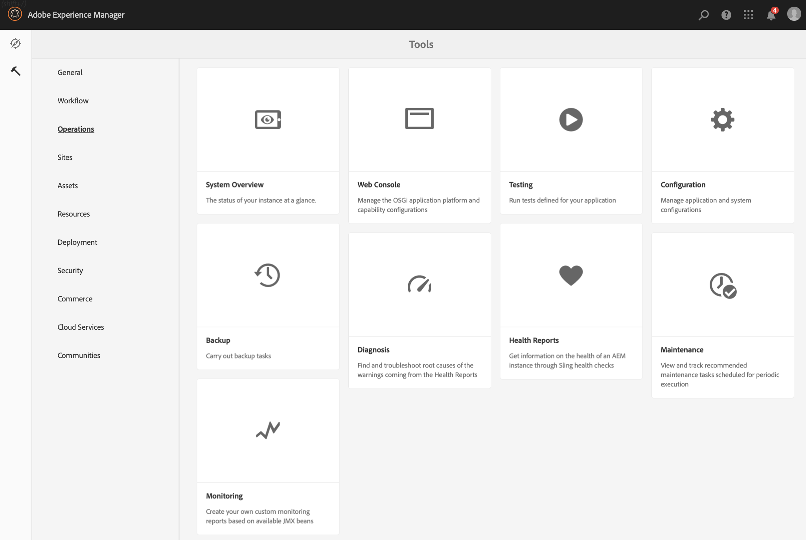

# Configuring and Deploying AEM Screens{#configuring-and-deploying-aem-screens}

本页介绍如何在设备上安装和配置Screens播放器，并涵盖以下主题：

* 安装AEM Screens播放器
* 服务器配置
* 播放器设备的硬件选择准则
* 后续步骤

## 安装AEM Screens播放器 {#installing-aem-screens-player}

AEM Screens播放器可用于Android、Chrome OS、iOS和Windows。

要下载 **AEM Screens Player**，请访问 [**AEM 6.4播放器下载页&#x200B;**](https://download.macromedia.com/screens/)。

>[!NOTE]
>
>下载最新的播放器(*.exe*)后，请按照播放器上的步骤完成临时安装：
>
>1. 长按左上角以打开管理面板。
>1. 从左侧 **操作菜单导航到** “配置”，然后在 **Server** 中输入AEM实例的位置地址，然后单击“保 **存”**。
   >
   >
1. 单击左侧操 **作菜单中的** “注册”链接和以下步骤以完成设备注册过程。
>

### 其他资源 {#additional-resources}

有关详细信息，请参阅以下主题：

* 要下载Android Player，请访 **问Google Play**。 要了解如何实施Android监视程序，请参阅实 **[施Android播放器](implementing-android-player.md)**。

* 要实施Chrome OS Player，请参阅 [Chrome管理控制台](implementing-chrome-os-player.md) ，了解更多信息。
* 要配置AEM Screens Windows播放器，请参阅实 [施Windows播放器](implementing-windows-player.md)。

## Server Configuration {#server-configuration}

>[!NOTE]
>
>**重要信息**：
>
>AEM Screens播放器不使用跨站点请求伪造(CSRF)令牌。 因此，要配置AEM服务器并使其准备好用于AEM Screens，请通过允许空的引用来跳过引用过滤器。

### 前提条件 {#prerequisites}

以下要点可帮助配置AEM服务器并使其准备好用于AEM Screens:

#### 允许空的引用请求 {#allow-empty-referrer-requests}

请按照以下步骤启用Apache Sling引用过滤器允许空。 这是在AEM Screens播放器和AEM Screens服务器之间优化控制协议操作所必需的。

1. 通过AEM实例—>锤子图标—>操作—> web控制台，导航到**Adobe Experience Manager Web Console配置** ********。

   

1. **Adobe Experience Manager Web Console配置将打开** 。 搜索sling引用。

   要搜索sling referrer属性，请按 **Command+F** ( **Mac** )和 **Control+F(****** Windows)。

   

1. 选中“ **允许为空** ”选项，如下图所示。

   

1. 单击 **保存** ，以启用Apache Sling引用过滤器允许空。

#### 为AEM Screens启用触屏UI {#enable-touch-ui-for-aem-screens}

AEM Screens需要触屏UI，并且不能用于Adobe Experience Manager(AEM)的经典UI。

1. 导航到 *&lt;yourAuthorInstance>/system/console/configMgr/com.day.cq.wcm.core.impl.AuthoringUIModeServiceImpl*
1. 确保将“默 **认创作UI** ”模式设 **置为“TOUCH**”，如下图所示

或者，您也可以使用*&lt;yourAuthorInstance> *->（锤子图标）->* Operations **->** Web Console **，以及搜索** WCM创作模式服务的 **** WCM设置。

>[!NOTE]
>
>您始终可以使用用户首选项为特定用户启用经典UI。

#### NOSAMPLECONTENT运行模式中的AEM {#aem-in-nosamplecontent-runmode}

在生产中运行AEM使用 **NOSAMPLECONTENT运行模式** 。 删除 *X-Frame-Options=SAMEORIGIN* header（在其他响应标题部分中）

[http://localhost:4502/system/console/configMgr/org.apache.sling.engine.impl.SlingMainServlet](http://localhost:4502/system/console/configMgr/org.apache.sling.engine.impl.SlingMainServlet)。

AEM Screens播放器必须具备此功能才能播放联机渠道。

#### 密码限制 {#password-restrictions}

对 ***DeviceServiceImpl进行最新更改***，您不必删除密码限制。

您可以通过 ***以下链接配置DeviceServiceImpl*** ，以在为屏幕设备用户创建口令时启用口令限制：

[http://localhost:4502/system/console/configMgr/com.adobe.cq.screens.device.impl.DeviceService](http://localhost:4502/system/console/configMgr/com.adobe.cq.screens.device.impl.DeviceService)

请按照以下步骤配置 ***DeviceServiceImpl***:

1. 通过 **AEM实例—>锤子图标—>操作** —> web控制台，导航到 **Adobe Experience Manager Web Console配置******。

1. **Adobe Experience Manager Web Console配置将打开** 。 搜索deviceservice. 要搜索属性，请 **按Command+F** ( **Mac)和** Control+F(Windows) ********(Windows)。

#### Dispatcher Configuration {#dispatcher-configuration}

对于**Dispatcher,**将客户端头添加到。any文件。 允许以下标题通过：

* &quot;X-Requested-With&quot;
* &quot;X-SET-HEARTBEAT&quot;
* &quot;X-REQUEST-COMMAND&quot;

#### Java编码 {#java-encoding}

将 ***Java编码设置为*** Unicode。 例如， *Dfile.encoding=Cp1252* 将不起作用。

>[!NOTE]
>
>**推荐:**
>
>建议在生产使用中对AEM Screens服务器使用HTTPS。

## 播放器设备的硬件选择准则 {#hardware-selection-guidelines-for-player-device}

以下部分为Screens项目提供了硬件选择指南：

* 始终为PC ***播放器和********* “Display Panel”（显示面板）或“Projector”（投影仪）提供商业级或工业级组件。

* 始终与为数字标牌市场提供服务的供应商互动。
* 总是考虑环境温度和相对湿度等环境因素。
* 始终查看电源要求和电源调节。
* 仔细查看应用程序所需的性能需求和I/O端口。

下表总结了AEM Screens项目的硬件配置和典型用例：

<table> 
 <tbody> 
  <tr> 
   <td>播放器配置</td> 
   <td>处理器</td> 
   <td>内存</td> 
   <td>存储固态硬盘</td> 
   <td>GPU</td> 
   <td>显示器</td> 
   <td>I/O</td> 
   <td>典型用例</td> 
  </tr> 
  <tr> 
   <td>基本</td> 
   <td>双核、i3或入门级四核英特尔®凌动处理器</td> 
   <td>
4GB内存
 
2MB高速缓存
 </td> 
   <td>
·ChromeOS 32 GB
 
·Windows 128 GB
 </td> 
   <td>OnBoard</td> 
   <td>1920 x 1080</td> 
   <td>DVI、以   太网／无线  、2xUSB</td> 
   <td> 
    <ul> 
     <li>标准全屏循环   </li> 
     <li>分时段</li> 
    </ul> </td> 
  </tr> 
  <tr> 
   <td>标准</td> 
   <td>四核，英特尔®酷睿i5处理器</td> 
   <td>
8GB内存
 
4MB高速缓存
 </td> 
   <td>128 GBB</td> 
   <td>OnBoard</td> 
   <td>3840x2160(4K)</td> 
   <td>DVI、HDMI  Ethernet/Wireless  、2xUSB</td> 
   <td> 
    <ul> 
     <li>单源动态内容 </li> 
     <li>简单的交互</li> 
     <li> 1-3区域布局</li> 
    </ul> </td> 
  </tr> 
  <tr> 
   <td>高级</td> 
   <td>四核超线程，英特尔®酷睿i7处理器</td> 
   <td>
16GB内存
 
8MB高速缓存
 </td> 
   <td>256 GB</td> 
   <td>Discreet GPU</td> 
   <td>3840x2160(4K)</td> 
   <td>DVI、HDMI  Ethernet/Wireless  、4xUSB</td> 
   <td> 
    <ul> 
     <li>4个或更多内容区域，并发视频播放</li> 
     <li> 多页交互式</li> 
     <li>多源数据触发器</li> 
    </ul> </td> 
  </tr> 
 </tbody> 
</table>

## 后续步骤 {#the-next-steps}

安装并配置Screens播放器后，请按照以下主题开始使用：

1. [创建和管理Screens项目](creating-a-screens-project.md)
1. [创建和管理渠道](managing-channels.md)
1. [创建和管理位置](managing-locations.md)
1. [创建和管理显示屏](managing-displays.md)
1. [分配渠道](channel-assignment.md)
1. [管理设备](managing-devices.md)
1. [注册设备](device-registration.md)
1. [分配设备](managing-devices.md)
1. [创建和管理计划](managing-schedules.md)
1. [AEM Screens 播放器](working-with-screens-player.md)
1. [设备控制中心疑难解答](monitoring-screens.md)

