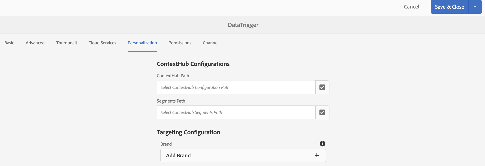

# 数据触发的资产更改{#data-triggered-asset-change}

## 用例描述 {#use-case-description}

此用例示例描述了如何根据您所在位置的天气实现个性化内容。

以下AEM Screens项目利用AEM个性化，其中包括ContextHub、分段引擎和内容定位UI。

此用例提供的内容根据每个地点的当前天气而个性化，如果天气是：

* *阳光明媚，它展示着夏装*
* *寒冷，它展示冬衣*

>[!NOTE]
>
>出于演示目的，此用例捕获您的地理位置以展示内容更新。 您可以在不同的情况下手动更新地理位置视图的输出。

### 先决条件 {#preconditions}

在开始使用此用例之前，请确保您了解：

* [个性化](/help/sites-administering/personalization.md)
* [配置ContextHub](/help/sites-administering/contexthub-config.md)
* [使用ContextHub配置分段](/help/sites-administering/segmentation.md)
* [使用定位模式创作目标内容](/help/sites-authoring/content-targeting-touch.md)

### 主要演员 {#primary-actors}

内容作者

## 基本流程：设置项目 {#basic-flow-setting-up-the-project}

请按照以下步骤设置展示由数据触发的资产更改的项目：

1. 创建一个名为 **DataTriggerAsset的AEM Screens项目**，如下所示。

   

1. **创建序列渠道**

   1. 选择渠 **道文件夹** ，然后单 **击创建** ，打开向导以创建渠道。
   1. 从向 **导中选择序列渠道** ，然后创建标题为DataTrigger的 **渠道**。
   

1. **将内容添加到序列渠道**

   1. 选择渠道 **DataTrigger**。
   1. 单击操作栏中的&#x200B;**编辑**&#x200B;以打开编辑器。将少量资源拖放到您的渠道。
   

   >[!NOTE]
   >
   >您只能将默认图像添加到编辑器中。 在步骤(6)中切换到定位模式时，必须将要替换的图像添加到编辑器中。

1. **设置ContextHub和定位配置**

   1. 导航到 **DataTriggerAsset** —>渠道 **—>** DataTrigger **，然后单击操****** 作栏中的“属性”。
   1. 单击“ **个性化** ”选项卡。
   

1. **添加ContextHub和定位配置**

   1. 为便于演示，请下载以下内容包。
   1. 将包下载到AEM实例后，您需要设置ContextHub和区段路径：
   * 对 **于ContextHub**，将路径设置为： ***/libs/settings/cloudsettings/legacy/contexthub***
   * 对于“ **区段路径**”，将路径设置为： ***/conf/data-triggers/settings/wcm/segments***
   数据触发器

   [获取文件](assets/data-triggers-1_00.zip)

   >[!NOTE]
   >
   >要了解如何配置ContextHub和Segmentation，请参阅：
   >
   >* [配置ContextHub](/help/sites-administering/contexthub-config.md)
   >* [使用ContextHub配置分段](/help/sites-administering/segmentation.md)

   

   单击 **保存并关闭**。

1. **切换到定位模式**

   1. 导航到 **DataTriggerAsset** >渠道 **>** DataTrigger **，然后单击操****** 作栏中的编辑。
   1. 从“ **编辑** ”下的菜单栏中选择“定 **位”**。
   

1. **添加目标内容**

   1. 在 **BRAND** 中选择“数据触发 **器** ”，在ACTIVITY中选择“季节性数据触发器” ******。
   1. Click the **Start Targeting**
   

1. **定义目标组件**

   1. 选择要具有目标内容的组件。
   1. 单击“ **Target** ”按钮可为该组件启用定位。
   1. 在侧边栏的“受众”中选择变量，然后根据需要调整 **内容** ，为每个变体定义内容。
   >[!NOTE]
   >
   >要在编辑 **器中隐藏** “资源”面板，您必须单击右侧面板上的向左箭头，如下图所示。

   

## 查看结果 {#viewing-the-results}

完成上述步骤后，请进一步预览并查看结果：

1. 从编 **辑器中** ，单击“预览”。

   

1. 要展示图像将如何更改（具体取决于您所在区域的位置以及区域的温度），您可以手动单击ContextHub图标，如下所示。

   更新位置后，将立即捕获该区域的温度，图像将更新为冬季选择，并替换夏季选择图像。

   

