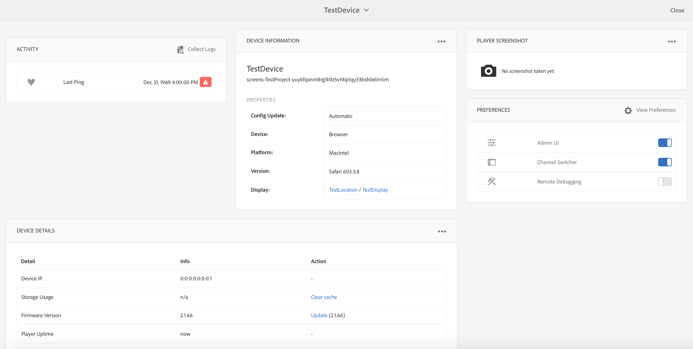
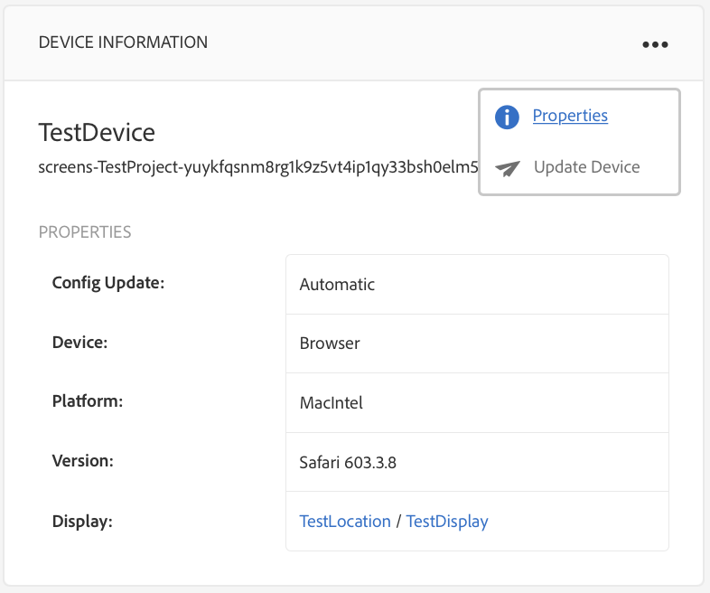

# 设备控制中心故障排除{#troubleshooting-device-control-center}

您可以使用设备功能板监视Screens播放器活动和设备的性能并对其进行疑难解答。 本页提供了有关如何监视和解决Screens播放器和已分配设备的性能问题的信息。

## 从设备控制中心进行监视和疑难解答 {#monitor-and-troubleshoot-from-device-control-center}

您可以使用设备控制板监视活动，从而对Screens播放器进行疑难解答。

### 设备控制板 {#device-dashboard}

按照以下步骤导航到设备功能板：

1. Navigate to the device dashboard from your project, for example, ***Test Project*** --> ***Devices***.

   Select **Devices** and **Device Manager** from the action bar.

   

1. 选择要监视的设备。

   

1. 该页面显示设备信息、活动和设备详细信息，允许您监视设备活动和功能。

   

### 监视设备活动 {#monitor-device-activity}

“活 **动** ”面板显示屏幕播放器上次ping的时间戳。 最后一个ping操作对应于设备上次联系服务器的时间。

此外，单 **击** “活动”面板右上角的“收集日志” **** ，以查看播放器的日志。

### 更新设备详细信息 {#update-device-details}

检查“设 **备详细信息** ”面板，查看设备IP、存储使用情况、固件版本以及设备的播放器正常运行时间。

此外，单击 **清除缓存** 和更新 **可清除设备的缓存，并分别从此面板更新** 固件版本  。

**此外，单击**...从“设备详细信息”面板 **的右上角** ，重新启动或刷新播放器的状态。

### 更新设备信息 {#update-device-information}

检查“ **设备信息** ”面板以查看与设备关联的配置更新、设备、平台、版本和显示。

此外，单击“设&#x200B;**备信息”面板右上角的**(...)可查看属性或更新设备。

单击 **属性** ，查看“设 **备属性** ”对话框。 您可以编辑设备标题或选择“手动”或“自动”作为配置 **更新** 的 **选项**。

>[!NOTE]
>
>要进一步了解与设备的自动或手动更新相关的事件，请参阅管理渠道中设备控制板中的 ***自动更新与手动更新***[一节](managing-channels.md)。

### 查看播放器屏幕截图 {#view-player-screenshot}

您可以从**播放器屏幕截图**面板查看设备上的播放器屏幕截图。

单击“播放&#x200B;**器屏幕截图”面板右上角的(...**)，然后选择**刷新屏幕截图**以查看正在运行的播放器的快照。

### 管理首选项 {#manage-preferences}

“首 **选项** ”面板允许用户更改管理员UI、渠道切换程 **序和设备远程调********** 试的首选项。

>[!NOTE]
>
>要了解有关这些选项的更多信息，请参 [阅AEM Screens播放器](working-with-screens-player.md)。

此外，单 **击右上角的** “查看首选项”以更新服务器URL和分辨率。

## OSGI设置疑难解答 {#troubleshoot-osgi-settings}

您需要启用空引用以允许设备向服务器发布数据。 例如，如果禁用空参照属性，则设备无法将屏幕截图发回。

目前，其中某些功能仅在OSGI配置中启用 *Apache Sling引用过滤器允许空* ，才可用。 功能板可能显示警告，指出安全设置可能会阻止某些功能正常工作。

请按照以下步骤启用Apache Sling引用过滤器允许空

1. 导航到 [Adobe Experience Manager Web Console配置](http://localhost:4502/system/console/configMgr/org.apache.sling.security.impl.ReferrerFilter)。
1. 选中**allow.empty **选项。
1. 单击&#x200B;**保存**。

### 推荐 {#recommendations}

以下部分建议监视网络链接、服务器和播放器，以了解运行状况并对问题做出反应。

AEM为以下对象提供内置监视功能：

* *心跳* （每5秒），表示AEM Screens播放器正在运行。
* *播放器的屏幕截图* ，显示播放器上当前显示的内容。
* 播放 *器上安装的AEM Screens播放器固件* 。
* *播放器上的可用存储空间* 。

关于使用第三方软件进行远程监视的建议：

* 播放器上的CPU使用情况。
* 检查AEM Screens播放器进程是否正在运行。
* 播放器的远程重新启动／重新启动。
* 实时通知。

建议以允许远程登录诊断问题和重新启动播放器的方式部署播放器硬件和操作系统。

#### 其他资源 {#additional-resources}

请参 [阅视频播放配置和疑难解答](troubleshoot-videos.md) ，以调试频道中播放的视频并对视频进行疑难解答。
