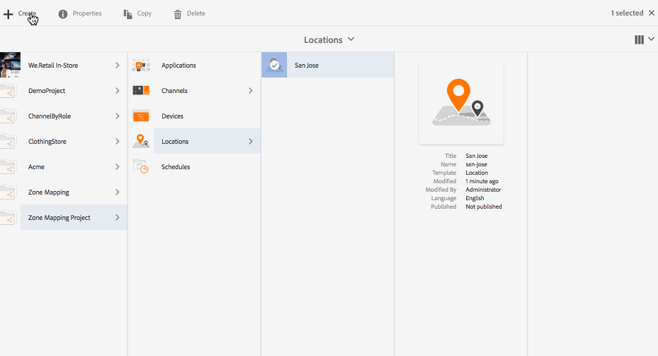

# 显示布局编辑器{#display-layout-editor}

“区域映射”******&#x200B;允许您创建不同的区域并使用各种资产（例如视频、图像和文本），这些资产可通过上下文方式组合到单个屏幕中。您可以拖入图像、视频和文本，并将它们全都混合在一起，创建直观的互动式数字体验。根据项目要求，有时您需要在显示屏上显示多个区域。

例如，某个产品序列具有相关社交媒体信息源，该信息源在单个显示屏上的两个不同区域中运行。

## 概述 {#overview}

在为渠道创建显示屏时，您可以选择不同的模板选项来查看/管理渠道中的内容。

在为显示屏创建区域时，可以使用以下模板：

* 2x1
* 2x2
* 3x1
* 4x1
* 5x1

使用其中的任一模板，您可以创建直观的交互式数字标牌体验，从而在单个屏幕上利用各种内容。

>[!NOTE]
>
>To learn in-depth about creating channels and displays, see [Managing Channels](managing-channels.md) and [Managing Displays](managing-displays.md) respectively in Authoring Screens.

## 用例描述 {#use-case-description}

在此用例中，您将创建一个 AEM Screens 项目，其中包含一个渠道，该渠道可利用内容并将其显示在多个区域的屏幕上。

>[!NOTE]
>
>区域不会缩放内容，该缩放操作必须在将内容插入渠道之前完成。

### 创建项目的步骤 {#steps-for-creating-a-project}

请按照以下步骤创建一个 AEM Screens 项目，以便演示如何实现 AEM Screens 项目的区域映射：

1. ***创建新 Screens 项目***

   1. 选择 Adobe Experience Manager 链接（左上方），然后选择“屏幕”。Alternatively, you can go directly to: [http://localhost:4502/screens.html/content/screens](http://localhost:4502/screens.html/content/screens).
   1. Click **Create** to create a new Screens project.
   1. Select **Screens** from the **Create Screens Project** wizard and click **Next**.
   1. Enter the title as **Demo Mapping Project** and click **Create**.
   

1. ***创建新渠道文件夹***

   1. 导航到**区域映射项目**。
   1. 单击操作栏中的&#x200B;**创建**。此时将打开一个向导。
   1. Choose the **Channels Folder **and click **Next**.
   1. Enter the Title as **Dual Zone **and click **Create**.
   

1. ***创建新渠道***

   1. Navigate to the **Zone Mapping Project** you created and select the Channels folder (**Dual Zone**).
   1. 单击操作栏中的&#x200B;**创建**。此时将打开一个向导。
   1. Choose the **Sequence Channel **and click **Next**.
   1. Enter the **Title** as **Left** and click **Create**.
   以同样的方式，在 **Zone Mapping Project** 中创建另一个名为 **Right** 的序列渠道。

   

1. ***向渠道中添加内容***

   1. Navigate to the **Zone Mapping Project** you created and select the **Channel** you created.
   1. Click **Edit** from the action bar.
   1. The editor for the **Left** opens. 单击操作栏左侧用于切换侧面板的图标以打开资产和组件。
   1. 将您希望添加的组件拖放到渠道中。
   以同样的方式，向 **Right** 渠道中添加内容。

   

   >[!NOTE]
   >
   >您可以根据项目要求使用不同的资产（图像、视频）在渠道中填充内容。

1. ***创建新位置***

   1. Navigate to the** Zone Mapping Project** and select the **Locations** folder.
   1. Click **Create** next to the plus icon in the action bar. 此时将打开一个向导。
   1. Select **Location** from the wizard and click **Next**.
   1. Enter the **Title** for your location (enter the title as **San Jose**) and click **Create**.
   

1. ***为San Jose创建新显示屏***

   1. Navigate to the location where you want to create your display (**Demo Mapping Project** --> **Locations** --> **San Jose**) and select **San Jose**.
   1. 单击操作栏中的&#x200B;**创建**。Select **Display** from the **Create** wizard and click **Next**.
   1. Enter **Title** for your display location (enter the title as **Dual Zone**).
   1. Under the **Display** tab, choose the details of the Layout. Choose the Resolution as **Full HD**.
   1. Choose the **Number of Devices Horizontally** as **2**. Choose the **Number of Devices Vertically** as **1**.
   1. 单击&#x200B;**创建**。
   

1. ***分配渠道***

   1. Navigate to the display from **Zone Mapping Project** --> **Locations** --> **San Jose** --> **Dual Zone Display**.
   1. Select **Dual Zone Display **and tap/click **Assign Channel** from the action bar, Or,
   1. Click **Dashboard** and select **+Assign Channel** at the top right from **ASSIGNED CHANNELS &amp; SCHEDULES** panel, as shown in the figure below. **渠道分配**对话框打开。
   1. Enter the **Channel Role** as **Zone**.
   1. 按路径选择引用渠道。 Select the channel folder path (**Zone Mapping Project **--> **Channels** --> **Dual Zone** ) in the Channel.
   1. Select the **Priority** for this channel as **1**. Choose the **Supported Events** as **Initial Load** and **Idle Screen**.
   1. 单击&#x200B;**保存**。
   

1. ***注册和分配设备***

   1. 启动一个单独的浏览器窗口。使用Web浏览器转到Screens播放器或启动AEM Screens应用程序。 在打开设备时，您会注意到设备的状态为未注册。
   1. From the AEM dashboard, navigate to **Zone Mapping Project** --> **Devices**.
   1. 单击操作栏中的**设备管理器**。
   1. Click **Device Registration** and you will see the pending devices.
   1. Select the device you want to register and click **Register Device**.
   1. 您将需要从 Web 浏览器或 AEM Screens 播放器中验证代码。Click **Validate** to navigate to **Device Registration** screen.
   1. Enter **Title** as **Zone Device** and click **Register** and the device will be registered.
   1. Click **Assign Display** to move on to the next step where you assign the device to a display.
   1. Click **Assign Device** fand select the display path for your channel () as */content/screens/Test_Project/Locations/TestLocation/TestDisplay*. Click **Assign**.
   1. Click **Finish** to complete the process, and now the device is assigned.
   

1. ***创建多区域显示屏***

   1. Navigate and select the display from **Zone Mapping Project** --> **Locations** --> **San Jose **--> **Dual Zone **display and click **Dashboard** from the action bar.
   1. 从&#x200B;**设备**&#x200B;面板中选择播放器的&#x200B;**设备配置**&#x200B;左侧的图标，然后单击&#x200B;**属性**。
   1. 导航到&#x200B;**设备配置**&#x200B;选项卡，然后填写&#x200B;**映射**&#x200B;和&#x200B;**模板**&#x200B;字段。Enter *{&quot;a1&quot;:&quot;${display.channel}/left&quot;, &quot;a2&quot;: &quot;${display.channel}/right&quot;}* in the **Mapping** field and template as *grid-2x1*.
   1. Click **Save &amp; Close** and reload the player.
   >[!NOTE]
   >
   >***了解设备配置中的“映射”和“模板”：***
   >
   >* 标识符“a1”和“a2”对应于模板中定义的区域，即“screens-zone-a1”和“screens-zone-a2”。
   >* “${display.channel}/left”是指要嵌入区域的渠道，其中“display.channel”是指显示屏中的当前渠道路径。此处有效地嵌入了渠道的“left”和“right”子项。

   

#### 在 AEM Screens 播放器中查看内容 {#viewing-content-in-aem-screens-player}

加载您的 AEM Screens 播放器或使用 Web 浏览器。

您将注意到两个渠道（Left 和 Right）的内容会显示在 Screens 播放器中。内容会以 2x1 显示区域显示。

### 总结 {#inference}

在 AEM Screens 中创建渠道时，使用某一可用模板进行区域映射，可以执行客户端拼合。您可以在屏幕中创建不同的区域，并使用视频、图像和其他可用资产进一步填充这些区域。
