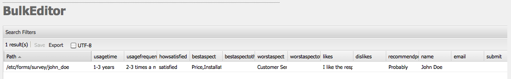

# 批量编辑器{#the-bulk-editor}

当可视页面上下文不需要时，批量编辑器可以进行非常有效的编辑，因为它允许您：

* 从多个页面搜索（并显示）内容； 这是使用GQL(Google查询语言)完成的
* 直接在批量编辑器中编辑此内容
* 保存更改（到原始页面）
* 将此内容导出到制表符分隔的(.tsv)电子表格文件

>[!NOTE]
>
>您也可以将内容导入存储库，但默认情况下，批量编辑器会禁用此功能，如“工具”控制台 **中所** 示。

本节介绍如何在工具控制台中使用批量编 **辑器** 。 通常，管理员使用批量编辑器搜索和编辑多个项目。 通过使用GQL查询填充表，然后选择要处理的内容项来完成此操作。 作者通常将批量编辑器用作可通过产品列表组件访问的自定义批量编辑器应用 [程序的一](/help/sites-authoring/default-components.md) 部分。

>[!CAUTION]
>
>AEM [6.4中弃用了经典UI](/help/release-notes/deprecated-removed-features.md) ，批量编辑器也已弃用，因此Adobe不打算进一步增强批量编辑器。

## 批量编辑器的示例用例 {#example-use-case-for-the-bulk-editor}

例如，如果您需要填写特定调查的用户的所有姓名和电子邮件地址，批量编辑器可以提供该信息，并将其导出到电子表格中。

Geometrixx网站中包含一个说明此类用例的示例：

1. 导航到支 **持页** ，然后导航到 **客户服务满意调查** 。
1. **编辑** “表 **单”段落的开始** 。 在对话框中，单击 **高级** 选项卡，展开 **操作配置**，然后 **单击视图数据……**.

   

1. 批量编辑器是完全可自定义的。但在本例中，批量编辑器不允许用户编辑内容，但只允许用户将信息导出到电子表格。

   

## 如何使用批量编辑器 {#how-to-use-the-bulk-editor}

批量编辑器允许您：

* [根据查询参数搜索内容、在列中显示结果的指定属性、编辑此内容并保存更改](#searching-and-editing-content)
* [将此内容导出到制表符分隔的电子表格](#exporting-content)

* [从制表符分隔的电子表格导入内容](#importing-content)

### 搜索和编辑内容 {#searching-and-editing-content}

要使用批量编辑器同时编辑多个项目，请执行以下操作：

1. 在“工 **具** ”控制台中，单 **击“导** 入器”文件夹以展开它。
1. 多次，单击 **批量编辑** 器以打开它。
1. 输入您的选择要求：

<table> 
 <tbody> 
  <tr> 
   <td>字段</td> 
   <td>属性</td> 
  </tr> 
  <tr> 
   <td>根路径</td> 
   <td>指示批量编辑器搜索的根路径。  例如， <code>/content/geometrixx/en</code>。 批量编辑器会搜索所有子节点。</td> 
  </tr> 
  <tr> 
   <td>查询参数</td> 
   <td>使用GQL参数，输入您希望批量编辑器在存储库中查找的搜索字符串； 例如， <code>type:Page</code> 在根路径中查找所有页面， <code>text:professional</code> 查找其中带有“professional”字样的所有页面，并查 <code>"jcr:title":English</code> 找以“English”作为标题的所有页面。 只能搜索字符串。</td> 
  </tr> 
  <tr> 
   <td>“内容模式”复选框</td> 
   <td>选中此复选框可读取搜索结果 <code>jcr:content</code> 子节点中的属性（如果存在）。 仅用于页面。 属性名称前缀为 <code>"jcr:content/"</code></td> 
  </tr> 
  <tr> 
   <td>属性/列</td> 
   <td>选中要批量编辑器返回的属性对应的复选框。 您选择的属性是结果窗格中的列标题。 默认情况下，节点路径显示在结果中。</td> 
  </tr> 
  <tr> 
   <td>自定义属性/列</td> 
   <td>输入“属性／列”字段中未列出的 <strong>任何其他属性</strong> 。 这些自定义属性显示在结果窗格中。 您可以使用逗号分隔属性，从而添加多个属性。 <i>注意：</i> 如果添加的自定义属性尚不存在，AEM WCM将显示一个空单元格。 修改空单元格并保存它时，属性将添加到节点。 新创建的属性必须遵守节点类型约束和属性命名空间。</td> 
  </tr> 
 </tbody> 
</table>

例如：

1. 单击“ **搜索**”。 批量编辑器显示结果。

   对于上面的示例，将返回所有满足搜索条件的页面并显示所请求的列。

   

1. 通过在单元格中多次单击，进行所需的任何更改。

   

1. 单击 **保存** ，以保存更改(编 **辑单元格后** ，将激活“保存”按钮)。

   >[!CAUTION]
   >
   >在此处所做的更改将写入存储库内容； 例如，路径中引用的 **页面**。

#### 其他GQL查询参数 {#additional-gql-query-parameters}

* **路径：** 仅搜索此路径下的节点。 如果指定多个具有路径前缀的术语，则只考虑最后一个术语。
* **类型：** 仅返回给定节点类型的节点。 这包括主类型和混音类型。 您可以指定多个以逗号分隔的节点类型。 GQL将返回任何指定类型的节点。
* **订单：** 按给定属性对结果进行排序。 您可以指定多个以逗号分隔的属性名称。 要按降序排列结果，只需在属性名称前加减号。 例如： order:-name。 使用加号将以升序返回结果，这也是默认值。
* **限制：** 使用间隔限制结果数。 例如： limit:10..20请注意，该间隔基于零，开始包含且结束为独占。 您还可以指定打开的时间间隔：limit:10。 或限制：..20如果省略点并且只指定一个值，则GQL最多将返回此数目的结果。 例如，limit:10（将返回前10个结果）

### 导出内容 {#exporting-content}

您可能需要导出内容并在Excel电子表格中对其进行更改。 例如，您可能希望导出邮寄列表，并直接在Excel中更改所有列出的电话号码的区域代码，添加其他线路等。

要导出内容，请执行以下操作：

1. 按照搜索和编辑内容中 [的说明搜索内容](#searching-and-editing-content)。
1. 单击 **“Export** ”（导出），将更改导出到制表符分隔的Excel电子表格中。 AEM WCM会询问您要将文件下载到何处。

   >[!NOTE]
   >
   >默认情况下，更改 [在Windows-1252](https://en.wikipedia.org/wiki/Windows-1252) （也称为CP-1252）中进行编码。 您可以选中UTF-8以以UTF-8格式导出更改。

   

1. 选择位置并确认要下载文件。
1. 下载文件后，可以从电子表格项目（例如Microsoft Excel）打开它。 电子表格项目导入文件并将其转换为电子表格格式。

   

### 导入内容 {#importing-content}

默认情况下，打开批量编辑器时，导入功能会隐藏。 只需将参数添 `hib=false` 加到URL，就会在“批量编 **辑器** ”页面上显示“导入”按钮。 您可以从任何制表符分隔的()文件中导 `.tsv`入内容。 为了使导入正常工作，列标题（单元格的第一行）必须与要导入到的表的列标题相匹配。

>[!NOTE]
>
>重新导入内容时，将清除这些节点的任何以前的内容。 请注意，不要覆盖重要信息。

要导入内容，请执行以下操作：

1. 打开批量编辑器。
1. 添 `?hib=false` 加到URL，例如：

   `http://localhost:4502/etc/importers/bulkeditor.html?hib=false`

1. 单击&#x200B;**导入**。
1. 选择文 `.tsv` 件。 数据将导入存储库。

