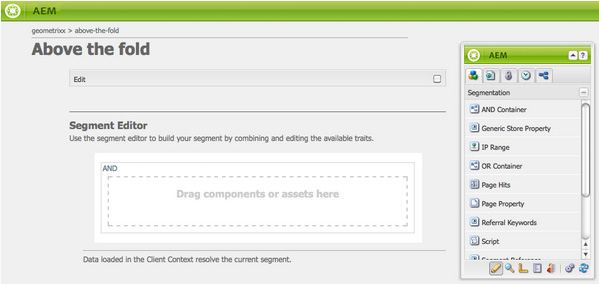
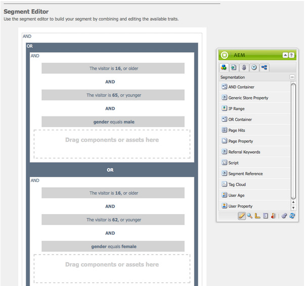

# 配置分段{#configuring-segmentation}

>[!NOTE]
>
>此文档涵盖与Client Context一起使用的分段配置。 要使用触屏UI配置ContextHub的区段，请参阅 [使用ContextHub配置分段](/help/sites-administering/segmentation.md)。

分段是创建营销活动时的主要考虑事项。请参 [阅分段词汇](/help/sites-authoring/segmentation-overview.md) ，了解有关分段工作方式和关键术语的信息。

根据您已收集的有关网站访客和您要实现的目标的信息，您需要定义目标内容所需的细分和策略。

然后，这些区段用于为访客提供具体目标内容。 此内容在网站的 [活动](/help/sites-authoring/personalization.md) 部分进行维护。 此处定义的Teaser页面可以作为Teaser段落包含在任何页面上，并定义专用内容适用的访客段。

AEM允许您轻松创建和更新区段、Teaser和活动。 它还允许您验证定义的结果。

使用 **细分编辑** 器，您可以轻松定义一个细分：

您可以 **编辑** 每个区段以指定标 **题**、 **说明****和** 提升。 使用Sidekick，您可以添 **加AND** 和OR **容器来定** 义段逻辑 **，然后添加所需的**&#x200B;段特征以定义选 **** 择条件。

## 提升因子 {#boost-factor}

每个区段都有 **一个** Boost参数，用作加权因子； 数字越大，表示将优先选择数字越小的区段。

* Minimum value: `0`
* Maximum value: `1000000`

## 细分逻辑 {#segment-logic}

以下逻辑容器现成可用，允许您构建区段选择的逻辑。 可以将它们从Sidekick拖动到编辑器中：

<table> 
 <tbody> 
  <tr> 
   <td> AND 容器  </td> 
   <td> 布尔AND运算符。  </td> 
  </tr> 
  <tr> 
   <td> OR 容器  </td> 
   <td> 布尔OR运算符。</td> 
  </tr> 
 </tbody> 
</table>

## 细分特征 {#segment-traits}

以下细分特征现成可用； 可以将它们从Sidekick拖动到编辑器：

<table> 
 <tbody> 
  <tr> 
   <td> IP 范围  </td> 
   <td>定义访客可以拥有的IP地址范围。  </td> 
  </tr> 
  <tr> 
   <td> 页面点击  </td> 
   <td>请求页面的频率。   </td> 
  </tr> 
  <tr> 
   <td> 页面属性  </td> 
   <td>已访问页面的任何属性。  </td> 
  </tr> 
  <tr> 
   <td> 引用关键字  </td> 
   <td>要与引用网站中的信息匹配的关键字。   </td> 
  </tr> 
  <tr> 
   <td> 脚本</td> 
   <td>要评估的Javascript表达式。  </td> 
  </tr> 
  <tr> 
   <td> 段引用   </td> 
   <td>引用其他段定义。  </td> 
  </tr> 
  <tr> 
   <td> 标记云  </td> 
   <td>与访问的页面中的标记相匹配的标记。  </td> 
  </tr> 
  <tr> 
   <td> 用户年龄  </td> 
   <td>用户用户档案。  </td> 
  </tr> 
  <tr> 
   <td> 用户属性  </td> 
   <td>用户用户档案中提供的任何其他信息。 </td> 
  </tr> 
 </tbody> 
</table>

您可以使用布尔运算符OR和AND组合这些特征(请 [参阅创建新区段](#creating-a-new-segment))，以定义选择此区段的确切方案。

当整个语句的计算结果为true时，此段已解析。 在适用多个区段的事件中，还 **[会使](/help/sites-administering/campaign-segmentation.md#boost-factor)**用提升因子。

>[!CAUTION]
>
>段编辑器不检查任何循环引用。 例如，区段A引用了另一个区段B，这反过来又引用了区段A。您必须确保您的区段不包含任何循环引用。

>[!NOTE]
>
>具有_i18n **后缀的属性** ，由作为个性化UI clientlib的一部分的脚本设置。 只有作者才会加载所有与UI相关的客户端库，因为发布时不需要UI。
>
>因此，在创建具有此类属性的段时，通常需要依 **赖于browserFamily** ，而不是 **browserFamily_i18n**。

## Creating a New Segment {#creating-a-new-segment}

要定义新区段，请执行以下操作：

1. 在边栏中，选择“工 **具”>“操作”>“配置**”。
1. 单击左窗格 **中的** “分段”页面，然后导航到所需的位置。
1. 使用 [区段模板](/help/sites-authoring/managing-pages.md) ，创 **建新** 页面。
1. 打开新页面以查看区段编辑器：

   

1. 使用Sidekick或上下文菜单(通常单击鼠标右键，然后选 **择新建。.** .以打开插入新组件窗口)查找所需的区段特征。 然后将其拖动到 **段编辑器** ，它将显示在默认 **AND容器中** 。
1. 多次单击新特征以编辑特定参数； 例如，鼠标位置：

   

1. Click **OK** to save your definition:
1. 您可以 **编辑** 区段定义，为其提供 **标题**、 **说明****[和](/help/sites-administering/campaign-segmentation.md#boost-factor)**提升：

   

1. 根据需要添加更多特征。 您可以使用“段逻辑”下 **的AND表达式****和OR容器组** 件来构建布 **尔容器**。 利用区段编辑器，您可以删除不再需要的特征或容器，或将它们拖动到语句中的新位置。

## 使用AND和OR容器 {#using-and-and-or-containers}

您可以在AEM中构建复杂的细分。 了解一些基本要点有所帮助：

* 定义的顶级始终是最初创建的AND容器; 无法更改，但对区段定义的其余部分没有影响。
* 确保容器嵌套合理。 这些容器可以作为布尔表达式的括号进行查看。

以下示例用于选择以下访客:

男，16至65岁

或者

女性，16至62岁

由于主运算符为OR，您需要用OR开始 **容器**。 在此中，您有2个AND语句，对于每个语句，您 **需要一个AND容器**，您可以在其中添加个别特征。

## 测试区段的应用 {#testing-the-application-of-a-segment}

定义区段后，可以借助Client Context测试潜在 **[结果](/help/sites-administering/client-context.md)**:

1. 选择要测试的区段。
1. 按 **[Ctrl-Alt](/help/sites-authoring/keyboard-shortcuts.md)**-C打开**[ Client Context](/help/sites-administering/client-context.md)**,Client Context显示已收集的数据。 为了进行测试，您可 **以编辑** 某些值，或加 **载其** 他用户档案，以了解其影响。

1. 根据定义的特征，当前页面的可用数据可能与段定义匹配，也可能不匹配。 匹配状态显示在定义下方。

例如，简单的细分定义可以基于用户的年龄和性别。 加载特定用户档案表明区段已成功解析：

或者不：

>[!NOTE]
>
>所有特征都会立即解析，但大多数特征只会在页面重新加载时发生更改。 对鼠标位置的更改会立即显示，因此对于测试非常有用。

此类测试还可以在内容页面上执行，并与Teaser组 **件结合** 。

将鼠标悬停在Teaser段落上将显示所应用的段，它们当前是否解析，因此，选择当前Teaser实例的原因：

## 使用您的细分 {#using-your-segment}

活动中当前使用区 [段](/help/sites-authoring/personalization.md)。 它们用于控制特定目标受众看到的实际内容。 有关更 [多信息](/help/sites-authoring/segmentation-overview.md) ，请参阅了解细分。
