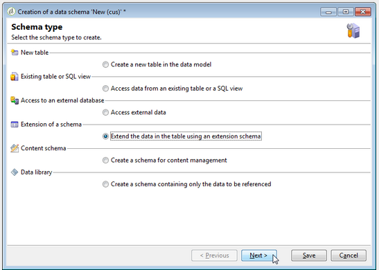

# 与Adobe Campaign Classic集成{#integrating-with-adobe-campaign-classic}

>[!NOTE]
>
>本文档介绍如何将AEM与Adobe Campaign Classic（内部部署解决方案）集成。 如果您使用的是Adobe Campaign Standard，请参阅 [与Adobe Campaign Standard集成](/help/sites-administering/campaignstandard.md) ，以获取这些说明。

Adobe Campaign允许您直接在Adobe Experience Manager中管理电子邮件分发内容和表单。

要同时使用这两个解决方案，您必须首先配置它们以相互连接。 这涉及到Adobe Campaign和Adobe Experience Manager中的配置步骤。 本文档对这些步骤进行了详细说明。

在AEM中使用Adobe Campaign包括通过Adobe Campaign发送电子邮件的功能，有关该功能的说明，请参 [阅使用Adobe Campaign](/help/sites-authoring/campaign.md)。 还包括使用AEM页面上的表单处理数据。

此外，将AEM与 [Adobe Campaign集成时，以下主题可能会引起关注](https://helpx.adobe.com/support/campaign/classic.html):

* [电子邮件模板的最佳实践](/help/sites-administering/best-practices-for-email-templates.md)
* [Adobe Campaign集成疑难解答](/help/sites-administering/troubleshooting-campaignintegration.md)

如果要扩展与Adobe Campaign的集成，您可能希望看到以下页面：

* [创建自定义扩展](/help/sites-developing/extending-campaign-extensions.md)
* [创建自定义表单映射](/help/sites-developing/extending-campaign-form-mapping.md)

## AEM和Adobe Campaign集成工作流 {#aem-and-adobe-campaign-integration-workflow}

本节介绍在创建营销活动和交付内容时AEM与Adobe Campaign之间的典型工作流程。

典型的工作流涉及到以下几方面，并有详细说明：

1. 开始构建您的营销活动（在Adobe Campaign和AEM中）。
1. 在链接内容和交付之前，请在AEM中个性化您的内容，并在Adobe Campaign中创建分发。
1. 在Adobe Campaign中关联内容和分发。

### 开始构建营销活动 {#start-building-your-campaign}

您可以随时开始构建营销活动。 在链接内容之前，AEM和AC是独立的。这意味着，当内容创建者在AEM中处理设计时，营销人员可以在Adobe Campaign中开始创建其营销活动和定位。

### 在链接内容和交付之前 {#before-linking-content-and-delivery}

在链接内容并创建交付机制之前，您需要执行以下操作：

**在AEM中**

* 使用文本和个性化组件中的个性 **化字段进行个性化** 。

**在 Adobe Campaign 中：**

* 创建aemContent类型的交 **付**

### 链接内容和设置交付 {#linking-content-and-setting-delivery}

在准备了用于链接和交付的内容后，您可以准确确定链接内容的方式和位置。

所有这些步骤均在Adobe Campaign中完成。

1. 指定要使用的AEM实例。
1. 通过单击“同步”按钮同步内容。
1. 打开内容选取器以选择您的内容。

### 如果您是AEM新用户 {#if-you-are-new-to-aem}

如果您是AEM的新用户，您可能会发现以下链接有助于了解AEM:

* [启动AEM](/help/sites-deploying/deploy.md)
* [了解复制代理](/help/sites-deploying/replication.md)
* [查找和使用日志文件](/help/sites-deploying/monitoring-and-maintaining.md#working-with-audit-records-and-log-files)
* [AEM Platform简介](/help/sites-deploying/platform.md)

## 配置Adobe Campaign {#configuring-adobe-campaign}

配置Adobe Campaign涉及以下事项：

1. 在Adobe Campaign中安装AEM集成包。
1. 配置外部帐户。
1. 验证AEMResourceTypeFilter是否配置正确。

此外，您还可以进行高级配置，包括：

* 管理内容块
* 管理个性化字段

请参阅 [高级配置](#advanced-configurations)。

>[!NOTE]
>
>要执行这些操作，您必须在Adobe Campaign中 **具有** “管理”角色。

### 前提条件 {#prerequisites}

请事先确保您具有以下元素：

* [AEM创作实例](/help/sites-deploying/deploy.md#getting-started)
* [AEM发布实例](/help/sites-deploying/deploy.md#author-and-publish-installs)
* [Adobe Campaign Classic实例](https://helpx.adobe.com/support/campaign/classic.html) -包括客户端和服务器
* Internet Explorer 11

>[!NOTE]
>
>如果运行的版本早于Adobe Campaign Classic内部版本8640，请参阅升级文 [档](https://docs.campaign.adobe.com/doc/AC6.1/en/PRO_Updating_Adobe_Campaign_Upgrading.html) ，以了解更多信息。 请注意，客户端和数据库必须升级到同一版本。

>[!CAUTION]
>
>要使AEM与Adobe Campaign之间的集 [成功能正常工作，必须执行配置Adobe Campaign](#configuring-adobe-campaign)[](#configuring-adobe-experience-manager) 和配置Adobe Experience Manager部分中详细介绍的操作。

### 安装AEM集成包 {#installing-the-aem-integration-package}

必须在Adobe Campaign中安 **装AEM集成包** 。 要执行此操作：

1. 转到要与AEM链接的Adobe Campaign实例。
1. *选择*&#x200B;工具&#x200B;*>高*&#x200B;级&#x200B;*>*&#x200B;导入包…….

   

1. 单击 **安装标准包**，然后选择 **AEM集成包** 。

   

1. 单击“ **下一步**”，然后单 **击“开始**”。

   此包中包含 **将用于将AEM服务器连接到Adobe Campaign的aemserver** 运算符。

   >[!CAUTION]
   >
   >默认情况下，不为此操作符配置安全区。 要通过AEM连接到Adobe Campaign，您必须选择一个。
   >
   >在 **serverConf.xml文件中** ，选定安全区 **域的allowUserPassword属性必须设置为** true **** ，以授权AEM通过登录名／密码连接Adobe Campaign。
   >
   >我们强烈建议创建专用于AEM的安全区，以避免任何安全问题。 有关详细信息，请参阅安装 [指南](https://docs.campaign.adobe.com/doc/AC/en/INS_Additional_configurations_Configuring_Campaign_server.html)。

   

### 配置AEM外部帐户 {#configuring-an-aem-external-account}

您必须配置一个外部帐户，以便将Adobe Campaign连接到AEM实例。

>[!NOTE]
>
>* 安装 **AEM Integration包时** ，将创建外部AEM帐户。 您可以从AEM实例配置与该实例的连接，或创建新实例。
>* 在AEM中，请确保为campaign-remote用户设置口令。 您需要设置此密码才能将Adobe Campaign与AEM连接。 以管理员身份登录，在用户管理控制台中，搜索营销活动远程用户并单击“设 **置口令”**。
>


配置外部AEM帐户：

1. 转到“管 **理** ”>“ **平台** ” **>“** 外部帐户”节点。
1. 创建新的外部帐户并选择 **AEM** 类型。
1. 输入AEM创作实例的访问参数：服务器地址以及用于连接此实例的ID和密码。 campaign-api用户帐户密码与您在AEM中为其设置密码的campaign-remote用户相同。

   >[!NOTE]
   >
   >确保服务器地址不以 **尾部斜杠** 结尾。 例如，输入 `https://yourserver:4502` 而不是 `https://yourserver:4502/`

    

1. 确保选中“已 **启用** ”复选框。

### 验证AEMResourceTypeFilter选项 {#verifying-the-aemresourcetypefilter-option}

AEMResourceTypeFilter **** 选项用于筛选可在Adobe Campaign中使用的AEM资源类型。 这允许Adobe Campaign检索专门设计用于Adobe Campaign的AEM内容。

此选项应预先配置；但是，如果更改此选项，则可能导致无法正常集成。

要验证 **AEMResourceTypeFilter选项是否已配置** ，请执行以下操作：

1. 转至“平 **台** ”>“**选项**”。
1. 在 **AEMResourceTypeFilter选项中** ，检查路径是否正确。 此字段必须包含以下值：

   **mcm/campaign/components/newsletter,mcm/campaign/components/campaign_newsletterpage,mcm/neolane/components/newsletter**

   或者在某些情况下，该值如下所示：

   **mcm/campaign/components/newsletter**

   

## Configuring Adobe Experience Manager {#configuring-adobe-experience-manager}

要配置AEM，您必须执行以下操作：

* 在实例之间配置复制。
* 通过云服务将AEM连接到Adobe Campaign。
* 配置externalizer。

### 在AEM实例之间配置复制 {#configuring-replication-between-aem-instances}

从AEM创作实例创建的内容会首先发送到发布实例。 您需要进行发布，以便新闻稿中的图像可在发布实例上和新闻稿收件人处使用。 因此，必须将复制代理配置为从AEM创作实例复制到AEM发布实例。

>[!NOTE]
>
>如果您不想使用复制URL，而是使用面向公共的URL，则可以在OSGi( **AAEM** >Hotols **>“清除”>“清除操作”>“Web>Web”>“清除”>“Web”>“Web”>“OsgI Console”配置>中在配置设置中设置** PublicURL **URL** URL **************** URLAEM集成- Configuration Campaign):
**** 公共URL:com.day.cq.mcm.campaign.impl.IntegrationConfigImpl#aem.mcm.campaign.publicUrl

此步骤也是将某些创作实例配置复制到发布实例所必需的。

要在AEM实例之间配置复制，请执行以下操作：

1. 从AEM **>** Tools **>** Deployment **>** ReplicationIcon实例中，选择AEM **> Tools**********> ReplicationIcon >作者代理的创作图标，然后单击默认的Adobe Agent中的Default Logo DeploymentAgent。

   

   >[!NOTE]
   在配置与Adobe Campaign的集成时，请避免使用localhost（即AEM的本地副本），除非发布和作者实例都位于同一台计算机上。

1. 点按或单击编 **辑** ，然后选择 **传输** 选项卡。
1. 配置URI，方法是将 **localhost替换** （IP地址或AEM发布实例的地址）。

   

### 将AEM连接到Adobe Campaign {#connecting-aem-to-adobe-campaign}

在将AEM和Adobe Campaign结合使用之前，您必须在两个解决方案之间建立链接，以便它们能够通信。

1. 连接到AEM创作实例。
1. 选择 **EM徽标** >工具 **图标** > **部署图标** > ******** Cloud Services，然后在Adobe Campaign中立即配置Cloud Services。

   

1. 通过输入标题并单击创建 **，创建新配置******，或选择要与Adobe Campaign实例链接的现有配置。
1. 编辑配置，使其与Adobe Campaign实例的参数匹配。

   * **用户名**:aemserver ****,Adobe Campaign AEM集成包运营商，用于在两个解决方案之间建立链接。
   * **密码**:Adobe Campaign aemserver操作员密码。 您可能必须直接在Adobe Campaign中为此操作员重新指定密码。
   * **API端点**:Adobe Campaign实例URL。

1. 选择 **连接到Adobe Campaign** ，然后单 **击确定**。

   

   >[!NOTE]
   在创建 [并发布电子邮件后](/help/sites-authoring/campaign.md)，您需要将配置重新发布到发布实例。

   

>[!NOTE]
如果连接失败，请确保检查以下内容：
* 在使用与Adobe Campaign实例(https)的安全连接时，您可能会遇到证书问题。 您必须将Adobe Campaign实例证书添加到AEM实 **例的** JDK的cacerts文件中。
* 必须为Adobe Campaign中的aemserver运 [营商配置安](#connecting-aem-to-adobe-campaign) 全区。 此外，在 **serverConf.xml文件中，安全区** 域的allowUserPassword **属性必须设置为** true **** ，才能使用登录名／密码模式授权AEM与Adobe Campaign的连接。

此外，请参 [阅AEM/Adobe Campaign集成疑难解答](/help/sites-administering/troubleshooting-campaignintegration.md)。

### 配置外部器 {#configuring-the-externalizer}

您需要在 [创作实例的AEM中配置](/help/sites-developing/externalizer.md) externalizer。 Externalizer是OSGi服务，它允许您将资源路径转换为外部和绝对URL。 此服务提供了配置和构建这些外部URL的中心位置。

有关 [常规说明，请参阅配置](/help/sites-developing/externalizer.md) externalizer。 对于Adobe Campaign集成，请确保在Adobe Campaign控制台可 `https://<host>:<port>/system/console/configMgr/com.day.cq.commons.impl.ExternalizerImpl`访问的服 `localhost:4503` 务器上配置发布服务器，而不是指向该服务器。

如果指向Adobe Campaign无 `localhost:4503` 法访问的服务器或其他服务器，则您的图像不会显示在Adobe Campaign控制台上。


## 高级配置 {#advanced-configurations}

您还可以执行一些高级配置，即：

* 管理个性化字段和基块。
* 取消激活个性化块。
* 管理目标扩展数据。

### 管理个性化字段和区块 {#managing-personalization-fields-and-blocks}

用于在AEM中向电子邮件内容添加个性化的字段和区块由Adobe Campaign管理。

提供了默认列表，但可以修改。 您还可以添加或隐藏个性化字段和区块。

#### 添加个性化字段 {#adding-a-personalization-field}

要将新的个性化字段添加到已有可用的个性化字段，您必须按如下方式扩展Adobe Campaign **nms:seedMember** 架构：

>[!CAUTION]
您需要添加的字段必须已通过收件人架构扩展(**nms:recipient**)添加。 有关详细信息，请参阅 [配置指南](https://docs.campaign.adobe.com/doc/AC6.1/en/CFG_Editing_schemas_Editing_schemas.html) 。

1. 转到Adobe Campaign导 **航中的** “管理” **>“配置”** >“ **数据架构** ”节点。
1. 选择 **新建**。

   

1. 在弹出窗口中，选择使用扩 **展架构扩展表中的数据** ，然后单击 **下一步**。

   

1. 输入扩展架构的不同参数：

   * **架构**:选择 **nms:seedMember** schema。 窗口中的其他字段将自动完成。
   * **命名空间**:个性化扩展架构的命名空间。

1. 编辑架构的XML代码，以指定要添加到此处的字段。 有关在Adobe Campaign中扩展架构的详细信息，请参阅配置 [指南](https://docs.campaign.adobe.com/doc/AC6.1/en/CFG_Editing_schemas_Extending_a_schema.html)。
1. 保存您的架构，然后通过控制台中的“工具 **** ”>“高级 **”** >“更新数 **据库结构** ”菜单更新Adobe Campaign数据库结构。
1. 断开连接，然后重新连接到Adobe Campaign控制台以保存更改。 新字段现在显示在AEM中可用的个性化字段列表中。

#### 示例 {#example}

要添加“注 **册编号** ”字段，您必须具有以下元素：

* 名 **为cus:recipient** 的nms:recipient架构扩 **展包含** :

```xml
<element desc="Recipient table (profiles)" img="nms:recipient.png" label="Recipients" labelSingular="Recipient" name="recipient">

  <attribute dataPolicy="smartCase" desc="Recipient registration number" 
  label="Registration Number"
  length="50" name="registrationNumber" type="string"/>

</element>
```

名 **为cus:seedMember** 的nms:seedMember架构扩 **展包含** :

```xml
<element desc="Seed to insert in the export files" img="nms:unknownad.png" label="Seed addresses" labelSingular="Seed" name="seedMember">

  <element name="custom_nms_recipient">
    <attribute name="registrationNumber" 
    template="cus:recipient:recipient/@registrationNumber"/>
  </element>

</element>
```

“注 **册编号** ”字段现在是可用个性化字段的一部分：


#### 隐藏个性化字段 {#hiding-a-personalization-field}

要隐藏已可用的个性化字段，您必须扩展Adobe Campaign **nms:seedMember** 架构，详情请参阅添 [加个性化字段部分](#adding-a-personalization-field) 。 应用以下步骤：

1. 复制要从扩展架构中的 **nms:seedMember** 架构中获取的字段(**例如，cus:seedMember** )。
1. 将 **advanced=&quot;true&quot;** XML属性添加到字段。 它不再显示在AEM中可用的个性化字段列表中。

   例如，要隐藏“中间名 **称”字段** , **cud:seedMember** 架构必须包含以下元素：

   ```xml
   <element desc="Seed to insert in the export files" img="nms:unknownad.png" label="Seed addresses" labelSingular="Seed" name="seedMember">
   
     <element name="custom_nms_recipient">
       <attribute advanced="true" name="middleName"/>
     </element>
   
   </element>
   ```

### 取消激活个性化块 {#deactivating-a-personalization-block}

要取消激活可用的个性化块，请执行以下操作：

1. 转到Adobe Campaign导 **航中的** “资源” **>“营销活动管理** ” **>** “个性化基块”节点。
1. 选择要在AEM中取消激活的个性化区块。
1. 清除自定 **义菜单中的“可见** ”复选框并保存更改。 该区块不再显示在Adobe Campaign中可用的个性化区块列表中。

   

### 管理目标扩展数据 {#managing-target-extension-data}

您还可以插入目标扩展数据以实现个性化。 目标扩展数据（也称为“目标数据”）来自于在营销活动工作流中的查询中丰富或添加数据。 有关详细信息，请参阅创建查 [询和](https://docs.campaign.adobe.com/doc/AC/en/PTF_Creating_queries_About_queries_in_Campaign.html)[丰富数据部分](https://docs.campaign.adobe.com/doc/AC/en/WKF_Use_cases_Enriching_data.html) 。

>[!NOTE]
仅当AEM内容与Adobe Campaign交付同步时，目标中的数据才可用。 See [Synchronizing content created in AEM with a delivery from Adobe Campaign](/help/sites-authoring/campaign.md#synchronizing-content-created-in-aem-with-a-delivery-from-adobe-campaign-classic).


