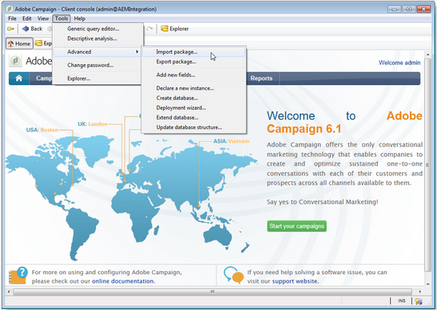
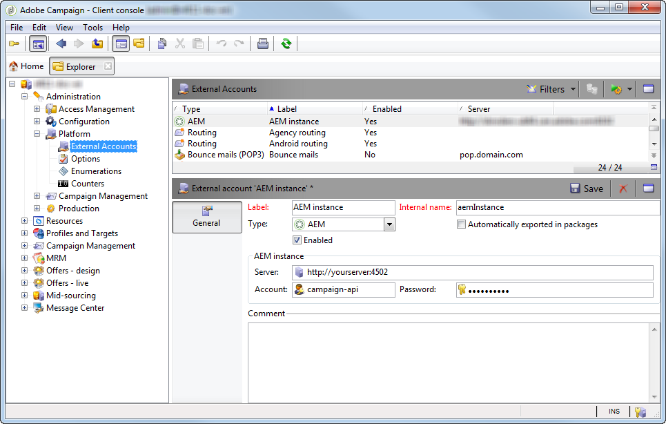
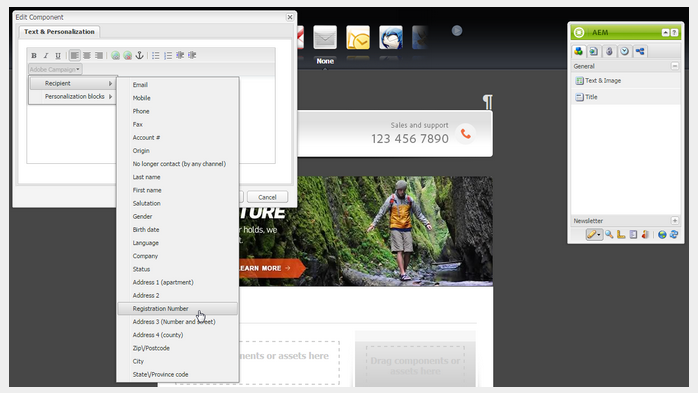

# 与Adobe Campaign Classic集成{#integrating-with-adobe-campaign-classic}

>[!NOTE]
>
>本文档介绍如何将AEM与内部部署解决方案Adobe Campaign Classic集成。 如果您使用的是Adobe Campaign Standard，请参阅[与Adobe Campaign Standard集成](/help/sites-administering/campaignstandard.md)以了解这些说明。

Adobe Campaign允许您直接在Adobe Experience Manager管理电子邮件投放内容和表单。

要同时使用这两个解决方案，您必须首先配置它们以彼此连接。 这涉及Adobe Campaign和Adobe Experience Manager中的配置步骤。 本文档详细介绍了这些步骤。

使用AEM中的Adobe Campaign包括通过Adobe Campaign发送电子邮件的功能，[使用Adobe Campaign](/help/sites-authoring/campaign.md)中有相关介绍。 还包括使用AEM页面上的表单来操作数据。

此外，将AEM与[Adobe Campaign](https://helpx.adobe.com/support/campaign/classic.html)集成时，以下主题可能会引起关注：

* [电子邮件模板的最佳实践](/help/sites-administering/best-practices-for-email-templates.md)
* [Adobe Campaign集成疑难解答](/help/sites-administering/troubleshooting-campaignintegration.md)

如果要扩展与Adobe Campaign的集成，您可能希望看到以下页面：

* [创建自定义扩展](/help/sites-developing/extending-campaign-extensions.md)
* [创建自定义表单映射](/help/sites-developing/extending-campaign-form-mapping.md)

## AEM和Adobe Campaign集成工作流{#aem-and-adobe-campaign-integration-workflow}

本节介绍创建活动和交付内容时AEM和Adobe Campaign之间的典型工作流程。

典型工作流涉及以下几方面，并进行了详细描述：

1. 开始构建您的活动(在Adobe Campaign和AEM中)。
1. 在链接内容和投放之前，在AEM中个性化您的内容并创建Adobe Campaign投放。
1. 链接Adobe Campaign中的内容和投放。

### 开始构建活动{#start-building-your-campaign}

您随时开始构建活动。 在链接内容之前，AEM和AC是独立的。这意味着营销人员可以在Adobe Campaign中开始创建活动和定位，而内容创建者在AEM中进行设计。

### 链接内容和投放{#before-linking-content-and-delivery}之前

在链接内容并创建投放机制之前，您需要执行以下操作：

**在AEM**

* 使用&#x200B;**文本与个性化**&#x200B;组件中的个性化字段进行个性化

**在 Adobe Campaign 中：**

* 创建类型&#x200B;**aemContent**&#x200B;的投放

### 链接内容和设置投放{#linking-content-and-setting-delivery}

在准备了用于链接和投放的内容后，您可以准确确定链接内容的方式和位置。

所有这些步骤都以Adobe Campaign完成。

1. 指定要使用的AEM实例。
1. 通过单击“同步”按钮同步内容。
1. 打开内容选取器以选择您的内容。

### 如果您是AEM {#if-you-are-new-to-aem}的新用户

如果您是AEM的新手，您可能会发现以下链接对了解AEM很有帮助：

* [启动AEM](/help/sites-deploying/deploy.md)
* [了解复制代理](/help/sites-deploying/replication.md)
* [查找和处理日志文件](/help/sites-deploying/monitoring-and-maintaining.md#working-with-audit-records-and-log-files)
* [AEM平台简介](/help/sites-deploying/platform.md)

## 配置Adobe Campaign{#configuring-adobe-campaign}

配置Adobe Campaign涉及以下方面：

1. 在Adobe Campaign中安装AEM集成包。
1. 配置外部帐户。
1. 验证AEMResourceTypeFilter配置正确。

此外，您还可以进行高级配置，包括：

* 管理内容块
* 管理个性化字段

请参阅[高级配置](#advanced-configurations)。

>[!NOTE]
>
>要执行这些操作，您必须具有&#x200B;**administration**&#x200B;角色作为Adobe Campaign。

### 前提条件 {#prerequisites}

请事先确保您具有以下元素：

* [AEM创作实例](/help/sites-deploying/deploy.md#getting-started)
* [AEM发布实例](/help/sites-deploying/deploy.md#author-and-publish-installs)
* [Adobe Campaign Classic实例](https://helpx.adobe.com/support/campaign/classic.html) -包括客户端和服务器
* Internet Explorer 11

>[!NOTE]
>
>如果运行的版本早于Adobe Campaign Classic内部版本8640，请参阅[升级文档](https://docs.campaign.adobe.com/doc/AC6.1/en/PRO_Updating_Adobe_Campaign_Upgrading.html)以了解详细信息。 请注意，必须将客户端和数据库升级到同一版本。

>[!CAUTION]
>
>要使AEM与Adobe Campaign之间的集成功能正常工作，必须在[配置Adobe Campaign](#configuring-adobe-campaign)和[配置Adobe Experience Manager](#configuring-adobe-experience-manager)部分中详细介绍的操作。

### 安装AEM集成包{#installing-the-aem-integration-package}

必须以Adobe Campaign安装&#x200B;**AEM Integration**&#x200B;包。 要执行此操作：

1. 转到要与AEM链接的Adobe Campaign实例。
1. 选择&#x200B;*工具* > *高级* > *导入包……*。

   

1. 单击&#x200B;**安装标准包**，然后选择&#x200B;**AEM Integration**&#x200B;包。

   

1. 单击&#x200B;**下一步**，然后单击&#x200B;**开始**。

   此包包含&#x200B;**aemserver**&#x200B;运算符，它将用于将AEM服务器连接到Adobe Campaign。

   >[!CAUTION]
   >
   >默认情况下，未为此运算符配置安全区。 要通过AEM连接到Adobe Campaign，必须选择一个。
   >
   >在&#x200B;**serverConf.xml**&#x200B;文件中，选定安全区域的&#x200B;**allowUserPassword**&#x200B;属性必须设置为&#x200B;**true**&#x200B;以授权AEM通过登录名／口令连接Adobe Campaign。
   >
   >我们强烈建议创建专用于AEM的安全区，以避免出现任何安全问题。 有关详细信息，请参阅[安装指南](https://docs.campaign.adobe.com/doc/AC/en/INS_Additional_configurations_Configuring_Campaign_server.html)。

   

### 配置AEM外部帐户{#configuring-an-aem-external-account}

您必须配置一个外部帐户，允许您将Adobe Campaign连接到AEM实例。

>[!NOTE]
>
>* 安装&#x200B;**AEM Integration**&#x200B;包时，将创建外部AEM帐户。 您可以从AEM实例配置到该实例的连接，或创建新实例。
>* 在AEM中，确保为活动远程用户设置口令。 您需要设置此密码才能将Adobe Campaign与AEM连接。 以管理员身份登录，在“用户管理”控制台中，搜索活动远程用户，然后单击“设置口令”**。**

>


配置外部AEM帐户：

1. 转至&#x200B;**Administration** > **Platform** > **外部帐户**&#x200B;节点。
1. 创建新外部帐户并选择&#x200B;**AEM**&#x200B;类型。
1. 输入AEM创作实例的访问参数：服务器地址以及用于连接到此实例的ID和密码。 活动api用户帐户密码与您在AEM中为活动远程用户设置密码的密码相同。

   >[!NOTE]
   >
   >确保服务器地址&#x200B;**不**&#x200B;以尾随斜杠结尾。 例如，输入`https://yourserver:4502`而不是`https://yourserver:4502/`

    

1. 确保选中&#x200B;**已启用**&#x200B;复选框。

### 验证AEMResourceTypeFilter选项{#verifying-the-aemresourcetypefilter-option}

**AEMResourceTypeFilter**&#x200B;选项用于筛选可用于Adobe Campaign的AEM资源的类型。 这允许Adobe Campaign检索专门设计用于Adobe Campaign的AEM内容。

此选项应预先配置；但是，如果更改此选项，可能会导致集成无法正常工作。

要验证&#x200B;**AEMResourceTypeFilter**&#x200B;选项是否已配置：

1. 转至&#x200B;**平台**>**选项**。
1. 在&#x200B;**AEMResourceTypeFilter**&#x200B;选项中，检查路径是否正确。 此字段必须包含以下值：

   **mcm/活动/组件/newsletter,mcm/活动/组件/活动_newsletterpage,mcm/neolane/组件/newsletter**

   或者在某些情况下，该值如下所示：

   **mcm/活动/组件／新闻稿**

   

## 配置Adobe Experience Manager{#configuring-adobe-experience-manager}

要配置AEM，您必须执行以下操作：

* 在实例之间配置复制。
* 通过Cloud Services将AEM连接到Adobe Campaign。
* 配置外部器。

### 在AEM实例{#configuring-replication-between-aem-instances}之间配置复制

首先从AEM创作实例创建的内容将发送到发布实例。 您需要进行发布，以便Newsletter中的图像可在发布实例上和Newsletter收件人中使用。 因此，必须将复制代理配置为从AEM创作实例复制到AEM发布实例。

>[!NOTE]
>
>如果不想使用复制URL，而是使用面向公共的URL，可以在OSGi(**AEM徽标** > **工具**&#x200B;图标> **操作** &lt;a8)中按照以下配置设置设置&#x200B;**公共URL**/>Web控制台&#x200B;**>** OSGi配置&#x200B;**>** AEM活动集成——配置&#x200B;**):**
**公共URL:** com.day.cq.mcm.活动.impl.IntegrationConfigImpl#aem.mcm.活动.publicUrl

此步骤也是将某些创作实例配置复制到发布实例所必需的。

要在AEM实例之间配置复制，请执行以下操作：

1. 在创作实例中，选择&#x200B;**AEM徽标**> **工具**&#x200B;图标> **部署** > **复制** > **作者**&#x200B;上的代理，然后单击&#x200B;**默认代理**。

   

   >[!NOTE]
   配置与Adobe Campaign的集成时，请避免使用localhost(即AEM的本地副本)，除非发布和作者实例都位于同一台计算机上。

1. 点按或单击&#x200B;**编辑**，然后选择&#x200B;**传输**&#x200B;选项卡。
1. 通过将&#x200B;**localhost**&#x200B;替换为AEM发布实例的IP地址或地址来配置URI。

   

### 将AEM连接到Adobe Campaign{#connecting-aem-to-adobe-campaign}

在将AEM和Adobe Campaign结合使用之前，您必须建立两个解决方案之间的链接，以便它们能够通信。

1. 连接到AEM创作实例。
1. 选择&#x200B;**AEM徽标** > **工具**&#x200B;图标> **部署** > **Cloud Services**，然后在Adobe Campaign部分中选择&#x200B;**立即配置**。

   

1. 通过输入&#x200B;**标题**&#x200B;并单击&#x200B;**创建**&#x200B;创建新配置，或选择要与Adobe Campaign实例链接的现有配置。
1. 编辑配置，使其与Adobe Campaign实例的参数匹配。

   * **用户名**: **aemserver**,Adobe CampaignAEM集成包运营商，用于建立两个解决方案之间的链接。
   * **密码**:Adobe CampaignAemserver操作员密码。您可能必须直接以Adobe Campaign重新指定此运算符的密码。
   * **API端点**:Adobe Campaign实例URL。

1. 选择&#x200B;**连接到Adobe Campaign**&#x200B;并单击&#x200B;**确定**。

   

   >[!NOTE]
   在[创建电子邮件并发布它](/help/sites-authoring/campaign.md)后，您需要将配置重新发布到发布实例。

   

>[!NOTE]
如果连接失败，请确保检查以下内容：
* 使用与Adobe Campaign实例(https)的安全连接时，可能会遇到证书问题。 您必须将Adobe Campaign实例证书添加到AEM实例JDK的&#x200B;**cacerts**&#x200B;文件。
* 必须为Adobe Campaign中的[aemserver运算符](#connecting-aem-to-adobe-campaign)配置安全区。 此外，在&#x200B;**serverConf.xml**&#x200B;文件中，必须将安全区域的&#x200B;**allowUserPassword**&#x200B;属性设置为&#x200B;**true**，以使用登录名／口令模式授权AEM连接到Adobe Campaign。

此外，请参阅[AEM/Adobe Campaign集成故障排除](/help/sites-administering/troubleshooting-campaignintegration.md)。

### 配置外部器{#configuring-the-externalizer}

您需要在创作实例的AEM中配置外部器](/help/sites-developing/externalizer.md)。 [Externalizer是OSGi服务，它允许您将资源路径转换为外部和绝对URL。 此服务提供一个中心位置来配置这些外部URL并构建它们。

有关一般说明，请参见[配置外部器](/help/sites-developing/externalizer.md)。 对于Adobe Campaign集成，请确保在`https://<host>:<port>/system/console/configMgr/com.day.cq.commons.impl.ExternalizerImpl`配置发布服务器，不要指向`localhost:4503`，而是指向Adobe Campaign控制台可以访问的服务器。

如果它指向`localhost:4503`或Adobe Campaign无法访问的其他服务器，则您的图像将不会显示在Adobe Campaign控制台上。


## 高级配置{#advanced-configurations}

您还可以执行一些高级配置，即：

* 管理个性化字段和块。
* 取消激活个性化块。
* 管理目标扩展数据。

### 管理个性化字段和块{#managing-personalization-fields-and-blocks}

用于向AEM中的电子邮件内容添加个性化的字段和基块由Adobe Campaign管理。

提供默认列表，但可以修改。 您还可以添加或隐藏个性化字段和块。

#### 添加个性化字段{#adding-a-personalization-field}

要将新的个性化字段添加到已有的Adobe Campaign中，您必须按如下方式扩展模式&#x200B;**nms:seedMember**:

>[!CAUTION]
您需要添加的字段必须已通过收件人模式扩展(**nms:收件人**)添加。 有关详细信息，请参阅[配置](https://docs.campaign.adobe.com/doc/AC6.1/en/CFG_Editing_schemas_Editing_schemas.html)指南。

1. 转到Adobe Campaign导航中的&#x200B;**管理** > **配置** > **模式**&#x200B;节点。
1. 选择&#x200B;**新建**。

   

1. 在弹出窗口中，选择&#x200B;**使用扩展模式**&#x200B;扩展表中的数据，然后单击&#x200B;**下一步**。

   

1. 输入扩展模式的不同参数：

   * **模式**:选择 **nms:** seedMemberschema。窗口中的其他字段将自动完成。
   * **命名空间**:个性化扩展模式的命名空间。

1. 编辑模式的XML代码以指定要添加到该字段的字段。 有关在Adobe Campaign中扩展模式的详细信息，请参阅[配置指南](https://docs.campaign.adobe.com/doc/AC6.1/en/CFG_Editing_schemas_Extending_a_schema.html)。
1. 保存模式，然后通过控制台中的&#x200B;**工具** > **高级** > **更新Adobe Campaign库结构**&#x200B;菜单更新数据库结构。
1. 断开连接，然后重新连接到Adobe Campaign控制台以保存更改。 新字段现在显示在AEM提供的个性化字段列表中。

#### 示例 {#example}

要添加&#x200B;**注册编号**&#x200B;字段，您必须具有以下元素：

* **nms:收件人**&#x200B;名为&#x200B;**cus:收件人**&#x200B;的模式扩展包含：

```xml
<element desc="Recipient table (profiles)" img="nms:recipient.png" label="Recipients" labelSingular="Recipient" name="recipient">

  <attribute dataPolicy="smartCase" desc="Recipient registration number" 
  label="Registration Number"
  length="50" name="registrationNumber" type="string"/>

</element>
```

**nms:seedMember**&#x200B;名为&#x200B;**cus:seedMember**&#x200B;的模式扩展包含：

```xml
<element desc="Seed to insert in the export files" img="nms:unknownad.png" label="Seed addresses" labelSingular="Seed" name="seedMember">

  <element name="custom_nms_recipient">
    <attribute name="registrationNumber" 
    template="cus:recipient:recipient/@registrationNumber"/>
  </element>

</element>
```

**注册编号**&#x200B;字段现在是可用个性化字段的一部分：



#### 隐藏个性化字段{#hiding-a-personalization-field}

要隐藏已可用的个性化字段，必须扩展Adobe Campaign **nms:seedMember**&#x200B;模式，详情请参阅[添加个性化字段](#adding-a-personalization-field)部分。 应用以下步骤：

1. 复制要从扩展模式（例如&#x200B;**cus:seedMember**）的&#x200B;**nms:seedMember**&#x200B;模式获取的字段。
1. 将&#x200B;**advanced=&quot;true&quot;** XML属性添加到字段。 它不再显示在AEM提供的个性化字段列表中。

   例如，要隐藏&#x200B;**中间名称**&#x200B;字段，**cud:seedMember**&#x200B;模式必须包含以下元素：

   ```xml
   <element desc="Seed to insert in the export files" img="nms:unknownad.png" label="Seed addresses" labelSingular="Seed" name="seedMember">
   
     <element name="custom_nms_recipient">
       <attribute advanced="true" name="middleName"/>
     </element>
   
   </element>
   ```

### 取消激活个性化块{#deactivating-a-personalization-block}

要取消激活可用个性化块，请执行以下操作：

1. 转到Adobe Campaign导航中的&#x200B;**资源** > **活动管理** > **个性化块**&#x200B;节点。
1. 选择要在AEM中取消激活的个性化区块。
1. 清除自定义菜单&#x200B;**中的“可见”复选框，并保存您所做的更改。**&#x200B;块不再出现在列表中可用个性化块的Adobe Campaign中。

   

### 管理目标扩展数据{#managing-target-extension-data}

您还可以插入目标扩展数据以进行个性化。 目标扩展数据(也称为“目标数据”)来自于在活动工作流中的查询中丰富或添加数据。 有关详细信息，请参阅[创建查询](https://docs.campaign.adobe.com/doc/AC/en/PTF_Creating_queries_About_queries_in_Campaign.html)和[丰富数据](https://docs.campaign.adobe.com/doc/AC/en/WKF_Use_cases_Enriching_data.html)部分。

>[!NOTE]
仅当AEM内容与目标投放同步时，Adobe Campaign中的数据才可用。 请参阅[将AEM中创建的内容与Adobe Campaign](/help/sites-authoring/campaign.md#synchronizing-content-created-in-aem-with-a-delivery-from-adobe-campaign-classic)中的投放同步。


