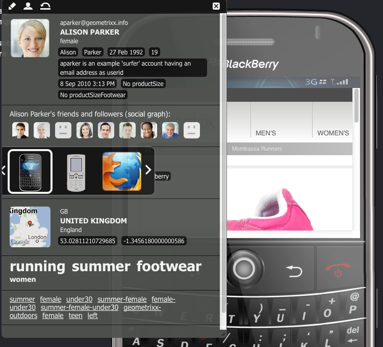

# ClientContext{#client-context}

>[!NOTE]
>
>Client Context已被ContextHub取代。 有关详细信息，请参阅相关 [配置](/help/sites-administering/contexthub-config.md) 和开 [发人员](/help/sites-developing/contexthub.md) 文档。

Client Context是一种机制，可为您提供有关当前页面和访客的特定信息。 可以使用Ctrl- **Alt-c** (windows)或 **control-option-c(Mac)打开它** :

在发布和创作环境中，它都显示有关以下信息：

* 访客; 根据您的实例，会请求或派生某些信息。
* 页面标记以及当前访客访问这些标记的次数（当您将鼠标移到特定标记上时会显示此信息）。
* 页面信息。
* 技术环境信息； 如IP地址、浏览器和屏幕分辨率。
* 当前已解析的任何区段。

这些图标(仅在创作环境中可用)允许您配置Client Context的详细信息：

* **编辑**&#x200B;此时将打开一个新页面，您 [可以编辑、添加或删除用户档案属性](#editing-property-details)。

* **加**&#x200B;载您 [可以从列表用户档案中进行选择，并加载要测试的用户档案](#loading-a-new-user-profile) 。

* **重置**&#x200B;可 [以将用户档案重](#resetting-the-profile-to-the-current-user) 置为当前用户的。

## 可用的Client Context组件 {#available-client-context-components}

Client Context可以显示以下属性([取决于使用“编辑”选择的属性](#adding-a-property-component)):

**Surfer Information** Shows the following client-side information:

* IP **地址**
* **关键字** （用于搜索引擎引用）
* 使 **用的浏** 览器
* 使 **用的** OS（操作系统）
* 屏幕分辨 **率**
* 鼠标 **X位置**
* 鼠标 **Y位置**

**活动流** ：提供用户在各种平台上的社交活动信息； 例如，AEM论坛、博客、评级等。

**活动** 允许作者模拟活动的特定体验。 此组件将覆盖正常的活动分辨率和体验选择，以便能够测试各种配置。

活动解析通常基于活动的优先级属性。 体验通常根据细分进行选择。

**购物车** 显示购物车信息，包括产品条目（标题、数量、格式化等）、已解析的促销（标题、消息等） 和凭证（代码、说明等）。

购物车会话商店还使用ClientContextCartServlet通知服务器已解决的促销更改（基于分段更改）。

**通用存储** (Generic Store)是显示存储内容的通用组件。 它是通用存储属性组件的低级版本。

通用商店必须配置JS呈示器，该呈示器将以自定义方式显示数据。

**通用存储属性** 是显示存储内容的通用组件。 它是通用商店组件的更高级版本。

通用商店属性组件包含一个默认呈现器，它列表配置的属性（与缩略图一起）。

**地理位置** 显示客户端的纬度和经度。 它使用HTML5地理位置API查询浏览器以找到当前位置。 这会导致弹出窗口显示给访客，浏览器会询问他们是否同意共享其位置。

当在Context Cloud中显示时，该组件使用Google API将地图显示为缩略图。 该组件受Google API使用限 [制的约束](https://developers.google.com/maps/documentation/staticmaps/intro#Limits)。

>[!NOTE]
>
>在AEM 6.1中，Geolocation商店不再提供反向地理编码功能。 因此，Geolocation存储不再检索有关当前位置的详细信息，如城市名称或国家／地区代码。 使用此存储数据的区段将无法正常工作。 地理位置存储仅包含位置的经度和纬度。

**JSONP存储** 一个组件，它显示依赖于您的安装的内容。

JSONP标准是对JSON的补充，它允许规避相同的来源策略（使Web应用程序无法与位于另一个域的服务器通信）。 它包括将JSON对象打包到函数调用中，以便能够从另一个域加载它(这是同一来源策略允许的例外)。

JSONP Store与任何其他存储区一样，但它加载来自其他域的信息，而无需为当前域上的该信息设置代理。 请参阅通过JSONP [在Client Context中存储数据中的示例](/help/sites-administering/client-context.md#storing-data-in-client-context-via-jsonp)。

>[!NOTE]
>
>JSONP存储不缓存Cookie中的信息，但在每页加载时检索该数据。

**用户档案数据** 显示在用户用户档案中收集的信息。 例如，性别、年龄、电子邮件地址等。

**已解析的区段** 显示当前解析的区段（通常取决于Client Context中显示的其他信息）。 这在配置活动时很重要。

例如，鼠标当前位于窗口的左手部分还是右手部分。 此区段主要用于测试，因为更改可立即看到。

**社交图** 显示用户的好友和关注者的社交图。

>[!NOTE]
>
>目前，这是一个演示功能，它依赖于我们演示用户的用户档案节点上的预配置数据集。 例如，请参阅：
>
>`/home/users/geometrixx/aparker@geometrixx.info/profile` =>朋友财产

**标记云** 显示在当前页面上设置的标记以及在浏览网站时收集的标记。 将鼠标移到标记上会显示当前用户访问包含该特定标记的页面的次数。

>[!NOTE]
在所访问页面上显示的DAM资产上设置的标记将不计数。

**技术说明** Store此组件取决于您的安装。

**已查看** Products跟踪购物者已查看的产品。 可以查询最近查看的产品或购物车中尚未查看的最近查看的产品。

此会话存储没有默认的客户端上下文组件。

有关其他信息，请参 [阅Client Context详细信息](/help/sites-developing/client-context.md)。

>[!NOTE]
页面数据不再作为默认组件存在于Client Context中。 如果需要，您可以通过编辑Client Context，添加“通用存 **储属性”组件** ，然后配置此组件以将存储 **定义为**`pagedata`。

## 更改Client Context用户档案 {#changing-the-client-context-profile}

Client Context允许您交互地更改详细信息：

* 更改Client Context中使用的用户档案后，您可以查看不同用户在当前页面上将看到的不同体验。
* 除了更改用户用户档案之外，您还可以更改一些用户档案详细信息，以查看不同条件下页面体验的差异。

### 加载新用户用户档案 {#loading-a-new-user-profile}

您可以通过以下任一方式更改用户档案:

* [使用加载图标](#loading-a-new-visitor-profile-with-the-load-profile-icon)
* [使用选择滑块](#loading-a-new-user-profile-with-the-selection-slider)

完成后，您可 [以重置用户档案](#resetting-the-profile-to-the-current-user)。

#### 使用加载访客图标加载新的用户档案用户档案 {#loading-a-new-visitor-profile-with-the-load-profile-icon}

1. 单击加载用户档案图标：

   

1. 这将打开对话框，您可以在此选择要加载的用户档案:

   

1. Click **OK** to load.

#### 使用选择滑块加载新用户用户档案 {#loading-a-new-user-profile-with-the-selection-slider}

您还可以使用选择滑块选择用户档案:

1. 多次单击表示当前用户的图标。 选择器将打开，使用箭头导航并查看可用用户档案:

   

1. 单击要加载的用户档案。 加载详细信息后，单击选择器外部以关闭。

#### 将用户档案重置为当前用户 {#resetting-the-profile-to-the-current-user}

1. 使用重置图标将Client Context中的用户档案返回给当前用户的上下文：

   

### 更改浏览器平台 {#changing-the-browser-platform}

1. 多次单击表示浏览器平台的图标。 选择器将打开，使用箭头导航并查看可用的平台／浏览器：

   

1. 单击要加载的平台浏览器。 加载详细信息后，单击选择器外部以关闭。

### 更改地理位置 {#changing-the-geolocation}

1. 多次单击地理位置图标。 此时将打开一个扩展的地图，您可以在此将标记拖动到新位置：

   

1. 在地图外部单击以关闭。

### 更改标记选择 {#changing-the-tag-selection}

1. 多次单击Client Context的“标记云”部分。 此时将打开对话框，您可以在此选择标记：

   

1. 单击“确定”以加载到Client Context中。

## 编辑Client Context {#editing-the-client-context}

编辑Client Context可用于设置（或重置）某些属性的值、添加新属性或删除不再需要的属性。

### 编辑属性详细信息 {#editing-property-details}

编辑Client Context可用于设置（或重置）某些属性的值。 这允许您测试特定方案(对分段和 [活动](/help/sites-administering/campaign-segmentation.md) 尤 [为有用](/help/sites-authoring/personalization.md))。

### 添加属性组件 {#adding-a-property-component}

在打开 **ClientContext设计页面后**，您还可以使用可用组件(组件列在Sidekick上或从“插入新组件 **”对话框中，该对话框在多次下单击“拖动组件”或资产********** 此处的“拖动组件”框后打开)添加全新属性：

### 删除属性组件 {#removing-a-property-component}

打开ClientContext设 **计页面后**，如果不再需要 **，还可** 以“删除属性”。 这包括现成提供的属性； **如果** “重置”已删除，则重置“重置”。

## 通过JSONP在Client Context中存储数据 {#storing-data-in-client-context-via-jsonp}

请按照此示例使用JSONP存储上下文存储组件向Client Context添加外部数据。 然后，根据数据中的信息创建区段。 该示例使用WIPmania.com提供的JSONP服务。 该服务基于Web客户端的IP地址返回地理位置信息。

此示例使用Geometrixx Outdoors示例网站访问Client Context并测试创建的区段。 只要页面已启用Client Context，就可以使用其他网站。 (请参 [阅将Client Context添加到页面](/help/sites-developing/client-context.md#adding-client-context-to-a-page)。)

### 添加JSONP存储组件 {#add-the-jsonp-store-component}

将JSONP Store组件添加到Client Context，然后使用它检索和存储有关Web客户端的地理位置信息。

1. 打开AEM作者实例上Geometrixx Outdoors站点的英语主页。 ([http://localhost:4502/content/geometrixx-outdoors/en.html](http://localhost:4502/content/geometrixx-outdoors/en.html)).
1. 要打开Client Context，请按Ctrl-Alt-c(windows)或control-option-c(Mac)。
1. 单击Client Context顶部的编辑图标以打开Client Context Designer。

   

1. 将JSONP存储组件拖到Client Context。

   

1. 多次-单击组件以打开编辑对话框。
1. 在“JSONP服务URL”框中，输入以下URL，然后单击“提取商店”:

   `https://api.wipmania.com/jsonp?callback=${callback}`

   该组件调用JSONP服务并列表返回数据包含的所有属性。 该列表中的属性是将在Client Context中可用的属性。

   

1. 单击确定。
1. 返回Geometrixx Outdoors主页并刷新页面。 Client Context现在包括来自JSONP存储组件的信息。

   

### 创建区段 {#create-the-segment}

使用您使用JSONP存储组件创建的会话存储中的数据。 区段使用会话商店的纬度和当前日期来确定是否在客户端位置是冬季时间。

1. 在Web浏览器中打开“工具”控制台([http://localhost:4502/miscadmin#/etc](http://localhost:4502/miscadmin#/etc))。
1. 在文件夹树中，单击“工具／分段”文件夹，然后单击“新建”>“新建文件夹”。 指定以下属性值，然后单击创建：

   * 名称： mysegments
   * 标题： 我的细分

1. 选择“我的区段”文件夹，然后单击新建>新建页面：

   1. 在“标题”中，键入Winter。
   1. 选择区段模板。
   1. 单击创建。

1. 右键单击“Winter”区段，然后单击“Open”。
1. 将“通用商店属性”拖至默认的AND容器。

   

1. 多次-单击组件以打开编辑对话框，指定以下属性值，然后单击确定：

   * 商店： 维普曼尼亚
   * 属性名称： 纬度
   * 运算符： 大于
   * 属性值： 30

1. 将“脚本”组件拖动到同一AND容器，然后打开其编辑对话框。 添加以下脚本，然后单击“确定”:

   `3 < new Date().getMonth() < 12`

