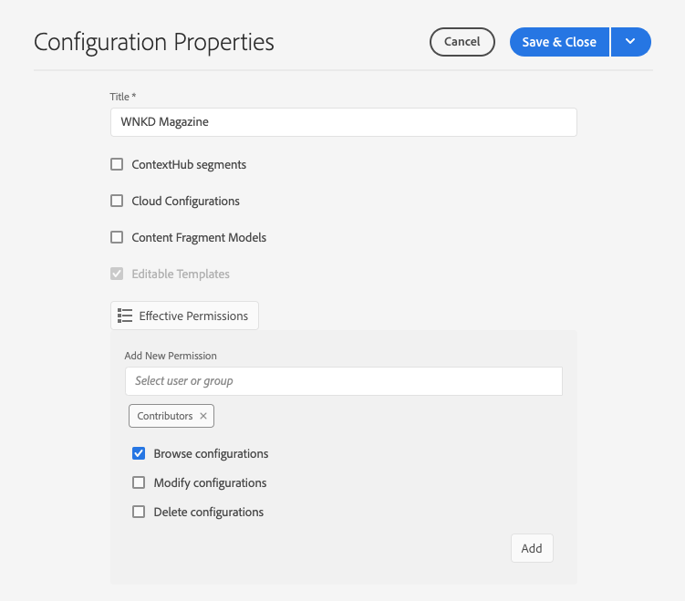

# 配置和配置浏览器{#configuration-browser}

AEM配置用于管理AEM中的设置并用作工作区。

## 什么是配置？{#what-is-a-configuration}

配置可以从两个不同的角度来考虑。

* [管理](#configurations-administrator) 员将配置用作AEM中的工作区，以定义和管理设置组。
* [开](#configurations-developer) 发人员使用底层配置机制，该机制实现配置以在AEM中保留和查找设置。

总结：从管理员的视图角度，配置是您创建工作区以管理AEM中的设置的方式，而开发人员应了解AEM如何使用和管理存储库中的这些配置。

无论从您的角度如何，配置在AEM中起着两个主要作用：

* 配置为特定用户组启用某些功能。
* 配置定义了这些功能的访问权限。

## 管理员配置{#configurations-administrator}

AEM管理员和作者可以将配置视为工作区。 这些工作区可用于通过实施这些功能的访问权限来收集设置组及其相关内容以用于组织目的。

可以为AEM中的许多不同功能创建配置。

* [云配置](/help/sites-administering/configurations.md)
* [Context Hub区段](/help/sites-administering/segmentation.md)
* [内容片段模型](/help/assets/content-fragments-models.md)
* [可编辑的模板](/help/sites-authoring/templates.md)

### 示例 {#administrator-example}

例如，管理员可以为可编辑模板创建两种配置。

* WKND-General
* WKND-Magazine

然后，管理员可以使用WKND-General配置创建一般页面模板，然后使用WKND-Magazine下的特定于杂志的模板。

然后，管理员可以将WKND-General与WKND站点的所有内容相关联。 但是，WKND-Magazine配置将仅与杂志站点相关。

通过执行以下操作：

* 当内容作者为杂志创建新页面时，作者可以从常规模板(WKND-General)或杂志模板(WKND-Magazine)中进行选择。
* 当内容作者为非杂志的站点的其他部分创建新页面时，作者只能从常规模板(WKND-General)中进行选择。

不仅可编辑模板可进行类似设置，云配置、ContextHub区段和内容片段模型也可进行类似设置。

### 使用配置浏览器{#using-configuration-browser}

配置浏览器允许管理员轻松创建、管理和配置AEM中配置的访问权限。

>[!NOTE]
>
>只有当用户具有`admin`权限时，才能使用配置浏览器创建配置。 `admin` 为了向配置分配访问权限或以其他方式修改配置，还需要权限。

#### 创建配置{#creating-a-configuration}

在AEM中使用配置浏览器创建新配置非常简单。

1. 以Cloud Service身份登录AEM，从主菜单中选择&#x200B;**工具** -> **常规** -> **配置浏览器**。
1. 点按或单击&#x200B;**创建**。
1. 为配置提供&#x200B;**标题**&#x200B;和&#x200B;**名称**。

   

   * **标题**&#x200B;应为描述性。
   * **名称**&#x200B;将成为存储库中的节点名称。
      * 它将根据标题自动生成，并根据[AEM命名约定进行调整。](/help/sites-developing/naming-conventions.md)
      * 如有必要，可进行调整。
1. 检查您希望允许的配置类型。
   * [云配置](/help/sites-administering/configurations.md)
   * [Context Hub区段](/help/sites-administering/segmentation.md)
   * [内容片段模型](/help/assets/content-fragments-models.md)
   * [可编辑的模板](/help/sites-authoring/templates.md)
1. 点按或单击&#x200B;**创建**。

>[!TIP]
>
>配置可以嵌套。

#### 编辑配置及其访问权限{#access-rights}

如果您将配置视为工作区，则可以对这些配置设置访问权限，以便强制哪些人员可能访问这些工作区，也可能不访问这些工作区。

1. 以Cloud Service身份登录AEM，从主菜单中选择&#x200B;**工具** -> **常规** -> **配置浏览器**。
1. 选择要修改的配置，然后点按或单击工具栏中的&#x200B;**属性**。
1. 选择要添加到配置的任何其他功能
   >[!NOTE]
   >
   >在创建配置后，无法取消选择某个特征。
1. 使用&#x200B;**有效权限**按钮视图角色矩阵及其当前授予配置的权限。
   
1. 要分配新权限，请在&#x200B;**添加新权限**&#x200B;部分的&#x200B;**选择用户或用户组**&#x200B;字段中输入用户或用户组名称。
   * **选择用户或组**&#x200B;字段会根据现有用户和角色自动完成优惠。
1. 从自动完成结果中选择适当的用户或角色。
   * 您可以选择多个用户或角色。
1. 检查选定用户或角色应具有的访问选项，然后单击&#x200B;**添加**。
   
1. 重复这些步骤以选择用户或角色，并根据需要分配其他访问权限。
1. 完成后，点按或单击&#x200B;**保存并关闭**。

## 开发者配置{#configurations-developer}

作为开发人员，了解AEM作为Cloud Service如何处理配置以及它如何处理配置解析非常重要。

### 配置和内容的分离{#separation-of-config-and-content}

尽管[管理员和用户可能将配置视为工作场所](#configurations-administrator)来管理不同的设置和内容，但必须了解配置和内容是由AEM在存储库中单独存储和管理的。

* `/content` 是所有内容的归所。
* `/conf` 是所有配置的主页。

内容通过`cq:conf`属性引用其关联配置。 AEM根据内容执行查找，其上下文属性为`cq:conf`以查找相应的配置。

### 示例 {#developer-example}

在本例中，假设您有一些对DAM设置感兴趣的应用程序代码。

```java
Conf conf = resource.adaptTo(Conf.class);
ValueMap imageServerSettings = conf.getItem("dam/imageserver");
String bgkcolor = imageServerSettings.get("bgkcolor", "FFFFFF");
```

所有配置查找的起始点是内容资源，通常位于`/content`下。 这可以是页面、页面内的组件、资产或DAM文件夹。 这是我们要寻找的实际内容，这些内容在此上下文中适用。

现在，在`Conf`对象的手中，我们可以检索我们感兴趣的特定配置项。 在这种情况下，它是`dam/imageserver`，它是与`imageserver`相关的设置的集合。 `getItem`调用返回`ValueMap`。 然后，我们读取`bgkcolor`字符串属性，并在属性（或整个配置项）不存在时提供默认值“FFFFFF”。

现在，我们来看一下相应的JCR内容：

```text
/content/dam/wknd
    + jcr:content
      - cq:conf = "/conf/wknd"
    + image.png [dam:Asset]

/conf/wkns
    + settings
      + dam
        + imageserver [cq:Page]
          + jcr:content
            - bgkcolor = "FF0000"
```

在此示例中，我们假定此处是WKND特定的DAM文件夹和相应的配置。 从该文件夹`/content/dam/wknd`开始，我们将看到一个名为`cq:conf`的字符串属性，它引用应用于子树的配置。 通常会在资产文件夹或页面的`jcr:content`中设置该属性。 这些`conf`链接是显式的，因此只需查看CRXDE中的内容即可轻松跟踪它们。

在`/conf`内跳转时，我们按照引用操作，看到有一个`/conf/wknd`节点。 这是配置。 请注意，其查找对应用程序代码完全透明。 示例代码从来没有对它的专用引用，它隐藏在`Conf`对象后面。 应用的配置完全通过JCR内容进行控制。

我们看到配置包含一个固定名称的`settings`节点，该节点包含实际项，包括我们的情况中需要的`dam/imageserver`。 此类项目可被视为“设置文档”，通常由`cq:Page`表示，其中包括保存实际内容的`jcr:content`。

最后，我们看到示例代码需要的属性`bgkcolor`。 我们从`getItem`返回的`ValueMap`基于页面的`jcr:content`节点。

### 配置解析{#configuration-resolution}

上面的基本示例显示了单个配置。 但是，在很多情况下，您希望具有不同的配置，如默认全局配置、每个品牌的不同配置以及子项目的特定配置。

要支持此功能，AEM中的配置查找按以下首选项顺序具有继承和回退机制：

1. `/conf/<siteconfig>/<parentconfig>/<myconfig>`
   * `/content`中`cq:conf`某处引用的特定配置
   * 层次结构是任意的，可以像站点结构一样进行设计，了解这一点并不是应用程序代码的业务
   * 在运行时由具有配置权限的用户更改
1. `/conf/<siteconfig>/<parentconfig>`
   * 遍历备用配置的父项
   * 在运行时由具有配置权限的用户更改
1. `/conf/<siteconfig>`
   * 遍历备用配置的父项
   * 在运行时由具有配置权限的用户更改
1. `/conf/global`
   * 系统全局设置
   * 通常，安装的全局默认值
   * 由`admin`角色设置
   * 在运行时由具有配置权限的用户更改
1. `/apps`
   * 应用程序默认值
   * 通过应用程序部署修复
   * 运行时只读
1. `/libs`
   * AEM产品默认值
   * 仅可通过Adobe更改，不允许项目访问
   * 通过应用程序部署修复
   * 运行时只读

### 使用配置{#using-configurations}

AEM中的配置基于Sling上下文感知配置。 Sling捆绑包提供可用于获取上下文感知配置的服务API。 上下文感知配置是与内容资源或资源树相关的配置，如上例中所述。[](#developer-example)

有关上下文感知配置、示例以及如何使用这些配置的更多详细信息，请[参阅Sling文档。](https://sling.apache.org/documentation/bundles/context-aware-configuration/context-aware-configuration.html)

### ConfMgr Web控制台{#confmgr-web-console}

为了进行调试和测试，在`https://<host>:<port>/system/console/conf`有一个&#x200B;**ConfMgr** Web控制台，它可显示给定路径／项的配置。


只需提供：

* **内容路径**
* **项目**
* **用户**

单击&#x200B;**解析**&#x200B;查看已解析的配置并接收将解析这些配置的示例代码。

### 上下文感知配置Web控制台{#context-aware-web-console}

出于调试和测试目的，在`https://<host>:<port>/system/console/slingcaconfig`有一个&#x200B;**上下文感知配置** Web控制台，它允许查询存储库中的上下文感知配置并查看其属性。


只需提供：

* **内容路径**
* **配置名称**

单击&#x200B;**解析**&#x200B;以检索选定配置的关联上下文路径和属性。
