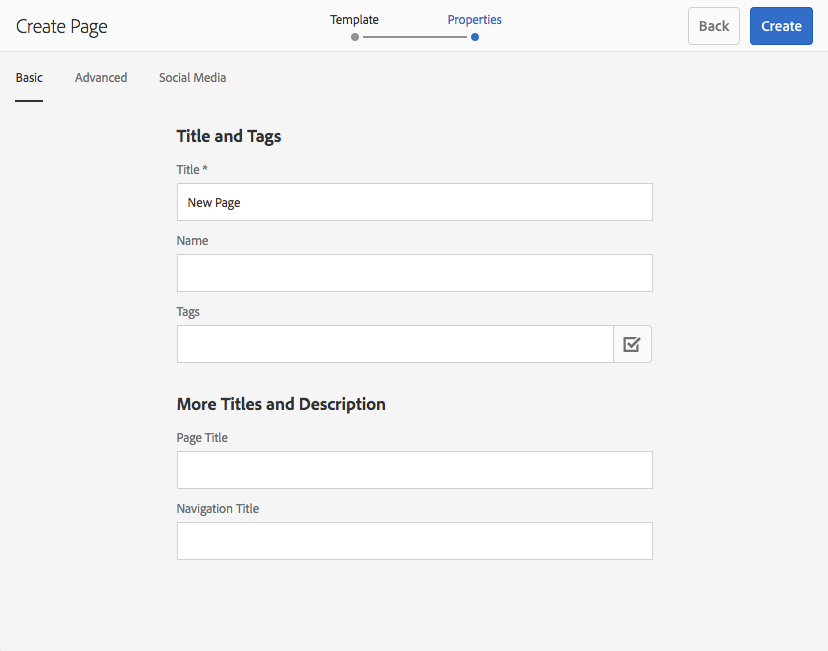

# 将cURL与AEM{#using-curl-with-aem}一起使用

管理员通常需要自动操作或简化任何系统中的常见任务。 例如，在AEM中，管理用户、安装包和管理OSGi捆绑包是通常必须完成的任务。

由于构建AEM的Sling框架具有RESTful性质，大多数任务都可通过URL调用完成。 cURL可用于执行此类URL调用，并且对于AEM管理员来说可以是一个有用的工具。

## 什么是cURL {#what-is-curl}

cURL是用于执行URL操作的开放源代码命令行工具。 它支持各种因特网协议，包括HTTP、HTTPS、FTP、FTPS、SCP、SFTP、TFTP、LDAP、DIP、DICT、TELNET、文件、IMAP、POP3、SMTP和RTSP。

cURL是使用URL语法获取或发送数据的成熟且广泛使用的工具，最初于1997年发布。 名称cURL最初是指“请参阅URL”。

由于构建AEM的Sling框架具有RESTful性质，因此大多数任务可以简化为URL调用，该调用可以用cURL执行。 [内容处](/help/sites-administering/curl.md#common-content-manipulation-aem-curl-commands) 理任务(如激活页面、启动工作流)以及 [操作](/help/sites-administering/curl.md#common-operational-aem-curl-commands) 任务（如包管理和管理用户）可以使用cURL实现自动化。此外，您还可以为AEM中的大多数任务创建您自己的cURL[命令。](/help/sites-administering/curl.md#building-a-curl-ready-aem-command)

>[!NOTE]
>
>通过cURL执行的任何AEM命令都必须像AEM的任何用户一样获得授权。 使用cURL执行AEM命令时，会尊重所有ACL和访问权限。

## 下载cURL {#downloading-curl}

cURL是macOS和某些Linux版本的标准部分。 但是，它适用于大多数操作系统。 最新下载内容位于[https://curl.haxx.se/download.html](https://curl.haxx.se/download.html)。

cURL的源存储库也可在GitHub上找到。

## 构建cURL就绪的AEM命令{#building-a-curl-ready-aem-command}

可以为AEM中的大多数操作(如触发工作流、检查OSGi配置、触发JMX命令、创建复制代理等)构建cURL命令。

要找到您特定操作所需的确切命令，您需要在浏览器中使用开发人员工具来捕获执行AEM命令时对服务器的POST调用。

以下步骤将以在Chrome浏览器中创建新页面为例说明如何执行此操作。

1. 准备要在AEM中调用的操作。 在这种情况下，我们已进入&#x200B;**创建页面**&#x200B;向导的末尾，但尚未单击&#x200B;**创建**。

   

1. 开始开发人员工具并选择&#x200B;**Network**&#x200B;选项卡。 在清除控制台之前，单击&#x200B;**保留日志**&#x200B;选项。

   

1. 单击&#x200B;**创建页面**&#x200B;向导中的&#x200B;**创建**&#x200B;以实际创建工作流。
1. 右键单击生成的POST操作，然后选择&#x200B;**复制** -> **复制为cURL**。

   

1. 将cURL命令复制到文本编辑器，并从命令中删除所有标头，该命令与`-H`开始（在下图中以蓝色突出显示），并添加正确的身份验证参数，如`-u <user>:<password>`。

   

1. 通过命令行执行cURL命令并视图响应。

   

## 常见操作AEM cURL命令{#common-operational-aem-curl-commands}

下面是AEM cURL命令的列表，用于常见的管理和操作任务。

>[!NOTE]
>
>以下示例假定AEM在端口`4502`上的`localhost`上运行，并将用户`admin`与密码`admin`一起使用。 其他命令占位符设置在尖括号中。

### 包管理{#package-management}

#### 列表所有已安装的包

```shell
curl -u <user>:<password> http://<host>:<port>/crx/packmgr/service.jsp?cmd=ls
```

#### 创建{#create-a-package}包

```shell
curl -u <user>:<password> -X POST http://localhost:4502/crx/packmgr/service/.json/etc/packages/mycontent.zip?cmd=create -d packageName=<name> -d groupName=<name>
```

#### 预览程序包{#preview-a-package}

```shell
curl -u <user>:<password> -X POST http://localhost:4502/crx/packmgr/service/.json/etc/packages/mycontent.zip?cmd=preview
```

#### 列表包内容{#list-package-content}

```shell
curl -u <user>:<password> -X POST http://localhost:4502/crx/packmgr/service/console.html/etc/packages/mycontent.zip?cmd=contents
```

#### 构建包{#build-a-package}

```shell
curl -X POST http://localhost:4502/crx/packmgr/service/.json/etc/packages/mycontent.zip?cmd=build
```

#### 重新打包{#rewrap-a-package}

```shell
curl -u <user>:<password> -X POST http://localhost:4502/crx/packmgr/service/.json/etc/packages/mycontent.zip?cmd=rewrap
```

#### 重命名包{#rename-a-package}

```shell
curl -u <user>:<password> -X POST -Fname=<New Name> http://localhost:4502/etc/packages/<Group Name>/<Package Name>.zip/jcr:content/vlt:definition
```

#### 上传包{#upload-a-package}

```shell
curl -u <user>:<password> -F cmd=upload -F force=true -F package=@test.zip http://localhost:4502/crx/packmgr/service/.json
```

#### 安装程序包{#install-a-package}

```shell
curl -u <user>:<password> -F cmd=install http://localhost:4502/crx/packmgr/service/.json/etc/packages/my_packages/test.zip
```

#### 卸载包{#uninstall-a-package}

```shell
curl -u <user>:<password> -F cmd=uninstall http://localhost:4502/crx/packmgr/service/.json/etc/packages/my_packages/test.zip
```

#### 删除包{#delete-a-package}

```shell
curl -u <user>:<password> -F cmd=delete http://localhost:4502/crx/packmgr/service/.json/etc/packages/my_packages/test.zip
```

#### 下载包{#download-a-package}

```shell
curl -u <user>:<password> http://localhost:4502/etc/packages/my_packages/test.zip
```

### 用户管理 {#user-management}

#### 创建新用户{#create-a-new-user}

```shell
curl -u <user>:<password> -FcreateUser= -FauthorizableId=hashim -Frep:password=hashim http://localhost:4502/libs/granite/security/post/authorizables
```

#### 创建新组{#create-a-new-group}

```shell
curl -u <user>:<password> -FcreateGroup=group1 -FauthorizableId=testGroup1 http://localhost:4502/libs/granite/security/post/authorizables
```

#### 向现有用户{#add-a-property-to-an-existing-user}添加属性

```shell
curl -u <user>:<password> -Fprofile/age=25 http://localhost:4502/home/users/h/hashim.rw.html
```

#### 创建用户档案{#create-a-user-with-a-profile}的用户

```shell
curl -u <user>:<password> -FcreateUser=testuser -FauthorizableId=hashimkhan -Frep:password=hashimkhan -Fprofile/gender=male http://localhost:4502/libs/granite/security/post/authorizables
```

#### 创建新用户作为组{#create-a-new-user-as-a-member-of-a-group}的成员

```shell
curl -u <user>:<password> -FcreateUser=testuser -FauthorizableId=testuser -Frep:password=abc123 -Fmembership=contributor http://localhost:4502/libs/granite/security/post/authorizables
```

#### 将用户添加到组{#add-a-user-to-a-group}

```shell
curl -u <user>:<password> -FaddMembers=testuser1 http://localhost:4502/home/groups/t/testGroup.rw.html
```

#### 从组{#remove-a-user-from-a-group}中删除用户

```shell
curl -u <user>:<password> -FremoveMembers=testuser1 http://localhost:4502/home/groups/t/testGroup.rw.html
```

#### 设置用户组成员关系{#set-a-user-s-group-membership}

```shell
curl -u <user>:<password> -Fmembership=contributor -Fmembership=testgroup http://localhost:4502/home/users/t/testuser.rw.html
```

#### 删除用户{#delete-a-user}

```shell
curl -u <user>:<password> -FdeleteAuthorizable= http://localhost:4502/home/users/t/testuser
```

#### 删除组{#delete-a-group}

```shell
curl -u <user>:<password> -FdeleteAuthorizable= http://localhost:4502/home/groups/t/testGroup
```

### 备份 {#backup}

有关详细信息，请参阅[备份和还原](/help/sites-administering/backup-and-restore.md#automating-aem-online-backup)。

### OSGi {#osgi}

#### 启动捆绑{#starting-a-bundle}

```shell
curl -u <user>:<password> -Faction=start http://localhost:4502/system/console/bundles/<bundle-name>
```

#### 停止捆绑{#stopping-a-bundle}

```shell
curl -u <user>:<password> -Faction=stop http://localhost:4502/system/console/bundles/<bundle-name>
```

### Dispatcher {#dispatcher}

#### 使缓存{#invalidate-the-cache}失效

```shell
curl -H "CQ-Action: Activate" -H "CQ-Handle: /content/test-site/" -H "CQ-Path: /content/test-site/" -H "Content-Length: 0" -H "Content-Type: application/octet-stream" http://localhost:4502/dispatcher/invalidate.cache
```

#### 驱逐缓存{#evict-the-cache}

```shell
curl -H "CQ-Action: Deactivate" -H "CQ-Handle: /content/test-site/" -H "CQ-Path: /content/test-site/" -H "Content-Length: 0" -H "Content-Type: application/octet-stream" http://localhost:4502/dispatcher/invalidate.cache
```

### 复制代理 {#replication-agent}

#### 检查代理{#check-the-status-of-an-agent}的状态

```shell
curl -u <user>:<password> "http://localhost:4502/etc/replication/agents.author/publish/jcr:conten t.queue.json?agent=publish"
http://localhost:4502/etc/replication/agents.author/publish/jcr:content.queue.js on?agent=publish
```

#### 删除代理{#delete-an-agent}

```shell
curl -X DELETE http://localhost:4502/etc/replication/agents.author/replication99 -u <user>:<password>
```

#### 创建代理{#create-an-agent}

```shell
curl -u <user>:<password> -F "jcr:primaryType=cq:Page" -F "jcr:content/jcr:title=new-replication" -F "jcr:content/sling:resourceType=/libs/cq/replication/components/agent" -F "jcr:content/template=/libs/cq/replication/templates/agent" -F "jcr:content/transportUri=http://localhost:4503/bin/receive?sling:authRequestLogin=1" -F "jcr:content/transportUser=admin" -F "jcr:content/transportPassword={DES}8aadb625ced91ac483390ebc10640cdf"http://localhost:4502/etc/replication/agents.author/replication99
```

#### 暂停代理{#pause-an-agent}

```shell
curl -u <user>:<password> -F "cmd=pause" -F "name=publish"  http://localhost:4502/etc/replication/agents.author/publish/jcr:content.queue.js on
```

#### 清除代理队列{#clear-an-agent-queue}

```shell
curl -u <user>:<password> -F "cmd=clear" -F "name=publish"  http://localhost:4502/etc/replication/agents.author/publish/jcr:content.queue.js on
```

### 社区 {#communities}

#### 分配和撤销标记{#assign-and-revoke-badges}

有关详细信息，请参阅[社区评分和标记](/help/communities/implementing-scoring.md#assign-and-revoke-badges)。

有关详细信息，请参阅[Scorning and Badges Essentials](/help/communities/configure-scoring.md#example-setup)。

#### MSRP重新索引{#msrp-reindexing}

有关详细信息，请参见[MSRP - MongoDB存储资源提供程序](/help/communities/msrp.md#running-msrp-reindex-tool-using-curl-command)。

### 安全 {#security}

#### 启用和禁用CRX DE Lite {#enabling-and-disabling-crx-de-lite}

有关详细信息，请参阅[在AEM](/help/sites-administering/enabling-crxde-lite.md)中启用CRXDE Lite。

### 数据存储垃圾收集 {#data-store-garbage-collection}

有关详细信息，请参阅[数据存储垃圾收集](/help/sites-administering/data-store-garbage-collection.md#automating-data-store-garbage-collection)。

### 分析和目标集成{#analytics-and-target-integration}

有关详细信息，请参阅[选择加入Adobe Analytics和Adobe Target](/help/sites-administering/opt-in.md#configuring-the-setup-and-provisioning-via-script)。

### 单一登录{#single-sign-on}

#### 发送测试标头{#send-test-header}

有关详细信息，请参阅[单点登录](/help/sites-deploying/single-sign-on.md)。

## 常见内容处理AEM cURL命令{#common-content-manipulation-aem-curl-commands}

以下是用于内容处理的AEM cURL命令的列表。

>[!NOTE]
>
>以下示例假定AEM在端口`4502`上的`localhost`上运行，并将用户`admin`与密码`admin`一起使用。 其他命令占位符设置在尖括号中。

### 页面管理{#page-management}

#### 页面激活{#page-activation}

```shell
curl -u <user>:<password> -X POST -F path="/content/path/to/page" -F cmd="activate" http://localhost:4502/bin/replicate.json
```

#### 页面取消激活{#page-deactivation}

```shell
curl -u <user>:<password> -X POST -F path="/content/path/to/page" -F cmd="deactivate" http://localhost:4502/bin/replicate.json
```

#### 树激活{#tree-activation}

```shell
curl -u <user>:<password> -F cmd=activate -F ignoredeactivated=true -F onlymodified=true -F path=/content/geometrixx http://localhost:4502/etc/replication/treeactivation.html
```

#### 锁定页面 {#lock-page}

```shell
curl -u <user>:<password> -X POST -F cmd="lockPage" -F path="/content/path/to/page" -F "_charset_"="utf-8" http://localhost:4502/bin/wcmcommand
```

#### 解锁页面 {#unlock-page}

```shell
curl -u <user>:<password> -X POST -F cmd="unlockPage" -F path="/content/path/to/page" -F "_charset_"="utf-8" http://localhost:4502/bin/wcmcommand
```

#### 复制页面 {#copy-page}

```shell
curl -u <user>:<password> -F cmd=copyPage -F destParentPath=/path/to/destination/parent -F srcPath=/path/to/source/location http://localhost:4502/bin/wcmcommand
```

### 工作流 {#workflows}

有关详细信息，请参阅[以编程方式与工作流交互](/help/sites-developing/workflows-program-interaction.md)。

### Sling内容{#sling-content}

#### 创建文件夹{#create-a-folder}

```shell
curl -u <user>:<password> -F jcr:primaryType=sling:Folder http://localhost:4502/etc/test
```

#### 删除节点{#delete-a-node}

```shell
curl -u <user>:<password> -F :operation=delete http://localhost:4502/etc/test/test.properties
```

#### 移动节点{#move-a-node}

```shell
curl -u <user>:<password> -F":operation=move" -F":applyTo=/sourceurl"  -F":dest=/target/parenturl/" https://localhost:4502/content
```

#### 复制节点{#copy-a-node}

```shell
curl -u <user>:<password> -F":operation=copy" -F":applyTo=/sourceurl"  -F":dest=/target/parenturl/" https://localhost:4502/content
```

#### 使用Sling PostServlet {#upload-files-using-sling-postservlet}上传文件

```shell
curl -u <user>:<password> -F"*=@test.properties"  http://localhost:4502/etc/test
```

#### 使用Sling PostServlet上传文件并指定节点名称{#upload-files-using-sling-postservlet-and-specifying-node-name}

```shell
curl -u <user>:<password> -F"test2.properties=@test.properties"  http://localhost:4502/etc/test
```

#### 上传指定内容类型{#upload-files-specifying-a-content-type}的文件

```shell
curl -u <user>:<password> -F "*=@test.properties;type=text/plain" http://localhost:4502/etc/test
```

### 资源操作{#asset-manipulation}

有关详细信息，请参阅[资产HTTP API](/help/assets/mac-api-assets.md)。
