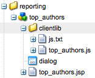

# 功能板{#dashboards}

>[!CAUTION]
>
>AEM 6.4已结束扩展支持，本文档将不再更新。 有关更多详细信息，请参阅 [技术支助期](https://helpx.adobe.com/cn/support/programs/eol-matrix.html). 查找支持的版本 [此处](https://experienceleague.adobe.com/docs/).

使用AEM时，您可以管理大量不同类型的内容（例如页面、资产）。 AEM功能板提供了一种简单易用且可自定义的方式来定义显示统一数据的页面。

>[!NOTE]
>
>AEM功能板是按用户创建的，因此用户只能访问其自己的功能板。
>
>
>但是， [功能板模板](#creating-a-dashboard-template) 可用于共享常用配置和功能板布局。


## 管理功能板 {#administering-dashboards}

### 创建功能板 {#creating-a-dashboard}

要创建新功能板，请按如下步骤继续操作：

1. 在 **工具** ，单击 **配置控制台**.

1. 在树中，双击 **功能板**.

1. 单击 **新功能板**.

1. 键入 **标题** （例如，我的功能板）和 **名称**.

1. 单击&#x200B;**创建**。

### 克隆功能板 {#cloning-a-dashboard}

您可能希望拥有多个功能板，以便从不同视图快速查看有关您的内容的信息。 为了帮助您创建新功能板，AEM提供了可用于复制现有功能板的克隆功能。 要克隆功能板，请按如下步骤继续操作：

1. 在 **工具** ，单击 **配置控制台**.

1. 在树中，单击 **功能板**.
1. 单击要克隆的功能板。

1. 单击 **克隆**.

1. 键入 **名称** 新功能板中。

### 删除功能板 {#removing-a-dashboard}

1. 在 **工具** ，单击 **配置控制台**.

1. 在树中，单击 **功能板**.
1. 单击要删除的功能板。

1. 单击&#x200B;**删除**。

1. 单击&#x200B;**是**&#x200B;以确认。

## 功能板组件 {#dashboard-components}

### 概述 {#overview}

功能板组件只是常规组件 [AEM组件](/help/sites-developing/developing-components-samples.md). 本节介绍AEM附带的报表组件。

### Web分析报表组件 {#web-analytics-reporting-components}

AEM随附一组组件，这些组件可渲染您的 [SiteCatalyst](/help/sites-administering/adobeanalytics.md) 数据。 这些组件列在Sidekick中，位于 **功能板** 中。

每个报表组件至少提供三个选项卡：

* **基本**:包含主配置。

* **报表：** 包含每个报表的特定配置。
* **样式**:包含样式配置，如图表大小和边距。

报表组件已使用默认配置进行初始化，这有助于您快速设置功能板。

#### 基本配置 {#basic-configuration}

的 **基本** 选项卡提供对以下配置条目的访问：

**标题** 功能板上显示的标题。

**请求类型** 请求数据的方式。

**SiteCatalyst配置（可选）** 要用于连接到SiteCatalyst的配置。 如果未提供，则假定配置是在功能板页面上配置（通过页面属性）。

**报表包ID（可选）** 要用于生成图形的SiteCatalyst报表包。

#### 报表配置 {#report-configuration}

要显示Web统计信息，您需要定义要获取的数据的日期范围。 的 **报表** 选项卡提供了两个用于定义该范围的字段。

>[!NOTE]
>
>设置较大的日期范围可能会降低功能板的响应速度。

**日期自** 从中获取数据的绝对或相对日期。

**日期至** 获取数据的绝对或相对日期。

每个组件还定义特定设置。

#### 超时报表 {#overtime-report}


**日期粒度** X轴的时间单位（例如，日、小时）。

**量度** 要显示的事件列表。

**元素** 划分图表中量度数据的元素列表。

#### 排名列表报表 {#ranked-list-report}


**元素** 用于划分图表中量度数据的元素。

**量度** 要显示的事件。

**否. 排名最前的项目** 报表显示的项目数。

#### 排名报表 {#ranked-report}


**量度** 要显示的事件。

**元素** 用于划分图表中量度数据的元素。

#### 顶级网站区域报表 {#top-site-section-report}

此组件会根据以下配置显示一个图表，其中显示了网站中访问次数较多的部分。


**否. 排名最前的项目** 报表中显示的区域数。

#### 趋势报表 {#trended-report}


**日期粒度** X轴的时间单位（例如，日、小时）。

**量度** 要显示的事件。

**元素** 用于划分图表中量度数据的元素。

## 扩展功能板 {#extending-dashboard}

### 概述 {#overview-1}

功能板是普通页面( `cq:Page`)，则任何组件都可用于组合功能板。

有一个默认的组件组 `Dashboard` 包含默认在模板中启用的analytics报表组件。

### 创建功能板模板 {#creating-a-dashboard-template}

模板可定义新功能板的默认内容。 您可以使用多个模板来创建不同类型的功能板。

功能板模板的创建方式与其他页面模板类似，只是它们存储在 `/libs/cq/dashboards/templates/`. 请参阅 [创建内容页面模板](/help/sites-developing/website.md#creating-the-contentpage-template) 中。

>[!NOTE]
>
>功能板模板在用户之间共享。

### 开发功能板组件 {#developing-a-dashboard-component}

开发功能板组件包括创建常规AEM组件。 本节介绍一个显示前10个参与者的组件示例。



顶级创作组件存储在位于的存储库中 `/apps/geometrixx-outdoors/components/reporting` 和由：

1. a `jsp` 用于读取jcr数据并定义 `html` 占位符。

1. 包含一个 `js` 对数据进行提取和排序，然后填充的文件 `html` 占位符。


以下Javascript文件在 `geout.reporting.topauthors` [客户端库](/help/sites-developing/clientlibs.md) 作为组件本身的子项。

的 [QueryBuilder](/help/sites-developing/querybuilder-api.md) 用于查询要读取的存储库 `cq:AuditEvent` 节点。 查询结果是一个JSON对象，可从中提取作者贡献。

#### top_authors.js {#top-authors-js}

```
$.ajax({
  url: "/bin/querybuilder.json",
  cache: false,
  data: {
       "orderby": "cq:time",
       "orderby.sort": "desc",
       "p.hits": "full",
       "p.limit": 100,
       "path": "/var/audit/com.day.cq.wcm.core.page/",
       "type": "cq:AuditEvent"
   },
  dataType: "json"     
}).done(function( res ) {
    var authors = {};
    // from JSON to Object
    for(var r in res.hits) {
        var userId = res.hits[r].userId;
        if(userId == undefined) {
            continue;
        }
        var auth = authors[userId] || {userId : userId};
        auth.contrib = (auth.contrib || 0) +1;
        
        authors[userId] = auth;
    }
    
    // order by contribution
    var orderedByContrib = [];
    for(var a in authors) {
        orderedByContrib.push(authors[a]);
    }
    orderedByContrib.sort(function(a,b){return b.contrib - a.contrib});
    
    // produce the list
    for (var i=0, tot=orderedByContrib.length; i < tot; i++) {
        var current = orderedByContrib[i];
        $("<div> #" + (i + 1) +" "+ current.userId + " (" + current.contrib +" contrib.)</div>").appendTo("#authors-list");

    }
});  
```

的 `JSP` 包括 `global.jsp` 和 `clientlib`.

#### top_authors.jsp {#top-authors-jsp}

```java
<%@page session="false" contentType="text/html; charset=utf-8" %><%
%><%
%><%@include file="/libs/foundation/global.jsp" %><%
%>
<ui:includeClientLib categories="geout.reporting.topauthors" />
<%
String reportletTitle = properties.get("title", "Top Authors");
%>
<html>
     <h3><%=xssAPI.encodeForHTML(reportletTitle) %></h3>
     <div id="authors-list"></div>
</html>
```
