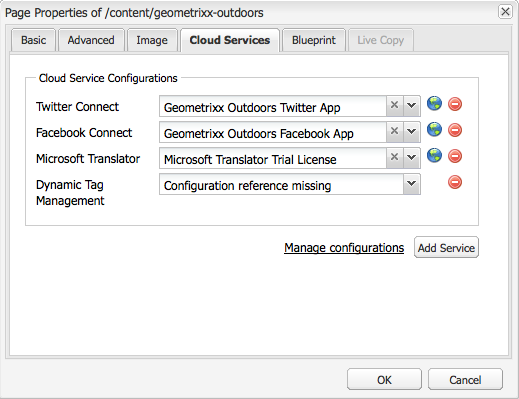

# 与AdobeDynamic Tag Management集成 {#integrating-with-adobe-dynamic-tag-management}

>[!CAUTION]
>
>AEM 6.4已结束扩展支持，本文档将不再更新。 有关更多详细信息，请参阅 [技术支助期](https://helpx.adobe.com/cn/support/programs/eol-matrix.html). 查找支持的版本 [此处](https://experienceleague.adobe.com/docs/).

集成 [Adobe动态Tag Management](https://www.adobe.com/solutions/digital-marketing/dynamic-tag-management.html) 使用AEM，以便您能够使用动态Tag Management Web属性来跟踪AEM网站。 动态Tag Management使营销人员能够管理用于收集数据的标记，并跨数字营销系统分发数据。 例如，使用动态Tag Management收集AEM网站的使用情况数据，并在Adobe Analytics或Adobe Target中分发数据以进行分析。

在集成之前，您需要创建动态Tag Management [Web属性](https://microsite.omniture.com/t2/help/en_US/dtm/#Web_Properties) 跟踪AEM网站的域。 的 [托管选项](https://microsite.omniture.com/t2/help/en_US/dtm/#Hosting__Embed_Tab) 必须配置web属性的，才能配置AEM以访问动态Tag Management库。

配置集成后，对Dynamic Tag Management部署工具和规则所做的更改不会要求您在AEM中更改Dynamic Tag Management配置。 更改将自动可供AEM使用。

>[!NOTE]
>
>如果您使用的是具有自定义代理配置的DTM，则需要配置两个HTTP客户端代理配置，因为AEM的某些功能使用3.x API，而其他一些功能使用4.x API:
>
>* 3.x 通过 [http://localhost:4502/system/console/configMgr/com.day.commons.httpclient](http://localhost:4502/system/console/configMgr/com.day.commons.httpclient) 进行配置
>* 4.x 通过 [http://localhost:4502/system/console/configMgr/org.apache.http.proxyconfigurator](http://localhost:4502/system/console/configMgr/org.apache.http.proxyconfigurator) 进行配置
>

## 部署选项 {#deployment-options}

以下部署选项会影响与动态Tag Management集成的配置。

### 动态Tag Management托管 {#dynamic-tag-management-hosting}

AEM支持在云中托管或在AEM上托管的动态Tag Management。

* 云托管：动态Tag Management Javascript库存储在云中，而AEM页面会直接引用它们。
* AEM托管：动态Tag Management会生成javascript库。 AEM使用工作流模型获取并安装库。

您的实施所使用的托管类型决定了您执行的某些配置和实施任务。 有关托管选项的信息，请参阅 [托管 — “嵌入”选项卡](https://microsite.omniture.com/t2/help/en_US/dtm/#Hosting__Embed_Tab) 在动态Tag Management帮助中。

### 暂存和生产库 {#staging-and-production-library}

确定AEM创作实例是使用动态Tag Management暂存代码还是生产代码。

通常，创作实例使用动态Tag Management暂存库，生产实例使用生产库。 此方案允许您使用创作实例来测试未批准的动态Tag Management配置。

如果需要，您的创作实例可以使用生产库。 提供了Web浏览器插件，在云托管库时，这些插件允许您在使用暂存库进行测试时进行切换。

### 使用动态Tag Management部署挂接 {#using-the-dynamic-tag-management-deployment-hook}

当AEM托管Dynamic Tag Management库时，您可以使用Dynamic Tag Management部署挂接服务自动将库更新推送到AEM。 当对库进行更改(例如，编辑动态Tag Management Web属性时)时，会推送库更新。

要使用部署挂接，动态Tag Management必须能够连接到承载库的AEM实例。 您必须 [启用对AEM的访问权限](/help/sites-administering/dtm.md#enabling-access-for-the-deployment-hook-service) (对于动态Tag Management服务器)。

在某些情况下，AEM可能不可访问，例如当AEM位于防火墙后面时。 在这些情况下，您可以使用AEM轮询导入器选项定期检索库。 cron作业表达式指示库下载的计划。

## 启用对部署挂接服务的访问 {#enabling-access-for-the-deployment-hook-service}

启用Dynamic Tag Management部署挂接服务以访问AEM，以便该服务可以更新由AEM托管的库。 根据需要指定更新暂存和生产库的Dynamic Tag Management服务器的IP地址：

* 暂存: `107.21.99.31`
* 生产： `23.23.225.112` 和 `204.236.240.48`

使用 [Web控制台](/help/sites-deploying/configuring-osgi.md#osgi-configuration-with-the-web-console) 或 [`sling:OsgiConfig`](/help/sites-deploying/configuring-osgi.md#osgi-configuration-in-the-repository) 节点：

* 在Web控制台中，使用“配置”页面上的AdobeDTM部署挂接配置项。
* 对于OSGi配置，服务PID为 `com.adobe.cq.dtm.impl.servlets.DTMDeployHookServlet`.

下表介绍了要配置的属性。

| Web控制台属性 | OSGi属性 | 描述 |
|---|---|---|
| 暂存DTM IP白名单 | `dtm.staging.ip.whitelist` | 用于更新暂存库的动态Tag Management服务器的IP地址。 |
| 生产DTM IP白名单 | `dtm.production.ip.whitelist` | 用于更新生产库的动态Tag Management服务器的IP地址。 |

## 创建动态Tag Management配置 {#creating-the-dynamic-tag-management-configuration}

创建云配置，以便AEM实例可以使用动态Tag Management进行身份验证并与您的Web资产进行交互。

>[!NOTE]
>
>当您的DTM Web属性包含Adobe Analytics工具并且还在使用 [内容分析](/help/sites-authoring/content-insights.md). 在 [Adobe Analytics云配置](/help/sites-administering/adobeanalytics-connect.md#configuring-the-connection-to-adobe-analytics)，选择不包含跟踪代码选项。

### 常规设置 {#general-settings}

<table> 
 <tbody> 
  <tr> 
   <th>属性</th> 
   <th>描述</th> 
  </tr> 
  <tr> 
   <td>API令牌</td> 
   <td>您的Dynamic Tag Management用户帐户的API令牌属性值。 AEM使用此属性通过动态Tag Management进行身份验证。</td> 
  </tr> 
  <tr> 
   <td>公司</td> 
   <td>与您的登录ID关联的公司。</td> 
  </tr> 
  <tr> 
   <td>属性</td> 
   <td>您为管理AEM网站的标记而创建的Web属性的名称。</td> 
  </tr> 
  <tr> 
   <td>包含有关作者的生产代码</td> 
   <td>
选择此选项可使AEM创作和发布实例使用动态Tag Management库的生产版本。 
 
未选择此选项时，暂存设置将应用于创作实例，生产设置将应用于发布实例。
 </td> 
  </tr> 
 </tbody> 
</table>

### 自托管资产 — 暂存和生产 {#self-hosting-properties-staging-and-production}

动态Tag Management配置的以下属性使AEM能够托管动态Tag Management库。 通过这些属性，AEM可以下载和安装库。 或者，您可以自动更新库，以确保库反映在动态Tag Management管理应用程序中所做的任何更改。

某些资产会使用您从“嵌入”选项卡的“库下载”部分中为Dynamic Tag Management Web资产获取的值。 有关信息，请参阅 [库下载](https://microsite.omniture.com/t2/help/en_US/dtm/#Library_Download) 在动态Tag Management帮助中。

>[!NOTE]
>
>在AEM上托管动态Tag Management包时，必须先在动态Tag Management中启用“库下载”，然后才能创建配置。 此外，必须启用Akamai，因为Akamai提供了供下载的库。

在AEM上托管动态Tag Management库时，AEM会根据您的配置自动配置Web属性的某些属性。 请参阅下表中的描述。

<table> 
 <tbody> 
  <tr> 
   <th>属性</th> 
   <th>描述</th> 
  </tr> 
  <tr> 
   <td>使用自托管</td> 
   <td>选择在AEM上托管动态Tag Management库文件的时间。 选择此选项将导致此表中显示其他属性。</td> 
  </tr> 
  <tr> 
   <td>DTM 包 URL</td> 
   <td>用于下载动态Tag Management库的URL。 从Dynamic Tag Management的库下载页面的下载URL部分获取此值。 出于安全考虑，必须手动配置此值。</td> 
  </tr> 
  <tr> 
   <td>下载工作流</td> 
   <td>
用于下载和安装动态Tag Management库的工作流模型。 默认模型为“默认DTM包下载”。 除非已创建自定义模型，否则使用此模型。
 
请注意，默认的下载工作流会在下载库时自动激活它们。
 </td> 
  </tr> 
  <tr> 
   <td>域提示</td> 
   <td>
（可选）托管动态Tag Management库的AEM服务器的域。 指定一个值以覆盖为 <a href="/help/sites-developing/externalizer.md">Day CQ Link Externalizer服务</a>.
 
连接到Dynamic Tag Management后，AEM会使用此值为Dynamic Tag Management Web属性配置“库下载”属性的暂存HTTP路径或生产HTTP路径。
 </td> 
  </tr> 
  <tr> 
   <td>安全域提示</td> 
   <td>
（可选）通过HTTPS托管动态Tag Management库的AEM服务器的域。 指定一个值以覆盖为 <a href="/help/sites-developing/externalizer.md">Day CQ Link Externalizer服务</a>.
 
连接到Dynamic Tag Management后，AEM会使用此值为Dynamic Tag Management Web属性配置库下载属性的暂存HTTPS路径或生产HTTPS路径。
 </td> 
  </tr> 
  <tr> 
   <td>共享密钥</td> 
   <td>
（可选）用于解密下载的共享密钥。 从Dynamic Tag Management的库下载页面的共享密钥字段中获取此值。
 
<strong>注意：</strong> 您必须拥有 <a href="https://www.openssl.org/docs/apps/openssl.html">OpenSSL</a> 安装在安装了AEM的计算机上的库，以便AEM可以解密下载的库。
 </td> 
  </tr> 
  <tr> 
   <td>启用轮询导入程序</td> 
   <td>
（可选）选择以定期下载和安装动态Tag Management库，以确保您使用的是更新版本。 选中此选项后，动态Tag Management不会向部署挂接URL发送HTTPPOST请求。
 
AEM会自动为动态Tag Management web属性配置“库下载”属性的“部署挂接URL”属性。 选择后，将配置属性，但没有值。 如果未选择，则会使用您的动态Tag Management配置的URL配置属性。
 
当动态Tag Management部署挂接无法连接到AEM时(例如，当AEM位于防火墙后时)启用轮询导入器。
 </td> 
  </tr> 
  <tr> 
   <td>时间表表达式</td> 
   <td>（选中“启用轮询导入器”时，显示并且是必需的。） 可控制下载动态标签管理库的时间的CRON表达式。</td> 
  </tr> 
 </tbody> 
</table>

### 云托管属性 — 暂存和生产 {#cloud-hosting-properties-staging-and-production}

在云托管动态标签配置时，您可以为动态Tag Management配置配置配置配置以下属性。

<table> 
 <tbody> 
  <tr> 
   <th>属性</th> 
   <th>描述</th> 
  </tr> 
  <tr> 
   <td>使用自托管</td> 
   <td>在云中托管动态Tag Management库文件时，清除此选项。</td> 
  </tr> 
  <tr> 
   <td>页眉代码</td> 
   <td>
从Dynamic Tag Management中为您的主机获取的用于暂存的标头代码。 此值在您连接到Dynamic Tag Management时自动填充。
 
 要在动态Tag Management中查看代码，请单击嵌入选项卡，然后单击主机名。 展开页眉代码部分，然后根据需要单击暂存嵌入代码或生产嵌入代码区域的复制嵌入代码。
 </td> 
  </tr> 
  <tr> 
   <td>页脚代码</td> 
   <td>
用于暂存的页脚代码，该代码是从您的主机的Dynamic Tag Management中获取的。 此值在您连接到Dynamic Tag Management时自动填充。
 
要在动态Tag Management中查看代码，请单击嵌入选项卡，然后单击主机名。 展开页脚代码部分，然后根据需要单击暂存嵌入代码或生产嵌入代码区域的复制嵌入代码。
 </td> 
  </tr> 
 </tbody> 
</table>

以下过程使用触屏优化UI配置与动态Tag Management的集成。

1. 在边栏中，单击工具>操作>云>Cloud Services。
1. 在Dynamic Tag Management区域中，将显示用于添加配置的以下链接之一：

   * 如果这是您添加的第一个配置，请单击立即配置。
   * 如果已创建一个或多个配置，请单击显示配置，然后单击可用配置旁边的+链接。

   

1. 键入配置的标题，然后单击创建。
1. 在API令牌字段中，输入Dynamic Tag Management用户帐户的API令牌属性值。

   要获取API令牌的值，请联系DTM客户关怀团队。

   >[!NOTE]
   >
   >在动态Tag Management用户明确请求API令牌之前，该令牌不会过期。

   

1. 单击连接到DTM。 AEM通过动态Tag Management进行身份验证，并检索与您的帐户关联的公司列表。
1. 选择公司，然后选择用于跟踪AEM网站的资产。
1. 如果在创作实例中使用暂存代码，请取消选择“在创作时包含生产代码”。
1. 根据需要，在“暂存设置”选项卡和“生产设置”选项卡中提供属性值，然后单击“确定”。

## 手动下载动态Tag Management库 {#manually-downloading-the-dynamic-tag-management-library}

手动下载动态Tag Management库，以在AEM上立即更新它们。 例如，当要在轮询导入程序计划自动下载库之前测试更新的库时，请手动下载。

1. 在边栏中，单击工具>操作>云>Cloud Services。
1. 在Dynamic Tag Management区域中，单击显示配置，然后单击您的配置。
1. 在“暂存设置”区域或“生产设置”区域中，单击“触发器下载工作流”按钮以下载和部署库包。

   

>[!NOTE]
>
>下载的文件存储在 `/etc/clientlibs/dtm/my config/companyID/propertyID/servertype`.
>
>以下内容直接从 [DTM配置](#creating-the-dynamic-tag-management-configuration).
>
>* `myconfig`
>* `companyID`
>* `propertyID`
>* `servertype`
>

## 将动态Tag Management配置与您的网站关联 {#associating-a-dynamic-tag-management-configuration-with-your-site}

将您的动态Tag Management配置与网站的页面关联，以便AEM将所需的脚本添加到页面。 将站点的根页面与配置关联。 该页面的所有子项都将继承关联。 如果需要，您可以覆盖子页面上的关联。

请按照以下过程将页面和子体与动态Tag Management配置相关联。

1. 在经典UI中打开站点的根页面。
1. 使用Sidekick打开页面属性。
1. 在“Cloud Services”选项卡上，单击添加服务，选择动态Tag Management，然后单击确定。

   

1. 使用动态Tag Management下拉菜单选择您的配置，然后单击确定。

请按照以下过程覆盖页面的继承配置关联。 覆盖会影响页面和所有页面后代。

1. 在经典UI中打开页面。
1. 使用Sidekick打开页面属性。
1. 在“Cloud Services”选项卡上，单击“继承自”属性旁边的挂锁图标，然后在确认对话框中单击“是”。

   

1. 删除或选择其他动态Tag Management配置，然后单击确定。
