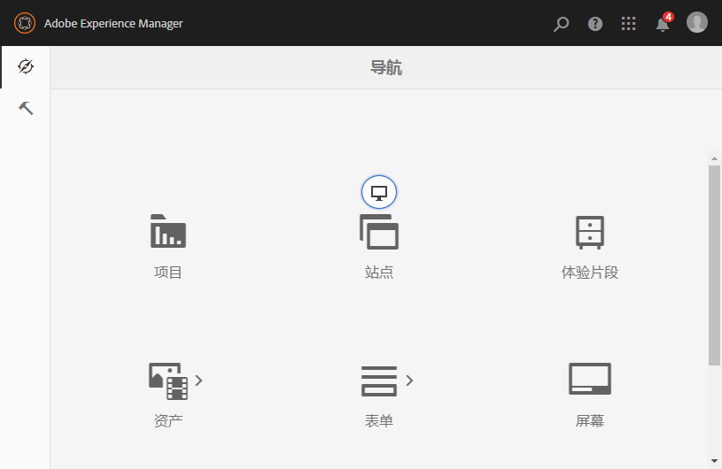

# Admin Console{#admin-consoles}

默认情况下，已禁用通过管理员控制台切换到经典UI的功能。 因此，将鼠标移过某些控制台图标时看到的弹出图标（允许访问经典UI）不再显示。

在中具有经典UI版本的每个控制台 `/libs/cq/core/content/nav` 都可以单独重新启用，这样 **将鼠标悬停在控制台图标上时，“经** 典UI”选项会再次弹出到该控制台图标上。

在此示例中，我们将重新为站点控制台启用经典UI。

1. 使用CRXDE Lite，找到要重新启用经典UI的管理控制台对应的节点。 它们位于：

   `/libs/cq/core/content/nav`

   例如

   [ `http://localhost:4502/crx/de/index.jsp#/libs/cq/core/content/nav`](http://localhost:4502/crx/de/index.jsp#/libs/cq/core/content/nav)

1. 选择要重新启用经典UI的控制台对应的节点。 对于我们的示例，我们将重新启用“站点”控制台的经典UI。

   `/libs/cq/core/content/nav/sites`

1. 使用“叠加节点” **选项创建叠** 加； 例如：

   * **路径**: `/apps/cq/core/content/nav/sites`
   * **覆盖位置**: `/apps/`
   * **匹配节点类型**: 活动（选中复选框）

1. 将以下布尔属性添加到叠加的节点：

   `enableDesktopOnly = {Boolean}true`

1. 经典 **UI选项** 在管理控制台中再次作为弹出窗口选项可用。

   

对要重新启用经典UI版本访问权限的每个控制台重复这些步骤。
