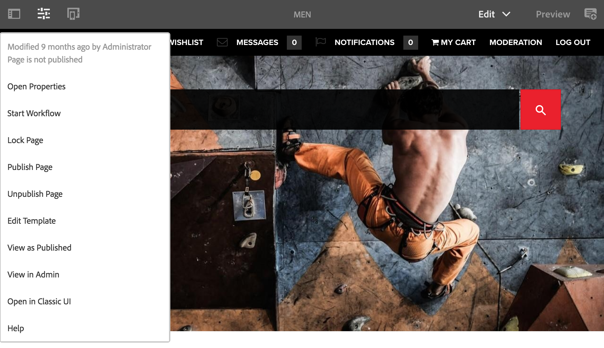

# 编辑器{#editor}

>[!CAUTION]
>
>AEM 6.4已结束扩展支持，本文档将不再更新。 有关更多详细信息，请参阅 [技术支助期](https://helpx.adobe.com/cn/support/programs/eol-matrix.html). 查找支持的版本 [此处](https://experienceleague.adobe.com/docs/).

默认情况下，从编辑器切换到经典UI的功能已被禁用。

重新启用选项 **在经典UI中打开** 在 **页面信息** 菜单，请按照以下步骤操作。

1. 使用CRXDE Lite，找到以下节点：

   `/libs/wcm/core/content/editor/jcr:content/content/items/content/header/items/headerbar/items/pageinfopopover/items/list/items/classicui`

   例如

   `http://localhost:4502/crx/de/index.jsp#/libs/wcm/core/content/editor/jcr%3Acontent/content/items/content/header/items/headerbar/items/pageinfopopover/items/list/items/classicui](http://localhost:4502/crx/de/index.jsp#/libs/wcm/core/content/editor/jcr%3Acontent/content/items/content/header/items/headerbar/items/pageinfopopover/items/list/items/classicui`

1. 使用创建叠加 **覆盖节点** 选项；例如：

   * **路径**: `/apps/wcm/core/content/editor/jcr:content/content/items/content/header/items/headerbar/items/pageinfopopover/items/list/items/classicui`
   * **覆盖位置**: `/apps/`
   * **匹配节点类型**:活动（选中复选框）

1. 将以下多值文本属性添加到叠加的节点：

   `sling:hideProperties = ["granite:hidden"]`

1. 的 **在经典UI中打开** 选项在 **页面信息** 菜单。

   
