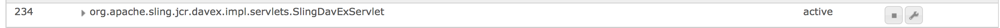

# 在AEM{#enabling-crxde-lite-in-aem}中启用CRXDE Lite

为确保AEM安装尽可能安全，安全检查列表建议在生产环境中[禁用WebDAV](/help/sites-administering/security-checklist.md#disable-webdav)。

但是，CRXDE Lite依赖于`org.apache.sling.jcr.davex`包才能正常运行，因此禁用WebDAV也会有效地禁用CRXDE Lite。

如果发生这种情况，浏览到`https://serveraddress:4502/crx/de/index.jsp`将显示一个空的根节点，并且所有用于CRXDE Lite资源的HTTP请求都将失败：

```xml
404 Resource at '/crx/server/crx.default/jcr:root/.1.json' not found: No resource found
```

虽然此建议旨在尽可能减少攻击表面，但系统管理员有时可能需要访问CRXDE Lite，以浏览内容或调试生产实例上的问题。

如果禁用，则可以按照以下过程打开CRXDE Lite:

1. 转到位于`http://localhost:4502/system/console/components`的OSGi组件控制台
1. 搜索以下组件：

   * `org.apache.sling.jcr.davex.impl.servlets.SlingDavExServlet`

1. 单击该扳手旁边的扳手图标可查看其配置选项：

   

1. 创建以下配置：

   * **根路径:** `/crx/server`
   * 勾选&#x200B;**使用绝对URI**&#x200B;下方的框。

1. 使用完CRXDE Lite后，请确保再次禁用WebDAV。

您还可以通过运行以下命令通过cURL启用CRXDE Lite:

```shell
curl -u admin:admin -F "jcr:primaryType=sling:OsgiConfig" -F "alias=/crx/server" -F "dav.create-absolute-uri=true" -F "dav.create-absolute-uri@TypeHint=Boolean" http://localhost:4502/apps/system/config/org.apache.sling.jcr.davex.impl.servlets.SlingDavExServlet
```

## 其他资源{#other-resources}

有关AEM 6安全功能的更多信息，请参阅以下页面：

* [AEM安全检查列表](/help/sites-administering/security-checklist.md)
* [在生产就绪模式下运行AEM](/help/sites-administering/production-ready.md)
