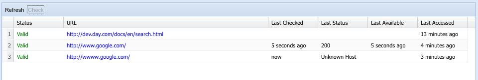

# The External Link Checker{#the-external-link-checker}

AEM中提供外部链接检查器。 链接检查器：

* 扫描所有内容页面
* 生成所有有效和无效链接的列表
* 在单个内容页面上将无效链接标记为原地中断

## 如何验证外部链接 {#how-to-validate-external-links}

要使用外部链接检查器：

1. Open the **Tools** console.
1. 多次单击“ **外部链接检查器** ”（右窗格或左窗格）。 将生成所有外部链接的列表。
1. 在列表中选择特定链接，然后单击检查，以验 **证该链接**:

   

   信息，例如：

   * 链接的状态
   * URL
   * 上次验证链接后的时间
   * 上次链接可用后的时间
   * 上次访问链接后的时间

   的双曲余切值。

1. 在单个内容页面上，无效链接将显示为断开：

   

