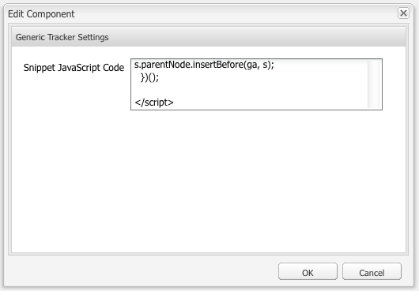

# Analytics与外部提供程序{#analytics-with-external-providers}

>[!CAUTION]
>
>AEM 6.4已结束扩展支持，本文档将不再更新。 有关更多详细信息，请参阅 [技术支助期](https://helpx.adobe.com/cn/support/programs/eol-matrix.html). 查找支持的版本 [此处](https://experienceleague.adobe.com/docs/).

Analytics可以为您提供有关网站使用方式的重要且有趣的信息。

各种开箱即用的配置可用于与相应的服务集成，例如：

* [Adobe Analytics](/help/sites-administering/adobeanalytics.md)
* [Adobe Target](/help/sites-administering/target.md)

您还可以配置自己的 **通用Analytics代码段** 定义新的服务配置。

然后，通过添加到网页的代码片段来收集信息。 例如：

>[!CAUTION]
>
>不得将脚本包含在 `script` 标记。

```
var _gaq = _gaq || [];
_gaq.push(['_setAccount', 'UA-XXXXX-X']);
_gaq.push(['_trackPageview']);

(function() {
    var ga = document.createElement('script'); ga.type = 'text/javascript'; ga.async = true;
    ga.src = ('https:' == document.location.protocol ? 'https://ssl' : 'https://www') + '.google-analytics.com/ga.js';
    var s = document.getElementsByTagName('script')[0]; s.parentNode.insertBefore(ga, s);
})();
```

这样的代码片段可以收集数据并生成报告。 收集的实际数据取决于提供程序和使用的实际代码段。 示例统计信息包括：

* 一段时间内的访客人数
* 访问的页数
* 使用的搜索词
* 登陆页面

>[!CAUTION]
>
>配置了Geometrixx-Outdoors演示网站，以便将“页面属性”中提供的属性附加到HTML源代码的正上方 `</html>` endtag) `js` 脚本。
>
>
>如果您自己 `/apps` 不从默认页面组件继承( `/libs/foundation/components/page`)您（或您的开发人员）必须确保 `js` 包含脚本，例如通过以下任一方式 `cq/cloudserviceconfigs/components/servicescomponents`，或使用类似的机制。
>
>
>如果没有此功能，则任何服务（通用、Analytics、Target等）都将无法正常运行。

## 使用通用代码片段创建新服务 {#creating-a-new-service-with-a-generic-snippet}

对于基本配置：

1. 打开 **工具** 控制台。

1. 从左窗格展开 **Cloud Services配置**.

1. 双击 **通用Analytics代码片段** 要打开页面，请执行以下操作：

   

1. 单击+以使用对话框添加新配置；至少分配一个名称，例如google analytics:

   

1. 单击 **创建**，将立即打开代码片段对话框 — 将相应的javascript代码片段粘贴到字段中：

   

1. 单击 **确定** 保存。

## 在页面上使用新服务 {#using-your-new-service-on-pages}

创建了服务配置后，您现在需要配置所需的页面才能使用它：

1. 导航到页面。

1. 打开 **页面属性** 从sidekick，然后 **Cloud Services** 选项卡。

1. 单击 **添加服务**，然后选择所需的服务；例如， **通用Analytics代码片段**:

   

1. 单击 **确定** 保存。

1. 您将返回到 **Cloud Services** 选项卡。 的 **通用Analytics代码片段** 现在随消息一起列出 `Configuration reference missing`. 使用下拉列表选择您的特定服务实例；例如google-analytics:

   

1. 单击 **确定** 保存。

   现在，如果您查看页面的页面源，则可以查看代码片段。

   在经过适当的时间段后，您将能够查看已收集的统计资料。

   >[!NOTE]
   >
   >如果配置附加到具有子页面的页面，则这些页面也会继承该服务。
