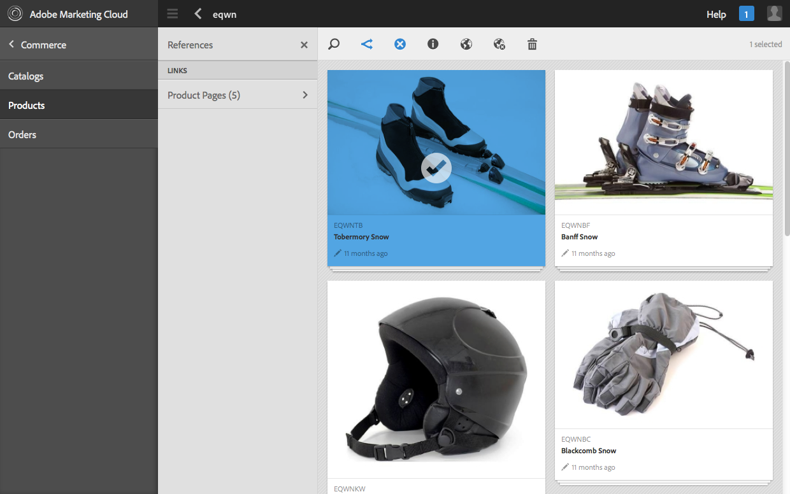
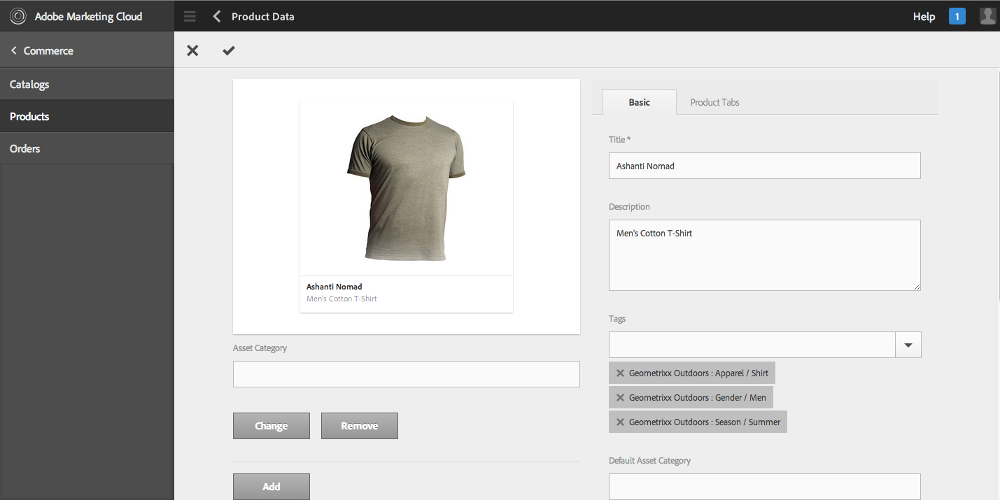

# 管理通用电子商务{#administering-generic-ecommerce}

>[!CAUTION]
>
>AEM 6.4已结束扩展支持，本文档将不再更新。 有关更多详细信息，请参阅 [技术支助期](https://helpx.adobe.com/cn/support/programs/eol-matrix.html). 查找支持的版本 [此处](https://experienceleague.adobe.com/docs/).

AEM通用解决方案提供了管理存储库中保存的商务信息的方法（而不是使用外部电子商务引擎）。 这包括：

* [产品](/help/sites-administering/concepts.md#products)
* [产品的系列品种](/help/sites-administering/concepts.md#product-variants)

* [目录](/help/sites-administering/concepts.md#catalogs)
* [促销活动](/help/sites-administering/concepts.md#promotions)
* [优惠券](/help/sites-administering/concepts.md#vouchers)
* [订单](/help/sites-administering/concepts.md#shopping-cart-and-orders)
* [代理页](/help/sites-administering/concepts.md#proxy-pages)

>[!NOTE]
>
>标准AEM安装包括通用AEM(JCR)电子商务实施。
>
>此功能当前用于演示目的，或根据您的要求作为自定义实施的基本基础。

## 产品和产品变量 {#products-and-product-variations}

>[!NOTE]
>
>以下过程适用于产品和产品变体。

在创建产品之前，您需要定义 [基架](/help/sites-authoring/scaffolding.md). 这会指定定义产品以及编辑产品的方式所需的字段。

每个不同的产品类型都需要基架。 相应的基架通过以下任一方式与产品关联：

* 路径
* 产品可以引用scaffold

>[!NOTE]
>
>Geometrixx-Outdoors商店具有单个产品类型（因此具有单个基架）：
>
>`/etc/scaffolding/geometrixx-outdoors`
>
>Geometrixx-Outdoors产品类型在以下位置处于活动状态：
>
>`/etc/commerce/products/geometrixx-outdoors`
>
>您可以在下的任意位置创建新的产品定义，而无需进行任何其他设置。

### 正在导入产品 {#importing-products}

#### 导入产品 — 触屏优化UI {#importing-products-touch-optimized-ui}

1. 导航到 **产品** 控制台，通过 **商务**.
1. 使用 **产品** 控制台导航到所需的位置。
1. 使用 **导入产品** 图标以打开向导。

   

1. 指定：

   * **导入程序**

      特定 [商务提供商](/help/sites-administering/concepts.md#commerce-providers)，默认情况下 `Geometrixx`.

   * **来源**

      要导入的文件；您可以使用浏览器选择文件。

   * **增量导入**

      指示这是否是增量导入（而不是完全导入）。
   >[!NOTE]
   >
   >示例geometrixx-outdoor导入程序的增量导入在产品级别运行。
   >
   >可定义自定义导入器以根据需要进行操作。

1. 选择 **下一个** 要导入产品，将显示所执行操作的日志。

   >[!NOTE]
   >
   >产品将导入到当前位置，或相对于当前位置。

   >[!NOTE]
   >
   >反复使用 **下一个** 和 **返回** 将重复导入产品定义。 但是，由于它们具有相同的SKU，因此存储库中现有的信息将会被覆盖。

1. 选择 **完成** 来关闭向导。

#### 导入产品 — 经典UI {#importing-products-classic-ui}

1. 使用 **工具** 控制台将打开 **商务** 文件夹。
1. 双击以打开 **产品导入程序**:

   

1. 指定：

   * **存储名称**

      产品将导入到：

      `/etc/commerce/products/<*store name*>/`

   * **商业提供程序**

      导入程序 [商务提供商](/help/sites-administering/concepts.md#commerce-providers);默认Geometrixx。

   * **源文件**

      要导入的文件的存储库中的位置。

   * **增量导入**

      指示这是否是增量导入（而不是完全导入）。

1. 单击 **导入产品**.

### 创建产品信息 {#creating-product-information}

>[!NOTE]
>
>标准产品管理是基本的，因为Geometrixx-Outdoors产品集一直是基本的。 复杂性基于产品 [基架](/help/sites-authoring/scaffolding.md)，因此使用您自己的产品基架，可以实现更复杂的编辑。

#### 创建产品信息 — 触屏优化UI {#creating-product-information-touch-optimized-ui}

1. 使用 **产品** 控制台(通过 **商务**)导航到所需的位置。
1. 使用 **创建** 图标以选择以下任一内容（取决于结构和位置）：

   * **创建产品**
   * **创建产品变量**

   

1. 随即会打开向导。 使用 **基本** 和 **产品选项卡** 输入 [产品属性](/help/sites-administering/concepts.md#product-attributes) （对于新产品或产品变体）。

   >[!NOTE]
   >
   >**标题** 和 **SKU** 是创建产品或变体所需的最低值。

1. 选择 **创建** 以保存信息。

>[!NOTE]
>
>许多产品都提供多种颜色和/或尺寸。 有关基本产品和相关产品变型的信息，可从 **产品** 控制台。
>
>产品及其变体以树结构形式存储，产品信息位于顶部，下面有变体（此结构由UI强制实施）。

### 编辑产品信息 {#editing-product-information}

>[!NOTE]
>
>geometrixx-outdoors中的产品图像来自：
>
>`/etc/commerce/products/...`
>
>这表示默认情况下，它们将被 [dispatcher](https://helpx.adobe.com/cn/experience-manager/dispatcher/using/dispatcher-configuration.html)，以根据需要进行配置。

#### 编辑产品信息 — 触屏优化UI {#editing-product-information-touch-optimized-ui}

1. 使用 **产品** 控制台(通过 **商务**)导航到您的产品信息。
1. 使用：

   * [快速操作](/help/sites-authoring/basic-handling.md#quick-actions)
   * [选择模式](/help/sites-authoring/basic-handling.md#viewing-and-selecting-resources)

   选择 **查看产品数据** 图标：

   

1. 的 [产品属性](/help/sites-administering/concepts.md#product-attributes) 中。 使用 **编辑** 和 **完成** 进行任何更改。

### 显示产品引用 {#showing-product-references}

#### 显示产品引用 — 触屏优化UI {#showing-product-references-touch-optimized-ui}

1. 使用 **产品** 控制台(通过 **商务**)导航到您的产品信息。
1. 使用图标打开引用的辅助边栏：

   

1. 选择您需要的产品 — 辅助边栏将更新以显示可用的引用类型：

   

1. 单击/点按引用类型（例如，产品页面）以展开列表。
1. 选择特定引用以显示选项：

   * 导航到产品页面
   * 编辑产品页面

   

### 搜索产品 {#search-for-products}

1. 导航到 **产品** 控制台，通过 **商务**.
1. 使用图标打开“搜索”的辅助边栏：

   

1. 您可以使用多个Facet来搜索产品。 您只能对搜索使用一个或多个Facet。 将显示找到的产品：

   

1. 单击/点按产品会打开它。 您还可以发布或查看产品数据。

#### 扩展搜索 {#extending-search}

您可以使用以下CRXDE Lite修改现有小平面或添加新小平面：

1. 导航至：

   `http://localhost:4502/crx/de/index.jsp#/libs/commerce/gui/content/products/aside/items/search/items/searchpanel/facets`

1. 您可以修改产品搜索页面上显示的大小。 单击 `sizegroup` 节点。
1. 单击 `items` 节点，然后单击 `propertypredicate` 节点。
1. 您可以修改 `propertyValues`. 例如，您可以添加XS、XXL或删除大小。
1. 单击 **全部保存** 并导航到产品搜索页面。 此时应会显示您所做的更改。

### 多个资产 {#multiple-assets}

您可以在产品组件中添加多个资产，然后指定将在产品页面上显示的资产。

>[!NOTE]
>
>与多个资产相关的所有操作均可通过触屏优化UI完成。

#### 添加多个资产 {#adding-multiple-assets}

1. 导航到 **产品** 控制台，通过 **商务**.
1. 使用 **产品** 控制台中，导航到所需的产品。

   >[!NOTE]
   >
   >您必须位于产品级别，而不是变体级别。

1. 点按/单击 **查看产品数据** 图标。
1. 点按/单击编辑图标。
1. 滚动到 **添加**.

   

1. 点按/单击 **添加**. 此时会显示新的资产占位符。
1. 点按/单击**更改**会打开一个对话框，通过该对话框可以选择资产。
1. 选择要添加的资产。

   >[!NOTE]
   >
   >您可以选择的资产来自 [资产](https://helpx.adobe.com/experience-manager/aem-previous-versions.html#assets).

1. 点按/单击完成图标。

现在，两个资产会存储在您的产品组件中。 您可以配置产品页面上将显示哪个页面。 这适用于类别系统。 首先，您需要向单个资产添加类别：

1. 点按/单击 **查看产品数据**.
1. 键入 **资产类别** 例如， `cat1` 和 `cat2`.

   >[!NOTE]
   >
   >您还可以对类别使用标记。

1. 点按/单击完成图标。 你现在必须 [转出](#rolling-out-a-catalog) 您的更改。

现在，您的产品组件中的资产有一个类别。 您可以配置在三个不同级别上显示的类别：

* [产品页面](#product-page)
* [目录](#catalog)
* [产品控制台](#products-console)

>[!NOTE]
>
>如果不设置类别，则第一个资产将显示在产品页面上。

选择要显示的图像的机制如下：

1. 验证是否为产品页面设置了类别。
1. 如果没有，请验证是否为目录设置了类别。
1. 如果未设置，请验证是否为产品控制台设置了类别。

>[!NOTE]
>
>对于目录级别和产品控制台级别，您必须转出更改才能应用修改并在产品页面上查看差异。

#### 产品页面 {#product-page}

1. 导航到您的产品页面。
1. **编辑** 产品组件。
1. 键入 **图像类别** 您选择了( `cat1` 例如)。
1. 点按/单击 **完成**. 页面将刷新，并应显示正确的资产。

#### 目录  {#catalog}

1. 导航到您的目录。
1. 点按/单击 **查看属性**.
1. 点按/单击&#x200B;**编辑**。
1. 点按/单击 **资产** 选项卡。
1. 键入所需的 **产品资产类别**.
1. 点按/单击 **完成**.
1. [转出](#rolling-out-a-catalog) 您的更改。

#### 产品控制台 {#products-console}

1. 使用 **产品** 控制台中，导航到所需的产品。
1. 点按/单击 **查看产品数据**.
1. 点按/单击&#x200B;**编辑**。
1. 键入 **默认资产类别**.
1. 点按/单击 **完成**.
1. [转出](#rolling-out-a-catalog) 您的更改。

### 发布/取消发布产品信息 {#publishing-unpublishing-product-information}

#### 发布/取消发布产品信息 — 触屏优化UI {#publishing-unpublishing-product-information-touch-optimized-ui}

>[!NOTE]
>
>产品信息通常通过引用它的页面发布。 例如，在发布引用产品Y的页面X时，AEM将询问您是否还要发布产品Y。
>  
>对于特殊情况，AEM还支持直接从产品数据发布。

1. 使用 **产品** 控制台(通过 **商务**)导航到您的产品信息。
1. 使用：

   * [快速操作](/help/sites-authoring/basic-handling.md#quick-actions)
   * [选择模式](/help/sites-authoring/basic-handling.md#viewing-and-selecting-resources)

   选择 **发布** 或 **取消发布** 图标：

    

   将根据需要发布或取消发布产品信息。

<!-- Search&Promote was end of life September 1, 2022. ### Product Feed {#product-feed} -->

<!-- Search&Promote was end of life September 1, 2022. The Search&Promote integration allows you to: -->

<!-- Search&Promote was end of life September 1, 2022. * use the eCommerce API, independently of the underlying repository structure and commerce platform. -->
<!-- Search&Promote was end of life September 1, 2022. * leverage the Index Connector feature of Search&Promote to provide a product feed in XML format. -->
<!-- Search&Promote was end of life September 1, 2022. * leverage the Remote Control feature of Search&Promote to perform on-demand or scheduled requests of the product feed -->
<!-- Search&Promote was end of life September 1, 2022. * feed generation for different Search&Promote accounts, configured as cloud services configurations. -->

<!-- Search&Promote was end of life September 1, 2022. For more information, read [Product Feed](/help/sites-administering/product-feed.md). -->

### 产品更新的事件处理程序 {#event-handler-for-product-updates}

有一个事件处理程序，它会在添加、修改或删除产品以及添加、修改或删除产品页面时记录事件。 以下是OSGi事件：

* `com/adobe/cq/commerce/pim/PRODUCT_ADDED`
* `com/adobe/cq/commerce/pim/PRODUCT_MODIFIED`
* `com/adobe/cq/commerce/pim/PRODUCT_DELETED`
* `com/adobe/cq/commerce/pim/PRODUCT_PAGE_ADDED`
* `com/adobe/cq/commerce/pim/PRODUCT_PAGE_MODIFIED`
* `com/adobe/cq/commerce/pim/PRODUCT_PAGE_DELETED`

对于 `PRODUCT_*` 事件，路径指向 `/etc/commerce/products`. 对于 `PRODUCT_PAGE_*` 事件，路径指向 `cq:Page` 节点。

您可以在OSGI事件的Web控制台中查看这些事件( `/system/console/events`)，例如：

>[!NOTE]
>
>另请阅读 [AEM中的事件处理](https://blogs.adobe.com/experiencedelivers/experience-management/event_handling_incq/). 

### 添加到购物车链接的图像 {#image-with-add-to-cart-links}

通过添加到购物车链接的图像组件，您可以通过创建与图像上的产品链接的热点来快速将产品添加到购物车。

单击热点会打开一个对话框，您可以从中选择产品的大小和数量。

1. 导航到要添加组件的页面。
1. 将组件拖放到页面中。
1. 从 [资产浏览器](/help/sites-authoring/author-environment-tools.md#assets-browser).
1. 您可以：

   * 单击组件，然后单击编辑图标
   * 慢速双击

1. 单击全屏图标。

   

1. 单击启动映射图标。

   

1. 单击其中一个形状图标。

   

1. 根据需要修改和移动形状。
1. 单击形状。
1. 单击浏览图标可打开 [资产选择器](/help/assets/asset-selector.md#using-the-asset-selector).

   >[!NOTE]
   >
   >或者，您也可以直接键入必须位于产品级别而非变体级别的产品路径。

   

1. 单击确认图标两次，然后单击退出全屏。
1. 单击组件旁边页面上的某个位置。 页面应会刷新，您应会在图像上看到以下符号：

   

1. 切换到 [预览](/help/sites-authoring/editing-content.md#previewing-pages) 模式。
1. 单击+热点。 此时将打开一个对话框，您可以从中选择输入产品的大小和数量 **路径**.

   

1. 输入大小和数量。
1. 单击添加到购物车按钮。 对话框关闭。
1. 导航到购物车。 产品应该在这里。

#### 配置选项 {#configuration-options}

您可以配置单击热点时对话框的外观：

1. 单击组件，然后单击配置图标。

   

1. 向下滚动. 有 **添加到购物车** 选项卡。

   

1. 单击 **添加到购物车**. 您可以使用3个配置选项。

   

1. 单击完成图标。

## 目录 {#catalogs}

### 生成目录 {#generating-a-catalog}

#### 生成目录 — 触屏优化UI {#generating-a-catalog-touch-optimized-ui}

>[!NOTE]
>
>目录将引用您的产品数据。

要生成目录，请执行以下操作：

1. 打开站点控制台(例如， [http://localhost:4502/sites.html/content](http://localhost:4502/sites.html/content))。
1. 导航到要创建新页面的位置。
1. 要打开选项列表，请使用 **创建** 图标：

   

1. 从列表中选择 **创建目录**，此时将打开创建目录向导。

   

1. 导航到所需的目录Blueprint。
1. 点按/单击 **选择** 按钮，然后点按/单击所需的目录Blueprint。
1. 点按/单击 **下一个**.

   

1. 键入 **标题** 和 **名称**.
1. 点按/单击 **创建** 按钮。 随即会创建目录并打开一个对话框。

   

1. 点按/单击 **完成** 按钮可将您返回到站点控制台，您将能够在该控制台中看到您的目录。

   点按/单击 **打开目录** 按钮打开您的目录(例如 `http://localhost:4502/editor.html/content/test-catalog.html`)。

#### 生成目录 — 经典UI {#generating-a-catalog-classic-ui}

>[!NOTE]
>
>该目录将引用您的 [产品数据](#editing-product-information).

1. 使用 **网站** 控制台，导航到 **目录Blueprint**，然后是基本目录。

   例如：

   `http://localhost:4502/siteadmin#/content/catalogs/geometrixx-outdoors/base-catalog`

1. 使用 **节Blueprint** 模板。

   例如：`Swimwear`。

1. 打开新 `Swimwear` 页面，然后单击 **编辑Blueprint** 打开 **属性** 对话框中，您可以在其中设置 **产品** 选项。

   例如，打开 **标记/关键词** 字段，然后从“Geometrixx — 户外”部分中选择“游泳”。

1. 单击 **确定** 保存资产；示例产品将显示在 **产品选择标准** 在Blueprint页面上。
1. 单击 **转出更改……**，选择 **转出页面和所有子页面**，然后单击 **下一个** then **转出**. 成功完成转出后， **状态** 指示器将显示为绿色。
1. 您现在可以单击 **关闭** 查看新目录部分；例如，在上和下：

   `http://localhost:4502/cf#/content/geometrixx-outdoors/en/swimwear.html`

1. 再次从Blueprint页面单击 **编辑Blueprint** 和 **属性** 对话框打开 **生成的页面** 选项卡。 在横幅列表字段中，选择要显示的图像；例如， `summer.jpg`
1. 单击 **确定** 保存资产；横幅信息将显示在 **产品选择标准** 在Blueprint页面上。
1. 转出这些新更改。

### 转出目录 {#rolling-out-a-catalog}

#### 推出目录 — 触屏优化UI {#rolling-out-a-catalog-touch-optimized-ui}

转出目录：

1. 导航到 **目录** 控制台，通过 **商务**.
1. 导航到要转出的目录。
1. 使用：

   * [快速操作](/help/sites-authoring/basic-handling.md#quick-actions)
   * [选择模式](/help/sites-authoring/basic-handling.md#viewing-and-selecting-resources)

   选择 **转出更改** 图标：

   

1. 在向导中，根据需要设置转出，然后点按/单击 **转出更改**.
1. 将打开一个对话框。 完成该过程后，点按/单击**完成**。

#### 转出目录 — 经典UI {#rolling-out-a-catalog-classic-ui}

转出目录：

1. 导航到要转出的目录。 例如：

   `http://localhost:4502/cf#/content/catalogs/geometrixx-outdoors/base-catalog.html`

1. 单击 **转出更改……**
1. 根据需要设置转出。
1. 单击 **转出**.

### Blueprint导入程序 {#blueprint-importer}

#### Blueprint导入器 — 触屏优化UI {#blueprint-importer-touch-optimized-ui}

1. 导航到 **目录** 控制台，通过 **商务**.
1. 导航到要导入目录Blueprint的位置。
1. 点按/单击 **导入Blueprint** 图标。

   

1. 在向导中，根据需要选择源，然后点按/单击 **下一个**.

   

1. 点按/单击 **完成** 完成导入后。

#### Blueprint导入器 — 经典UI {#blueprint-importer-classic-ui}

1. 使用 **工具** 控制台，导航到 **商务**.

   例如：

   `http://localhost:4502/miscadmin#/etc/commerce`

1. 打开 **目录蓝印导入程序**.
1. 根据需要设置导入。
1. 单击 **导入目录蓝图**.

## 促销活动 {#promotions}

### 创建促销活动 {#creating-a-promotion}

#### 创建促销活动 — 经典UI {#creating-a-promotion-classic-ui}

>[!NOTE]
>
>以下示例涉及直接在 [营销活动](/help/sites-authoring/personalization.md)，用于凭证。
>
>促销活动也可以位于 [体验](/help/sites-authoring/personalization.md) 在营销策划中。
>
>有关详细信息，请参阅 [促销和凭单](#promotions).

1. 打开 **网站** 创作实例的控制台。
1. 在左窗格中，选择所需的 **Campaign**.
1. 单击 **新建**，选择 **促销** 模板，然后指定 **标题** (和 **名称** （如果需要）。
1. 单击&#x200B;**创建**。新的促销活动页面将显示在右侧窗格中。

1. 编辑 **属性** 按以下任一方式：

   * 打开页面，然后单击编辑按钮以打开属性对话框
   * 在“网站”控制台中选择页面，然后使用上下文菜单（通常是鼠标右键）选择 **属性……** 并打开“属性”对话框

   指定 **促销类型**, **折扣类型**, **折扣值** 和任何其他字段。

1. 单击 **确定** 保存。

1. 您现在可以激活促销活动，以便购物者在发布实例上看到该促销活动。

## 优惠券 {#vouchers}

### 创建优惠券 {#creating-a-voucher}

#### 创建优惠券 — 经典UI {#creating-a-voucher-classic-ui}

1. 打开 **网站** 创作实例的控制台。
1. 在左窗格中，选择所需的 **Campaign**.
1. 单击 **新建**，选择 **优惠券** 模板，然后指定 **标题** (和 **名称** （如果需要）。
1. 单击&#x200B;**创建**。新的凭单页面将显示在右侧窗格中。

1. 双击打开新凭证页面，然后单击 **编辑** ，以根据需要配置信息。
1. 单击 **确定** 保存。

1. 您现在可以激活您的优惠券，以便购物者在发布实例上的购物车中使用该优惠券。

### 删除凭单 {#removing-vouchers}

#### 删除凭单 — 经典UI {#removing-vouchers-classic-ui}

要使凭单对客户不可用，您可以：

* 停用凭单 — 凭单将在创作环境中保持可用，以便您稍后可以重新激活它。
* 完全删除。

这两项操作均可从 **网站** 控制台。

### 修改凭证 {#modifying-vouchers}

#### 修改凭单 — 经典UI {#modifying-vouchers-classic-ui}

要更改凭证或促销活动的属性，可在 **网站** 控制台，单击 **编辑**. 保存后，应激活该实例，以便将更改推送到发布实例。

### 将优惠券添加到购物车 {#adding-vouchers-to-a-cart}

要允许用户向购物车添加凭单，您可以使用 **凭单** 组件（商务类别）。 您需要将此内容添加到显示购物车的同一页面（但不是强制选项）。 凭单组件只是用户可在其中输入凭证代码的表单，它是实际显示已应用凭证列表及其折扣的购物车组件。

在演示网站(Geometrixx Outdoors — 英语)中，您可以在购物车页面的实际购物车下看到凭证表单。

## 订单 {#orders}

>[!NOTE]
>
>应当记住，现成的AEM没有对与订单相关的标准功能（如退货、更新订单状态、执行完成、生成装箱单）所需的操作。 它主要用作技术预览。
>
>AEM中的通用订单管理一直是基本的；向导中可用的字段取决于基架：\
>`/etc/scaffolding/geometrixx-outdoors/order/jcr:content/cq:dialog`
>
>如果创建自定义基架，则可以存储更多订单信息。

>[!NOTE]
>
>订单控制台会公开供应商订单信息，该信息从未发布。
>  
>客户订单信息保存在其主目录中，并由其帐户的订单历史记录公开。 此信息与其其余的主目录一起发布。

### 创建订单信息 {#creating-order-information}

#### 创建订单信息 — 触屏优化UI {#creating-order-information-touch-optimized-ui}

1. 使用 **订单数** 控制台导航到所需的位置。
1. 使用 **创建** 图标 **创建顺序**.

   

1. 随即会打开向导。 使用 **基本**, **内容**, **付款** 和 **履行** 选项卡 [有关新订单的信息](/help/sites-administering/concepts.md#order-information).

1. 选择 **创建** 以保存信息。

### 编辑订单信息 {#editing-order-information}

#### 编辑订单信息 — 触屏优化UI {#editing-order-information-touch-optimized-ui}

1. 使用 **订单数** 控制台导航到订单。
1. 使用：

   * [快速操作](/help/sites-authoring/basic-handling.md#quick-actions)
   * [选择模式](/help/sites-authoring/basic-handling.md#viewing-and-selecting-resources)

   选择 **查看订单数据** 图标：

   

1. 的 [订单信息](/help/sites-administering/concepts.md#order-information) 中。 使用 **编辑** 和 **完成** 进行任何更改。
