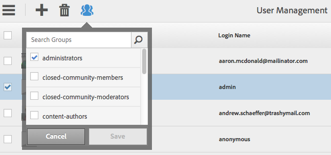

# Granite操作 — 用户和组管理{#granite-operations-user-and-group-administration}

由于Granite整合了JCR API规范的CRX存储库实施，因此它拥有自己的用户和组管理。

这些帐户是[AEM帐户](/help/sites-administering/security.md)的基础，如果/当从[AEM用户控制台](/help/sites-administering/security.md#accessing-user-administration-with-the-security-console)访问帐户时，通过Granite管理所做的任何帐户更改都将被反映(例如，`http://localhost:4502/useradmin`)。 从AEM用户控制台中，您还可以管理权限和其他AEM特定信息。

Granite用户和组管理控制台均可从触屏优化UI的&#x200B;**[工具](/help/sites-administering/tools-consoles.md)**&#x200B;控制台中使用：

从“工具”控制台中选择&#x200B;**用户**&#x200B;或&#x200B;**组**&#x200B;将打开相应的控制台。 在这两种情况下，您都可以先使用Clickbox，然后再使用工具栏中的操作，或者通过&#x200B;**Name**&#x200B;下的链接打开帐户详细信息，从而执行操作。

* [用户管理](#user-administration)

   

   **Users**&#x200B;控制台列表：

   * 用户名
   * 用户登录名（帐户名称）
   * 已提供帐户的任何标题

* [群组管理](#group-administration)

   

   **组**&#x200B;控制台列表：

   * 群组名称
   * 群组描述
   * 组中的用户/组数量

## 用户管理{#user-administration}

### 添加新用户{#adding-a-new-user}

1. 使用&#x200B;**Add User**&#x200B;图标：

   

1. 将打开&#x200B;**创建用户**&#x200B;表单：

   

   您可以在此输入帐户的用户详细信息（大多数是标准的和不言而喻的）：

   * **ID**

      这是用户帐户的唯一标识。 它是必选项，不能包含空格。

   * **电子邮件地址**
   * **密码**

      密码是强制性的。

   * **重新键入密码**

      这是强制性的，因为确认密码时需要此参数。

   * **名字**
   * **姓氏**
   * **电话号码**
   * **职务**
   * **街道**
   * **移动设备**
   * **城市**
   * **邮政编码**
   * **国家/地区**
   * **状态**
   * **标题**
   * **性别**
   * **关于**
   * **帐户设置**

      * ****
状态您可以将帐户标记为 
**** 活动或 **不活动**。
   * **照片**

      您可以在此处上传照片以用作头像。

      接受的文件类型: `.jpg .png .tif .gif`

      首选大小：`240x240px`

   * **将用户添加到组**

      使用“选择”下拉列表选择用户应为其成员的组。 选择&#x200B;**X**&#x200B;后，在保存之前，请取消选择该名称。

   * **组**

      用户当前所属的组列表。 在保存前，使用名称&#x200B;**X**&#x200B;取消选择。

1. 在您定义了用户帐户后，使用：

   * **** 取消中止注册。
   * **** Saveto完成注册。将确认创建用户帐户，并显示一条消息。

### 编辑现有用户{#editing-an-existing-user}

1. 从“用户”控制台中用户名下的链接访问用户详细信息。

1. 现在，您可以编辑[添加新用户](#adding-a-new-user)中的详细信息。

1. 从“用户”控制台中用户名下的链接访问用户详细信息。

1. 现在，您可以编辑[添加新用户](#adding-a-new-user)中的详细信息。

### 更改现有用户{#changing-the-password-for-an-existing-user}的密码

1. 从“用户”控制台中用户名下的链接访问用户详细信息。

1. 现在，您可以编辑[添加新用户](#adding-a-new-user)中的详细信息。 在&#x200B;**帐户设置**&#x200B;下，有一个用于&#x200B;**更改密码**&#x200B;的链接。

   

1. 将打开&#x200B;**更改密码**&#x200B;对话框。 输入并重新键入新密码以及密码。 使用&#x200B;**OK**&#x200B;确认更改。

   

   将显示一条消息，确认密码已更改。

### 快速组分配{#quick-group-assignment}

1. 使用单击框标记一个或多个用户。
1. 使用&#x200B;**Groups**&#x200B;图标：

   

   要打开组选择下拉列表，请执行以下操作：

   

1. 在选择框中，您可以选择或取消选择用户帐户应属于的组。

1. 在您分配或未分配了所需的组后，将使用：

   * **** 取消中止更改
   * **** Saveto确认更改

### 删除现有用户详细信息{#deleting-existing-user-details}

1. 使用单击框标记一个或多个用户。
1. 使用&#x200B;**删除**&#x200B;图标删除用户详细信息：

   

1. 系统将要求您确认删除，然后会显示一条消息，确认已执行实际的删除操作。

## 组管理{#group-administration}

### 添加新组{#adding-a-new-group}

1. 使用“添加群组”图标：

   

1. 将打开&#x200B;**创建组**&#x200B;表单：

   

   您可以在此输入群组详细信息：

   * **ID**

      这是组的唯一标识符。 这是必填项，不能包含空格。

   * **名称**

      组的名称；它将显示在“组”控制台中。

   * **描述**

      群组的描述。

   * **将成员添加到组**

      使用选择下拉列表选择要添加到群组的用户。 选择&#x200B;**X**&#x200B;后，在保存之前，请取消选择该名称。

   * **组成员**

      组中用户的列表。 在保存前，使用名称&#x200B;**X**&#x200B;取消选择。

1. 定义群组后，使用：

   * **** 取消中止注册。
   * **** Saveto完成注册。将通过消息确认创建组。

### 编辑现有组{#editing-an-existing-group}

1. 从群组控制台中群组名称下的链接访问群组详细信息。

1. 现在，您可以编辑并保存详细信息，如[添加新组](#adding-a-new-group)中所示。

### 复制现有组{#copying-an-existing-group}

1. 使用单击框标记群组。
1. 使用&#x200B;**复制**&#x200B;图标复制组详细信息：

   

1. 将打开&#x200B;**编辑组设置**&#x200B;窗体。

   组ID将与原始ID相同，但前缀为`Copy of`。 您必须编辑此代码，因为ID不能包含空格。 所有其他详细信息将与原始信息相同。

   现在，您可以编辑并保存详细信息，如[添加新组](#adding-a-new-group)中所示。

### 删除现有组{#deleting-an-existing-group}

1. 使用单击框标记一个或多个群组。
1. 使用&#x200B;**删除**&#x200B;图标删除组详细信息：

   

1. 系统将要求您确认删除，然后会显示一条消息，确认已执行实际的删除操作。
