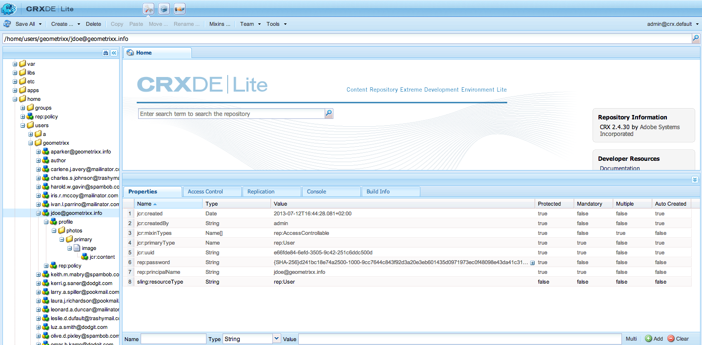

# 身份管理{#identity-management}

只有在您提供网站登录功能时，才能识别网站的各个访客。 您可能希望提供登录功能的原因有多种：

* [AEM](/help/communities/overview.md)Communities站点访客必须登录才能将内容发布到社区。
* [已关闭的用户组](/help/sites-administering/cug.md)

   您可能需要将访问您的网站（或网站的各个部分）的权限限制为特定访客。

* [个性化](/help/sites-administering/personalization.md) -允许访客配置访问您网站的某些方面。

登录（和注销）功能由具有用户档案 [的帐户提 **供&#x200B;**](#profiles-and-user-accounts)，该包含有关注册访客（用户）的附加信息。 注册和授权的实际过程可能不同：

* 从网站进行自注册

   社 [区站点](/help/communities/sites-console.md) 可以配置为允许访客使用其Facebook或Twitter帐户自行注册或登录。

* 从网站申请注册

   对于已关闭的用户组，您可能允许访客请求注册，但通过工作流强制授权。

* 从作者环境注册每个帐户

   如果您拥有少量用户档案，并且仍需要授权，您可以决定直接注册每个用户。

为了允许访客注册，可以使用一系列组件和表单来收集所需的标识信息，然后收集附加的（通常是可选的）用户档案信息。 注册后，还应当能够查看和更新自己提交的详细信息。

可以配置或开发其他功能：

* 配置任何需要的反向复制。
* 通过将表单与工作流一起开发，允许用户删除用户档案。

>[!NOTE]
>
>用户档案中指定的信息还可用于通过区段和活动向用户提供目 [标内](/help/sites-administering/campaign-segmentation.md) 容 [](/help/sites-authoring/personalization.md)。

## 注册Forms {#registration-forms}

表单可用于收集注册信息，然后生成新帐户和用户档案。

例如，用户可以使用用户档案页请求新Geometrixx\
`http://localhost:4502/content/geometrixx-outdoors/en/user/register.html`


提交请求后，用户档案页面将打开，用户可在其中提供个人详细信息。


新帐户也会显示在“用户” [控制台中](/help/sites-administering/security.md)。

## 登录 {#login}

登录组件可用于收集登录信息，然后激活登录过程。

这为访客提供了“用户名 **”和** “口令” **的标准字段**，以及一 **个“登录** ”按钮，用于在输入凭据时激活登录过程。

例如，用户可以使用Geometrixx工具栏上的“登录 **”选项** （使用页面）登录或创建新帐户：

`http://localhost:4502/content/geometrixx-outdoors/en/user/sign-in.html`


## 注销 {#logging-out}

由于存在登录机制，因此也需要注销机制。 此选项在Geometrixx **中作为** “注销”选项可用。

## 查看和更新用户档案 {#viewing-and-updating-a-profile}

根据您的注册表，访客可能在其用户档案中有注册信息。 他们应该能够在以后阶段视图和／或更新此项。 这可以用类似的表单完成； 例如，在Geometrixx中：

```
http://localhost:4502/content/geometrixx-outdoors/en/user/profile.html
```

要查看用户档案的详细信息，请 **单击任** 何页面右上角的“我的用户档案”; 例如，帐 `admin` 户：\
`http://localhost:4502/home/users/a/admin/profile.form.html/content/geometrixx-outdoors/en/user/profile.html.`

您可以使用Client Context视图其 [他用户档案](/help/sites-administering/client-context.md) (在创作环境上，并具有足够的权限):

1. 打开页面； 例如，“Geometrixx”页：

   `http://localhost:4502/cf#/content/geometrixx/en.html`

1. 单击 **右上角** 的“我的用户档案”。 您将看到您经常帐户的用户档案; 例如，管理员。
1. 按 **control-alt-C** 打开Client Context。
1. 在Client Context的左上角，单击“加 **载用户档案** ”按钮。

   

1. 从对话框窗口的下拉用户档案中选择其他列表; 例如，艾莉森 **·帕克**。
1. 单击&#x200B;**确定**。
1. 再次单击“我的 **用户档案**”。 表单将用Alison的详细信息进行更新。

   

1. 您现在可以使用 **编辑用户档案****或更改密** 码来更新详细信息。

## 将字段添加到用户档案定义 {#adding-fields-to-the-profile-definition}

您可以向用户档案定义中添加字段。 例如，向Geometrixx用户档案添加“收藏夹颜色”字段：

1. 从网站控制台中，导航到Geometrixx Outdoors站点>英语>用户>我的用户档案。

1. 多次单击“我 **的用户档案** ”页面以打开它进行编辑。

1. 在Sidekick的 **组件** 选项卡中，展开 **表单** 。

1. 将“下 **拉列表** ”列表从Sidekick拖到表单中 **，位于“关于** 我”字段的下方。

1. 多次-单击下 **拉列表组** 件，打开要配置的对话框并输入：

   * **元素名称** - `favoriteColor`
   * **标题** - `Favorite Color`
   * **项目** -将多种颜色添加为项目

   单击&#x200B;**确定**&#x200B;进行保存。

1. 关闭页面并返回到“网 **站** ”控制台并激活“我的用户档案”页面。

   下次视图用户档案时，您可以选择喜爱的颜色：

   

   此字段将保存在相关 **用户** 帐户的用户档案部分：

   

## 用户档案州 {#profile-states}

有许多用例需要了解用户(或其用户档案)是否处于特 *定状态* 。

这包括以下方式在用户用户档案中定义适当的属性：

* 对用户可见且可访问
* 为每个属性定义两个状态
* 允许在定义的两种状态之间切换

这是通过以下方式完成的：

* [状态提供者](#state-providers)

   管理特定属性的两种状态以及两者之间的过渡。

* [工作流](#workflows)

   管理与状态相关的操作。

可以定义多个状态； 例如，在Geometrixx中，这些包括：

* 在新闻稿或注释线程上订阅（或取消订阅）通知
* 添加和删除与朋友的连接

### 状态提供者 {#state-providers}

状态提供程序管理所涉及属性的当前状态，以及两个可能状态之间的过渡。

状态提供者是作为组件实现的，因此可以为您的项目自定义。 在Geometrixx中，这些包括：

* 取消订阅/订阅论坛主题
* 添加/删除好友

### 工作流 {#workflows}

状态提供者管理用户档案属性及其状态。

需要一个工作流来实施与状态相关的操作。 例如，订阅通知时，工作流将处理实际的订阅操作； 从通知中取消订阅时，工作流将处理从订阅列表中删除用户的操作。

## 用户档案和用户帐户 {#profiles-and-user-accounts}

用户档案作为用户帐户的一部分存储在内容 [存储库中](/help/sites-administering/user-group-ac-admin.md)。

该用户档案位于 `/home/users/geometrixx`:



在标准安装（创作或发布）中，每个人都有权读取所有用户的整个用户档案信息。 每个人都是一个“*自动包含所有现有用户和用户组的内置用户组”。 成员的列表不能编辑*”。

这些访问权限由以下通配符ACL定义：

/home每个人都允许jcr:read rep:glob = &amp;ast;/用户档案&amp;ast;

这允许：

* 论坛、评论或博客帖子，显示相应用户档案中的信息（如图标或全名）
* 指向geometrixx用户档案页面的链接

如果此访问权限不适合您的安装，则可以更改这些默认设置。

这可以使用“访问控制” **[选项卡](/help/sites-administering/user-group-ac-admin.md#access-right-management)**:


## 个人资料组件 {#profile-components}

还提供一系列用户档案组件，用于定义站点的用户档案要求。

### 检查密码字段 {#checked-password-field}

此组件为您提供了两个字段。分别用于：

* 输入密码
* 确认密码已正确输入。

使用默认设置时组件将显示为：


### 个人资料头像照片 {#profile-avatar-photo}

此组件为用户提供了选择和上传头像照片文件的途径。


### 个人资料详细姓名 {#profile-detailed-name}

此组件允许用户输入详细的名称。


### 个人资料性别 {#profile-gender}

此组件允许用户输入其性别。


