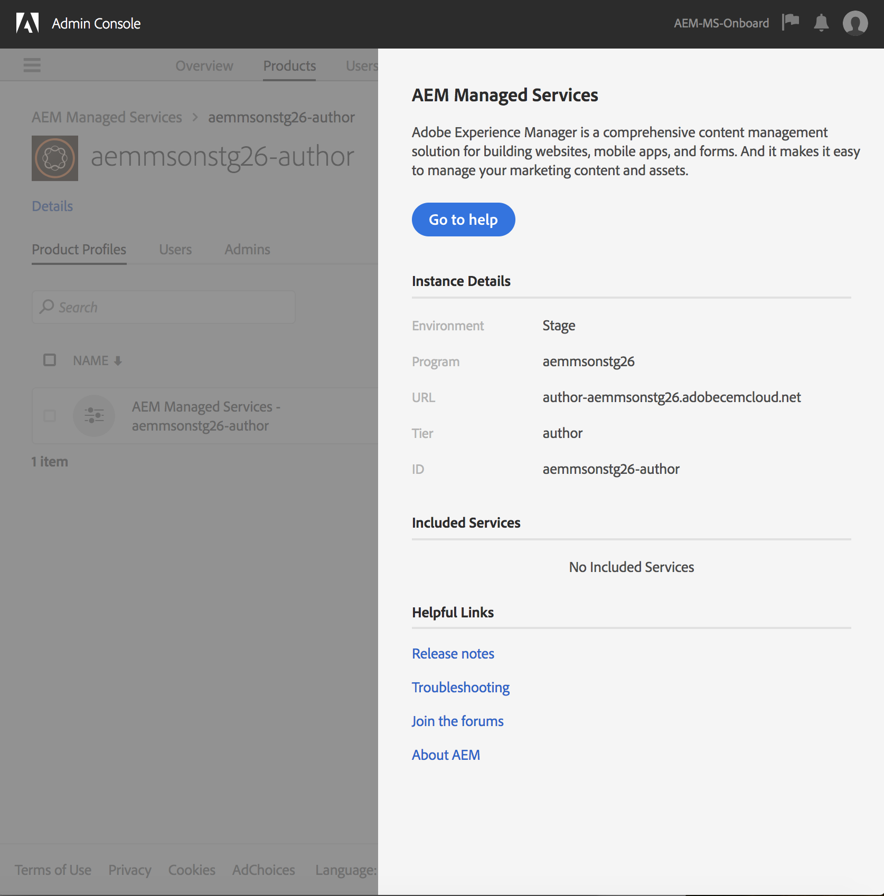

# AdobeIMS对AEMManaged Services的身份验证和Admin Console支持 {#adobe-ims-authentication-and-admin-console-support-for-aem-managed-services}

>[!NOTE]
>
>请注意，此功能仅对Adobe Managed Services客户可用。

## 简介 {#introduction}

AEM 6.4.3.0引入了Admin Console支持，以及针对AEMManaged Services客户的基于AdobeIMS(Identity Management系统)的 **身份验证** 。

AEM对Admin Console的登记将允许AEMManaged Services客户在一个控制台中管理所有Experience Cloud用户。 用户和用户组可以分配给与AEM实例关联的产品用户档案，允许他们登录到特定实例。

## 主要亮点 {#key-highlights}

* AEM IMS身份验证支持仅针对AEM作者、管理员或开发人员，而不针对客户站点(如站点访客)的外部最终用户
* 该Admin Console将AEMManaged Services客户作为IMS组织，将其实例作为产品上下文。 客户系统和产品管理员将能够管理对实例的访问
* AEMManaged Services将同步客户拓扑与Admin Console。 该Admin Console中每个实例将有一个AEMManaged Services产品上下文实例。
* Admin Console中的产品用户档案将决定用户可以访问的实例
* 支持使用客户自己的符合SAML 2规范的标识提供者的联合身份验证
* 仅支持Enterprise ID或Federated ID（用于客户单点登录），不支持个人AdobeID。
* 用户管理(在Adobe Admin Console)将继续归客户管理员所有。

## 架构 {#architecture}

IMS身份验证通过在AEM和AdobeIMS端点之间使用OAuth协议来工作。 将用户添加到 IMS 并拥有 Adobe 身份后，他们便可以使用 IMS 凭证登录到 AEM Managed Services 实例。

用户登录流程如下所示，用户将被重定向到IMS，或者被重定向到客户IDP进行SSO验证，然后被重定向回AEM。

## How To Set Up {#how-to-set-up}

### 将组织载入 Admin Console {#onboarding-organizations-to-admin-console}

Admin Console加入是使用AdobeIMS进行AEM身份验证的先决条件。

作为第一步，客户应在AdobeIMS中设置组织。 Adobe企业客户在Adobe Admin Console以IMS组织的 [身份](https://helpx.adobe.com/cn/enterprise/using/admin-console.html)。

AEMManaged Services客户应已设置组织，作为IMS设置的一部分，客户实例将在Admin Console中提供，用于管理用户权利和访问。

转向IMS进行用户身份验证将是AMS和客户之间的共同努力，每个客户都有工作流完成。

一旦客户作为IMS组织存在，并且AMS完成为客户供应IMS的过程，这就是所需配置工作流的摘要：

1. 指定的系统管理员将收到登录Admin Console的邀请
1. 系统管理员声明域以确认域的所有权（在此示例中为acme.com）
1. 系统管理员设置用户目录
1. 系统管理员在SSO设置Admin Console中配置标识提供者(IDP)。
1. AEM管理员照常管理本地组、权限和权限。 请参阅用户和组同步

>[!NOTE]
>
>有关AdobeIdentity Management基础知识（包括IDP配置）的详细信息，请参阅 [本页文章。](https://helpx.adobe.com/cn/enterprise/using/set-up-identity.html)
>
>有关企业管理和Admin Console的详细信息，请参阅 [本页文章](https://helpx.adobe.com/cn/enterprise/managing/user-guide.html)。

### 入门Admin Console {#onboarding-users-to-the-admin-console}

根据客户的规模及其偏好，有三种登录用户的方法：

1. 在Admin Console中手动创建用户和用户组
1. 上传包含用户的CSV文件
1. 从客户的企业Active Directory同步用户和用户组。

#### 通过 Admin Console UI 手动添加 {#manual-addition-through-admin-console-ui}

可以在 Admin Console UI 中手动创建用户和组。如果用户数不多，则可以使用此方法。 例如，少于50个AEM用户。

如果客户已使用此方法管理其他Adobe产品(如Analytics、目标或Creative Cloud应用程序)，则还可以手动创建用户。

#### File Upload in the Admin Console UI {#file-upload-in-the-admin-console-ui}

为便于用户创建，可以上传CSV文件以批量添加用户：

#### 用户同步工具 {#user-sync-tool}

用户同步工具（简称UST）使企业客户能够利用Active Directory或其他经测试的OpenLDAP目录服务创建或管理Adobe用户。 目标用户是IT身份管理员（企业目录和系统管理员），他们将能够安装和配置该工具。 开放源工具可自定义，这样客户就可以让开发人员修改它以满足自己的特定要求。

当用户同步运行时，它会从组织的Active Directory（或任何其他兼容数据源）获取一列表用户，并将其与Admin Console内用户的列表进行比较。 然后，它会调用 Adobe 用户管理 API，以便将 Admin Console 与组织的目录同步。改变流完全是单向的； 在Admin Console中所做的任何编辑不会推送到目录。

此工具允许系统管理员将客户目录中的用户组与Admin Console中的产品配置和用户组进行映射，新的UST版本还允许在Admin Console中动态创建用户组。

要设置用户同步，组织需要创建一组凭证，其方式与使用[用户管理 API](https://www.adobe.io/apis/cloudplatform/usermanagement/docs/setup.html) 的方式相同。

用户同步通过AdobeGithub存储库分发，该位置为：

[https://github.com/adobe-apiplatform/user-sync.py/releases/latest](https://github.com/adobe-apiplatform/user-sync.py/releases/latest)

请注意，预发行版2.4RC1支持动态组创建，可在以下位置找到： [https://github.com/adobe-apiplatform/user-sync.py/releases/tag/v2.4rc1](https://github.com/adobe-apiplatform/user-sync.py/releases/tag/v2.4rc1)

此版本的主要功能是能够动态映射新的 LDAP 组以在 Admin Console 中获得用户成员资格，以及动态创建用户组。

有关新组功能的更多信息，请访问：

[https://github.com/adobe-apiplatform/user-sync.py/blob/v2/docs/en/user-manual/advanced_configuration](https://github.com/adobe-apiplatform/user-sync.py/blob/v2/docs/en/user-manual/advanced_configuration.md#additional-group-options)

>[!NOTE]
>
>有关用户同步工具的详细信息，请参阅 [文档页](https://adobe-apiplatform.github.io/user-sync.py/en/)。
>
>
>The User Sync Tool needs to register as an Adobe I/O client UMAPI using the procedure described [here](https://adobe-apiplatform.github.io/umapi-documentation/en/UM_Authentication.html).
>
>The Adobe I/O Console Documentation can be found [here](https://www.adobe.io/apis/cloudplatform/console.html).
>
>
>The User Management API that is used by the User Sync Tool is covered at this [location](https://www.adobe.io/apis/cloudplatform/umapi-new.html).

>[!NOTE]
>
>AEM IMS配置将由Adobe Managed Services团队处理。 但是，客户管理员可以根据其要求修改它（例如“自动组成员关系”或“组映射”）。 IMS客户端也将由您的Managed Services团队注册。

## 使用方法 {#how-to-use}

### 在 Admin Console 中管理产品和用户访问权限 {#managing-products-and-user-access-in-admin-console}

客户产品管理员登录Admin Console后，他们将看到AEMManaged Services产品上下文的多个实例，如下所示：

In this example, the org *AEM-MS-Onboard* has 32 instances spanning different topologies and environments like Stage, Prod, etc.

可以检查实例详细信息以标识实例：

在每个Product Context实例下，将有一个关联的Product用户档案。 此产品用户档案用于为用户和组分配访问权限。

在此产品用户档案下添加的任何用户和用户组都将能够登录到该实例，如下例所示：

### 登录AEM {#logging-into-aem}

#### 本地管理员登录 {#local-admin-login}

AEM可以继续支持管理员用户的本地登录，因为登录屏幕具有本地登录选项：

#### 基于 IMS 的登录 {#ims-based-login}

对于其他用户，只需在实例上配置 IMS 即可使用基于 IMS 的登录。The user will first click on the **Sign in with Adobe** button as shown below:

然后，他们将被重定向到IMS登录屏幕并输入其凭据：

如果在初始Admin Console设置过程中配置了联合IDP，则会将用户重定向到客户IDP以进行SSO。

以下示例中的IDP为Okta:

身份验证完成后，用户将被重定向回 AEM 并登录：

### 迁移现有用户 {#migrating-existing-users}

对于使用其他身份验证方法并正在迁移到IMS的现有AEM实例，需要执行迁移步骤。

AEM存储库（通过LDAP或SAML本地源）中的现有用户可以使用用户迁移实用程序迁移到IMS作为IDP。

此实用程序将由您的AMS团队作为IMS配置的一部分运行。

### 管理AEM中的权限和ACL {#managing-permissions-and-acls-in-aem}

访问控制和权限将继续在AEM中进行管理，这可以通过将来自IMS的用户组(如下例中的AEM- GRP-008)与定义权限和访问控制的本地组分开来实现。 可以将从IMS同步的用户组分配给本地组并继承权限。

在以下示例中，我们将同步的组作为示例添加到本地 *Dam_Users* 组。

此处，Admin Console中还为用户分配了几个组。 (请注意，用户和用户组可以使用用户同步工具从LDAP同步或在本地创建，请参阅上 **述Admin Console的入门用户** 一节)。

&amp;ast；请注意，用户只有登录到实例时才会同步用户组，对于拥有大量用户和用户组的客户，AMS可以运行组同步实用程序以预取组，以进行上述访问控制和权限管理。

用户是 IMS 中以下组的一部分：

用户登录时，会同步其组成员资格，如下所示：

在AEM中，可以将从IMS同步的用户组添加为现有本地组（如DAM用户）的成员。

如下所示，AEM- *GRP_008组继承* DAM用户的权限和权限。 这是管理已同步组权限的有效方法，也常用于基于LDAP的身份验证方法。

