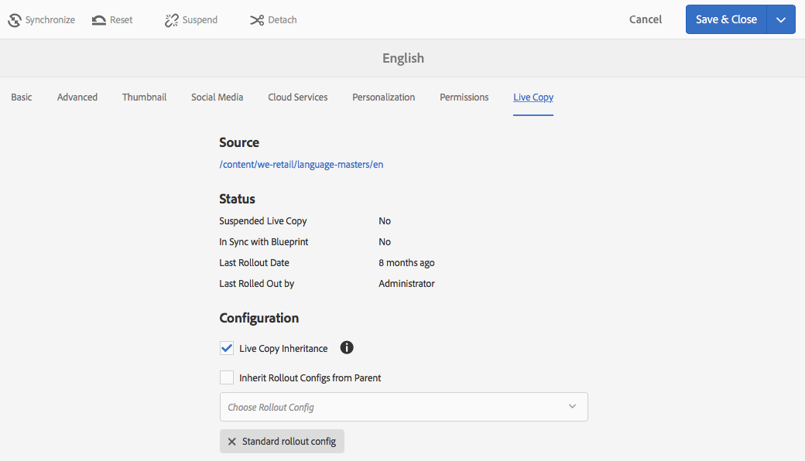

# 创建和同步Live Copy{#creating-and-synchronizing-live-copies}

您可以从页面或Blueprint配置创建Live Copy，然后可以管理继承和同步。

## 管理Blueprint配置{#managing-blueprint-configurations}

Blueprint配置标识要用作一个或多个Live Copy页面源的现有网站。

>[!NOTE]
>
>Blueprint配置允许您将内容更改推送到Live Copy。 请参阅[Live Copy — 源、Blueprint和Blueprint配置](/help/sites-administering/msm.md#source-blueprints-and-blueprint-configurations)。

在创建Blueprint配置时，您需要选择一个模板来定义Blueprint的内部结构。 默认的Blueprint模板假定源网站具有以下特征：

* 网站具有根页面。
* 根的直接子页面是网站的语言分支。 创建Live Copy时，语言将作为可选内容显示，以包含在副本中。
* 每个语言分支的根具有一个或多个子页面。 创建Live Copy时，子页面将显示为可包含在Live Copy中的章节。

>[!NOTE]
>
>不同的结构需要另一个Blueprint模板。

在创建Blueprint配置后，您可以配置以下属性：

* **名称**:Blueprint配置的名称。
* **源路径**:您用作源(Blueprint)的站点的根页面的路径。
* **描述**. （可选）Blueprint配置的描述。 描述将显示在Blueprint配置列表中，供在创建站点时从中进行选择。

在使用Blueprint配置时，您可以将其与转出配置关联，该转出配置可确定源/Blueprint的Live Copy如何同步。 请参阅[指定要使用的转出配置](/help/sites-administering/msm-sync.md#specifying-the-rollout-configurations-to-use)。

### 创建Blueprint配置{#creating-a-blueprint-configuration}

要创建Blueprint配置，请执行以下操作：

1.  导航到“工 **** 具”菜单，然后选择“网 **** 站”菜单。
1. 选择&#x200B;**Blueprints**&#x200B;以打开&#x200B;**Blueprint配置**&#x200B;控制台：

   

1. 选择&#x200B;**创建**。
1. 选择Blueprint模板，然后选择&#x200B;**Next**&#x200B;以继续。
1. 选择要用作Blueprint的源页面；然后，**Next**&#x200B;继续。
1. 定义：

   * **标题**:blueprint的必填标题
   * **描述**:可选描述，用于提供更多详细信息。

1. **** Create将根据您的规范创建Blueprint配置。

### 编辑或删除Blueprint配置{#editing-or-deleting-a-blueprint-configuration}

您可以编辑或删除现有的Blueprint配置：

1.  导航到“工 **** 具”菜单，然后选择“网 **** 站”菜单。
1. 选择&#x200B;**Blueprints**&#x200B;以打开&#x200B;**Blueprint配置**&#x200B;控制台：

   

1. 选择所需的Blueprint配置 — 相应的操作将在工具栏中变得可用：

   * **资产**;您可以使用它查看和编辑配置的属性。
   * **删除**

## 创建 Live Copy {#creating-a-live-copy}

### 创建页面{#creating-a-live-copy-of-a-page}的Live Copy

您可以创建任何页面或分支的Live Copy。 创建Live Copy时，您可以指定用于同步内容的转出配置：

* 选定的转出配置适用于Live Copy页面及其子页面。
* 如果未指定任何转出配置，MSM会确定要使用的转出配置。 请参阅[指定要使用的转出配置](/help/sites-administering/msm-sync.md#specifying-the-rollout-configurations-to-use)。

您可以创建任何页面的Live Copy:

* [Blueprint配置](#creating-a-blueprint-configuration)引用的页面。
* 和与配置无连接的页面。
* AEM还支持在另一个Live Copy的页面中创建Live Copy。

唯一的区别在于源/Blueprint页面上&#x200B;**Rollout**&#x200B;命令的可用性取决于源是否被Blueprint配置引用：

* 如果您从Blueprint配置中引用的&#x200B;**为**&#x200B;的源页面创建Live Copy，则源/Blueprint页面上将提供“转出”命令。
* 如果您从Blueprint配置中未&#x200B;**引用的源页面创建Live Copy，则源/Blueprint页面上将不提供“转出”命令。**

要创建Live Copy，请执行以下操作：

1. 在&#x200B;**Sites**&#x200B;控制台中，选择&#x200B;**创建**，然后选择&#x200B;**Live Copy**。

   

1. 选择源页面，然后单击或点按&#x200B;**下一步**。 例如：

   

1. 指定Live Copy的目标路径（打开Live Copy的父文件夹/页面），然后单击或点按&#x200B;**Next**。

   

   >[!NOTE]
   >
   >目标路径不能在源路径内。

1. 输入：

   * 页面的&#x200B;**标题**。
   * **名称**，在URL中使用。

   

1. 使用&#x200B;**Exclude sub pages**&#x200B;复选框：

   * 已选择：仅创建选定页面的Live Copy（简化Live Copy）
   * 未选择：创建包含选定页面（深层Live Copy）的所有子代的Live Copy

1. （可选）要指定要用于Live Copy的一个或多个转出配置，请使用&#x200B;**转出配置**&#x200B;下拉列表选择它们；选定的配置将显示在下拉选择器下方。
1. 单击或点按&#x200B;**创建**。此时将显示确认消息，您可以从此处选择&#x200B;**Open**&#x200B;或&#x200B;**Done**。

### 从Blueprint配置{#creating-a-live-copy-of-a-site-from-a-blueprint-configuration}创建站点的Live Copy

使用Blueprint配置创建Live Copy，以基于Blueprint（源）内容创建站点。 从Blueprint配置创建Live Copy时，您需要选择要复制的Blueprint源的一个或多个语言分支，然后从语言分支中选择要复制的章节。 请参阅[创建Blueprint配置](/help/sites-administering/msm-livecopy.md#creating-a-blueprint-configuration)。

如果在Live Copy中忽略某些语言分支或章节，则可以稍后添加它们；请参阅[在Live Copy中创建Live Copy（Blueprint配置）](#creating-a-live-copy-inside-a-live-copy-blueprint-configuration)。

>[!CAUTION]
>
>当Blueprint源包含链接和引用以在其他分支中定位段落时，目标不会在Live Copy页面中更新，而会保持指向原始目标。

创建网站时，请提供以下属性的值：

* **初始语言**:要包含在Live Copy中的Blueprint源的语言分支。
* **初始章节**:要包含在Live Copy中的Blueprint语言分支的子页面。
* **目标路径**:Live Copy站点的根页面的位置。
* **标题**:Live Copy站点的根页面的标题。
* **名称**:（可选）存储Live Copy根页面的JCR节点的名称。默认值基于标题。
* **网站所有者**:（可选）
* **Live Copy**:选择此选项可与源站点建立实时关系。如果未选择此选项，则将创建Blueprint的副本，但随后不会与源同步。
* **转出配置**:（可选）选择一个或多个用于同步Live Copy的转出配置。默认情况下，转出配置继承自Blueprint;有关更多详细信息，请参阅[指定要使用的转出配置](/help/sites-administering/msm-sync.md#specifying-the-rollout-configurations-to-use) 。

要从Blueprint配置创建站点的Live Copy，请执行以下操作：

1. 在&#x200B;**Sites**&#x200B;控制台中，选择&#x200B;**创建**，然后从下拉选择器中选择&#x200B;**Site**。
1. 选择要用作Live Copy源的Blueprint配置，然后继续执行&#x200B;**Next**:

   

1. 使用&#x200B;**初始语言**&#x200B;选择器指定Blueprint站点用于Live Copy的语言。

   默认情况下，会选择所有可用语言。 要删除语言，请单击或点按该语言旁边显示的&#x200B;**X**。

   例如：

   

1. 使用&#x200B;**初始章节**&#x200B;下拉列表选择要包含在Live Copy中的Blueprint部分。 同样，所有可用的章节默认包含在内，但可以删除。
1. 为其余属性提供值，然后选择&#x200B;**创建**。 在确认对话框中，选择&#x200B;**Done**&#x200B;以返回到&#x200B;**Sites**&#x200B;控制台，或选择&#x200B;**Open Site**&#x200B;以打开站点的根页面。

### 在Live Copy中创建Live Copy（Blueprint配置）{#creating-a-live-copy-inside-a-live-copy-blueprint-configuration}

在现有Live Copy中创建Live Copy（使用Blueprint配置创建）时，可以插入最初创建Live Copy时未包含的任何语言副本或章节。

## 监控Live Copy {#monitoring-your-live-copy}

### 查看Live Copy的状态{#seeing-the-status-of-a-live-copy}

Live Copy页面的属性显示有关Live Copy的以下信息：

* **来源**:Live Copy页面的源页面。
* **状态**:Live Copy的同步状态。状态包括Live Copy是否与源保持最新，以及上次同步发生的时间和执行同步的人员。
* **配置**:

   * 页面是否仍受Live Copy继承的约束。
   * 配置是否继承自父页面。
   * Live Copy使用的任何转出配置。

要查看属性，请执行以下操作：

1. 在&#x200B;**站点**&#x200B;控制台中，选择Live Copy页面并打开属性。
1. 选择&#x200B;**Live Copy**&#x200B;选项卡。

   例如：

   

   >[!NOTE]
   >
   >有关更多详细信息，另请参阅知识库文章[Livecopy状态消息 — 最新/绿色/同步](https://helpx.adobe.com/experience-manager/kb/livecopy-status-message---up-to-date-green-in-sync.html)。

### 查看Blueprint页面{#seeing-the-live-copies-of-a-blueprint-page}的Live Copy

Blueprint页面（在Blueprint配置中引用）为您提供了使用当前(Blueprint)页面作为源的Live Copy页面列表。 使用此列表可跟踪Live Copy。 该列表显示在[页面属性](/help/sites-authoring/editing-page-properties.md)的&#x200B;**Blueprint**&#x200B;选项卡上。

## 同步Live Copy {#synchronizing-your-live-copy}

### 推出Blueprint {#rolling-out-a-blueprint}

展开Blueprint页面，将内容更改推送到Live Copy。 **Rollout**&#x200B;操作执行使用[On Rollout](/help/sites-administering/msm-sync.md#rollout-triggers)触发器的转出配置。

>[!NOTE]
>
>如果在Blueprint分支和从属Live Copy分支中创建具有相同页面名称的新页面，则可能会发生冲突。
>
>此类[冲突需要在转出](/help/sites-administering/msm-rollout-conflicts.md)时进行处理和解决。

#### 从页面属性{#rolling-out-a-blueprint-from-page-properties}中转出Blueprint

1. 在&#x200B;**站点**&#x200B;控制台中，选择Blueprint中的页面并打开属性。
1. 打开 **Blueprint** 选项卡。
1. 选择&#x200B;**转出**。

   

1. 指定页面和任何子页面，然后使用复选标记进行确认：

   

#### 从引用边栏{#roll-out-a-blueprint-from-the-reference-rail}中推出Blueprint

1. 在&#x200B;**站点**&#x200B;控制台中，选择Blueprint中的页面，然后打开&#x200B;**[引用](/help/sites-authoring/basic-handling.md#references)**&#x200B;面板（从工具栏中）。
1. 从列表中选择&#x200B;**Blueprint**&#x200B;选项，以显示与此页面关联的蓝图。
1. 从列表中选择所需的Blueprint。
1. 单击或点按&#x200B;**转出**。
1. 系统将要求您确认转出的详细信息：

   * **转出范围**:

      指定范围是仅针对所选页面，还是应包含子页面。

   * **背景转出**:

      如果涉及许多页面/子页面，您可以将转出作为后台任务运行。
   

1. 确认这些详细信息后，选择&#x200B;**转出**&#x200B;以执行该操作。

#### 从Live Copy概述{#roll-out-a-blueprint-from-the-live-copy-overview}中推出Blueprint

选择Blueprint页面后，Live Copy概述](/help/sites-administering/msm-livecopy-overview.md#using-the-live-copy-overview)中也提供了[转出操作。

1. 打开[Live Copy概述](/help/sites-administering/msm-livecopy-overview.md#using-the-live-copy-overview)并选择Blueprint页面。
1. 从工具栏中选择&#x200B;**转出**。
1. 指定页面和任何子页面，然后使用复选标记进行确认：

   

### 同步Live Copy {#synchronizing-a-live-copy}

同步Live Copy页面，以将内容更改从源提取到Live Copy。

#### 从页面属性{#synchronize-a-live-copy-from-page-properties}同步Live Copy

同步Live Copy以将更改从源拉入Live Copy。

>[!NOTE]
>
>同步会执行使用[On Rollout](/help/sites-administering/msm-sync.md#rollout-triggers)触发器的转出配置。

1. 在&#x200B;**站点**&#x200B;控制台中，选择Live Copy页面并打开属性。
1. 打开 **Live Copy** 选项卡。
1. 单击或点按&#x200B;**Synchronize**。

   

   将请求确认，使用&#x200B;**Sync**&#x200B;继续。

#### 从Live Copy概述中同步Live Copy {#synchronize-a-live-copy-from-the-live-copy-overview}

选择Live Copy页面后， Live Copy概述](/help/sites-administering/msm-livecopy-overview.md#using-the-live-copy-overview)中也提供了[同步操作。

1. 打开[Live Copy概述](/help/sites-administering/msm-livecopy-overview.md#using-the-live-copy-overview)并选择Live Copy页面。
1. 从工具栏中选择&#x200B;**Synchronize**。
1. 在指定是否要包含以下内容后，在对话框中确认&#x200B;**Rollout**&#x200B;操作：

   * **页面和子页面**
   * **仅页面**

   

## 更改Live Copy内容{#changing-live-copy-content}

要更改Live Copy内容，您可以：

* 向页面中添加防撞栏。
* 通过中断任何页面或组件的Live Copy继承来更新现有内容。

>[!NOTE]
>
>如果您在Live Copy中手动创建新页面，则该页面是Live Copy的本地页面，这意味着它没有要附加到的相应源页面。
>
>创建属于关系一部分的本地页面的最佳实践是在源中创建该页面，然后进行（深层）转出。 这将在本地将页面创建为Live Copy。

>[!NOTE]
>
>如果在Blueprint分支和从属Live Copy分支中创建具有相同页面名称的新页面，则可能会发生冲突。
>
>此类[冲突需要在转出](/help/sites-administering/msm-rollout-conflicts.md)时进行处理和解决。

### 将组件添加到Live Copy页面{#adding-components-to-a-live-copy-page}

随时将组件添加到Live Copy页面。 Live Copy及其段落系统的继承状态无法控制您添加组件的功能。

将Live Copy页面与源页面同步后，添加的组件保持不变。 另请参阅[更改Live Copy页面上组件的顺序](#changing-the-order-of-components-on-a-live-copy-page)。

>[!NOTE]
>
>在本地对标记为容器的组件所做的更改将不会被转出中Blueprint的内容覆盖。 有关更多信息，请参阅[MSM最佳实践](/help/sites-administering/msm-best-practices.md#components-and-container-synchronization)。

### 暂停页面{#suspending-inheritance-for-a-page}的继承

创建Live Copy时，Live Copy配置会保存在复制页面的根页面上。 根页面的所有子页面都将继承Live Copy配置。 Live Copy页面上的组件也会继承Live Copy配置。

您可以暂停Live Copy页面的Live Copy继承，以便更改页面属性和组件。 暂停继承时，页面属性和组件不再与源同步。

>[!NOTE]
>
>您还可以从Live Copy](#detaching-a-live-copy)的Blueprint中分离[以删除所有连接。 “分离”操作是永久性的，且不可撤消。

>[!NOTE]
>
>如果将组件标记为容器，则取消和暂停操作不会应用到其子组件。 另请参阅[MSM最佳实践](/help/sites-administering/msm-best-practices.md#components-and-container-synchronization)以了解更多信息。

#### 暂停页面属性{#suspending-inheritance-from-page-properties}中的继承

要暂停页面上的继承，请执行以下操作：

1. 使用&#x200B;**Sites**&#x200B;控制台的&#x200B;**View Properties**&#x200B;命令或使用页面工具栏上的&#x200B;**Page Information**&#x200B;打开Live Copy页面的属性。
1. 单击或点按&#x200B;**Live Copy**&#x200B;选项卡。
1. 从工具栏中选择&#x200B;**暂停**。 然后，您可以选择以下任一项：

   * **暂停**:仅当前页面
   * **暂停并包含子项**:当前页面以及任何子页面

1. 在确认对话框中选择&#x200B;**Suspend**。

#### 暂停Live Copy中的继承概述{#suspending-inheritance-from-the-live-copy-overview}

选择Live Copy页面后， Live Copy概述](/help/sites-administering/msm-livecopy-overview.md#using-the-live-copy-overview)中也提供了[暂停操作。

1. 打开[Live Copy概述](/help/sites-administering/msm-livecopy-overview.md#using-the-live-copy-overview)并选择Live Copy页面。
1. 从工具栏中选择&#x200B;**暂停**。
1. 从以下位置选择相应的选项：

   * **暂停**
   * **与子项一起暂停**

   

1. 在**暂停Live Copy **对话框中确认&#x200B;**暂停**&#x200B;操作：

   

### 恢复页面{#resuming-inheritance-for-a-page}的继承

暂停页面的Live Copy继承是一项临时操作。 暂停后，**恢复**&#x200B;操作将变为可用，允许您恢复实时关系。

重新启用继承时，页面不会自动与源同步。 如果需要，您可以请求同步：

* 在&#x200B;**恢复**/**恢复**&#x200B;对话框中；例如：

   

* 在稍后阶段，通过手动选择同步操作。

>[!CAUTION]
>
>重新启用继承时，页面不会自动与源同步。 如果需要，您可以手动请求同步；恢复或稍后恢复时。

#### 从页面属性{#resuming-inheritance-from-page-properties}中恢复继承

在[suspended](#suspending-inheritance-from-page-properties)后，**Resume**&#x200B;操作将变为页面属性的工具栏中：

选择后，将显示对话框。 您可以根据需要选择同步，然后确认操作。

#### 从Live Copy概述中恢复Live Copy页面{#resume-a-live-copy-page-from-the-live-copy-overview}

选择Live Copy页面后， Live Copy概述](/help/sites-administering/msm-livecopy-overview.md#using-the-live-copy-overview)中也提供了[恢复操作。

1. 打开[Live Copy概述](/help/sites-administering/msm-livecopy-overview.md#using-the-live-copy-overview)并选择已暂停的Live Copy页面；将显示为&#x200B;**INHERITANCE CANCELLED**。
1. 从工具栏中选择&#x200B;**恢复**。
1. 指示是否要在还原继承后同步该页面，然后在**恢复Live Copy **对话框中确认&#x200B;**Resume**&#x200B;操作。

### 更改继承深度（浅层/深层）{#changing-inheritance-depth-shallow-deep}

在现有Live Copy上，您可以更改页面的深度；即是否包含子页面。

* 切换到浅层Live Copy:

   * 将立即生效，并且不可撤销。

      * 子页面会与Live Copy明确分离。 如果撤消，则无法保留对子项的进一步修改。
   * 将删除任何子体`LiveRelationships`，即使存在嵌套`LiveCopies`。

* 切换到深层Live Copy:

   * 子页面仍未更改。
   * 要了解交换机的效果，您可以进行转出，任何内容修改都将根据转出配置进行应用。

* 切换到浅层Live Copy，然后返回深层：

   * 浅层Live Copy的所有子项都会被视为已手动创建，因此会使用`[oldname]_msm_moved name`移开。

要指定或更改深度，请执行以下操作：

1. 使用&#x200B;**Sites**&#x200B;控制台的&#x200B;**View Properties**&#x200B;命令或使用页面工具栏上的&#x200B;**Page Information**&#x200B;打开Live Copy页面的属性。
1. 单击或点按&#x200B;**Live Copy**&#x200B;选项卡。
1. 在&#x200B;**Configuration**&#x200B;部分中，根据是否包含子页面，设置或清除&#x200B;**Live Copy继承**&#x200B;选项：

   * 选中 — 深层Live Copy（包含子页面）
   * 清除 — 简化Live Copy（排除子页面）

   >[!CAUTION]
   >
   >切换到浅层Live Copy将立即生效，并且不可撤销。
   >
   >有关更多信息，请参阅[Live Copy — 组合](/help/sites-administering/msm.md#live-copies-composition)。

1. 单击或点按&#x200B;**Save**&#x200B;以保留您的更新。

### 取消组件{#cancelling-inheritance-for-a-component}的继承

取消组件的Live Copy继承，以便该组件不再与源组件同步。 如果需要，您可以稍后启用继承。

>[!NOTE]
>
>如果将组件标记为容器，则取消和暂停操作不会应用到其子组件。 另请参阅[MSM最佳实践](/help/sites-administering/msm-best-practices.md#components-and-container-synchronization)以了解更多信息。

>[!NOTE]
>
>重新启用继承时，组件不会自动与源同步。 如果需要，您可以手动请求同步。

取消继承以更改组件内容或删除组件：

1. 单击或点按要取消继承的组件。

   

1. 在组件工具栏上，单击或点按&#x200B;**取消继承**&#x200B;图标。

   

1. 在取消继承对话框中，使用&#x200B;**Yes**&#x200B;确认操作。

   组件工具栏已更新以包含所有（相应）编辑命令。

### 为组件{#re-enabling-inheritance-for-a-component}重新启用继承

要为组件启用继承，请单击或点按组件工具栏上的&#x200B;**重新启用继承**&#x200B;图标。

### 更改Live Copy页面上组件的顺序{#changing-the-order-of-components-on-a-live-copy-page}

如果Live Copy包含属于段落系统的组件，则该段落系统的继承符合以下规则：

* 即使已建立继承，也可以修改继承段落系统中组件的顺序。
* 转出后，组件的顺序将从Blueprint中恢复。 如果在转出之前已将新组件添加到Live Copy，则会对它们以及上面添加它们的组件进行重新排序。
* 如果取消段落系统的继承，组件的顺序将在转出时不会恢复，并将保持在Live Copy中的状态。

>[!NOTE]
>
>在段落系统上还原已取消的继承时，组件&#x200B;**的顺序将不会自动从Blueprint中还原**。 如果需要，您可以手动请求同步。

请按照以下步骤取消段落系统的继承。

1. 打开Live Copy页面。
1. 将现有组件拖动到页面上的新位置。
1. 在&#x200B;**取消继承**&#x200B;对话框中，使用&#x200B;**Yes**&#x200B;确认操作。

### 覆盖Live Copy页面{#overriding-properties-of-a-live-copy-page}的属性

默认情况下，Live Copy页面的页面属性会从源页面继承（且不可编辑）。

当您需要更改Live Copy的属性值时，可以取消属性的继承。 链接图标表示已为属性启用继承。

取消继承时，可以更改属性值。 断开链接图标表示继承已取消。

您稍后可以根据需要为属性重新启用继承。

>[!NOTE]
>
>重新启用继承时，Live Copy页面属性不会自动与源属性同步。 如果需要，您可以手动请求同步。

1. 使用页面工具栏上的&#x200B;**站点**&#x200B;控制台或&#x200B;**页面信息**&#x200B;图标的&#x200B;**查看属性**&#x200B;选项打开Live Copy页面的属性。
1. 要取消属性的继承，请单击或点按资产右侧显示的链接图标。

   

1. 在&#x200B;**取消继承**&#x200B;确认对话框中，单击或点按&#x200B;**是**。

### 还原Live Copy页面{#revert-properties-of-a-live-copy-page}的属性

要启用属性的继承，请单击或点按属性旁边显示的&#x200B;**还原继承**&#x200B;图标。

### 重置Live Copy页面{#resetting-a-live-copy-page}

将Live Copy页面重置为：

* 删除所有继承取消和
* 将页面返回到与源页面相同的状态。

重置会影响您对页面属性、段落系统和组件所做的更改。

#### 从页面属性{#reset-a-live-copy-page-from-the-page-properties}中重置Live Copy页面

1. 在&#x200B;**站点**&#x200B;控制台中，选择Live Copy页面，然后选择&#x200B;**查看属性**。
1. 打开 **Live Copy** 选项卡。
1. 从工具栏中选择&#x200B;**Reset**。

   

1. 在&#x200B;**重置Live Copy**&#x200B;对话框中，使用&#x200B;**重置**&#x200B;进行确认。

#### 从Live Copy概述中重置Live Copy页面{#reset-a-live-copy-page-from-the-live-copy-overview}

选择Live Copy页面后， Live Copy概述](/help/sites-administering/msm-livecopy-overview.md#using-the-live-copy-overview)中也提供了[重置操作。

1. 打开[Live Copy概述](/help/sites-administering/msm-livecopy-overview.md#using-the-live-copy-overview)并选择Live Copy页面。
1. 从工具栏中选择&#x200B;**Reset**。
1. 在&#x200B;**重置Live Copy**&#x200B;对话框中确认&#x200B;**Reset**&#x200B;操作：

   

## 将Live Copy页面与Blueprint页面{#comparing-a-live-copy-page-with-a-blueprint-page}进行比较

要跟踪您所做的更改，您可以在&#x200B;**引用**&#x200B;中查看Blueprint页面，并将其与其Live Copy页面进行比较：

1. 在&#x200B;**站点**&#x200B;控制台中， [导航到Blueprint或Live Copy页面并选择它](/help/sites-authoring/basic-handling.md#viewing-and-selecting-resources)。
1. 打开&#x200B;**[References](/help/sites-authoring/basic-handling.md#references)**&#x200B;面板，然后选择：

   * **Blueprint** （选择Live Copy页面时）
   * **Live Copy** （当选择Blueprint页面时）

1. 选择您的特定Live Copy，然后执行以下任一操作：

   * **与Blueprint比较** （选择Live Copy页面时）
   * **与Live Copy比较** （选择Blueprint页面时）

   例如：

   

1. 两个页面（Live Copy和Blueprint）将并排打开。

   有关使用此功能的完整信息，请参阅[页面差异](/help/sites-authoring/page-diff.md)。

## 分离Live Copy {#detaching-a-live-copy}

“分离”会永久删除Live Copy及其源/Blueprint页面之间的Live关系。 所有与MSM相关的属性都将从Live Copy中删除，并且Live Copy页面会成为独立副本。

>[!CAUTION]
>
>在分离Live Copy后，无法恢复Live关系。
>
>要删除与稍后恢复该关系选项的Live关系，您可以[取消页面的Live Copy继承](#suspending-inheritance-for-a-page)。

对于使用&#x200B;**Detach**&#x200B;的树中的位置，会产生以下影响：

* **在LiveCopy的根页面上分离**

   在Live Copy的根页面上执行此操作时，会删除Blueprint的所有页面与其Live Copy之间的Live关系。

   对Blueprint中的页面（原样）**的进一步更改不会**&#x200B;影响Live Copy（原样）。

* **在LiveCopy的子页面上分离**

   当对Live Copy中的子页面（或分支）执行此操作时：

   * 将删除该子页面（或分支）的实时关系
   * 和live copy分支中的（子）页面会被视为是手动创建的。

   *但是*，子页面仍受父分支的实时关系的约束，因此进一步转出Blueprint页面将同时执行以下操作：

   1. 重命名分离的页面：

      * 这是因为MSM将它们视为手动创建的页面，这些页面会导致冲突，因为它们的名称与它尝试创建的Live Copy页面的名称相同。
   1. 使用原始名称创建新(Live Copy)页面，其中包含转出中所做的更改。

   >[!NOTE]
   >
   >有关此类情况的详细信息，请参阅[MSM转出冲突](/help/sites-administering/msm-rollout-conflicts.md)。

### 从页面属性{#detach-a-live-copy-page-from-the-page-properties}中分离Live Copy页面

要分离Live Copy，请执行以下操作：

1. 在&#x200B;**站点**&#x200B;控制台中，选择Live Copy页面，然后单击或点按&#x200B;**查看属性**。
1. 打开 **Live Copy** 选项卡。
1. 在工具栏中，选择&#x200B;**Detach**。

   

1. 此时将显示确认对话框，选择&#x200B;**Detach**&#x200B;以完成操作。

### 在Live Copy概述{#detach-a-live-copy-page-from-the-live-copy-overview}中分离Live Copy页面

选择Live Copy页面后， Live Copy概述](/help/sites-administering/msm-livecopy-overview.md#using-the-live-copy-overview)中也提供了[分离操作。

1. 打开[Live Copy概述](/help/sites-administering/msm-livecopy-overview.md#using-the-live-copy-overview)并选择Live Copy页面。
1. 从工具栏中选择&#x200B;**Detach**。
1. 在&#x200B;**分离Live Copy**&#x200B;对话框中确认&#x200B;**Detach**&#x200B;操作：

   
