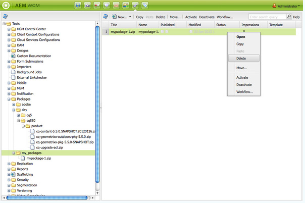

# How to Work With Packages{#how-to-work-with-packages}

包允许导入和导出存储库内容。 例如，您可以使用包安装新功能、在实例之间传输内容以及备份存储库内容。

可以从以下页面访问和／或维护包：

* [包管理器](#package-manager)，用于管理本地AEM实例中的包。

* [包共享](#package-share)，一个集中服务器，它既包含公开可用的包，又包含您公司的私有包。 公共包可包含修补程序、新功能、文档等。

可以在包管理器、包共享和文件系统之间传输包。

## 什么是包？ {#what-are-packages}

包是一个zip文件，其中以文件系统序列化（称为“保管库”序列化）的形式存放存储库内容。 这为文件和文件夹提供了易于使用和编辑的表示形式。

包包括使用过滤器选择的内容（包括页面内容和项目相关内容）。

包中还包含保管库元信息，包括过滤器定义和导入配置信息。 包中可包含其他内容属性(不用于包提取)，如描述、可视图像或图标； 这些属性仅用于内容包使用者和信息用途。

>[!NOTE]
>
>包代表构建包时内容的当前版本。 它们不包括AEM保留在存储库中的任何旧版本的内容。

您可以对包或对包执行以下操作：

* 创建新包； 根据需要定义包设置和过滤器
* 预览包内容（生成前）
* 构建包
* 视图包信息
* 视图包内容（构建后）
* 修改现有包的定义
* 重建现有包
* 重新包装包
* 将包从AEM下载到文件系统
* 将包从文件系统上传到本地AEM实例
* 安装前验证包内容
* 执行练习安装
* 安装包(AEM上传后不自动安装包)
* 删除包
* 从包共享库下载包（如修补程序）
* 将包上传到包共享库的公司内部部分

## 包信息 {#package-information}

包定义由各种类型的信息组成：

* [包设置](#package-settings)
* [包过滤器](#package-filters)
* [打包屏幕截图](#package-screenshots)
* [包图标](#package-icons)

### 包设置 {#package-settings}

您可以编辑各种“包设置”来定义包描述、相关错误、依赖关系和提供程序信息等方面。

在创 **建或编辑** 包时 **，可通过“编辑**[”按钮使](#creating-a-new-package) 用“包设 [置”对话框，并](#viewing-and-editing-package-information) 提供三个用于配置的选项卡。 进行任何更改后，单击“ **确定** ”以保存这些更改。


| **字段** | **描述** |
|---|---|
| 名称 | 包的名称。 |
| 组 | 要添加包的组的名称，用于组织包。 键入新用户组的名称，或选择现有用户组。 |
| 版本 | 用于自定义版本的文本。 |
| 描述 | 包的简要说明。 HTML标记可用于格式化。 |
| 缩略图 | 随包列表一起显示的图标。 单击“浏览”以选择本地文件。 |


<table> 
 <tbody> 
  <tr> 
   <th><strong>字段</strong></th> 
   <th><strong>描述</strong></th> 
   <th><strong>格式／示例</strong></th> 
  </tr> 
  <tr> 
   <td>名称</td> 
   <td>提供者的名称。</td> 
   <td><em>AEMGeometrixx<br /> </em></td> 
  </tr> 
  <tr> 
   <td>URL</td> 
   <td>提供程序的URL。</td> 
   <td><em>https://www.aem-geometrixx.com</em></td> 
  </tr> 
  <tr> 
   <td>链接</td> 
   <td>指向提供程序页面的包特定链接。</td> 
   <td><em>https://www.aem-geometrixx.com/mypackage.html</em></td> 
  </tr> 
  <tr> 
   <td>需要<br /> </td> 
   <td> 
    <ul> 
     <li>管理员： 选择何时包只能由具有管理员权限的帐户安装。</li> 
     <li>重新启动： 选择安装包后需要重新启动服务器的时间。</li> 
    </ul> </td> 
   <td> </td> 
  </tr> 
  <tr> 
   <td>AC 处理</td> 
   <td><p>指定在导入包时如何处理包中定义的访问控制信息：</p> 
    <ul> 
     <li><strong>忽略</strong></li> 
     <li><strong>覆盖</strong></li> 
     <li><strong>合并</strong></li> 
     <li><strong>清除</strong></li> 
     <li><strong>MergePreserve</strong></li> 
    </ul> <p>The default value is <strong>Ignore</strong>.</p> </td> 
   <td> 
    <ul> 
     <li><strong>忽略</strong> -保留存储库中的ACL</li> 
     <li><strong>覆盖</strong> -覆盖存储库中的ACL</li> 
     <li><strong>合并</strong> -合并两组ACL</li> 
     <li><strong>清除</strong> -清除ACL</li> 
     <li><strong>MergePreserve</strong> —— 通过添加内容中不存在的承担者的访问控制项，将内容中的访问控制与包中提供的合并</li> 
    </ul> </td> 
  </tr> 
 </tbody> 
</table>


| **字段** | **描述** | **格式／示例** |
|---|---|---|
| 已通过 | 此包的目标产品名称和版本或与之兼容的版本。 | *AEM6* |
| 修复的错误／问题 | 允许您列表此包修复的错误的详细信息的文本字段。 请在单独的行上列表每个错误。 | bug-nr摘要 |
| 依赖于 | 列表依赖关系信息，当需要其他包时需要遵守这些信息才能让当前包按预期运行。 使用修补程序时，此字段很重要。 | groupId:name:version |
| 替换 | 替换此包的已弃用包的列表。 在安装之前，请检查此包是否包含来自废弃包的所有必要内容，以便不覆盖任何内容。 | groupId:name:version |

### 包过滤器 {#package-filters}

过滤器标识要包含在包中的存储库节点。 筛 **选器定义** 指定以下信息：

* 要 **包含的内** 容的根路径。
* **包含** 或排除根路径下的特定节点的规则。

过滤器可以包含零个或多个规则。 未定义规则时，包包含根路径下的所有内容。

您可以为包定义一个或多个筛选器定义。 使用多个筛选器来包含来自多个根路径的内容。


下表介绍了这些规则并提供了示例：

<table> 
 <tbody> 
  <tr> 
   <th> 规则类型</th> 
   <th>描述 </th> 
   <th>示例 </th> 
  </tr> 
  <tr> 
   <td> 包括</td> 
   <td>您可以定义路径，或使用常规表达式指定要包括的所有节点。<br /> <br /> 包含目录将： 
    <ul> 
     <li>包括该 <i>目录</i> ，以及该目录中的所有文件和文件夹（即整个子树）</li> 
     <li><strong>不包含</strong> 指定根路径下的其他文件或文件夹</li> 
    </ul> </td> 
   <td>/libs/sling/install(/)*)? </td> 
  </tr> 
  <tr> 
   <td> 排除</td> 
   <td>可以指定路径或使用常规表达式来指定要排除的所有节点。<br /> <br /> 排除目录将排除该目 <i>录</i> 、该目录中的所有文件和文件夹（即整个子树）。<br /> </td> 
   <td>/libs/wcm/foundation/components(/)*)?</td> 
  </tr> 
 </tbody> 
</table>

>[!NOTE]
>
>一个包可以包含多个筛选器定义，以便将来自不同位置的节点轻松组合到一个包中。

包过滤器最常在您首次创建包 [时进行定义](#creating-a-new-package)，但也可以在以后编辑它们（之后应重新构建包）。

### 打包屏幕截图 {#package-screenshots}

您可以将屏幕截图附加到包中，以直观呈现内容的外观； 例如，提供新功能的截屏。

### 包图标 {#package-icons}

您还可以将图标附加到包中，以快速参考包中包含的内容的可视化演示。 然后，此列表会显示在包中，它可以帮助您轻松识别包或包类别。

由于包中可以包含图标，因此正式包使用以下约定：

>[!NOTE]
>
>要避免混淆，请为包使用描述性图标，而不要使用其中一个官方图标。

正式修补程序包：


正式的AEM安装或扩展包：

正式功能包：


## Package Manager {#package-manager}

包管理器管理本地AEM安装上的包。 分配了必 [要权限后](#permissions-needed-for-using-the-package-manager) ，您可以使用包管理器执行各种操作，包括配置、构建、下载和安装包。 要配置的关键元素包括：

* [包设置](#package-settings)
* [包过滤器](#package-filters)

### 使用包管理器所需的权限 {#permissions-needed-for-using-the-package-manager}

要授予用户创建、修改、上传和安装包的权利，您必须在以下位置为他们授予适当的权限：

* **/etc/packages** （删除除外）
* 包含包内容的节点

有关 [更改权限](/help/sites-administering/security.md) 的说明，请参阅设置权限。

### Creating a New Package {#creating-a-new-package}

要创建新包定义，请执行以下操作：

1. 在AEM欢迎屏幕上，单 **击** “包”(或在“工具 **”控制台多次** 中 **，单击“**&#x200B;包”)。

1. 然后选择 **包管理器**。
1. 单击“ **创建包**”。

   >[!NOTE]
   >
   >如果实例包含大量包，则可能存在文件夹结构，因此，您可以在创建新包之前导航到所需的目标文件夹。

1. 在对话框中：

   

   输入：

   * **组名称**

      目标组（或文件夹）名称。 组旨在帮助您组织包。

      如果组尚不存在，则将为其创建文件夹。 如果将组名称留空，它将在主包列表（“主页”>“包”）中创建包。

   * **包名称**

      新包的名称。 选择一个描述性名称，帮助您（和其他人）轻松识别包的内容。

   * **版本**

      用于指示版本的文本字段。 这将附加到包名称中，以构成zip文件的名称。
   单击 **“确** 定”以创建包。

1. AEM列表相应组文件夹中的新包。

   

   单击要打开的图标或包名称。

   

   >[!NOTE]
   >
   >如果需要，您可以在以后的阶段返回此页。

1. 单击 **“编辑** ”以编辑 [包设置](#package-settings)。

   在此，您可以添加信息和／或定义某些设置； 例如，这包括描述、图 [标](#package-icons)、相关错误和添加提供程序详细信息。

   编辑 **完设** 置后，单击“确定”。

1. 根 **[据需要](#package-screenshots)**，将截屏添加到包。 创建包时有一个实例可用，使用Sidekick中的包屏幕截图根据需要添&#x200B;**加更多**。

   通过多次单击“屏幕截图”区域中的图像组 **件** ，添加图像，然后单击“确 **定”来添加实际图像**。

1. 定义 **[包过滤器](#package-filters)**，方法是从Sidekick中拖&#x200B;**动过滤器定义的**实例，然后多次单击以打开进行编辑：

   

   指定：

   * **根路径**&#x200B;要打包的内容； 这可以是子树的根。
   * **规则**&#x200B;规则是可选的； 对于简单的包定义，无需指定包括或排除规则。

      如果需要，您可以定 [**义Include ****&#x200B;或Exclude **规](#package-filters)则，以准确定义包内容。

      使用+符号添 **加规则** ，或者使用——符号 **删除规则** 。 规则会根据规则的顺序应用，因此使用“上移”和“下移”按 **钮** ，根 **据需要** 定位它们。
   然后，单 **击** “确定”以保存过滤器。

   >[!NOTE]
   >
   >您可以根据需要使用任意数量的筛选器定义，但必须谨慎确保它们不发生冲突。 使 **用预览** ，确认包内容将包含哪些内容。

1. 要确认包的存放方式，您可以使用 **预览**。 这将执行构建过程的练习，并列表将在实际构建包时添加到包的所有内容。
1. 您现在可 [以构](#building-a-package) 建包。

   >[!NOTE]
   >
   >此时不强制构建包，可在以后某个时间完成。

### 构建包 {#building-a-package}

通常，在创建包定义的同时 [构建包](#creating-a-new-package)，但可以在以后的时间返回构建或重建包。 如果存储库中的内容已更改，则此功能可能很有用。

>[!NOTE]
>
>在构建包之前，预览包的内容可能会很有用。 要执行此操作，请单击 **预览**。

1. 从“包管理器” **中打开包定义** （单击包图标或名称）。

1. 单击“ **生成**”。 将显示一个对话框，要求您确认是否要构建包。

   >[!NOTE]
   >
   >当您重建包时，这尤其重要，因为将覆盖包内容。

1. 单击&#x200B;**确定**。AEM将构建包，并按照其方式列出添加到包的所有内容。 完成AEM后，将显示确认，确认已构建包，并（关闭对话框时）更新包列表信息。

### 重新打包包 {#rewrapping-a-package}

构建包后，可以根据需要重新打包。

重新打包会更改包信息- *而不* 更改包内容。 包信息是缩览图、描述等，换言之，您可以通过“包设置”对话框编辑的 **一切内容** (要打开此选项，请单击“ **编辑**”)。

重新包装的主要用例是为包共享准备包。 例如，您可能有一个现有包，并决定与他人共享它。 要添加缩略图并添加说明。 您不必使用其所有功能重新创建整个包（可能需要一些时间，并且有可能使包不再与原始包相同），而是重新包装它，只需添加缩略图和说明。

1. 从“包管理器” **中打开包定义** （单击包图标或名称）。

1. 单击 **“编辑** ”，然后根 **[据需要更](#package-settings)**新“包设置”。 单击&#x200B;**确定**进行保存。

1. 单击 **“重新**&#x200B;换行”，将显示一个对话框要求进行确认。

### 查看和编辑包信息 {#viewing-and-editing-package-information}

要视图或编辑有关包定义的信息：

1. 在包管理器中，导航到要视图的包。
1. 单击要视图的包的包图标。 此操作将打开包页面，其中列出有关包定义的信息：

   

   >[!NOTE]
   >
   >您还可以通过此页编辑并对包执行某些操作。
   >
   >可用的按钮取决于包是否已构建。

1. 如果包已经构建，请单 **击**“内容”，将打开一个窗口并列表包的整个内容：

### 查看包内容和测试安装 {#viewing-package-contents-and-testing-installation}

生成包后，您可以视图内容：

1. 在包管理器中，导航到要视图的包。
1. 单击要视图的包的包图标。 这将打开包页面，其中列出有关包定义的信息。

1. 要视图内容，请 **单击**“内容”，此时将打开一个窗口并列表包的整个内容：

   

1. 要执行安装的练习，请单击“测试 **安装”**。 确认操作后，将打开一个窗口并列表结果，就像执行了安装一样：

   

### 将包下载到文件系统 {#downloading-packages-to-your-file-system}

本节介绍如何使用包管理器将包从AEM下载到文 **件系统**。

>[!NOTE]
>
>请参 [阅包共享](#package-share) ，了解有关从公共区域和公司的内部包共享区域下载修补程序、功能包和包的信息。
>
>从包共享中，您可以：
>
>* 将包从包共 [享直接下载到本地AEM实例](#downloading-and-installing-packages-from-package-share)。\
   >  下载包后，该包会导入到您的存储库中，之后，您可以使用包管理器立即将其安装到您的本 **地实例上**。 这些包包括修补程序和其他共享包。
   >
   >
* 将包从包共 [享下载到文件系统](#downloading-packages-to-your-file-system-from-package-share)。

>


1. 在AEM欢迎屏幕上，单击“ **包**”，然后选择 **“包管理器”**。
1. 导航到要下载的包。

   

1. 单击要下载的包的zip文件名称（带下划线）所形成的链接； 例如 `export-for-offline.zip`,

   AEM将软件包下载到您的计算机（使用标准浏览器下载对话框）。

### 从文件系统上传包 {#uploading-packages-from-your-file-system}

包上传允许您从文件系统将包上传到AEM包管理器。

>[!NOTE]
>
>请参 [阅将包上传到公司内部包共享](#uploading-a-package) ，以将包上传到公司的包共享的专用区域。

要上传包，请执行以下操作：

1. 导航到包 **管理器**。 然后，转到要将包上载到的组文件夹。

   

1. 单击“ **上传包”**。

   

   * **文件**

      您可以直接键入文件名，或使用“浏 **览……** ”对话框从本地文件系统中选择所需的包(选择后，单击“ **确定**”)。

   * **强制上传**

      如果具有此名称的包已存在，则可以单击此按钮强制上传（并覆盖现有包）。
   单 **击** “确定”，以上传新包并在“包管理器”列表中列出。

   >[!NOTE]
   >
   >要使内容可供AEM使用，请务必安 [装软件包](#installing-packages)。

### 验证包 {#validating-packages}

在安装包之前，您可能希望验证其内容。 由于包可以修改ACL下 `/apps` 的叠加文件和／或添加、修改和删除ACL，因此在安装前验证这些更改通常很有用。

#### 验证选项 {#validation-options}

验证机制可以检查包的以下特性：

* OSGi包导入
* 叠加
* ACL

这些选项详见下文。

* **验证 OSGi 包的导入情况**

   **检查的内容**

   此验证检查所有JAR文件（OSGi捆绑包）的包，提取其 `manifest.xml` （其中包含所述OSGi捆绑包所依赖的版本化依赖关系），并验证AEM实例将所述依赖关系导出为正确的版本。

   **报告方式**

   AEM实例无法满足的任何版本化依赖项列在包管理 **器的活动** 日志中。

   **错误状态**

   如果依赖项不满足，则包中包含这些依赖项的OSGi捆绑包将不开始。 这会导致应用程序部署中断，因为任何依赖未启动的OSGi捆绑包的部署都将无法正常工作。

   **错误解决**

   要解决由于未满足要求的OSGi捆绑包导致的错误，需要调整捆绑包中具有未满足要求的导入的依赖关系版本。

* **验证覆盖**

   **检查的内容**

   此验证确定要安装的包是否包含已覆盖到目标AEM实例中的文件。

   例如，给定现有叠加(位 `/apps/sling/servlet/errorhandler/404.jsp`于)，包含的 `/libs/sling/servlet/errorhandler/404.jsp`包，这样它将更改位于的现有文件 `/libs/sling/servlet/errorhandler/404.jsp`。

   **报告方式**

   包管理器的活动日志 **中介绍了** 任何此类叠加。

   **错误状态**

   错误状态意味着包正在尝试部署已覆盖的文件，因此包中的更改将被叠加覆盖（从而“隐藏”），而不会生效。

   **错误解决**

   要解决此问题，其中叠加文件的维护人员必须 `/apps` 查看中对叠加文件所做的更改，并根 `/libs` 据需要将更改合并到叠加()中，然后重新部署叠加 `/apps`文件。

   >[!NOTE]
   >
   >请注意，如果叠加文件中正确并入了叠加内容，验证机制将无法进行协调。 因此，即使进行了必要的更改，此验证仍会继续报告冲突。

* **验证 ACL**

   **检查的内容**

   此验证检查正在添加哪些权限，如何处理这些权限（合并／替换），以及当前权限是否受到影响。

   **报告方式**

   这些权限在包管理器 **的活动** 日志中有介绍。

   **错误状态**

   不能提供显式错误。 验证只指示是否会添加或影响任何新的ACL权限。

   **错误解决**

   使用验证提供的信息，可以在CRXDE中查看受影响的节点，并根据需要在包中调整ACL。

   >[!CAUTION]
   >
   >作为最佳实践，建议软件包不要影响AEM提供的ACL，因为这可能导致意外的产品行为。

#### 执行验证 {#performing-validation}

可以通过两种不同的方式验证包：

* 通过包管理器UI
* 通过HTTPPOST请求（如与cURL一起）

>[!NOTE]
>
>上传包后但安装包之前，应始终进行验证。

**通过包管理器进行包验证**

1. 在打开包管理器 `https://<server>:<port>/crx/packmgr`
1. 在列表中选择包，然后从标 **题中** ，选择更多， **然后从下拉** 菜单中选择“验证”。

   >[!NOTE]
   >
   >这应在上传内容包后完成，但在安装该包之前完成。

1. 在随后出现的模态对话框中，使用复选框选择验证类型，并通过单击验证开始 **验证**。 或者，单击 **取消**。

1. 然后运行所选验证。 结果显示在包管理器的活动日志中。

**通过HTTPPOST请求进行包验证**

POST请求采用以下形式。

```
https://<host>:<port>/crx/packmgr/service.jsp?cmd=validate&type=osgiPackageImports,overlays,acls
```

>[!NOTE]
>
>该参 `type` 数可以是以逗号分隔的无序列表，包括：
>
>* `osgiPackageImports`
>* `overlays`
>* `acls`

>
>
如果未传 `type` 递， `osgiPackageImports` 则默认值为。

以下是使用cURL执行包验证的示例。

1. 如果使用cURL，则执行类似于以下语句：

   ```shell
   curl -v -X POST --user admin:admin -F file=@/Users/SomeGuy/Desktop/core.wcm.components.all-1.1.0.zip 'http://localhost:4502/crx/packmgr/service.jsp?cmd=validate&type=osgiPackageImports,overlays,acls'
   ```

1. 将运行所请求的验证，并将响应作为JSON对象发回。

>[!NOTE]
>
>对验证HTTPPOST请求的响应将是JSON对象，验证结果为。

### 安装包 {#installing-packages}

上传包后，您需要安装该内容。 要安装包内容并使其正常工作，它必须同时具备以下两种功能：

* 加载到AEM(从 [文件系统上传](#uploading-packages-from-your-file-system)[或从包共享下载](#downloading-and-installing-packages-from-package-share))

* 已安装

>[!CAUTION]
>
>安装包可覆盖或删除现有内容。 仅在您确定不删除或覆盖您需要的内容时上传包。
>
>要查看包的内容或影响，您可以：
>
>* 无需修改任何内容即可对包执行测试安装：\
   >  打开包（单击包图标或名称），然后单击“测 **试安装”**。
   >
   >
* 请参阅包内容列表:\
   >  打开包，然后单击“ **内容**”。

>


>[!NOTE]
>
>在安装包之前，会立即创建一个快照包，以包含将被覆盖的内容。
>
>卸载包时，将重新安装此快照。

>[!CAUTION]
>
>如果您正在安装数字资产，则必须：
>
>* 首先，取消激活WorkflowLauncher。\
   >  使用OSGi控制台的“组件”菜单选项取消激活 `com.day.cq.workflow.launcher.impl.WorkflowLauncherImpl`。
   >
   >
* 然后，在安装完成后，重新激活WorkflowLauncher。
>
>
取消激活WorkflowLauncher可确保资产导入程序框架在安装时不会（无意中）操作资产。

1. 在“包管理器”中，导航到要安装的包。

   尚未 **安装** 的包的一侧会显示“安装”按钮。

   >[!NOTE]
   >
   >或者，也可以通过单击包的图标打开包，以访问该 **包的** “安装”按钮。

1. 单击 **“安装** ”以开始安装。 对话框将请求确认并列表所有正在进行的更改。 完成后，单击 **对话框** 上的“关闭”。

   安装包 **后** ，软件包旁边将显示“Installed”字样。

### 基于文件系统的上传和安装 {#file-system-based-upload-and-installation}

有一种替代方法可将包上传并安装到实例。 在文件系统中，您的jar和 `crx-quicksart` 文件旁边有一个文 `license.properties` 件夹。 您需要创建一个名为“”的 `install` 文件夹 `crx-quickstart`。 然后您将拥有这样的功能： `<aem_home>/crx-quickstart/install`

在此安装文件夹中，您可以直接添加包。 它们将自动上传并安装在您的实例上。 完成后，您可以在包管理器中看到包。

如果实例正在运行，则向文件夹添 `install` 加包将直接启动上传和实例安装。 如果实例未运行，您放入文件夹的包 `install` 将在启动时按字母顺序安装。

>[!NOTE]
>
>您还可以在首次启动实例之前执行此操作。 为此，您需要手动创建文 `crx-quickstart` 件夹，在其下 `install` 创建文件夹并将包放在那里。 然后，当您首次启动实例时，将按字母顺序安装包。

### 卸载包 {#uninstalling-packages}

AEM允许您卸载包。 此操作会还原受在安装包之前立即创建的快照影响的存储库内容。

>[!NOTE]
>
>安装后，将创建一个包含将被覆盖的内容的快照包。
>
>卸载该包时，将重新安装该包。

1. 在包管理器中，导航到要卸载的包。
1. 单击要卸载的包的包图标。
1. 单 **击“** Uninstall（卸载）”从存储库中删除此包的内容。 对话框将请求确认并列表所有正在进行的更改。 完成后，单击 **对话框** 上的“关闭”。

### 删除包 {#deleting-packages}

要从“包管理器”列表中删除包，请执行以下操作：

>[!NOTE]
>
>不会删除包中已安装的文件/ **节点** 。

1. 在“工 **具** ”控制台中，展 **开“包** ”文件夹，在右侧窗格中显示包。

1. 单击要删除的包，以突出显示它，然后：

   * 单击工 **具栏** 菜单中的删除。
   * 右键单击并选择“ **删除**”。

   

1. AEM要求您确认是否要删除该包。 Click **OK** to confirm the deletion.

>[!CAUTION]
>
>如果此包已安装，则不会 *删除* 已安 **装的内** 容。

### 复制包 {#replicating-packages}

复制包的内容以将其安装到发布实例：

1. 在包 **管理器**，导航到要复制的包。

1. 单击要复制的包的图标或名称以展开它。
1. 在工 **具栏** 的更多下拉菜单中，选择复 **制**。

## 包共享 {#package-share}

包共享是公开提供的用于共享内容包的中央服务器。

通过包共享，您可以下载这些包，其中可以包括正式修补程序、功能集、更新或其他用户生成的示例内容。

您还可以在公司内上传和共享包。

### 访问包共享 {#access-to-package-share}

对包共享没有匿名访问权限； 即，仅允许注册用户视图、下载和上传包。

我们的合作伙伴和客户可以访问包共享。 必须提交注册详细信息才能分配访问权限。

要获取包共享权限，请执行以下操作：

* 使用“ [登录”页](#signing-in-to-package-share)
* 首次使用登录页面时，您需要：

   * [注册Adobe ID](#registering-for-package-share) 和／或验 [证现有Adobe ID](#validating-your-adobe-id)
   * 以便创 [建包共享帐户](#package-share-account) 。

>[!NOTE]
>
>任何尚未分配给客户的包共享用户都必须通过单击包共享登录旁的“加入” **** ，加入社区以查看这些资源。

#### 登录到包共享 {#signing-in-to-package-share}

1. 在AEM欢迎屏幕上，单击“工 **具** ” -> **“部署”**
1. 然后选择 **包共享**。 您将需要：

   * 登录您的Adobe ID
   * [创建Adobe ID](#registering-for-package-share)

   >[!NOTE]
   >
   >首次登录Adobe ID时，必须完成对 [电子邮件地址的验证](#validating-your-adobe-id)。

   >[!NOTE]
   >
   >如果您忘记了密码，请使用“登录 **时遇到问题？** 链接。

#### 验证您的Adobe ID {#validating-your-adobe-id}

您首次与Adobe ID一起登录包共享时，将验证您的电子邮件地址。

1. 您将收到一封包含链接的电子邮件。
1. 您需要单击此链接。
1. 将打开网页。

   打开此网页的操作将作为验证。

1. 登录将继续。

1. 您将收到一封包含链接的电子邮件。
1. 您需要单击此链接。
1. 将打开网页。 打开此网页的操作将作为验证。
1. 登录将继续。

#### 正在注册包共享 {#registering-for-package-share}

如果您需要访问包共享，您需要注册一个Adobe ID:

* 包 [共享登录页面优惠用于注册](#signing-in-to-package-share) Adobe ID的链接。
* 您可以从某些Adobe桌面软件注册Adobe ID。
* 或者，您也可以在“Adobe Sign [入”页面在线注册](https://www.adobe.com/cfusion/membership/index.cfm?nf=1&amp;nl=1)。

Adobe ID可以通过提供：

* 您的电子邮件地址
* 您选择的密码
* 一些其他信息，如您的姓名和居住国

#### 包共享帐户 {#package-share-account}

在以下操作之前，将检查您的应用程序的有效性：

* 您的用户帐户是使用所需／允许的权限创建的。
* 您的帐户已添加到公司组。

>[!NOTE]
>
>我们的合作伙伴公司中的某个用户也可以是其客户组的成员。

#### 网络注意事项 {#network-considerations}

**IPv6**

在尝试从纯IPv6环境访问包共享时，可能会遇到问题。

这是因为包共享是服务器上托管的服务，这意味着您的连接是通过Internet上的各种网络建立的。 不能保证所有的连接网络都支持IPv6; 如果不是，连接可能失败。

要避免此问题，您可以从IPv4网络访问包共享，下载包，然后将其上传到IPv6环境。

**HTTP代理**

如果公司运行需要身份验证的http代理，则包共享当前不可用。

只有在AEM服务器无需身份验证即可访问Internet时，包共享才可用。 要为使用http客户端（包括包共享）的所有服务配置代理，请 [使用Day Commons HTTP Client 3.1捆绑的OSGi配置](/help/sites-deploying/osgi-configuration-settings.md)。

### 内部包共享 {#inside-package-share}

在包共享包中，包排列在树子树中：

* Adobe包由Adobe提供。
* 由其他公司提供并由Adobe公开的共享包。
* 您的私有公司包。


### 搜索和筛选包 {#searching-and-filtering-packages}

包共享优惠可用于搜索特定关键字或／和标记的搜索栏。 关键字和标记都支持多个值。

* 要搜索多个关键字，您必须按空格分隔每个关键字。
* 要搜索多个标记，您必须在包树中选择每个标记。

您还可以将筛选器摘要栏右侧的条件运算符从OR更改为AND。

### 从包共享下载和安装包 {#downloading-and-installing-packages-from-package-share}

要从包共享下载包并将其安装到本地实例，可更轻松地从AEM实例访问包共享。 这将下载包并立即在包管理器中注册它，从中可以安装它。

1. 在AEM欢迎屏幕中，单击 **工具**，然后选择 **包共享** ，以打开包共享页。
1. 使用帐户详细信息，登录“包共享”。 将显示登陆页，其中列出Adobe文件夹、共享文件夹以及特定于公司的文件夹。

   >[!NOTE]
   >
   >在开始从包共享下载包之前，请确保您具有所需 [的访问权](#access-to-package-share)。

1. 导览至要下载的包，然后单击“下 **载”**。

1. 返回或导航到AEM实 **例上的** “包管理器”。 然后导航到刚下载的包。

   >[!NOTE]
   >
   >要查找您下载的包，请遵循与包共享中相同的路径。 例如，如果您从“包共享”中的以下路径下载了包：
   >
   >**“包** ”>“ **公共** ”>“修 **补程序**
   然后，在本地实例的“包管理器”中，包也将显示在：
   **“包** ”>“ **公共** ”>“修 **补程序**

1. 单击 **“安装** ”，将包安装到本地AEM安装中。

   >[!NOTE]
   如果实例中已安装该包，则在该包旁 **显示** “已安装”指示 **符，而非“安** 装”按钮。

   >[!CAUTION]
   安装包可覆盖存储库中的现有内容。 因此，我们建议您先执行 **测试安装** 。 这允许您检查包中包含的内容是否与您的现有内容冲突。

### 从包共享将包下载到文件系统 {#downloading-packages-to-your-file-system-from-package-share}

[下载和安装](#downloading-and-installing-packages-from-package-share) 非常方便，但如果需要，您还可以下载包并将其保存到本地文件系统：

1. 在“包共享”中，单击包图标或名称。
1. Click the **Assets** tab.
1. 单击 **下载到磁盘**。

### 上传包 {#uploading-a-package}

通过包共享，您可以将包上传到包共享的公司内部区域。 这样，它们便可在您的公司内共享。

这些包不 *适用于* 一般AEM社区，但适用于向公司注册的所有用户。

要上传包，请执行以下操作：

>[!CAUTION]
要将包上传到包共享，您首先必须在本地包管理器上创建以公司命名的组文件夹。 例如，geometrixx。 要上传以进行共享的所有包都必须放在此组文件夹中。
无法共享“包管理器”主列表或其他文件夹中的包。

1. 打开 **包管理器** ，然后导航到要上传的包。

1. 单击包图标以将其打开。
1. 单击 **共享** ，打开将包上传到包共享的对话框。
1. 如果尚未登录到包共享，则需要输入登录凭据。

   登录后，AEM将显示有关要上传的包的详细信息：

   

1. 单击 **共享** ，将包上传到公司的内部包共享。

   AEM显示状态并指示包何时完成上传，之后您可以单击 **x** （右上角）退出“共享包 **”窗口** 。

1. 上传完成后，您可以导航到公司的内部文件夹，查看刚才共享的包。

>[!NOTE]
要修改包共享上可用的包，您需要下载它，重新构建它，然后再次将其上传到包共享。

### 删除包 {#deleting-a-package}

您只能通过继续删除已上传的包，如下所示：

1. 在公司树中，检查包含该包的包组。
1. 单击包。
1. 单击删除按钮。

   

1. 单 **击** “删除”以确认要删除包。

### 使包半私有 {#making-packages-semi-private}

您可以在组织之外共享包，但不能公开共享。 这些方案将被视为半私有。 要共享这些半私有包，您需要Adobe支持的帮助。 为此，请打开一个包含Adobe支持的票证，请求在您的组织之外提供包。 他们会要求您列表Adobe ID，您希望授予您对包的访问权限。

