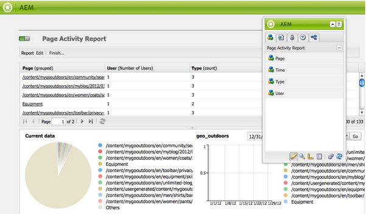

# 报告 {#reporting}

为了帮助您监视和分析实例的状态，AEM提供了默认报告的选择，可根据您的具体要求配置这些报告：

* [组件报告](#component-report)
* [磁盘使用情况](#disk-usage)
* [运行状况检查](#health-check)
* [页面活动报告](#page-activity-report)
* [用户生成的内容报告](#user-generated-content-report)
* [用户报告](#user-report)
* [工作流实例报告](#workflow-instance-report)
* [工作流报告](#workflow-report)

所有报告都可从&#x200B;**工具**&#x200B;控制台访问。 在左侧窗格中选择&#x200B;**报告**，然后多次单击右侧窗格中所需的报告以将其打开进行查看和／或配置。

还可以从&#x200B;**工具**&#x200B;控制台创建报表的新实例。 在左侧窗格中选择&#x200B;**报告**，然后选择&#x200B;**新建……**。 定义&#x200B;**标题**&#x200B;和&#x200B;**名称**，选择所需的报告类型，然后单击&#x200B;**创建**。 您的新报表实例将显示在列表中。 多次-单击此图标可打开，然后从Sidekick拖动组件以创建第一列并开始报表定义。

>[!NOTE]
>
>除了开箱即用的标准AEM报告之外，您还可以[开发您自己的（全新的）报告](/help/sites-developing/dev-reports.md)。

## 报表自定义的基础知识{#the-basics-of-report-customization}

报告有多种格式。 以下报告所有使用列，如以下各节中所详述，可进行自定义：

* [组件报告](#component-report)
* [页面活动报告](#page-activity-report)
* [用户生成的内容报告](#user-generated-content-report)
* [用户报告](#user-report)
* [工作流实例报告](#workflow-instance-report)

>[!NOTE]
>
>以下各个报告都有自己的格式和自定义：
>
>
>* [运行](#health-check) 状况检查使用选择字段指定要报告的数据。
>* [磁盘](#disk-usage) 使用链接可深入浏览存储库结构。
>* [工作](/help/sites-administering/reporting.md#workflow-report) 流报告概述了在实例上运行的工作流。

>
>
因此，列配置的以下过程不合适。 有关各个报表的详细信息，请参阅其描述。

### 选择并定位数据列{#selecting-and-positioning-the-data-columns}

可以向任何报表添加列、在其上重新定位列或从其中删除列（标准或自定义列）。

Sidekick的&#x200B;**组件**&#x200B;选项卡（在报告页上可用）列表所有类别可选为列的数据。

要更改数据选择：

* 要添加新列，请将所需组件从Sidekick拖放到所需位置

   * 绿色勾号将指示位置何时有效，一对箭头将指明放置位置的确切位置
   * 位置无效时，红色的无go符号将指示

* 要移动列，请单击标题，按住并拖动到新位置
* 要删除列，请单击列标题，按住并向上拖动到报表标题区域（红色减号将指示位置无效）;松开鼠标按钮，删除组件对话框将请求确认您确实要删除该列。

### 列下拉菜单{#column-drop-down-menu}

报告中的每列都有一个下拉菜单。 当鼠标光标移动到列标题单元格上时，该图标会变为可见。

标题单元格的最右侧将显示一个箭头（请勿与标题文本右侧的箭头混淆，该箭头指示[当前排序机制](#sorting-the-data)）。

菜单上的可用选项取决于列的配置（如在项目开发过程中所做），任何无效选项都将灰显。

### 对数据{#sorting-the-data}排序

数据可以按以下任一方式根据特定列进行排序：

* 单击相应的列标题；排序将在升序和降序之间切换，标题文本旁的箭头指示
* 使用[列的下拉菜单](#column-drop-down-menu)专门选择&#x200B;**升序排序**&#x200B;或&#x200B;**降序排序**;同样，标题文本旁边将显示一个箭头

### 组和当前数据图表{#groups-and-the-current-data-chart}

在相应的列上，您可以从[列的下拉菜单](#column-drop-down-menu)中选择&#x200B;**按此列分组**。 这将根据该列中的每个不同值对数据进行分组。 您可以选择多个要分组的列。 当列中的数据不适当时，该选项将灰显；例如，每个条目都是独特的和唯一的，因此不能形成任何组，例如用户报告的“用户ID”列。

至少将一个列分组后，将根据此分组生成&#x200B;**当前数据**&#x200B;的饼图。 如果将多个列分组，图表上也会指示此情况。

将光标移到饼图上将显示相应区段的聚集值。 它使用当前为列定义的聚合;例如，计数、最小、平均等。

### 过滤器和聚合{#filters-and-aggregates}

在相应的列上，您还可以从[列的下拉菜单](#column-drop-down-menu)配置&#x200B;**过滤器设置**&#x200B;和／或&#x200B;**聚合**。

#### 筛选器 {#filters}

过滤器设置允许您指定要显示的条目的条件。 可用的运算符有：

* `contains`
* `equals`

要设置过滤器：

1. 从下拉列表中选择您想要的运算符。
1. 输入要筛选的文本。
1. 单击&#x200B;**应用**。

要取消激活筛选器，请执行以下操作：

1. 删除筛选文本。
1. 单击&#x200B;**应用**。

#### 聚合{#aggregates}

您还可以选择聚合方法（这些方法可能因所选列而异）:

### 列属性 {#column-properties}

仅当[用户报告](#user-report)中使用了[通用列](#generic-column)时，此选项才可用。

### 历史数据 {#historic-data}

数据随时间变化的图表可在&#x200B;**历史数据**&#x200B;下查看。 这源于以固定间隔拍摄的快照。

数据是：

* 收集者（如果可用）是第一个已排序列，否则是第一个（非分组）列
* 按相应列分组

可以生成报告：

1. 在所需列上设置&#x200B;**分组**。
1. **编** 辑配置以定义快照的制作频率；每小时或每天。
1. **完成……** 开始快照集合的定义。

   左上方的红色／绿色滑块按钮指示何时收集快照。

结果图表显示在右下方：

数据收集启动后，您可以选择：

* **时间段**

   您可以为要显示的报表数据选择起始日期和终止日期。

* **间隔**

   可以选择月、周、日、小时来进行报表的缩放和汇总。

   例如，如果2011年2月提供每日快照：

   * 如果间隔设置为`Day`，则每个快照在图表中显示为一个值。
   * 如果间隔设置为`Month`，则2月份的所有快照都将聚合为单个值（在图表中显示为单个“点”）。

选择您的要求，然后单击&#x200B;**转至**&#x200B;将其应用到报表。 要在创建更多快照后更新显示屏，请再次单击&#x200B;**转至**。

收集快照时，您可以：

* 使用&#x200B;**完成……再次**&#x200B;以重新初始化集合。

   **完成** “冻结”报表的结构（即分配给报表的列，这些列被分组、排序、筛选等）开始拍摄快照。

* 打开&#x200B;**编辑**&#x200B;对话框以选择&#x200B;**没有数据快照**&#x200B;以在需要前终止收集。

   **“仅** 编辑”可切换快照的拍摄。如果再次打开快照，则使用上次完成时报告的状态进行进一步快照。

>[!NOTE]
>
>快照存储在`/var/reports/...`下，其中路径的其余部分反映报告的路径和报告完成时创建的ID。
>
>
>如果您完全确定不再需要这些实例，则可以手动清除旧快照。

>[!NOTE]
>
>预配置的报告不会占用大量的性能，但仍建议在生产环境上使用每日快照。 如果可能，在网站活动不多时运行这些每日快照；可以使用&#x200B;**Day CQ报告配置**&#x200B;的`Daily snapshots (repconf.hourofday)`参数定义；有关如何配置此配置的详细信息，请参阅[ OSGI配置](/help/sites-deploying/configuring-osgi.md)。

#### 显示限制{#display-limits}

历史数据报告也可能因可设置的限制而在外观上略有变化，这取决于所选期间的结果数。

每条水平线都称为系列（与图表图例中的条目相对应），每条垂直圆点列表示聚合快照。

要在较长的时间段内保持图表清晰，可以设置限制。 对于标准报告，这些报告包括：

* 水平系列——默认和系统最大值均为`9`

* 垂直聚合快照——默认值为`35`（每个水平系列）

因此，当超出（适当）限制时：

* 点不会显示
* 历史数据图表的图例可能显示与当前数据图表不同的条目数

自定义报告还可显示所有系列的&#x200B;**Total**&#x200B;值。 它显示为一个系列（水平线和图例中的条目）。

>[!NOTE]
>
>对于自定义报告，可以以不同方式设置限制。

### 编辑（报告）{#edit-report}

**编辑**&#x200B;按钮打开&#x200B;**编辑报告**&#x200B;对话框。

这是定义用于收集[历史数据](#historic-data)快照的时间段的位置，但也可以定义各种其他设置：

* **标题**

   您可以定义自己的标题。

* **描述**

   您可以定义自己的描述。

* **根路径** (*仅对某些报告处于活动状态*)

   使用此选项可将报告限制在存储库的（子）部分。

* **报表处理**

   * **自动刷新数据**

      每次更新报告定义时，都将刷新报告数据。

   * **手动刷新数据**

      此选项可用于防止出现大量数据时自动刷新操作导致的延迟。

      选择此选项表示当报表配置的任何方面发生更改时，必须手动刷新报表数据。 这也意味着一旦更改了配置的任何方面，报告表就会被遮蔽掉。

      选择此选项后，将显示&#x200B;**[加载数据](#load-data)**&#x200B;按钮（在报告上的&#x200B;**编辑**&#x200B;旁边）。 **加** 载数据将加载数据并刷新显示的报告数据。

* **快**
照您可以定义快照的制作频率；每天、每小时或根本不是。

### 加载数据 {#load-data}

仅当从&#x200B;**[编辑](#edit-report)**&#x200B;中选择了&#x200B;**手动刷新数据**&#x200B;时，**加载数据**&#x200B;按钮才可见。

单击&#x200B;**加载数据**&#x200B;将重新加载数据并更新所显示的报告。

选择手动刷新数据意味着：

1. 更改报告配置后，报告数据表将被清空。

   例如，如果更改列的排序机制，则不会显示数据。

1. 如果希望再次显示报告数据，则需要单击&#x200B;**加载数据**&#x200B;以重新加载数据。

### 完成（报告）{#finish-report}

在&#x200B;**完成**&#x200B;时，报告：

* 从该时间点开始，报表定义&#x200B;*将用于拍摄快照（之后，您可以继续处理报表定义，因为它与快照相分离）。*
* 将删除所有现有快照。
* 为[历史数据](#historic-data)收集新快照。

通过此对话框，您可以定义或更新生成报告的标题和说明。

## 报告类型{#report-types}

### 组件报告 {#component-report}

组件报告提供有关您的网站如何使用组件的信息。

[有关以下](#selecting-and-positioning-the-data-columns) 信息的列：

* 作者
* 组件路径
* 组件类型
* 上次修改时间
* 页面

表示您可以看到，例如：

* 在何处使用哪些组件。

   例如，在测试时非常有用。

* 特定组件实例的分发方式。

   如果特定页面(即“繁页”)遇到性能问题。

* 确定更改频繁／较少的站点部分。
* 了解页面内容随时间的推移如何发展。

包括所有组件、产品标准组件和特定于项目的组件。 使用&#x200B;**编辑**&#x200B;对话框，用户还可以设置定义报表起始点的&#x200B;**根路径** —— 该根下的所有组件都将被考虑用于报表。

 

### 磁盘使用情况 {#disk-usage}

磁盘使用情况报告显示有关存储在存储库中的数据的信息。

报告开始位于存储库的根(/)中；通过单击特定分支，您可以在存储库内向下展开（当前路径将反映在报表标题中）。

### 运行状况检查{#health-check}

此报告分析当前请求日志：

`<cq-installation-dir>/crx-quickstart/logs/request.log`\
以帮助您确定给定时间段内最昂贵的请求。

要生成报表，您可以指定：

* **期间（小时）**

   要分析的小时数（过去）。

   默认: `24`

* **最大. 结果**

   最大输出行数。

   默认: `50`

* **最大. 请求**

   要分析的最大请求数。

   默认：`-1`（全部）

* **电子邮件地址**

   将结果发送到电子邮件地址。

   可选；默认：空白

* **每日运行时间(hh:mm)**

   指定每天自动运行报告的时间。

   可选；默认：空白

### 页面活动报告 {#page-activity-report}

页面活动报告列表页面以及对页面执行的操作。

[有关以下](#selecting-and-positioning-the-data-columns) 信息的列：

* 页面
* 时间
* 类型
* 用户

这意味着您可以监控：

* 最新修改。
* 处理特定页面的作者。
* 最近未修改的页面，因此可能需要执行操作。
* 更改次数最多／最少的页面。
* 最多／最不活跃的用户。

页面活动报告从审核日志中获取其所有信息。 默认情况下，根路径配置为位于`/var/audit/com.day.cq.wcm.core.page`的审核日志。

### 用户生成的内容报告 {#user-generated-content-report}

此报告提供有关用户生成内容的信息；评论、评级或论坛。

[信息](#selecting-and-positioning-the-data-columns) 列：

* 日期
* IP 地址
* 页面
* 引用
* 类型
* 用户标识符

允许您：

* 查看哪些页面收到的注释最多。
* 获取特定网站访客所离开的所有评论的概述，这些问题可能是相关的。
* 通过监视在页面上添加注释的时间来判断新内容是否激发注释。

### 用户报告 {#user-report}

此报告提供有关已注册帐户和／或用户档案的所有用户的信息；这可以包括组织内的作者和外部访客。

[有关以下信息](#selecting-and-positioning-the-data-columns) （如果可用）的列：

* 年龄
* 国家/地区
* 域
* 电子邮件
* 姓氏
* 性别
* [通用](#generic-column)
* 名字
* 信息
* 关注
* 语言
* NTLM 哈希码
* 用户 ID

允许您：

* 查看用户的人口统计分布。
* 报告已添加到用户档案的自定义字段。

#### 常规列{#generic-column}

**Generic**&#x200B;列在用户报告中可用，这样您就可以访问自定义信息，通常从[用户用户档案](/help/sites-administering/identity-management.md#profiles-and-user-accounts)访问；例如，[“收藏夹颜色”，详见将字段添加到用户档案定义](/help/sites-administering/identity-management.md#adding-fields-to-the-profile-definition)。

当您执行以下任一操作时，将打开“常规”列对话框：

* 将通用组件从Sidekick拖动到报表。
* 为现有通用列选择列属性。

在&#x200B;**定义**&#x200B;选项卡中，您可以定义：

* **标题**

   通用列的您自己的标题。

* **属性**

   存储在存储库中的属性名称，通常在用户的用户档案中。

* **路径**

   通常，属性取自`profile`。

* **类型**

   从`String`、`Number`、`Integer`、`Date`中选择字段类型。

* **默认聚合**

   默认情况下，这定义在至少一个分组列的报告中取消分组时使用的聚合。 从`Count`、`Minimum`、`Average`、`Maximum`和`Sum`中选择所需的聚合。

   例如，`String`字段的&#x200B;*计数*&#x200B;表示在聚集状态中显示列的不同值`String`的数量。

在&#x200B;**扩展**&#x200B;选项卡中，您还可以定义可用的聚合和过滤器:

### 工作流实例报告 {#workflow-instance-report}

这为您提供了简洁的概述，提供了有关工作流的单个实例（运行和完成）的信息。

[有关以下](#selecting-and-positioning-the-data-columns) 信息的列：

* 已完成
* 持续时间
* 发起者
* 模型
* 有效负荷
* 启动时间
* 状态

这意味着您可以：

* 监测工作流的平均持续时间；如果经常发生这种情况，它可能会突出显示工作流的问题。

### 工作流报告{#workflow-report}

它提供有关实例上运行的工作流的关键统计信息。

## 在发布环境{#using-reports-in-a-publish-environment}中使用报告

根据特定要求配置报告后，您可以激活报告以将配置传输到发布环境。

>[!CAUTION]
>
>如果要&#x200B;**发布环境的历史数据**，请在激活页面之前，**完成创作环境上的报告。**

随后，可在

`/etc/reports`

例如，用户生成的内容报告可在以下位置找到：

`http://localhost:4503/etc/reports/ugcreport.html`

现在将报告从发布环境收集的数据。

由于发布环境中不允许任何报告配置，因此&#x200B;**编辑**&#x200B;和&#x200B;**完成**&#x200B;按钮不可用。 但是，如果正在收集快照，可以为&#x200B;**历史数据**&#x200B;报告选择&#x200B;**期间**&#x200B;和&#x200B;**间隔**。

>[!CAUTION]
>
>访问这些报告可能是一个安全问题；因此，我们建议您配置调度程序，以使`/etc/reports`不适用于外部访客。 有关详细信息，请参阅[安全清单](security-checklist.md)。

## 运行报告{#permissions-needed-for-running-reports}所需的权限

所需的权限取决于操作：

* 报告数据基本上是使用当前用户的权限收集的。
* 历史数据是使用完成报告的用户的权限收集的。

在标准AEM安装中，为报告预设了以下权限：

* **用户报告**

   `user administrators` -读写

* **页面活动报告**

   `contributors` -读写

* **组件报告**

   `contributors` -读写

* **用户生成的内容报告**

   `contributors` -读写

* **工作流实例报告**

   `workflow-users` -读写

`administrators`组的所有成员都具有创建新报告的必要权限。
