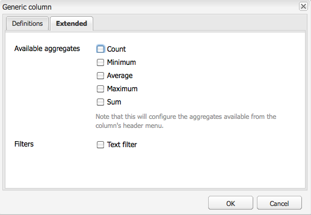

# 报告 {#reporting}

为了帮助您监视和分析实例的状态，AEM提供了一系列默认报告选项，这些报告可以根据您的具体要求进行配置：

* [组件报告](#component-report)
* [磁盘使用情况](#disk-usage)
* [运行状况检查](#health-check)
* [页面活动报告](#page-activity-report)
* [用户生成的内容报告](#user-generated-content-report)
* [用户报告](#user-report)
* [工作流实例报告](#workflow-instance-report)
* [工作流报告](#workflow-report)

所有报告都可以从“工具”控 **制台访** 问。 在左 **侧窗格中选择** “报告”，然后在右侧窗格中双击所需的报告以将其打开进行查看和／或配置。

还可以从工具控制台中创建报表的 **新实例** 。 **在左**&#x200B;侧窗格中&#x200B;**，选择报表，然后选择**&#x200B;新建……中。 定义标 **题** 和名 **称**，选择所需的报告类型，然后单击创 **建**。 您的新报告实例将显示在列表中。 双击此图标可打开，然后从Sidekick中拖动组件以创建第一列并启动报告定义。

>[!NOTE]
>
>除了开箱即用的标准AEM报表外，您还可以开 [发自己的（全新）报表](/help/sites-developing/dev-reports.md)。

## 报表自定义的基础 {#the-basics-of-report-customization}

可用的报告格式各异。 以下报告所有使用的列均可自定义，详情请见以下各节：

* [组件报告](#component-report)
* [页面活动报告](#page-activity-report)
* [用户生成的内容报告](#user-generated-content-report)
* [用户报告](#user-report)
* [工作流实例报告](#workflow-instance-report)

>[!NOTE]
>
>以下各个报告都有自己的格式和自定义：
>
>
>* [运行状况检查](#health-check) (Health Check)使用选择字段指定要报告的数据。
>* [“磁盘使用情况](#disk-usage) ”使用链接深入浏览存储库结构。
>* [“工作流](/help/sites-administering/reporting.md#workflow-report) ”报告概述了在实例上运行的工作流。
>
>
因此，列配置的以下过程并不合适。 有关各个报表的详细信息，请参阅其说明。

### 选择和定位数据列 {#selecting-and-positioning-the-data-columns}

可以向任何报表添加列、将列重新定位或从其中删除列（标准或自定义）。

Sidekick的 **组件** （在报告页面上可用）选项卡列出了可选择为列的所有类别的数据。

要更改数据选择：

* 要添加新列，请将所需组件从Sidekick拖放到您想要的位置

   * 绿色勾号将指示位置何时有效，一对箭头将指示其将放置的位置
   * 位置无效时，红色的不转动符号将指示

* 要移动列，请单击标题，按住并拖动到新位置
* 要删除列，请单击列标题，按住并向上拖动到报表标题区域（红色减号将指示位置无效）;释放鼠标按钮，“删除组件”对话框将请求确认您确实要删除列。

### 列下拉菜单 {#column-drop-down-menu}

报告中的每列都有一个下拉菜单。 当鼠标光标移动到列标题单元格上时，该图标会变为可见。

标题单元格最右侧将显示一个箭头(请勿与标题文本右侧的箭头混淆，该箭头指示当前排序 [机制](#sorting-the-data))。

菜单上的可用选项取决于列的配置（如在项目开发过程中所做），任何无效选项都将灰显。

### 对数据排序 {#sorting-the-data}

数据可以按以下任一方式根据特定列进行排序：

* 单击相应的列标题；排序将在升序和降序之间切换，标题文本旁边有一个箭头指示
* 使用 [列的下拉菜单](#column-drop-down-menu) ，具体选择升序 **排序** 或降 **序排序**;同样，标题文本旁边将显示一个箭头

### 组和当前数据图表 {#groups-and-the-current-data-chart}

在相应的列上，您可 **以从列的下拉菜单**[中选择按此列分组](#column-drop-down-menu)。 这将根据该列中的每个不同值对数据进行分组。 您可以选择多个要分组的列。 当列中的数据不当时，该选项将灰显；例如，每个条目都是不同的且唯一的，因此不能形成任何组，例如用户报告的用户ID列。

在将至少一列分组之后，将基于此分组 **生成“当前** ”数据的饼图。 如果将多个列分组，图表上也会指示此值。

将光标移到饼图上将显示相应区段的聚集值。 它使用当前为列定义的聚合；例如，计数、最小值、平均值等。

### 过滤器和聚合 {#filters-and-aggregates}

在相应的列上，您还可以 **从列的下拉菜单配** 置过滤器设置和／或 **聚合**。

#### 筛选器 {#filters}

过滤器设置允许您指定要显示的条目的条件。 可用的操作符有：

* `contains`
* `equals`

要设置过滤器，请执行以下操作：

1. 从下拉列表中选择所需的运算符。
1. 输入要筛选的文本。
1. 单击“ **应用**”。

要取消激活筛选器，请执行以下操作：

1. 删除过滤器文本。
1. 单击“ **应用**”。

#### 聚合 {#aggregates}

您还可以选择聚合方法（这些方法可能因所选列而异）:

### 列属性 {#column-properties}

只有在用户报告中使用 [了“通用](#generic-column) ”列时，此选项才 [可用](#user-report)。

### 历史数据 {#historic-data}

您可以在历史数据下查看数据随时间变化 **的图表**。 这源于以固定间隔拍摄的快照。

数据是：

* 收集者（如果可用）是第一个已排序列，否则是第一个（非分组）列
* 按相应的列分组

可以生成报告：

1. 在所 **需列上** ，设置分组。
1. **编辑** ，以定义快照的制作频率；每小时或每天。
1. **** 完成……用于启动快照集合的定义。

   左上角的红色／绿色滑块按钮指示何时收集快照。

生成的图表显示在右下角：

数据收集启动后，您可以选择：

* **时间段**

   您可以选择要显示的报表数据的开始和结束日期。

* **间隔**

   可以选择月份、周份、日期、小时，以进行报表的缩放和汇总。

   例如，如果2011年2月提供每日快照：

   * 如果间隔设置为， `Day`则每个快照在图表中显示为单个值。
   * 如果将间隔设置为 `Month`，则2月份的所有快照将汇总为单个值（在图表中显示为单个“点”）。

选择您的要求，然后单 **击开始** ，将其应用到报表。 要在创建更多快照后更新显示屏，请再次单 **击** “开始”。

收集快照时，您可以：

* **使用**&#x200B;完成……以重新初始化集合。

   **完成** “冻结”报表的结构（即分配给报表的列，这些列被分组、排序、筛选等）开始拍摄快照。

* 打开编 **辑对话框** ，选择无 **数据快照** ，以在需要前终止收集。

   **“编辑** ”仅切换快照的拍摄开启或关闭。 如果再次打开拍摄快照，则会使用上次完成时报告的状态来进一步拍摄快照。

>[!NOTE]
>
>快照存储在路径 `/var/reports/...` 的其余部分镜像报告的路径和报告完成时创建的ID的位置下。
>
>
>如果您完全确定不再需要这些实例，则可以手动清除旧快照。

>[!NOTE]
>
>预配置的报告不会占用大量的性能，但仍建议在生产环境中使用每日快照。 如果可能，在网站上活动不多的时候运行这些每日快照；可以使用Day CQ报告配 `Daily snapshots (repconf.hourofday)` 置的参 **数来定义它**;有关 [如何配置此配置的更多详细信息](/help/sites-deploying/configuring-osgi.md) ，请参阅OSGI配置。

#### 显示限制 {#display-limits}

历史数据报告也可能因可设置的限制而在外观上略有变化，这取决于所选时间段的结果数。

每条水平线称为系列（对应于图表图例中的条目），每条垂直的圆点列表示聚集的快照。

要在较长的时间段内保持图表清晰，可以设置一些限制。 对于标准报告，这些报告包括：

* 水平序列——默认和系统最大值都是 `9`

* 垂直聚合快照——默认为(每 `35` 个水平系列)

因此，当超出（适当）限制时：

* 点不会显示
* 历史数据图表的图例可能显示与当前数据图表不同的条目数

自定义报告还可显示所 **有系列** 的“总值”。 它显示为一个系列（水平线和图例中的条目）。

>[!NOTE]
>
>对于自定义报告，可以以不同方式设置限制。

### Edit (Report) {#edit-report}

“编 **辑** ”按钮会打开“ **编辑报告** ”对话框。

这是定义收集历史数据快照的时 [间段的位置](#historic-data) ，但也可以定义各种其他设置：

* **标题**

   您可以定义自己的标题。

* **描述**

   您可以定义自己的描述。

* **根路径** (仅&#x200B;*对某些报告处于活动状态*)

   使用此选项可将报告限制在存储库的（子）部分。

* **报表处理**

   * **自动刷新数据**

      每次更新报告定义时，报告数据都将刷新。

   * **手动刷新数据**

      此选项可用于防止在有大量数据时由自动刷新操作引起的延迟。

      选择此选项表示当报表配置的任何方面发生更改时，必须手动刷新报表数据。 这也意味着，一旦更改了配置的任何方面，报表表就会被遮蔽掉。

      选择此选项后，将显 **[示“加载数据](#load-data)**”按钮(在报&#x200B;**告的“编辑**”旁边)。**加载数据**，将加载数据并刷新显示的报告数据。

* **快照**&#x200B;您可以定义快照的制作频率；每天、每小时或根本不是。

### 加载数据 {#load-data}

仅当 **从“编辑** ”中选择了手动 **刷新数据** ,“加载数据”按钮才 **[可见](#edit-report)**。

单击加 **载数据** ，将重新加载数据并更新所显示的报告。

选择手动刷新数据意味着：

1. 更改报告配置后，报告数据表将被遮蔽掉。

   例如，如果更改列的排序机制，则不会显示数据。

1. 如果希望再次显示报告数据，则需要单击加载数 **据** ，以重新加载数据。

### Finish (report) {#finish-report}

完成 **报告** 时：

* 截至该时 *间点的报告定义将用于拍摄快照* （之后，您可以继续处理报告定义，因为它与快照相分离）。
* 将删除任何现有快照。
* 会收集新快照以获取历 [史数据](#historic-data)。

通过该对话框，您可以为生成的报告定义或更新自己的标题和说明。

## 报告类型 {#report-types}

### 组件报告 {#component-report}

组件报告提供有关网站如何使用组件的信息。

[有关以下内容的](#selecting-and-positioning-the-data-columns) 列信息：

* 创作
* 组件路径
* 组件类型
* 上次修改时间
* 页面

表示您可以看到，例如：

* 哪些组件在何处使用。

   例如，在测试时很有用。

* 特定组件的实例的分发方式。

   如果特定页面(即“繁重的页面”)遇到性能问题。

* 确定更改频繁／频繁的站点部分。
* 了解页面内容随时间的推移如何发展。

包括所有组件、产品标准组件和特定于项目的组件。 使用 **编辑** ，用户还可以设置定义报表起始点的根路径 **** -该根目录下的所有组件都将被考虑用于报表。

### 磁盘使用情况 {#disk-usage}

磁盘使用情况报告显示有关存储在存储库中的数据的信息。

报告在存储库的根(/)中启动；通过单击特定的分支，您可以在存储库中向下展开（当前路径将反映在报表标题中）。

### Health Check {#health-check}

此报告分析当前请求日志：

`<cq-installation-dir>/crx-quickstart/logs/request.log`\
以帮助您确定给定时间段内最昂贵的请求。

要生成报表，可指定：

* **期间（小时）**

   要分析的小时数（过去）。

   默认: `24`

* **最大. 结果**

   输出行的最大数量。

   默认: `50`

* **最大. 请求**

   要分析的最大请求数。

   默认： `-1` （全部）

* **电子邮件地址**

   将结果发送到电子邮件地址。

   可选；默认：空白

* **每日运行时间(hh:mm)**

   指定每天自动运行报告的时间。

   可选；默认：空白

### 页面活动报告 {#page-activity-report}

页面活动报告列出页面以及对页面执行的操作。

[有关以下内容的](#selecting-and-positioning-the-data-columns) 列信息：

* 页面
* 时间
* 类型
* 用户

这意味着您可以监控：

* 最新修改。
* 处理特定页面的作者。
* 最近未修改的页面，因此可能需要执行操作。
* 更改频率最高／最不频繁的页面。
* 最多／最不活动的用户。

页面活动报告从审核日志中获取其所有信息。 默认情况下，根路径配置为位于的审核日志 `/var/audit/com.day.cq.wcm.core.page`。

### 用户生成的内容报告 {#user-generated-content-report}

此报告提供有关用户生成内容的信息；无论是评论、评级还是论坛。

[有关的信息列](#selecting-and-positioning-the-data-columns) :

* 日期
* IP 地址
* 页面
* 引用
* 类型
* 用户标识符

允许您：

* 查看哪些页面接收的注释最多。
* 获取特定网站访问者要离开的所有评论的概述，这些问题可能是相关的。
* 通过监视在页面上添加评论的时间来判断新内容是否在引发评论。

### 用户报告 {#user-report}

此报告提供有关已注册帐户和／或配置文件的所有用户的信息；这可以包括组织内的作者和外部访客。

[有关以下信息](#selecting-and-positioning-the-data-columns) （如果可用）的列：

* 年龄
* 国家/地区
* 域
* 电子邮件
* 姓氏
* 性别
* [通用](#generic-column)
* 名字
* 信息
* 关注
* 语言
* NTLM 哈希码
* 用户 ID

允许您：

* 查看用户的人口统计分布。
* 报告已添加到配置文件的自定义字段。

#### Generic Column {#generic-column}

“用 **户报告** ”中有“通用”列，这样您就可以访问自定义信息，通常从用户 [资料中](/help/sites-administering/identity-management.md#profiles-and-user-accounts);例如，在“将字 [段添加到配置文件定义”中详细介绍的“收藏夹颜色”](/help/sites-administering/identity-management.md#adding-fields-to-the-profile-definition)。

当您执行以下任一操作时，将打开“常规”列对话框：

* 将通用组件从Sidekick拖动到报表。
* 为现有的“通用”列选择“列属性”。

From the **Definitions** tab you can define:

* **标题**

   通用列的您自己的标题。

* **属性**

   存储在存储库中的属性名称，通常位于用户的配置文件中。

* **路径**

   通常，该属性取自 `profile`。

* **类型**

   从、、、、中选 `String`择字 `Number`段 `Integer`类型 `Date`。

* **默认聚合**

   如果列在至少具有一个分组列的报告中取消分组，则这将定义默认情况下使用的聚合。 从、、、、、中选 `Count`择所需 `Minimum`的 `Average`聚 `Maximum`合 `Sum`。

   例如，字 *段的计数* ，表示在聚 `String``String` 集状态中为列显示不同值的数量。

在“扩 **展** ”选项卡中，您还可以定义可用的聚合和筛选器：

### 工作流实例报告 {#workflow-instance-report}

这为您提供了简洁的概述，其中提供了有关工作流的各个实例的信息（运行和完成）。

[有关以下内容的](#selecting-and-positioning-the-data-columns) 列信息：

* 已完成
* 持续时间
* 发起者
* 模型
* 有效负荷
* 启动时间
* 状态

这意味着您可以：

* 监控工作流程的平均持续时间；如果这种情况经常发生，则可能会突出显示工作流的问题。

### 工作流报告 {#workflow-report}

这提供了有关在实例上运行的工作流的关键统计信息。

## 在发布环境中使用报告 {#using-reports-in-a-publish-environment}

根据特定要求配置报告后，您可以激活报告以将配置传输到发布环境。

>[!CAUTION]
>
>如果要发布环 **境的历史数据** ，请在激活页面之前完成有关创 **作环境的报告** 。

随后，可在

`/etc/reports`

例如，“用户生成的内容”报告位于：

`http://localhost:4503/etc/reports/ugcreport.html`

此操作现在将报告从发布环境收集的数据。

由于发布环境中不允许任何报告配置，因此“编 **辑** ”和“ **完成** ”按钮不可用。 但是，如果要收集快 **照** ，您可以为“历史数据 **”报表选****** 择“期间”和“间隔”。

>[!CAUTION]
>
>访问这些报告可能是一个安全问题；因此，我们建议您配置调度程序，以便 `/etc/reports` 外部访客不能使用它。 有关更多详 [细信息，请参阅安全核对清单](security-checklist.md) 。

## 运行报告所需的权限 {#permissions-needed-for-running-reports}

所需的权限取决于操作：

* 报告数据基本上是使用当前用户的权限收集的。
* 使用完成报告的用户的权限收集历史数据。

在标准AEM安装中，预设了以下报告权限：

* **用户报告**

   `user administrators` -读写

* **页面活动报告**

   `contributors` -读写

* **组件报告**

   `contributors` -读写

* **用户生成的内容报告**

   `contributors` -读写

* **工作流实例报告**

   `workflow-users` -读写

组的所有成员 `administrators` 都有创建新报告的必要权限。
