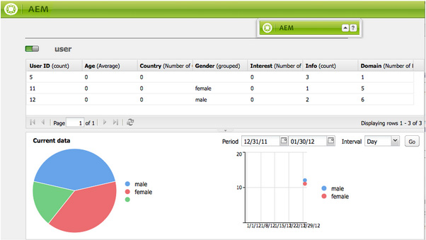

# 报告 {#reporting}

>[!CAUTION]
>
>AEM 6.4已结束扩展支持，本文档将不再更新。 有关更多详细信息，请参阅 [技术支助期](https://helpx.adobe.com/cn/support/programs/eol-matrix.html). 查找支持的版本 [此处](https://experienceleague.adobe.com/docs/).

为了帮助您监视和分析实例的状态，AEM提供了一系列默认报表选项，这些报表可根据您的各个要求进行配置：

* [组件报告](#component-report)
* [磁盘使用情况](#disk-usage)
* [运行状况检查](#health-check)
* [页面活动报告](#page-activity-report)
* [用户生成的内容报告](#user-generated-content-report)
* [用户报告](#user-report)
* [工作流实例报告](#workflow-instance-report)
* [工作流报表](#workflow-report)

>[!NOTE]
>
>这些报表仅在经典UI中可用。 有关现代UI中的系统监控和报告，请参阅 [操作仪表板。](/help/sites-administering/operations-dashboard.md)

所有报表均可从 **工具** 控制台。 选择 **报表** 在左侧窗格中，双击右侧窗格中的所需报表以将其打开进行查看和/或配置。

报表的新实例也可以通过 **工具** 控制台。 选择 **报表** 在左窗格中， **新建……** 中。 定义 **标题** 和 **名称**，选择所需的报表类型，然后单击 **创建**. 您的新报表实例将显示在列表中。 双击此图标以打开，然后从Sidekick中拖动组件以创建第一列并开始报表定义。

>[!NOTE]
>
>除了现成可用的标准AEM报表之外，您还可以 [开发您自己的（完全新的）报表](/help/sites-developing/dev-reports.md).

## 报表自定义的基础知识 {#the-basics-of-report-customization}

可使用各种格式的报表。 以下报表都使用可自定义的列，如以下各节所述：

* [组件报告](#component-report)
* [页面活动报告](#page-activity-report)
* [用户生成的内容报告](#user-generated-content-report)
* [用户报告](#user-report)
* [工作流实例报告](#workflow-instance-report)

>[!NOTE]
>
>以下报表各自具有自己的格式和自定义设置：
>
>
>* [运行状况检查](#health-check) 使用选择字段指定要报告的数据。
>* [磁盘使用情况](#disk-usage) 使用链接向下钻取存储库结构。
>* [工作流报表](/help/sites-administering/reporting.md#workflow-report) 概述了在您的实例上运行的工作流。
>
>因此，列配置的以下过程不合适。 有关各个报表的详细信息，请参阅其描述。

### 选择和定位数据列 {#selecting-and-positioning-the-data-columns}

可向任何报表添加列、将列重新定位到报表或从任何报表中删除列（标准报表或自定义报表）。

的 **组件** sidekick的选项卡（在报表页面上提供）列出了可以选择为列的所有数据类别。

要更改数据选择，请执行以下操作：

* 要添加新列，请将所需组件从sidekick拖放到所需位置

   * 绿色勾号将指示位置何时有效，并且一对箭头将指示位置的确切位置
   * 位置无效时，将显示一个红色的禁用符号

* 要移动列，请单击标题，按住并拖动到新位置
* 要删除列，请单击列标题，按住并向上拖动到报表标题区域（红色减号表示该位置无效）；释放鼠标按钮，删除组件对话框将请求确认您确实要删除该列。

### 列下拉菜单 {#column-drop-down-menu}

报表中的每列都有一个下拉菜单。 当鼠标光标移动到列标题单元格上时，此图标会变得可见。

箭头将显示在标题单元格的最右侧(请勿与标题文本右侧的箭头头混淆，该箭头指示 [当前排序机制](#sorting-the-data))。

菜单中的可用选项取决于列的配置（在项目开发期间进行），任何无效选项都将灰显。

### 对数据排序 {#sorting-the-data}

数据可以按以下任一方式根据特定列进行排序：

* 点击相应的列标题；排序将在升序和降序之间进行切换，如标题文本旁边的箭头所示
* 使用 [列的下拉菜单](#column-drop-down-menu) 具体选择 **升序排序** 或 **降序排序**;同样，在标题文本的正旁边，将用箭头指示

### 组和当前数据图 {#groups-and-the-current-data-chart}

在相应的列上，您可以选择 **按此列分组** 从 [列的下拉菜单](#column-drop-down-menu). 这将根据该列中的每个不同值对数据进行分组。 您可以选择多个要分组的列。 当列中的数据不适当时，选项将灰显；例如，每个条目都是不同且唯一的，因此无法组成组，例如用户报表的“用户ID”列。

在将至少一列分组为饼图之后 **当前数据** 将基于此分组生成。 如果将多个列分组，则图表中也会显示这一情况。

将光标移到饼图上将显示相应区段的聚合值。 它使用当前为列定义的聚合；例如，计数、最小值、平均值等。

### 过滤器和聚合 {#filters-and-aggregates}

在相应的列上，您还可以配置 **过滤器设置** 和/或 **聚合** 从 [列的下拉菜单](#column-drop-down-menu).

#### 过滤器 {#filters}

过滤器设置允许您指定要显示的条目的条件。 可用的运算符包括：

* `contains`
* `equals`

要设置过滤器，请执行以下操作：

1. 从下拉列表中选择所需的运算符。
1. 输入要筛选的文本。
1. 单击 **应用**.

要取消激活过滤器，请执行以下操作：

1. 删除过滤器文本。
1. 单击 **应用**.

#### 聚合 {#aggregates}

您还可以选择聚合方法（这些方法可能因所选列而异）：

### 列属性 {#column-properties}

此选项仅在 [常规列](#generic-column) 在 [用户报表](#user-report).

### 历史数据 {#historic-data}

您可以在 **历史数据**. 这是从定期拍摄的快照派生的。

数据为：

* 收集者（如果可用）是第一个已排序列，否则是第一个（非分组）列
* 按相应列分组

可以生成报表：

1. 已设置 **分组** 在所需列中。
1. **编辑** 用于定义快照的生成频率的配置；每小时或每天。
1. **完成……** 用于开始快照集合的定义。

   左上角的红色/绿色滑块按钮指示何时收集快照。

结果图表显示在右下方：

数据收集开始后，您可以选择：

* **时间段**

   您可以选择要显示的报表数据的开始日期和结束日期。

* **间隔**

   可以选择月、周、日、小时，以进行报表的规模和汇总。

   例如，如果每日快照在2011年2月可用：

   * 如果间隔设置为 `Day`，则每个快照在图表中显示为一个值。
   * 如果间隔设置为 `Month`，则2月的所有快照都会聚合为一个值（在图表中显示为一个“点”）。

选择您的要求，然后单击 **开始** 以将其应用到报表。 要在创建更多快照后更新显示屏，请单击 **开始** 再次。

在收集快照时，您可以：

* 使用 **完成……** 再次重新初始化集合。

   **完成** “冻结”报表的结构（即分配给报表的列，这些列分组、排序、过滤等） 开始拍摄快照。

* 打开 **编辑** 对话框选择 **无数据快照** 终止收藏集，直到需要。

   **编辑** 只切换快照的拍摄。 如果再次打开快照，则会使用上次完成时报表的状态，以便进一步拍摄快照。

>[!NOTE]
>
>快照存储在 `/var/reports/...` 其中，路径的其余部分反映了完成报告时创建的相应报表和ID的路径。
>
>
>如果您完全确定不再需要这些实例，则可以手动清除旧快照。

>[!NOTE]
>
>预配置的报表不会占用大量的性能，但仍建议在生产环境中使用每日快照。 如果可能，在一天中您的网站上没有太多活动时运行这些每日快照；这可以通过 `Daily snapshots (repconf.hourofday)` 参数 **Day CQ报表配置**;请参阅 [OSGI配置](/help/sites-deploying/configuring-osgi.md) 以了解有关如何配置此选项的更多详细信息。

#### 显示限制 {#display-limits}

历史数据报表的外观也可能因可设置的限制而略有变化，这取决于所选时段的结果数。

每个水平线都称为系列（对应于图表图例中的一个条目），每个垂直的圆点列都表示聚合的快照。

为了在较长的时间段内保持图表清洁，可以设置一些限制。 对于标准报表，这些报表包括：

* 水平系列 — 默认和系统最大值都为 `9`

* 垂直汇总快照 — 默认 `35` （每个水平系列）

因此，当超出（适当）限制时：

* 不会显示点
* 历史数据图表的图例可能显示与当前数据图表不同的条目数

自定义报表还可显示 **合计** 值。 它显示为系列（图例中的水平行和条目）。

>[!NOTE]
>
>对于自定义报表，限制的设置方式可以不同。

### 编辑（报表） {#edit-report}

的 **编辑** 按钮 **编辑报表** 对话框。

这是收集快照时段的一个位置 [历史数据](#historic-data) 定义，但还可以定义各种其他设置：

* **标题**

   您可以定义自己的标题。

* **描述**

   您可以定义自己的描述。

* **根路径** (*仅对特定报表有效*)

   使用此选项可将报表限制为存储库的（子）部分。

* **报表处理**

   * **自动刷新数据**

      每次更新报表定义时，报表数据都会刷新。

   * **手动刷新数据**

      此选项可用于防止在有大量数据时自动刷新操作导致的延迟。

      选择此选项表示当报表配置的任何方面发生更改时，必须手动刷新报表数据。 这还意味着，一旦您更改了配置的任何方面，报表表就会被清空。

      选择此选项后， **[加载数据](#load-data)** 按钮(位于 **编辑** )。 **加载数据** 将加载数据并刷新显示的报表数据。

* **快照**
您可以定义快照的制作频率；每天、每小时或根本不是。

### 加载数据 {#load-data}

的 **加载数据** 按钮 **手动刷新数据** 已从 **[编辑](#edit-report)**.

单击 **加载数据** 将重新加载数据并更新所显示的报表。

选择手动刷新数据意味着：

1. 一旦更改报表配置，报表数据表将被清空。

   例如，如果更改列的排序机制，则不会显示数据。

1. 如果您希望再次显示报表数据，则需要单击 **加载数据** 以重新加载数据。

### 完成（报告） {#finish-report}

当您 **完成** 报告：

* 报表定义 *到那个时间点* 将用于拍摄快照（之后，您可以继续处理报告定义，因为它与快照分开）。
* 将删除任何现有的快照。
* 会为 [历史数据](#historic-data).

通过此对话框，您可以为生成的报表定义或更新自己的标题和描述。

## 报表类型 {#report-types}

### 组件报告 {#component-report}

组件报表提供有关您的网站如何使用组件的信息。

[信息列](#selecting-and-positioning-the-data-columns) 关于：

* 创作
* 组件路径
* 组件类型
* 上次修改时间
* 页面

表示您可以看到，例如：

* 在何处使用哪些组件。

   例如，在测试时很有用。

* 特定组件的实例的分发方式。

   如果特定页面(例如，“页面繁多”)遇到性能问题。

* 识别网站中更改频繁/较少的部分。
* 了解页面内容随时间的推移而如何发展。

所有组件均包含在内，产品标准组件和特定于项目的组件中。 使用 **编辑** 对话框用户还可以设置 **根路径** 定义报表起点 — 该根下的所有组件都将考虑到报表。

 

### 磁盘使用情况 {#disk-usage}

>[!CONTEXTUALHELP]
>id="aemcloud_ctt_diskusage"
>title="磁盘使用情况报告"
>abstract="作为 CTT 计算器的输入，用户可以通过运行“http://HOST:PORT/etc/reports/diskusage.html”下的磁盘使用情况报告来估算 AEM 存储库的大小。用户还可以使用“path”参数来估计特定存储库路径的大小，例如：“http://HOST:PORT/etc/reports/diskusage.html?path=/content/dam”。"

磁盘使用情况报表显示有关存储在您的存储库中的数据的信息。

报表在存储库的根(/)中启动；通过单击特定分支，您可以在存储库内向下展开（当前路径将反映在报表标题中）。

### 运行状况检查 {#health-check}

此报表分析当前请求日志：

`<cq-installation-dir>/crx-quickstart/logs/request.log`\
以帮助您确定给定时间段内最昂贵的请求。

要生成报表，您可以指定：

* **期间（小时）**

   要分析的小时数（过去）。

   默认: `24`

* **最大. 结果**

   最大输出行数。

   默认: `50`

* **最大. 请求**

   要分析的请求数上限。

   默认： `-1` （全部）

* **电子邮件地址**

   将结果发送到电子邮件地址。

   可选；默认：空白

* **每日运行时间：(hh:mm)**

   指定报表每天自动运行的时间。

   可选；默认：空白

### 页面活动报告 {#page-activity-report}

页面活动报表列出了页面以及对页面执行的操作。

[信息列](#selecting-and-positioning-the-data-columns) 关于：

* 页面
* 用时
* 类型
* 用户

表示您可以监控：

* 最新修改。
* 在特定页面上工作的作者。
* 最近未修改的页面，因此可能需要执行操作。
* 更改次数最多/最不频繁的页面。
* 最多/最不活动的用户。

页面活动报表从审核日志中获取其所有信息。 默认情况下，根路径配置为位于的审核日志 `/var/audit/com.day.cq.wcm.core.page`.

### 用户生成的内容报告 {#user-generated-content-report}

此报表提供有关用户生成内容的信息；评论、评级或论坛。

[信息列](#selecting-and-positioning-the-data-columns) 开：

* 日期
* IP 地址
* 页面
* 引用
* 类型
* 用户标识符

允许您：

* 查看哪些页面收到的评论最多。
* 获取特定网站访客离开的所有评论的概述，这些问题可能与之相关。
* 通过监控在页面上进行评论时，判断新内容是否会引发评论。

### 用户报告 {#user-report}

此报表提供有关已注册帐户和/或用户档案的所有用户的信息；这可以包括组织内的作者和外部访客。

[信息列](#selecting-and-positioning-the-data-columns) （如果可用）关于：

* 年龄
* 国家/地区
* 域
* 电子邮件
* 姓氏
* 性别
* [通用](#generic-column)
* 名字
* 信息
* 关注
* 语言
* NTLM 哈希码
* 用户 ID

允许您：

* 查看用户的人口统计分布。
* 报告已添加到用户档案的自定义字段。

#### 通用列 {#generic-column}

的 **通用** 列，以便您能够访问自定义信息(通常从 [用户配置文件](/help/sites-administering/identity-management.md#profiles-and-user-accounts);例如， [向配置文件定义添加字段中详细描述的收藏颜色](/help/sites-administering/identity-management.md#adding-fields-to-the-profile-definition).

当您执行以下任一操作时，将打开“常规”列对话框：

* 将通用组件从Sidekick拖到报表中。
* 为现有的“通用”列选择“列属性”。

从 **定义** 选项卡：

* **标题**

   您自己的通用列标题。

* **属性**

   存储库中存储的属性名称，通常在用户的配置文件中。

* **路径**

   通常，资产会从 `profile`.

* **类型**

   从中选择字段类型 `String`, `Number`, `Integer`, `Date`.

* **默认聚合**

   这定义了当列在至少具有一个分组列的报表中未分组时，默认使用的聚合。 从中选择所需的聚合 `Count`, `Minimum`, `Average`, `Maximum`, `Sum`.

   例如， *计数* a `String` 字段表示非重复数 `String` 将以聚合状态显示该列的值。

在 **扩展** 选项卡，您还可以定义可用的聚合和过滤器：

### 工作流实例报告 {#workflow-instance-report}

这为您提供了简洁的概述，其中提供了有关运行和已完成的工作流各个实例的信息。

[信息列](#selecting-and-positioning-the-data-columns) 关于：

* 已完成
* 持续时间
* 发起者
* 模型
* 有效负荷
* 启动时间
* 状态

这意味着您可以：

* 监控工作流的平均持续时间；如果定期发生这种情况，可能会突出显示工作流存在的问题。

### 工作流报表 {#workflow-report}

这会提供有关实例上运行的工作流的关键统计信息。

## 在发布环境中使用报表 {#using-reports-in-a-publish-environment}

按照特定要求配置报表后，您可以将其激活以将配置传输到发布环境。

>[!CAUTION]
>
>如果您需要 **历史数据** ，则 **完成** 激活页面之前的创作环境报表。

然后，可在

`/etc/reports`

例如，用户生成的内容报表可在以下位置找到：

`http://localhost:4503/etc/reports/ugcreport.html`

此时将报告从发布环境收集的数据。

由于发布环境中不允许进行报表配置，因此 **编辑** 和 **完成** 按钮不可用。 但是，您可以选择 **句点** 和 **间隔** 对于 **历史数据** 报告是否正在收集快照。

>[!CAUTION]
>
>访问这些报告可能是安全问题；因此，我们建议您配置Dispatcher，以便 `/etc/reports` 对外部访客不可用。 请参阅 [安全检查列表](security-checklist.md) 以了解更多详细信息。

## 运行报表所需的权限 {#permissions-needed-for-running-reports}

所需的权限取决于操作：

* 报表数据基本上是使用当前用户的权限收集的。
* 使用完成报告的用户权限收集历史数据。

在标准AEM安装中，为报表预设了以下权限：

* **用户报告**

   `user administrators`  — 读写

* **页面活动报告**

   `contributors`  — 读写

* **组件报告**

   `contributors`  — 读写

* **用户生成的内容报告**

   `contributors`  — 读写

* **工作流实例报告**

   `workflow-users`  — 读写

所有 `administrators` 组具有创建新报表的必要权限。
