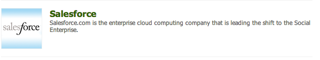

# 与 Salesforce 集成{#integrating-with-salesforce}

将Salesforce与AEM集成可提供潜在客户管理功能，并利用Salesforce提供的现有开箱即用功能。 您可以配置AEM以将潜在客户发布到Salesforce并创建直接从Salesforce访问数据的组件。

AEM和Salesforce之间的双向、可扩展集成支持：

* 组织可以充分利用和更新数据，以增强客户体验。
* 从营销到销售活动的参与度。
* 组织自动从Salesforce数据存储中传输和接收数据。

本文档将介绍以下内容：

* 如何配置SalesforceCloud Services(配置AEM以与Salesforce集成)。
* 如何在Client Context和Personalization中使用Salesforce潜在客户／联系信息。
* 如何使用Salesforce工作流模型将AEM用户作为潜在客户发布到salesforce。
* 如何创建显示来自Salesforce的数据的组件。

## 配置AEM以与Salesforce集成 {#configuring-aem-to-integrate-with-salesforce}

要配置AEM以与Salesforce集成，您首先需要在Salesforce中配置远程访问应用程序。 然后，您将salesforce云服务配置为指向此远程访问应用程序。

>[!NOTE]
>
>您可以在Salesforce中创建免费的开发人员帐户。

要配置AEM以与Salesforce集成，请执行以下操作：

1. 在AEM中，导航到 **Cloud Services**。 在第三方服务中，单击“ **立即在Salesforce** 中 **配置”**。

   

1. 创建新配置，例如， **开发人员**。

   >[!NOTE]
   >
   >新配置将重定向到新页面： **http://localhost:4502/etc/cloudservices/salesforce/developer.html**。 这与在Salesforce中创建远程访问应用程序时需要在回调URL中指定的值完全相同。 这些值必须匹配。

1. 登录您的salesforce帐户(如果您没有，请在https://developer.force.com中创建 [一个](https://developer.force.com))。
1. 在Salesforce中，导航到 **Salesforce** > **Apps** 以进入已连接的应 **用程序(在旧版的Salesforce中，该工作流是DeployDeploy >********** Remote Access Pro中)。
1. 单击 **新建** ，将AEM与Salesforce连接。

   

1. 输入已 **连接的应用程****序名称**、 **API名称**，以及联系电子邮件。 选中“ **启用OAuth设置** ”复选框， **输入回调URL** ，并添加OAuth范围（例如，完全访问）。 回调URL的外观类似于： `http://localhost:4502/etc/cloudservices/salesforce/developer.html`

   更改服务器名称／端口号和页面名称以匹配您的配置。

   

1. 单击 **保存** ，以保存salesforce配置。 Salesforce会创建 **消费方密钥****和消费方密码**，您需要它们才能进行AEM配置。

   

   >[!NOTE]
   >
   >您可能需要等待几分钟（最长15分钟），才能激活Salesforce中的远程访问应用程序。

1. 在AEM中，导航到 **Cloud Services** ，然后导航到您之前创建的salesforce配置(例如， **开发人员**)。 单击 **编辑** ，然后从salesforce.com输入客户密钥和客户机密。

   

   | 登录 Url | 这是Salesforce授权端点。 它的值是预填充的，在大多数情况下都适用。 |
   |---|---|
   | 客户密钥 | 在salesforce.com中输入从“远程访问应用程序注册”页获取的值 |
   | 客户机密 | 在salesforce.com中输入从“远程访问应用程序注册”页获取的值 |

1. 单击 **“连接到Salesforce** ”以连接。 Salesforce请求您允许您的配置连接到salesforce。

   

   在AEM中，将打开确认对话框，告诉您已成功连接。

1. 导航到网站的根页面，然后单击“页 **面属性”**。 然后选 **择Cloud Services** ，添加 **Salesforce** ，并选择正确的配置(例如，开 **发人员**)。

   

   现在，您可以使用工作流模型将潜在客户发布到Salesforce并创建从Salesforce访问数据的组件。

## 将AEM用户导出为Salesforce潜在客户 {#exporting-aem-users-as-salesforce-leads}

如果要将AEM用户导出为salesforce潜在客户，您需要配置工作流以将潜在客户过帐到salesforce。

要将AEM用户作为Salesforce潜在客户导出，请执行以下操作：

1. 通过右键单击工作流Salesforce.com `http://localhost:4502/workflow` 导出并单击 **开始，导** 航到位于的Salesforce工 **作流**。

   

1. 选择要创建为潜在客户的AEM用户，作为此工 **作流** （主页->用户）的有效负荷。 请务必选择用户的用户档案节点，因为它包 **含诸如** givenName、 **familyName等信息**，这些信息将映射到Salesforce潜在客户的FirstName **** 和 **** LastName字段。

   

   >[!NOTE]
   >
   >在启动此工作流之前，AEM中的潜在客户节点在发布到Salesforce之前必须具有某些必填字段。 这些是 **给定的** Name ****、 **** familyName **、** company和电子邮件。 要查看AEM用户与Salesforce潜在客户之间映射的完整列表，请参 [阅AEM用户与Slaesforce潜在客户之间的映射配置。](#mapping-configuration-between-aem-user-and-salesforce-lead)

1. 单击&#x200B;**确定**。用户信息将导出到salesforce.com。 您可以在salesforce.com上验证它。

   >[!NOTE]
   >
   >错误日志将显示是否导入了潜在客户。 有关详细信息，请查看错误日志。

### 配置Salesforce.com导出工作流 {#configuring-the-salesforce-com-export-workflow}

您可能需要配置Salesforce.com导出工作流，使其与正确的Salesforce.com配置匹配，或进行其他更改。

要配置Salesforce.com导出工作流，请执行以下操作：

1. 导航至 `http://localhost:4502/cf#/etc/workflow/models/salesforce-com-export.html.`

   

1. 打开Salesforce.com导出步骤，选择“参 **数** ”选项卡，选择正确的配置并单击 **确定**。 此外，如果希望工作流重新创建在Salesforce中删除的潜在客户，请选中复选框。

   

1. 单击 **保存** ，以保存更改。

   

### AEM用户和Salesforce潜在客户之间的映射配置 {#mapping-configuration-between-aem-user-and-salesforce-lead}

要视图或编辑AEM用户和Salesforce潜在客户之间的当前映射配置，请打开配置管理器： `https://<hostname>:<port>/system/console/configMgr` 和搜索Salesforce **潜在客户映射配置**。

1. 通过单击Web控制台或 **直接转** 到 `https://<hostname>:<port>/system/console/configMgr.`
1. 搜索Salesforce **潜在客户映射配置**。

   

1. 根据需要更改映射。 默认映射遵循模式** aemUserAttribute=sfLeadAttribute**。 单击 **保存** ，以保存更改。

## 配置Salesforce客户端上下文存储 {#configuring-salesforce-client-context-store}

salesforce客户端上下文存储显示有关当前已登录用户的其他信息，而AEM中已提供的信息则不在此列。 它根据用户与Salesforce的连接从Salesforce中提取此附加信息。

为此，您需要配置以下各项：

1. 通过Salesforce Connect组件将AEM用户与Salesforce ID关联。
1. 将Salesforce用户档案数据添加到Client Context页，以配置要查看的属性。
1. （可选）构建使用Salesforce Client Context Store中数据的区段。

### 将AEM用户与Salesforce ID关联 {#linking-an-aem-user-with-a-salesforce-id}

您需要将AEM用户映射到Salesforce ID，以便在Client Context中加载它。 在现实场景中，您将基于已知用户数据与验证进行链接。 出于演示目的，在此过程中，您使用 **Salesforce Connect组件** 。

1. 导航到AEM中的网站，登录，然后从Sidekick中拖 **放Salesforce** Connect组件。

   >[!NOTE]
   >
   >如果Salesforce **Connect组件** 不可用，请转到 **Design** 视图，选择它以在“编辑 **”视图中** 可用。

   

   将组件拖动到页面时，它会显 **示指向Salesforce=Off的链接**。

   

   >[!NOTE]
   >
   >此组件仅用于演示目的。 对于真实场景，还会有另一个过程将用户与潜在客户关联／匹配。

1. 在页面上拖动组件后，打开它进行配置。 选择配置、联系人类型以及Salesforce潜在客户或联系人，然后单击“确 **定”**。

   

   AEM将用户与Salesforce联系人或潜在客户链接。

   

### 将Salesforce数据添加到Client Context {#adding-salesforce-data-to-client-context}

您可以在Client Context中从Salesforce加载用户数据以用于个性化：

1. 通过在此处导航打开要扩展的Client Context，例如， `http://localhost:4502/etc/clientcontext/default/content.html.`

   

1. 将Salesforce用户档案 **数据组** 件拖到Client Context中。

   

1. 多次-单击组件以打开它。 选 **择添加** 项，然后从下拉列表中选择属性。 添加任意所需数量的属性，然后选择“ **确定**”。

   

1. 现在，您会看到Salesforce中特定于Salesforce的属性显示在Client Context中。

   

### 使用Salesforce Client Context Store中的数据构建区段 {#building-a-segment-using-data-from-salesforce-client-context-store}

您可以构建使用Salesforce Client Context Store中数据的区段。 要执行此操作：

1. 通过转到工具>分段或转 **到http://localhost:4502/miscadmin#/etc/segmentation** ，在 **AEM** 中导航到 [分段](http://localhost:4502/miscadmin#/etc/segmentation)。
1. 创建或更新区段以包含来自Salesforce的数据。 有关详细信息，请参阅 [分段](/help/sites-administering/campaign-segmentation.md)。

## 搜索潜在客户 {#searching-leads}

AEM附带一个示例搜索组件，该组件可根据给定条件在Salesforce中搜索潜在客户。 此组件向您展示如何使用Salesforce REST API搜索salesforce对象。 您需要将页面与Salesforce配置链接，以跟踪对salesforce.com的调用。

>[!NOTE]
>
>这是一个示例组件，它向您显示如何使用Salesforce REST API查询Salesforce对象。 以它为例，根据您的需求创建更复杂的组件。

要使用此组件：

1. 导航到要使用此配置的页面。 打开页面属性并选择 **Cloud Services。** 单击 **添加服务** ，选择 **Salesforce** 和相应的配置，然后单 **击确定**。

   

1. 将Salesforce搜索组件拖至页面（前提是已启用它）。 要启用它，请转至“设计”模式，并将其添加到相应区域)。

   

1. 打开搜索组件并指定搜索参数，然后单击 **确定。**

   

1. AEM显示在搜索组件中指定的符合指定条件的潜在客户。

   

