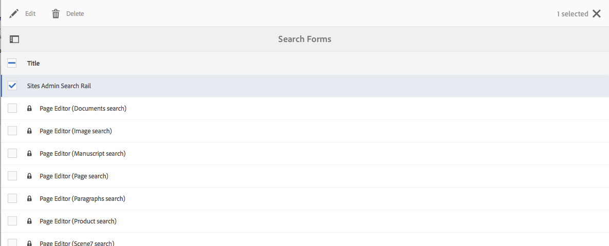

# 配置搜索表单{#configuring-search-forms}

使用 **搜索Forms** (Search Search Section)可自定义在各种AEM控制台和／或创作环境面板中提供的搜索面板中使用的搜索谓词的选择。 自定义这些面板可使搜索功能根据您的特定需求进行多用途化。

一 [系列](#predicates-and-their-settings)谓词现成可用。 您可以添加多个谓词，包括用于全文搜索的全文谓词、用于搜索与您指定的单个属性匹配的资产的属性谓词，或用于搜索与您为特定属性指定的一个或多个值相匹配的资产的选项谓词。

您可以 [配置在各种控制台](#configuring-your-search-forms) 和资产浏览器（编辑页面时）中使用的搜索表单。 配置 [这些表单的对话框](#configuring-your-search-forms) ，可通过以下方式访问：

* **工具**

   * **常规**

      * **搜索表单**

首次访问此控制台时，您可以看到所有配置都有一个挂锁符号。 这表示相应的配置是默认（现成）配置——无法删除。 自定义配置后，锁将消失——除非您删 [除自定义配置](#deleting-a-configuration-to-reinstate-the-default)，在这种情况下，将恢复默认配置（和挂锁指示符）。

## 配置 {#configurations}

可用的默认配置包括：

* **页面编辑器(文档搜索):**

   此配置定义在资产浏览器（编辑页面）中搜索文档时可用的选项。

* **页面编辑器（图像搜索）:**

   此配置定义在资产浏览器中（编辑页面时）搜索图像时可用的选项。

* **页面编辑器（手稿搜索）:**

   此配置定义在资产浏览器中（编辑页面时）搜索手稿时可用的选项。

* **页面编辑器（页面搜索）:**

   此配置定义在资产浏览器（编辑页面）中搜索页面时可用的选项。

* **页面编辑器（段落搜索）:**

   此配置定义在资产浏览器中（编辑页面时）搜索段落时可用的选项。

* **页面编辑器（产品搜索）:**

   此配置定义在资产浏览器中（编辑页面时）搜索产品时可用的选项。

* **页面编辑器(Scene7搜索**):

   此配置定义在资产浏览器（编辑页面时）中搜索Scene7资源时可用的选项。

* **站点管理员搜索边栏**:

   此配置定义在使用站点控制台的搜索边栏时用户可用的搜索选项。

* **页面编辑器（视频搜索）:**

   此配置定义在资产浏览器中（编辑页面时）搜索视频时可用的选项。

* **资产管理员搜索边栏:**

   此配置定义在使用资产控制台时用户可用的搜索选项。

* **目录管理员搜索边栏:**

   此配置定义用户在搜索商务目录时可用的搜索选项。

* **订单管理员搜索边栏:**

   此配置定义搜索商务订单时用户可用的搜索选项。

* **产品收藏集管理员搜索边栏:**

   此配置定义搜索商务产品集合时用户可用的搜索选项。

* **产品管理员搜索边栏:**

   此配置定义搜索商务产品时用户可用的搜索选项。

* **项目管理员搜索边栏:**

   此配置定义用户在搜索项目时可用的搜索选项。

## 谓词及其设置 {#predicates-and-their-settings}

### 谓词 {#predicates}

以下谓词可用，具体取决于配置：

<table> 
 <tbody> 
  <tr> 
   <th>谓词</th> 
   <th>用途</th> 
   <th>设置</th> 
  </tr> 
  <tr> 
   <td>分析 </td> 
   <td>显示以分析为后盾的数据时，站点浏览器中的搜索／过滤功能。 分析搜索过滤器加载以匹配映射的自定义分析列。</td> 
   <td> 
    <ul> 
     <li>字段标签</li> 
     <li>描述</li> 
    </ul> </td> 
  </tr> 
  <tr> 
   <td>上次修改的资源 </td> 
   <td>上次修改资产的日期。  </td> 
   <td>基于日期谓词的自定义谓词。</td> 
  </tr> 
  <tr> 
   <td>组件 </td> 
   <td>允许作者搜索／筛选具有特定组件的页面。 For example an image gallery.  </td> 
   <td> 
    <ul> 
     <li>字段标签</li> 
     <li>占位符</li> 
     <li>属性名称*</li> 
     <li>属性深度</li> 
     <li>描述</li> 
    </ul> </td> 
  </tr> 
  <tr> 
   <td>日期 </td> 
   <td>根据日期属性，基于滑块搜索资产。</td> 
   <td> 
    <ul> 
     <li>字段标签</li> 
     <li>属性名称*</li> 
     <li>描述</li> 
    </ul> </td> 
  </tr> 
  <tr> 
   <td>日期范围 </td> 
   <td>搜索在日期属性的指定范围内创建的资产。 在“搜索”面板中，可以指定开始日期和结束日期。</td> 
   <td> 
    <ul> 
     <li>字段标签</li> 
     <li>占位符</li> 
     <li>属性名称*</li> 
     <li>范围文本（自）*</li> 
     <li>范围文本（收件人）*</li> 
     <li>描述</li> 
    </ul> </td> 
  </tr> 
  <tr> 
   <td>到期状态 </td> 
   <td>根据到期状态搜索资产。</td> 
   <td> 
    <ul> 
     <li>字段标签</li> 
     <li>属性名称*</li> 
     <li>描述</li> 
    </ul> </td> 
  </tr> 
  <tr> 
   <td>文件大小 </td> 
   <td>根据资产大小搜索资产。</td> 
   <td> 
    <ul> 
     <li>字段标签</li> 
     <li>属性名称*</li> 
     <li>选项路径</li> 
     <li>描述</li> 
    </ul> </td> 
  </tr> 
  <tr> 
   <td>全文 </td> 
   <td>此搜索谓词用于进行全文搜索.</td> 
   <td> 
    <ul> 
     <li>字段标签</li> 
     <li>占位符</li> 
     <li>属性名称</li> 
     <li>描述</li> 
    </ul> </td> 
  </tr> 
  <tr> 
   <td>隐藏的筛选器</td> 
   <td>属性和值的过滤器，用户不可见。</td> 
   <td> 
    <ul> 
     <li>属性名称</li> 
     <li>属性值</li> 
     <li>描述</li> 
    </ul> </td> 
  </tr> 
  <tr> 
   <td>选项 </td> 
   <td>
这些选项是用户创建的内容节点。
 
有关 <a href="#addinganoptionspredicate">详细信息，请参阅</a> “添加选项谓词”。
 </td> 
   <td> 
    <ul> 
     <li>字段标签</li> 
     <li>JSON 路径</li> 
     <li>属性名称*</li> 
     <li>单选</li> 
     <li>选项路径</li> 
     <li>描述</li> 
    </ul> </td> 
  </tr> 
  <tr> 
   <td>选项属性 </td> 
   <td>搜索选项的属性。</td> 
   <td> 
    <ul> 
     <li>字段标签</li> 
     <li>属性名称*</li> 
     <li>选项节点路径  </li> 
     <li>单选</li> 
     <li>描述</li> 
    </ul> </td> 
  </tr> 
  <tr> 
   <td>页面 状态 </td> 
   <td>根据页面状态搜索页面。</td> 
   <td> 
    <ul> 
     <li>字段标签</li> 
     <li>发布属性名称</li> 
     <li>LiveCopy 属性名称</li> 
     <li>描述</li> 
    </ul> </td> 
  </tr> 
  <tr> 
   <td>路径 </td> 
   <td>搜索位于特定路径下的资产。</td> 
   <td> 
    <ul> 
     <li>字段标签</li> 
     <li>添加搜索路径</li> 
     <li>描述</li> 
    </ul> </td> 
  </tr> 
  <tr> 
   <td>属性 </td> 
   <td>搜索指定的属性。</td> 
   <td>无</td> 
  </tr> 
  <tr> 
   <td>发布状态 </td> 
   <td>根据资产的发布状态搜索资产</td> 
   <td> 
    <ul> 
     <li>字段标签</li> 
     <li>属性名称*</li> 
     <li>描述</li> 
    </ul> </td> 
  </tr> 
  <tr> 
   <td>范围 </td> 
   <td>搜索位于指定范围内的资源。 在“搜索”面板中，可以指定范围的最小值和最大值。</td> 
   <td> 
    <ul> 
     <li>字段标签</li> 
     <li>属性名称</li> 
     <li>描述</li> 
    </ul> </td> 
  </tr> 
  <tr> 
   <td>范围选项 </td> 
   <td>资产的特定搜索谓词，与通用的滑块谓词相同。 由于向后兼容性问题，仍可用。</td> 
   <td> 
    <ul> 
     <li>字段标签</li> 
     <li>属性名称*</li> 
     <li>选项路径</li> 
     <li>描述</li> 
    </ul> </td> 
  </tr> 
  <tr> 
   <td>评级 </td> 
   <td>根据资产的评级搜索资产。  </td> 
   <td> 
    <ul> 
     <li>字段标签</li> 
     <li>属性名称*</li> 
     <li>选项路径</li> 
     <li>描述</li> 
    </ul> </td> 
  </tr> 
  <tr> 
   <td>相对日期 </td> 
   <td>Search assets based on the relative date of their creation  </td> 
   <td> 
    <ul> 
     <li>字段标签</li> 
     <li>属性名称*</li> 
     <li>相对日期</li> 
     <li>描述</li> 
    </ul> </td> 
  </tr> 
  <tr> 
   <td>滑块范围 </td> 
   <td>使用滑块功能扩展范围谓词的通用搜索谓词。 搜索的属性的值必须介于滑块限制之间。</td> 
   <td> 
    <ul> 
     <li>字段标签</li> 
     <li>属性名称*</li> 
     <li>描述</li> 
    </ul> </td> 
  </tr> 
  <tr> 
   <td>Tag </td> 
   <td>根据标记搜索资产。 您可以配置“路径”属性，以在“标记”列表中填充各种标记。</td> 
   <td> 
    <ul> 
     <li>字段标签</li> 
     <li>属性名称*</li> 
     <li>选项路径</li> 
     <li>描述</li> 
    </ul> </td> 
  </tr> 
  <tr> 
   <td>标记 </td> 
   <td>根据标记进行搜索。</td> 
   <td> 
    <ul> 
     <li>占位符</li> 
     <li>属性名称*</li> 
     <li>描述</li> 
    </ul> </td> 
  </tr> 
 </tbody> 
</table>

>[!NOTE]
>
>* 常用搜索谓词在以下位置进行定义：
   >  `/libs/cq/gui/components/common/admin/customsearch/searchpredicates`
   >  
   >  
   >

* 仅与siteadmin（经典UI）相关的搜索谓词位于以下位置：
   > `/libs/cq/gui/components/siteadmin/admin/searchpanel/searchpredicates`
   >   * 这些版本已弃用，并且仅可用于向后兼容。

> 
>
此信息仅供参考，您不得对进行更改 `/libs`。

### 谓词设置 {#predicate-settings}

根据谓词，可以选择以下设置进行配置：

* **字段标签**

   将显示为可折叠标题或谓词字段标签的标签。

* **描述**

   用户的描述性详细信息。

* **占位符**

   如果未输入过滤文本，则为空文本或谓词的占位符。

* **属性名称**

   要搜索的属性。 它使用相对路径，通配符 `*/*/*` 指定属性相对于节点的深度(每个星 `jcr:content` 号表示一个节点级别)。

   如果只想在具有该节点上的属性的资源的一级子节点 `x` 上搜索， `jcr:content` 则使用 `*/jcr:content/x`

* **属性深度**

   在资源中搜索该属性的最大深度。 因此，可以对资源和递归子项执行对该属性的搜索，直到子项的级别等于指定的深度。

* **属性值**

   属性值作为绝对字符串或作为表达式语言； 例如， `cq:Page` 或

   `${empty requestPathInfo.suffix ? "/content" : requestPathInfo.suffix}`。

* **范围文本**

   “日期范围”谓词中范围字段 **的标签** 。

* **选项路径**

   用户可以使用谓词设置选项卡中的路径浏览器选择路径。 选择+图 **标后** ，将选择添加到有效选项的列表中(然后 **使用——图标根据需要** 删除)。

   这些选项是用户创建的内容节点，其结构如下：

   `(jcr:primaryType = nt:unstructured, value (String), jcr:title (String))`

* **选项节点路**&#x200B;径与 
**选项路径**，只有此路径位于通用谓词字段中，而另一个路径则特定于资产。

* **单选**&#x200B;如果选中，选项将呈现为复选框，仅允许单选。 如果错误地选中了复选框，则可取消选中该复选框。

* **发布和Live Copy属性名称特**&#x200B;定站点谓词的发布和Live Copy复选框的标签。

* &amp;ast; 在“设置”选项卡的 **字段** 标签上，表示字段为必填字段，如果留空，将显示错误消息

## 配置搜索Forms {#configuring-your-search-forms}

### 创建／打开自定义配置 {#creating-opening-a-customized-configuration}

1. 导航到 **工具**、 **操作**、 **搜索Forms**。

1. 选择要自定义的配置。
1. 使用编 **辑** 图标打开要更新的配置。
1. 如果是新的自定义，您可能想要 [添加新的谓词字段并根据需要定义](#add-edit-a-predicate-field-and-define-field-settings) 设置。 如果是现有自定义，则可以选择现有字段并 [更新设置](#add-edit-a-predicate-field-and-define-field-settings)。
1. Select **Done** to save the configuration.

   >[!NOTE]
   >
   >自定义配置存储在（视情况而定）下：
   >
   >* `/apps/cq/gui/content/facets/<option>`
   >* `/apps/commerce/gui/content/facets/<option>`

### 添加／编辑谓词字段和定义字段设置 {#add-edit-a-predicate-field-and-define-field-settings}

您可以添加或编辑字段，并定义／更新其设置：

1. [打开要更新的自定](#creating-opening-a-customized-configuration) 义配置。
1. 如果要添加新字段，请打开“选 **择谓词** ”选项卡，并将所需的谓词拖动到所需位置。 例如，日期 **范围谓词**:

   

1. 取决于：

   * 您正在添加新字段：

      添加谓词后，将 **打开** “设置”选项卡并显示可定义的属性。

   * 您要更新现有谓词：

      选择谓词字段（在右侧），然后打开“设 **置** ”选项卡。
   例如，日期范围谓词 **的设置**:

   

1. 根据需要进行更改，然后单击“完 **成”**。

### 预览搜索配置 {#previewing-the-search-configuration}

1. 选择预览图标：

   

1. 这将显示搜索表单，就像在相应控制台的“搜索”列中显示（完全展开）这些表单一样。

   

1. **关闭** 预览以返回并完成配置。

### 删除谓词字段 {#deleting-a-predicate-field}

1. [打开要更新的自定](#creating-opening-a-customized-configuration) 义配置。
1. 选择谓词字段（在右侧），打开“设 **置** ”选项卡，然后选择 **删除** 图标（左下方）。

   

1. 对话框将请求确认删除操作。

1. 使用完成确认此更改和任何其他 **更改**。

### 删除配置（恢复默认配置） {#deleting-a-configuration-to-reinstate-the-default}

自定义配置后，这将覆盖默认值。 您可以通过删除自定义配置来重新声明默认配置。

>[!NOTE]
>
>您无法删除任一默认配置。

从控制台中删除自定义配置：

1. 选择所需的配置(例如，页 **面编辑器(段落搜索**))，然后 **在工具栏中** 选择“删除”图标：

   

1. 将删除自定义配置并恢复默认配置（在控制台中重新显示挂锁符号表示）。

### 添加选项谓词 {#adding-options-predicates}

选项谓词（选项、选项属性）允许您配置要搜索的项目。 它们通常用于直接搜索页面下的内容； 例如，页面节点上的属性。

以下示例（根据用于创建页面的模板进行搜索）说明了所涉及的步骤：

1. 创建定义要搜索的属性的节点。

   您需要一个根节点，其中包含单个选项的定义才能提供给用户。

   单个选项的节点需要属性：

   * `jcr:title` -要在搜索边栏中显示的字段标签
   * `value` -要搜索的属性值

   

   >[!NOTE]
   >
   >您 ***不得*** 更改路径中的任 `/libs` 何内容。
   >
   >这是因为下次升级实 `/libs` 例时，内容会被覆盖（而应用修补程序或功能包时，内容很可能会被覆盖）。
   >
   >建议的配置和其他更改方法是：
   >
   >1. 在下重新创建所需的项(它 `/libs`存在于 `/apps`)。 在本例中，来源：
   >1. `/libs/cq/gui/content/common/options/predicates`
   >1. 在 `/apps.`

1. 打开搜 **索Forms** (Search Segation)控制台，选择要更新的配置。 例如，“站 **点管理员搜索边栏**”。

   然后单击／点按编 **辑搜索表单** 图标。

1. 根据配置，向配 **置添加****“选项** ”或“选项”属性。
1. 更新字段，特别是：

   * **属性名称**

      在目标节点上指定要搜索的节点属性。 例如：

      `jcr:content/cq:template`

   * **选项节点路径**

      选择保留选项的路径。 例如：

      `/apps/cq/gui/content/common/options/predicates/templatetype`
   

1. Select **Done** to save your configuration.
1. 导航到相应的控制台(在本例中为 **站点**)并打开 **搜索边栏** 。 新定义的搜索表单以及各种选项将可见。 选择所需的选项可查看搜索结果：

   

## 用户权限 {#user-permissions}

下表列表了对搜索表单执行编辑、删除和预览操作所需的权限。

<table> 
 <tbody> 
  <tr> 
   <td><strong>操作</strong></td> 
   <td><strong>权限</strong></td> 
  </tr> 
  <tr> 
   <td>编辑 </td> 
   <td>节点的读取、写入 <code>/apps </code>权限。</td> 
  </tr> 
  <tr> 
   <td>删除</td> 
   <td>节点上的读取、写入和删除权 <code>/apps</code> 限</td> 
  </tr> 
  <tr> 
   <td>预览</td> 
   <td>节点上的读取、写入和删除 <code>/var/dam/content</code> 权限。  节点上的读取、写入 <code>/apps</code> 权限。</td> 
  </tr> 
 </tbody> 
</table>

