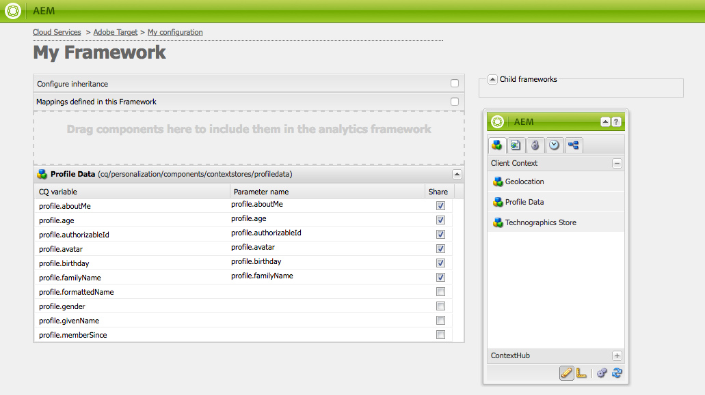

# 手动配置与Adobe target的集成 {#manually-configuring-the-integration-with-adobe-target}

您可以修改在使用向导时创建的加入向导配置，也可以手动与Adobe Target集成，而无需使用向导。

## 修改加入向导配置 {#modifying-the-opt-in-wizard-configurations}

将 [AEM与Adobe Target集成的](/help/sites-administering/opt-in.md) Opt-in向导会自动创建一个名为“已配置目标配置”的Target云配置。 该向导还为名为“已配置的目标框架”的云配置创建Target框架。 您可以根据需要修改云配置和框架的属性。

您还可以配置Adobe Target，以在定位内容时将Adobe Target用作报告源，方法是配置A4T Analytics云配置。

要找到云和框架，请通过“工具” **>“部** 署” **>“云配置”导航**********&#x200B;到云服务。 ([http://localhost:4502/libs/cq/core/content/tools/cloudservices.html](http://localhost:4502/libs/cq/core/content/tools/cloudservices.html))\
在Adobe Target下，单击或点按显 **示配置**。

### 预配的目标配置属性 {#provisioned-target-configuration-properties}

在“选择加入”向导创建的“已配置目标配置”云配置中使用以下属性值：

* **** 客户端代码：在选择加入向导中输入。
* **** 电子邮件：在选择加入向导中输入。
* **** 密码：在选择加入向导中输入。
* **** API类型：REST
* **** 从Adobe Target同步区段：已选择。

* **** 客户端库：mbox.js。
* **** 使用DTM交付客户端库：未选择。 如果使用DTM  或其他标签管理系统来承载mbox.js或AT.js文件，请选择此选项。 Adobe建议您使用DTM而不是AEM来传送库。

* **** 自定义mbox.js:未指定，因此使用默认mbox.js文件。 根据需要指定要使用的自定义mbox.js文件。 仅当您选择了mbox.js时显示。
* **** 自定义AT.js:未指定，因此使用默认的AT.js文件。 根据需要指定要使用的自定义AT.js文件。 仅当您选择了AT.js时显示。

>[!NOTE]
>
>在AEM 6.3中，您可以选择目标库文件 [AT.JS](https://marketing.adobe.com/resources/help/en_US/target/ov2/c_target-atjs-implementation.html)，该文件是Adobe Target的一个新实施库，专为典型Web实施和单页应用程序而设计。
>
>AT.js对mbox.js库提供了若干改进：
>
>* 改进了Web实现的页面加载时间
>* 改进的安全性
>* 针对单页应用程序的更好实施选项
>* AT.js包含target.js中包含的组件，因此不再有对target.js的调用
>
>
有关更 [多信息，请参阅](https://marketing.adobe.com/resources/help/en_US/target/rn/201604.html) Target发行说明。

### 预配的目标框架属性 {#provisioned-target-framework-properties}

选择加入向导创建的已配置目标框架配置为从配置文件数据存储发送上下文数据。 默认情况下，商店的年龄和性别数据项会发送到Target。 您的解决方案可能需要发送其他参数。

您可以配置框架以向Target发送其他上下文信息，如添 [加Target框架中所述](/help/sites-administering/target-configuring.md#adding-a-target-framework)。

### Configuring A4T Analytics Cloud Configuration {#configuring-a-t-analytics-cloud-configuration}

您可以配置Adobe Target，以在定位内容时将Adobe Analytics用作报告源。

为此，您需要指定将Adobe Target云配置与以下项连接的A4T云配置：

1. 通过“ **AEM徽标** ” **>“工具”** >“Deployment **”** >“Cloud Services”导航 ********&#x200B;到Cloud Services。
1. 在“ **Adobe Target** ”部分，单击“ **立即配置”**。
1. 重新连接到您的Adobe Target配置。
1. 在 **A4T Analytics云配置下拉菜单中** ，选择框架。

   >[!NOTE]
   >
   >只有为A4T启用的分析配置才可用。
   >
   >在AEM中配置A4T时，可能会看到缺少配置引用条目。 要能够选择分析框架，请执行以下操作：
   > 
   >1. 导航到 **工具** >常 **规** > **CRXDE Lite**。
   1. 导航到 **/libs/cq/analytics/components/testandtargetpage/dialog/items/tabs/items/tab1_general/items/a4tAnalyticsConfig**
   1. 将属性disable **设置为****false**。
   1. Tap or click **Save All**.

   

   单击&#x200B;**确定**。使用Adobe target定位内容时，您可以选 [择报告源](/help/sites-authoring/content-targeting-touch.md)。

## Manually Integrating with Adobe Target {#manually-integrating-with-adobe-target}

手动与Adobe Target集成，而不是使用选择加入向导。

>[!NOTE]
目标库文件 [AT.JS](https://marketing.adobe.com/resources/help/en_US/target/ov2/c_target-atjs-implementation.html)，是Adobe Target的一个新实施库，专为典型Web实施和单页应用程序设计。 Adobe建议您使用AT.js而不是mbox.js作为客户端库。
AT.js对mbox.js库提供了若干改进：
* 改进了Web实现的页面加载时间
* 改进的安全性
* 针对单页应用程序的更好实施选项
* AT.js包含target.js中包含的组件，因此不再有对target.js的调用

有关更 [多信息，请参阅](https://marketing.adobe.com/resources/help/en_US/target/rn/201604.html) Target发行说明。
您可以在“客户端库”下拉菜单中选 **择AT** .js或mbox.js。

### 创建Target Cloud配置 {#creating-a-target-cloud-configuration}

要使AEM能够与Adobe Target交互，请创建Target云配置。 要创建配置，请提供Adobe target客户端代码和用户凭据。

您只能创建一次Target云配置，因为您可以将该配置与多个AEM营销活动关联。 如果您有多个Adobe target客户端代码，请为每个客户端代码创建一个配置。

您可以配置云配置以从Adobe Target同步区段。 如果启用同步，则在保存云配置后，会立即从后台的Target导入区段。

请按照以下过程在AEM中创建Target云配置：

1. 通过“ **AEM徽标** ” **>“工具”** >“Deployment **”** >“Cloud Services”导航 ********&#x200B;到Cloud Services。 ([http://localhost:4502/libs/cq/core/content/tools/cloudservices.html](http://localhost:4502/libs/cq/core/content/tools/cloudservices.html))

   此时 **将打开Adobe Marketing Cloud** 概述页面。

1. 在“ **Adobe Target** ”部分，单击“ **立即配置”**。
1. 在创建配 **置对话框中** :

   1. 为配置指定 **标题**。
   1. 选择 **Adobe Target配置模板** 。
   1. 单击&#x200B;**创建**。
   此时将打开编辑对话框。

   

   >[!NOTE]
   在AEM中配置A4T时，可能会看到缺少配置引用条目。 要能够选择分析框架，请执行以下操作：
   1. 导航到 **工具** >常 **规** > **CRXDE Lite**。
   1. 导航到 **/libs/cq/analytics/components/testandtargetpage/dialog/items/tabs/items/tab1_general/items/a4tAnalyticsConfig**
   1. 将属性disable **设置为****false**。
   1. Tap or click **Save All**.

1. 在对话框中，提供这些属性的值。

   * **客户端代码**:目标帐户客户端代码
   * **电子邮件**:目标帐户电子邮件。
   * **密码**:目标帐户密码。
   * **API类型**:REST或XML
   * **A4T Analytics云配置**:选择用于目标活动目标和指标的Analytics云配置。 如果您在定位内容时使用Adobe Analytics作为报告源，则需要此功能。 如果看不到云配置，请参阅配置A4T [Analytics云配置中的注意事项](#configuring-a-t-analytics-cloud-configuration)。

   * **** 使用准确定位：默认情况下，此复选框处于选中状态。 如果选择此项，云服务配置将在加载内容之前等待上下文加载。 请参阅以下注意事项。
   * **** 从Adobe Target同步区段：选择此选项可下载在Target中定义的区段，以便在AEM中使用它们。 当“API类型”属性为REST时，必须选择此选项，因为不支持内联区段，并且您始终需要使用Target中的区段。 （请注意，“segment”的AEM术语与Target的“audience”等效。）
   * **** 客户端库：选择是要mbox.js还是AT.js客户端库。
   * **使用DTM传送客户端库** -选择此选项可使用DTM中的AT.js或mbox.js或其他标签管理系统。 必须配 [置DTM集成](/help/sites-administering/dtm.md) ，才能使用此选项。 Adobe建议您使用DTM而不是AEM来传送库。
   * **自定义mbox.js**:如果选中DTM框或使用默认mbox.js，请将其留空。 或者上传自定义mbox.js。 仅当您选择了mbox.js时显示。
   * **自定义AT.js**:如果选中DTM框或使用默认的AT.js，请将其留空。 或者上传自定义AT.js。 仅当您选择了AT.js时显示。
   >[!NOTE]
   默认情况下，当您选择加入Adobe target配置向导时，“准确定位”处于启用状态。
   准确定位意味着云服务配置在加载内容之前会等待上下文加载。 因此，在性能方面，准确定位可能会在加载内容之前造成毫秒的延迟。
   创作实例上始终启用准确定位。 但是，在发布实例中，您可以通过清除云服务配置(http://localhost:4502/etc/cloudservices.html)中“准确定位”旁边的复选标记，选择全局关闭准确&#x200B;**定位**。 您还可以打开和关闭各个组件的精确定位，而不管您在云服务配置中进行了何种设置。
   如果您已经创 ***建了目标组件*** ，并且更改了此设置，则您所做的更改不会影响这些组件。 您必须直接对这些组件进行任何更改。

1. 单击 **连接到Target** ，以初始化与Target的连接。 如果连接成功，则显示消息**连接成功**。 单 **击消息** “确定”，然后 **单击** “确定”。

   如果无法连接到Target，请参阅疑难 [解答](/help/sites-administering/target-configuring.md#troubleshooting-target-connection-problems) 部分。

### 添加Target Framework {#adding-a-target-framework}

在配置Target云配置后，添加Target框架。 该框架标识从可用的Client Context或 [ContextHub组件发送到Adobe Target的默](/help/sites-administering/client-context.md) 认参数  。 Target使用参数确定应用于当前上下文的区段。

您可以为单个Target配置创建多个框架。 当您需要为网站的不同部分将一组不同的参数发送到Target时，多个框架很有用。 为需要发送的每组参数创建一个框架。 将网站的每个部分与相应的框架相关联。 请注意，网页一次只能使用一个框架。

1. 在Target配置页面上，单击“可 **用框架** ”旁边的+（加号）。
1. 在“创建框架”对话框中，指定 **标题**，选择 **Adobe Target Framework**，然后单击“ **创建**”。

   

   将打开框架页面。 Sidekick提供的组件表示您可以映射 [的Client Context](/help/sites-administering/client-context.md)[或ContextHub](/help/sites-administering/contexthub-config.md) 中的信息。

   

1. 拖动表示要用于映射到放置目标的数据的Client context组件。 或者，将&#x200B;**ContextHub Store组件拖到框架** 。

   >[!NOTE]
   映射时，参数会通过简单字符串传递到mbox。 无法从ContextHub映射数组。

   例如，要使用站点访 **问者的个人资料数据** ，以控制您的Target营销活动，请将个人资料数据组 **** 件拖动到页面。 此时会显示可用于映射到Target参数的配置文件数据变量。

   

1. 通过选中相应列中的“共享”复选框，选择要在Adobe Target系统中显 **示的变** 量。

   

   >[!NOTE]
   同步参数只是一种方式——从AEM到Adobe Target。

将创建您的框架。 要将框架复制到发布实例，请使用Sidekick中 **的“激活框架** ”选项。

### 将活动与目标云配置关联 {#associating-activities-with-the-target-cloud-configuration}

将 [AEM活动与Target云配置关联](/help/sites-authoring/activitylib.md) ，以便能够镜像 [Adobe Target中的活动](https://marketing.adobe.com/resources/help/en_US/target/target/c_manage_content.html)。

>[!NOTE]
可用的活动类型由以下因素决定：
* 如果对 AEM 端上用来连接到 Adobe Target 的 Adobe Target 租户 (clientcode) 启用了 **xt_only** 选项，则您&#x200B;**只**&#x200B;能在 AEM 中创建 XT 活动。

* 如果&#x200B;**未**&#x200B;对 Adobe Target 租户 (clientcode) 启用 **xt_only** 选项，则可以在 AEM 中创建 XT 活动&#x200B;**和** A/B 活动。

**另请注意：****xt_only** 选项是对特定 Target 租户 (clientcode) 应用的设置，只能直接在 Adobe Target 中进行修改。您无法在 AEM 中启用或禁用此选项。

### 将目标框架与站点关联 {#associating-the-target-framework-with-your-site}

在AEM中创建Target框架后，将网页与框架关联。 页面上的目标组件会将框架定义的数据发送到Adobe Target进行跟踪。 (请参阅 [内容定位](/help/sites-authoring/content-targeting-touch.md)。)

将页面与框架关联后，子页面将继承关联。

1. 在“站 **点** ”控制台中，导航到要配置的站点。
1. 使用快 [速操作](/help/sites-authoring/basic-handling.md#quick-actions) 或选择 [模式](/help/sites-authoring/basic-handling.md)，选择 **“查看属性”。**
1. 选择“ **云服务** ”选项卡。
1. Tap/click **Edit**.
1. 点按／单击“ **云服务配置** ”下 **的“添加配置”** ，然后选择 **“Adobe Target**”。

   

1. 在“配置参考”( **Configuration Reference)下选择所需的框架**。

   >[!NOTE]
   确保选择您创建的特 **定框架** ，而不是创建该框架时所依据的Target云配置。

1. 点按／单击 **完成**。
1. 激活网站的根页面，以将其复制到发布服务器。 (See [How To Publish Pages](/help/sites-authoring/publishing-pages.md).)

   >[!NOTE]
   如果您附加到页面的框架尚未激活，则会打开一个向导，通过该向导，您也可以发布页面。

## 目标连接问题疑难解答 {#troubleshooting-target-connection-problems}

执行以下任务以解决连接到Target时出现的问题：

* 确保您提供的用户凭据正确无误。
* 确保AEM实例可以连接到Target服务器。 例如，确保防火墙规则不会阻止出站AEM连接，或者AEM配置为使用必要的代理。
* 在AEM错误日志中查找有帮助的消息。 error.log文件位于安装AEM **的crx-quickstart/logs** 目录中。
* 在Adobe Target中编辑活动时，URL将指向localhost。 通过将AEM externalizer设置为正确的URL，可解决此问题。

