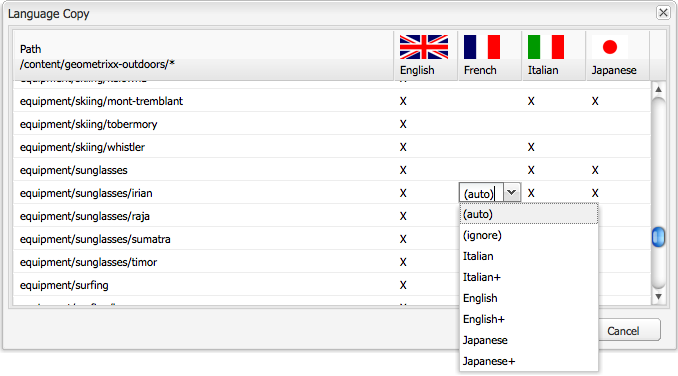

# 使用经典UI创建语言根{#creating-a-language-root-using-the-classic-ui}

>[!CAUTION]
>
>AEM 6.4已结束扩展支持，本文档将不再更新。 有关更多详细信息，请参阅 [技术支助期](https://helpx.adobe.com/cn/support/programs/eol-matrix.html). 查找支持的版本 [此处](https://experienceleague.adobe.com/docs/).

以下过程使用经典UI创建站点的语言根。 有关更多信息，请参阅 [创建语言根](/help/sites-administering/tc-prep.md#creating-a-language-root).

1. 在网站控制台的网站树中，选择站点的根页面。 ([http://localhost:4502/siteadmin#](http://localhost:4502/siteadmin#))
1. 添加表示网站语言版本的新子页面：

   1. 单击新建>新建页面。
   1. 在对话框中，指定标题和名称。 名称的格式必须为 `<language-code>` 或 `<language-code>_<country-code>`，例如en_US、en_us、en_GB、en_gb。

      * 支持的语言代码为小写，由ISO-639-1定义的双字母代码
      * 受支持的国家/地区代码为小写或大写，由ISO 3166定义的双字母代码
   1. 选择模板，然后单击创建。

   

1. 在网站控制台的网站树中，选择站点的根页面。
1. 在“工具”菜单中，选择“语言副本”。

   

   语言副本对话框显示可用语言版本和网页的矩阵。 语言列中的x表示页面使用该语言。

   

1. 要将现有页面或页面树复制到语言版本，请在语言列中为该页面选择单元格。 单击箭头，然后选择要创建的复制类型。

   在以下示例中，设备/太阳镜/irian页面正被复制到法语版本。

   

   | 语言副本类型 | 描述 |
   |---|---|
   | auto | 使用父页面中的行为 |
   | 忽略 | 不创建此页面及其子页面的副本 |
   | `<language>+` （例如，法语+） | 复制该语言中的页面及其所有子页面 |
   | `<language>` （例如法语） | 仅复制该语言中的页面 |

1. 单击确定以关闭对话框。
1. 在下一个对话框中，单击是以确认副本。
