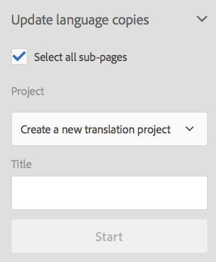
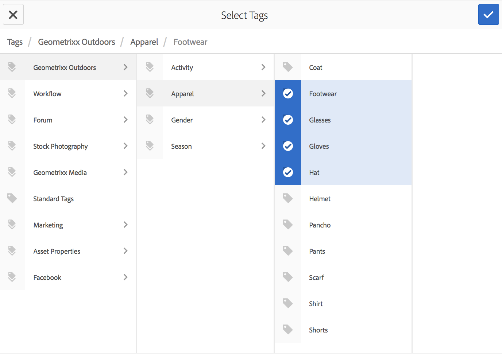

# 管理翻译项目{#managing-translation-projects}

在准备翻译内容后，您需要通过创建缺少的语言副本来完成语言结构，并创建翻译项目。

翻译项目使您能够管理AEM内容的翻译。 翻译项目是一种AEM [project](/help/sites-authoring/projects.md)类型，其中包含要翻译成其他语言的资源。 这些资源是使用语言主控创建的[语言副本](/help/sites-administering/tc-prep.md)的页面和资产。

将资源添加到翻译项目后，将为其创建翻译作业。 作业提供命令和状态信息，您可以使用这些命令和状态信息来管理对资源执行的人工翻译和机器翻译工作流。

>[!NOTE]
>
>翻译项目可以包含多个翻译作业。

翻译项目是长期运行的项目，由语言和翻译方法/提供商定义，以符合全球化的组织管理。 在初始翻译期间或手动翻译期间，应启动一次，并在整个内容和翻译更新活动中保持有效。

翻译项目和作业是使用翻译准备工作流创建的。 这些工作流有三个选项，分别用于初始翻译（创建和翻译）和更新（更新翻译）：

1. [创建新项目](#creating-translation-projects-using-the-references-panel)
1. [添加到现有项目](#adding-pages-to-a-translation-project)
1. [仅限内容结构](#creating-the-structure-of-a-language-copy)

>[!NOTE]
>
>选项3与翻译作业/项目无关。 它允许您将语言主控的内容和结构更改复制到（未翻译）语言副本。 您可以使用它保持语言母版同步，即使不进行翻译。

## 执行初始翻译并更新现有翻译{#performing-initial-translations-and-updating-existing-translations}

AEM会检测是为内容的初始翻译创建翻译项目，还是更新已翻译的语言副本。 在为页面创建翻译项目并指示要翻译的语言副本时，AEM会检测源页面在目标语言副本中是否已存在：

* **语言副本不包括页面：** AEM将这种情况视为初始翻译。页面会立即复制到语言副本中，并包含在项目中。 将翻译后的页面导入AEM后，AEM会直接将其复制到语言副本。
* **语言副本已包含页面：** AEM将此情况视为更新的翻译。随即会创建启动项，并将页面的副本添加到启动项中，并包含在项目中。 启动项允许您在将更新的翻译提交到语言副本之前，先查看该翻译：

   * 将翻译后的页面导入AEM后，会覆盖启动项中的页面。
   * 仅当提升启动项时，翻译后的页面才会覆盖语言副本。

例如，为/content/geometrixx/en主控语言的法语翻译创建/content/geometrixx/fr语言根目录。 法语副本中没有其他页面。

* 将为/content/geometrixx/en/products页面和所有子页面创建翻译项目，以法语语言副本为目标。 由于语言副本不包括/content/geometrixx/fr/products页面，因此AEM会立即将/content/geometrixx/en/products页面和所有子页面复制到法语语言副本中。 翻译项目中也包含这些副本。
* 将为/content/geometrixx/en页面和所有子页面创建翻译项目，以法语语言副本为目标。 由于语言副本包含与/content/geometrixx/en页面（语言根）对应的页面，因此AEM会复制/content/geometrixx/en页面和所有子页面，并将它们添加到启动项中。 翻译项目中也包含这些副本。

## 使用引用面板{#creating-translation-projects-using-the-references-panel}创建翻译项目

创建翻译项目，以便您能够执行和管理用于翻译语言资源的工作流主控。 在创建项目时，您需要以要翻译的语言主控以及要执行翻译的语言副本指定页面：

* 与选定页面关联的翻译集成框架的云配置决定了翻译项目的许多属性，如要使用的翻译工作流。
* 将为选定的每个语言副本创建一个项目。
* 此时会创建选定页面的副本以及关联的资产，并将其添加到每个项目。 这些副本稍后会发送给翻译提供商以进行翻译。

您可以指定还选择选定页面的子页面。 在这种情况下，子页面的副本也会添加到每个项目中，以便翻译。 当任何子页面与不同的翻译集成框架配置关联时，AEM会创建其他项目。

您还可以[手动创建翻译项目](#creating-a-translation-project-using-the-projects-console)。

**初始翻译和更新翻译**

“引用”面板指示您是更新现有语言副本还是创建语言副本的第一个版本。 当选定页面存在语言副本时，将显示“更新语言副本”选项卡，提供对项目相关命令的访问。

翻译后，可以在使用翻译覆盖语言副本之前，[查看翻译](#reviewing-and-promoting-updated-content)。 当选定页面不存在语言副本时，将显示“创建并翻译”选项卡，提供对项目相关命令的访问。

### 为新语言副本创建翻译项目{#create-translation-projects-for-a-new-language-copy}

1. 使用站点控制台选择要添加到翻译项目的页面。

   例如，要翻译Geometrixx演示网站的英文页面，请选择Geometrixx演示网站>英文。

1. 在工具栏中，单击或点按引用。

   

1. 选择语言副本，然后选择要翻译其源页面的语言副本。
1. 单击或点按创建和翻译，然后配置翻译作业：

   * 使用语言下拉列表选择要翻译的语言副本。 根据需要选择其他语言。 列表中显示的语言与您创建的](/help/sites-administering/tc-prep.md#creating-a-language-root)语言根对应。[
   * 要翻译您选择的页面和所有子页面，请选择“选择所有子页面”。 要仅翻译您选择的选定页面，请清除选项。
   * 对于项目，选择新建翻译项目。
   * 键入项目的名称。

   

1. 单击或点按创建。

### 为现有语言副本创建翻译项目{#create-translation-projects-for-an-existing-language-copy}

1. 使用站点控制台选择要添加到翻译项目的页面。

   例如，要翻译Geometrixx演示网站的英文页面，请选择Geometrixx演示网站>英文。

1. 在工具栏中，单击或点按引用。

   

1. 选择语言副本，然后选择要翻译其源页面的语言副本。
1. 单击或点按更新语言副本，然后配置翻译作业：

   * 要翻译您选择的页面和所有子页面，请选择“选择所有子页面”。 要仅翻译您选择的选定页面，请清除选项。
   * 对于项目，选择新建翻译项目。
   * 键入项目的名称。

   

1. 单击或点按开始。

## 将页面添加到翻译项目{#adding-pages-to-a-translation-project}

创建翻译项目后，可以使用“资源”窗格向项目添加页面。 当您在同一项目中包含来自不同分支的页面时，添加页面非常有用。

在将页面添加到翻译项目时，这些页面会包含在新的翻译作业中。 您还可以[将页面添加到现有作业](#adding-pages-assets-to-a-translation-job)。

与创建新项目时一样，在添加页面时，会在必要时将页面的副本添加到启动项，以避免覆盖现有语言副本。 （请参阅[为现有语言副本创建翻译项目](#performing-initial-translations-and-updating-existing-translations)。）

1. 使用站点控制台选择要添加到翻译项目的页面。

   例如，要翻译Geometrixx演示网站的英文页面，请选择Geometrixx演示网站>英文。

1. 在工具栏中，单击或点按引用。

   

1. 选择语言副本，然后选择要翻译其源页面的语言副本。

   

1. 单击或点按更新语言副本，然后配置属性：

   * 要翻译您选择的页面和所有子页面，请选择“选择所有子页面”。 要仅翻译您选择的选定页面，请清除选项。
   * 对于项目，选择添加到现有翻译项目。
   * 选择项目。

   >[!NOTE]
   >
   >翻译项目中设置的目标语言应与语言副本的路径相匹配，如引用面板中所示。

   

1. 单击或点按开始。

## 将页面/资产添加到翻译作业{#adding-pages-assets-to-a-translation-job}

您可以向翻译项目的翻译作业中添加页面、资产、标记或i18n字典。 要添加页面或资产，请执行以下操作：

1. 在翻译项目的翻译作业拼贴的底部，单击或点按省略号。

   

1. 单击或点按添加和页面/资产。

   

1. 选择要添加的分支的最顶端项目，然后单击或点按复选标记图标。 您可以进行多选。

   

1. 或者，您也可以选择搜索图标，以轻松查找要添加到翻译作业的页面或资产。

   

您的页面和/或资产会添加到翻译作业中。

## 将i18n字典添加到翻译作业{#adding-i-n-dictionaries-to-a-translation-job}

您可以向翻译项目的翻译作业中添加页面、资产、标记或i18n字典。 要添加i18n词典，请执行以下操作：

1. 在翻译项目的翻译作业拼贴的底部，单击或点按省略号。

   

1. 单击或点按添加和I18N-Dictionary。

   

1. 选择要添加的字典，然后单击或点按添加按钮。

   

你的字典现在在翻译工作。

>[!NOTE]
>
>有关i18n字典的更多信息，请阅读[使用翻译器管理字典](/help/sites-developing/i18n-translator.md)。

## 向翻译作业{#adding-tags-to-a-translation-job}添加标记

您可以向翻译项目的翻译作业中添加页面、资产、标记或i18n字典。 添加标记：

1. 在翻译项目的翻译作业拼贴的底部，单击或点按省略号。

   

1. 单击或点按添加，然后单击标记。

   

1. 选择要添加的标记，然后单击或点按复选标记图标。 您可以进行多选。

   

您的标记现已添加到翻译作业中。

## 查看翻译项目详细信息{#seeing-translation-project-details}

“翻译摘要”拼贴包含为翻译项目配置的属性。 除了通用的[项目信息](/help/sites-authoring/projects.md#project-info)之外，“翻译”选项卡还包含特定于翻译的属性：

* 源语言：正在翻译的页面的语言。
* 目标语言：页面被翻译到的语言。
* 翻译方法：翻译工作流。 支持人文翻译或机器翻译。
* 翻译提供商：执行翻译的翻译服务提供商。
* 内容类别：（机器翻译）用于翻译的内容类别。
* 云配置：用于项目的翻译服务连接器的云配置。

使用页面的“资源”窗格创建项目时，这些属性会根据源页面的属性自动进行配置。

## 监控翻译作业的状态{#monitoring-the-status-of-a-translation-job}

翻译项目的“翻译作业”拼贴提供了翻译作业的状态，以及作业中的页面和资产数量。

下表描述了作业或作业中的项目可以具有的每种状态：

| 状态 | 描述 |
|---|---|
| 个草稿 | 尚未启动翻译作业。 创建翻译作业后，这些作业处于“草稿”状态。 |
| 已提交 | 翻译作业中的文件在成功发送到翻译服务后会处于此状态。 在发出“请求范围”命令或“开始”命令后，可能会出现此状态。 |
| 已请求设定范围 | 对于“人文翻译”工作流，作业中的文件已提交给翻译供应商进行范围分析。 发出“请求范围”命令后，将显示此状态。 |
| 已完成范围的设定 | 供应商已确定翻译作业的范围。 |
| 承诺翻译 | 项目所有者已接受该范围。 此状态表示翻译供应商应开始翻译作业中的文件。 |
| 正在翻译 | 对于作业，作业中一个或多个文件的翻译尚未完成。 对于作业中的项目，该项目正在翻译。 |
| 已翻译 | 对于作业，作业中所有文件的翻译已完成。 对于作业中的项目，该项目已翻译。 |
| 准备审阅 | 作业中的项目已翻译，文件已导入AEM。 |
| 完成 | 项目所有者表示翻译合同已完成。 |
| 取消 | 指示翻译供应商应停止处理翻译作业。 |
| 错误更新 | 在AEM和翻译服务之间传输文件时出错。 |
| 未知状态 | 发生未知错误。 |

要查看作业中每个文件的状态，请单击或点按图块底部的省略号。

## 设置翻译作业的到期日期{#setting-the-due-date-of-translation-jobs}

指定翻译供应商需要返回翻译文件的日期。 您可以为项目或特定作业设置到期日期：

* **项目：** 项目中的翻译作业将继承到期日期。
* **作业：** 您为作业设置的到期日期将覆盖为项目设置的到期日期。

仅当您使用的翻译供应商支持此功能时，才能正确设置到期日期。

以下过程设置项目的到期日期。

1. 单击或点按“翻译摘要”拼贴底部的省略号。

   

1. 在“基本”选项卡上，使用“到期日期”属性的日期选取器选择到期日期。

   

1. 单击或点按完成。

以下步骤设置翻译作业的到期日期。

1. 在“翻译作业”拼贴中，单击或点按命令菜单，然后单击或点按到期日期。

   

1. 在对话框中，单击或点按日历图标，选择要用作到期日期的日期和时间，然后单击保存。

   

## 对翻译作业的范围{#scoping-a-translation-job}

对翻译作业进行范围设置，以从翻译服务提供商那里获取翻译成本的估算值。 在您查看作业时，会将源文件提交给翻译供应商，该供应商将文本与其存储的翻译池（翻译内存）进行比较。 通常，范围是需要翻译的词数。

要获取有关范围界定结果的更多信息，请与翻译供应商联系。

>[!NOTE]
>
>范围界定是可选的。 您可以启动翻译作业，而无需进行范围分析。

在您查看翻译作业时，该作业的状态为`Scope Requested`。 当翻译供应商返回范围时，状态将更改为`Scope Completed`。 完成范围界定后，可以使用“显示范围”命令来查看范围界定结果。

仅当您使用的翻译供应商支持此功能时，范围界定才能正确运行。

1. 在“项目”控制台中，打开您的翻译项目。
1. 在“翻译作业”拼贴中，单击或点按命令菜单，然后单击或点按请求范围。

   

1. 当作业状态更改为SCOPE_COMPLETED时，在“翻译作业”拼贴上单击或点按命令菜单，然后单击或点按显示范围。

## 启动翻译作业{#starting-a-translation-job}

启动翻译作业以将源页面翻译为目标语言。 根据“翻译摘要”拼贴的属性值执行翻译。

启动翻译作业后，“翻译作业”拼贴会显示“正在翻译”状态。

1. 在项目控制台中，打开翻译项目。
1. 在翻译作业拼贴中，单击或点按命令菜单，然后单击或点按开始。

   

1. 在确认翻译开始的操作对话框中，单击或点按关闭。

## 取消翻译作业{#canceling-a-translation-job}

取消翻译作业以停止翻译过程并阻止翻译供应商执行任何进一步的翻译。 当作业具有`Committed For Translation`或`Translation In Progress`状态时，可以取消作业。

1. 在项目控制台中，打开翻译项目。
1. 在翻译作业拼贴中，单击或点按命令菜单，然后单击或点按取消。
1. 在确认取消翻译的操作对话框中，单击或点按确定。

## 接受/拒绝工作流{#accept-reject-workflow}

当内容在翻译后返回且处于“准备审阅”状态时，您可以进入翻译作业并接受/拒绝内容。

如果选择“拒绝翻译”，则可以选择添加评论。

拒绝内容会将其发送回翻译供应商，以便他能够在该供应商处查看评论。

## 查看和提升更新内容{#reviewing-and-promoting-updated-content}

在为现有语言副本翻译内容时，请查看翻译，根据需要进行更改，然后提升翻译以将其移至语言副本。 当翻译作业显示“准备审阅”状态时，您可以审阅已翻译的文件。

1. 使用语言主控选择页面，单击或点按引用，然后单击或点按语言副本。
1. 单击或点按要查看的语言副本。

   

1. 单击或点按Launch以显示与Launch相关的命令。

   

1. 要打开要查看和编辑内容的页面启动副本，请单击打开页面。
1. 查看内容并进行必要更改后，要提升启动项副本，请单击提升。
1. 在提升启动项页面，指定要提升的页面，然后单击或点按提升。

## 比较语言副本{#comparing-language-copies}

要将语言副本与语言主控进行比较，请执行以下操作：

1. 在&#x200B;**站点**&#x200B;控制台中，导航到要比较的语言副本。
1. 打开&#x200B;**[引用](/help/sites-authoring/basic-handling.md#references)**&#x200B;面板。
1. 在&#x200B;**副本**&#x200B;标题下，选择&#x200B;**语言副本。**
1. 选择您的特定语言副本，然后您可以单击**与主控进行比较**或**与上一个语言进行比较**（如果适用）。

   

1. 此时将并列打开两个页面（启动页面和源页面）。

   有关使用此功能的完整信息，请参阅[页面差异](/help/sites-authoring/page-diff.md)。

## 完成和归档翻译作业{#completing-and-archiving-translation-jobs}

在审核供应商提供的翻译文件后完成翻译工作。 对于人类翻译工作流，完成翻译会向供应商指示翻译合同已履行，他们应将翻译保存到其翻译记忆库。

完成作业后，作业状态为“完成”。

在翻译作业完成后存档该作业，您不再需要查看作业状态详细信息。 存档作业时，将从项目中删除翻译作业拼贴。

## 创建语言副本的结构{#creating-the-structure-of-a-language-copy}

填充语言副本，以便包含您正在翻译的主控语言中的内容。 在填充语言副本之前，必须先创建语言副本的语言根](/help/sites-administering/tc-prep.md#creating-a-language-root)。[

1. 使用“站点”控制台选择用作源的主控语言的语言根。 例如，要翻译Geometrixx演示网站的英文页面，请选择内容>Geometrixx演示网站>英文。
1. 在工具栏中，单击或点按引用。

   

1. 选择语言副本，然后选择要填充的语言副本。

   

1. 单击或点按更新语言副本以显示翻译工具，然后配置属性：

   * 选择选择所有子页面选项。
   * 对于项目，选择仅创建结构。

   

1. 单击或点按开始。

## 使用项目控制台{#creating-a-translation-project-using-the-projects-console}创建翻译项目

如果您希望使用“项目”控制台，可以手动创建翻译项目。

手动创建翻译项目时，除了[基本属性](/help/sites-authoring/touch-ui-managing-projects.md#creating-a-project)之外，还必须为以下与翻译相关的属性提供值：

* **名称：** 项目名称。
* **源语言：** 源内容的语言。
* **目标语言：** 内容正在翻译到的语言。
* **翻译方法：** 选择“人工翻译”以指示将手动执行翻译。

1. 在项目控制台的工具栏中，单击或点按创建。
1. 选择翻译项目模板，然后单击或点按下一步。
1. 输入基本属性的值。
1. 单击或点按高级，并提供与翻译相关的属性的值。
1. 单击或点按创建。在确认框中，单击或点按完成，以返回到项目控制台，或单击或点按打开项目以打开并开始管理项目。

## 导出翻译作业{#exporting-a-translation-job}

您可以下载翻译作业的内容，例如，通过连接器发送到未与AEM集成的翻译提供商，或者查看内容。

1. 从翻译作业拼贴的下拉菜单中，单击或点按导出。
1. 在“导出”对话框中，单击或点按下载导出的文件，如有必要，可使用Web浏览器对话框保存文件。
1. 在“导出”对话框中，单击或点按关闭。

## 导入翻译作业{#importing-a-translation-job}

您可以将翻译内容导入AEM，例如，当翻译提供商将翻译内容发送给您时，因为它们未通过连接器与AEM集成。

1. 从翻译作业拼贴的下拉菜单中，单击或点按导入。
1. 使用Web浏览器的对话框选择要导入的文件。
1. 在导入对话框中，单击或点按关闭。
