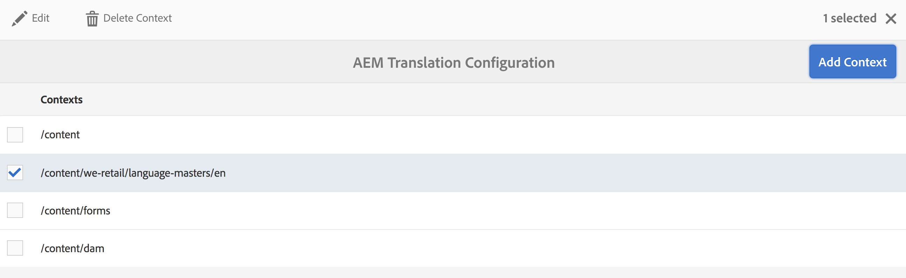
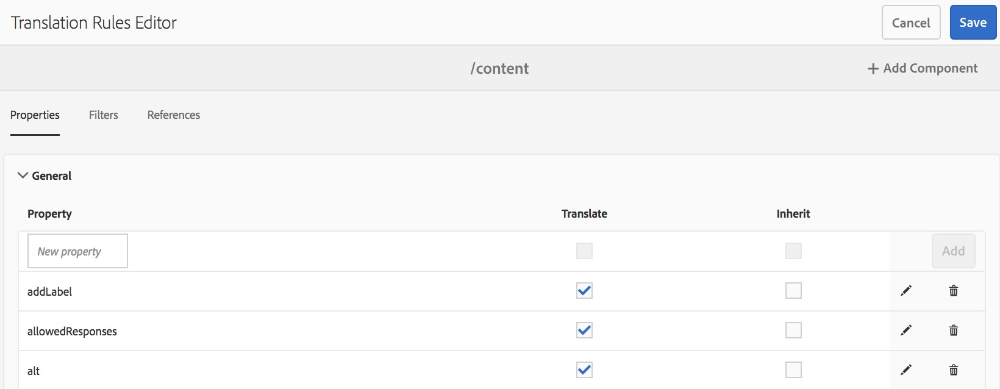

# 识别要翻译的内容{#identifying-content-to-translate}

翻译规则可标识要翻译包含在翻译项目中或从中排除的页面、组件和资产的内容。 当页面或资产被翻译时，AEM会提取此内容，以便将其发送到翻译服务。

页面和资产在JCR存储库中表示为节点。 提取的内容是节点的一个或多个属性值。 翻译规则标识包含要提取的内容的属性。

翻译规则以XML格式表示，并存储在以下可能的位置：

* `/libs/settings/translation/rules/translation_rules.xml`
* `/apps/settings/translation/rules/translation_rules.xml`
* `/conf/global/settings/translation/rules/translation_rules.xml`

该文件适用于所有翻译项目。

>[!NOTE]
>
>升级到6.4后，建议将文件从/etc移动。 有关 [更多详细信息，请参阅AEM 6.4中的](/help/sites-deploying/all-repository-restructuring-in-aem-6-4.md#translation-rules) Common Repository Restruction。

规则包括以下信息：

* 应用规则的节点的路径。 该规则也适用于节点的后代。
* 包含要翻译的内容的节点属性的名称。 该属性可以特定于特定资源类型或所有资源类型。

例如，您可以创建一个规则，该规则将作者添加的内容转换到您页面上的所有AEM foundation Text组件。 规则可以标识节 `/content` 点和组件 `text` 的属性 `foundation/components/text` 。

已添加一 [个控制台](#translation-rules-ui) ，用于配置翻译规则。 UI中的定义将为您填充文件。

有关AEM中内容翻译功能的概述，请参 [阅多语言站点翻译内容](/help/sites-administering/translation.md)。

>[!NOTE]
>
>AEM支持资源类型和引用属性之间的一对一映射，以转换页面上引用的内容。

## 页面、组件和资产的规则语法 {#rule-syntax-for-pages-components-and-assets}

规则是包含一个 `node` 或多个子元素和零个或 `property` 多个子元素的元 `node` 素：

```xml
<node path="content path">
          <property name="property name" [translate="false"]/>
          <node resourceType="component path" >
               <property name="property name" [translate="false"]/>
          </node>
</node>
```

以下各个元 `node` 素具有以下特征：

* 属 `path` 性包含规则所应用分支的根节点的路径。
* 子元 `property` 素标识要转换所有资源类型的节点属性：

   * 属 `name` 性包含属性名称。
   * 如果属 `translate` 性未转 `false` 换，则可选属性为等号。 默认情况下，该值为 `true`。 此属性在覆盖以前的规则时很有用。

* 子元 `node` 素标识要针对特定资源类型转换的节点属性：

   * 该属 `resourceType` 性包含解析到实现资源类型的组件的路径。
   * 子元 `property` 素标识要转换的节点属性。 以与节点规则的子元素相同的 `property` 方式使用此节点。

以下示例规则导致转换节点下 `text` 所有页面的所有属性的 `/content` 内容。 该规则对于在属性中存储内容的任何组 `text` 件（如基础文本组件和基础图像组件）都有效。

```xml
<node path="/content">
          <property name="text"/>
</node>
```

以下示例转换所有属性的 `text` 内容，还转换基础图像组件的其他属性。 如果其他组件具有同名属性，则规则不适用于这些组件。

```xml
<node path="/content">
      <property name="text"/>
      <node resourceType="foundation/components/textimage">
         <property name="image/alt"/>
         <property name="image/jcr:description"/>
         <property name="image/jcr:title"/>
      </node>
</node>
```

## 从页面提取资产的规则语法  {#rule-syntax-for-extracting-assets-from-pages}

使用以下规则语法包括嵌入在组件中或从组件引用的资产：

```xml
<assetNode resourceType="path to component" assetReferenceAttribute="property that stores asset"/>
```

每个 `assetNode` 元素具有以下特征：

* 一个 `resourceType` 属性等于解析到组件的路径。
* 一个 `assetReferenceAttribute` 属性等于存储资产二进制文件（对于嵌入式资产）或引用资产路径的属性的名称。

以下示例从基础图像组件中提取图像：

```xml
<assetNode resourceType="foundation/components/image" assetReferenceAttribute="fileReference"/>
```

## 覆盖规则 {#overriding-rules}

translation_rules.xml文件由一个元素组成，其 `nodelist` 中包含几个子元 `node` 素。 AEM从上到下读取节点列表。 当多个规则目标同一节点时，将使用文件中较低的规则。 例如，以下规则导致属性中除页 `text` 面分支外的所有内容 `/content/mysite/en` 都进行翻译：

```xml
<nodelist>
     <node path="/content”>
           <property name="text" />
     </node>
     <node path=“/content/mysite/en”>
          <property name=“text” translate=“false" />
     </node> 
<nodelist>
```

## 筛选属性 {#filtering-properties}

您可以使用元素筛选具有特定属性的 `filter` 节点。

例如，以下规则导致属性中的所 `text` 有内容都被翻译，但属性设置为的节 `draft` 点除外 `true`。

```xml
<nodelist>
    <node path="/content”>
     <filter>
   <node containsProperty="draft" propertyValue="true" />
     </filter>
        <property name="text" />
    </node>
<nodelist>
```

## 翻译规则UI {#translation-rules-ui}

控制台也可用于配置翻译规则。

要访问它：

1. 依次导航到 **工具** 、常规 **工具**。

   

1. 选择 **转换配置**。

   

从此处，可以添 **加上下文**。 这允许您添加路径。



然后，您需要选择上下文，然后单击“ **编辑**”。 这将打开翻译规则编辑器。


您可以通过UI更改以下4个属性： `isDeep`、 `inherit`和 `translate``updateDestinationLanguage`。

**isDeep** 此属性适用于节点过滤器，默认为true。 它检查节点（或其祖先）是否包含筛选器中具有指定属性值的属性。 如果为false，则仅检查当前节点。

例如，子节点将添加到转换作业中，即使父节点将属性设置为true以标 `draftOnly` 记草稿内容。 此 `isDeep` 处将开始播放并检查父节点是否具有 `draftOnly` true属性并排除这些子节点。

在编辑器中，您可以在过滤器选 **项卡中`s Deep`**选中/**&#x200B;取消选中&#x200B;**I。


以下是在UI中未选中“深 **层** ”时生成的xml的示例：

```xml
 <filter>
    <node containsProperty="draftOnly" isDeep="false" propertyValue="true"/>
</filter>
```

**继承** ，这适用于属性。 默认情况下，每个属性都是继承的，但如果您希望某些属性不在子项上继承，则可以将该属性标记为false，以便它仅应用于该特定节点。

在UI中，您可以选中／取消选中“ **属性** ”选项 **卡中** 的“继承”。



**translate** 转换属性只用于指定是否转换属性。

在UI中，您可以选中／取消选中“ **属性** ”选 **项卡中的** “翻译”。

**updateDestinationLanguage** 此属性用于没有文本但语言代码的属性，例如jcr:language。 用户不是在翻译文本，而是在从源到目标的语言区域设置。 此类属性不会发送以进行翻译。

在UI中，您可以选中／取消选 **中** “属性” **选项卡中** ，但是对于具有语言代码作为值的特定属性。

为了帮助澄清和之 `updateDestinationLanguage` 间的 `translate`差异，以下是仅包含两个规则的上下文的简单示例：


xml中的结果将如下所示：

```xml
<property inherit="true" name="text" translate="true" updateDestinationLanguage="false"/>
<property inherit="true" name="jcr:language" translate="false" updateDestinationLanguage="true"/>
```

## 手动编辑规则文件 {#editing-the-rules-file-manually}

随AEM一起安装的translation_rules.xml文件包含一组默认的转换规则。 您可以编辑文件以支持翻译项目的要求。 例如，您可以添加规则，以便转换自定义组件的内容。

如果编辑translation_rules.xml文件，请在内容包中保留一个备份副本。 安装AEM service pack或重新安装某些AEM包可以将当前translation_rules.xml文件替换为原始文件。 要在这种情况下恢复规则，可以安装包含备份副本的包。

>[!NOTE]
>
>创建内容包后，每次编辑文件时都重新构建该包。

## 示例翻译规则文件 {#example-translation-rules-file}

```xml
<nodelist>
    <!-- translation rules for Geometrixx Demo site (example) -->
    <node path="/content/geometrixx">
        <!-- list all node properties that should be translated -->
        <property name="jcr:title" /> <!-- translation workflows running on content saved in /content/geometrixx, will extract jcr:title values independent of the component. -->
        <property name="jcr:description" />
        <node resourceType ="foundation/components/image"> <!-- translation workflows running on content saved in /content/geometrixx, will extract alternateText values only for Image component. -->
            <property name="alternateText"/>
        </node>
        <node resourceType ="geometrixx/components/title">
            <property name="richText"/>
            <property name="jcr:title" translate="false"/> <!-- translation workflows running on content saved in /content/geometrixx, will not extract jcr:title for Title component, but instead use richText. -->
        </node>
        <node pathContains="/cq:annotations">
            <property name="text" translate="false"/> <!-- translation workflows running on content saved in /content/geometrixx, will not extract text if part of cq:annotations node. -->
        </node>
    </node>
    <!-- translation rules for Geometrixx Outdoors site (example) -->
    <node path="/content/geometrixx-outdoors">
        <node resourceType ="foundation/components/image">
            <property name="alternateText"/>
            <property name="jcr:title" />
        </node>
        <node resourceType ="geometrixx-outdoors/components/title">
            <property name="richText"/>
        </node>
    </node>
    <!-- translation rules for ASSETS (example) -->
    <node path="/content/dam">
        <!-- configure list of metadata properties here -->
        <property name="dc:title" />
        <property name="dc:description" />
    </node>
    <!-- translation rules for extracting ASSETS from SITES content, configure all components that embed or reference assets -->
    <assetNode resourceType="foundation/components/image" assetReferenceAttribute="fileReference"/>
    <assetNode resourceType="foundation/components/video" assetReferenceAttribute="asset"/>
    <assetNode resourceType="foundation/components/download" assetReferenceAttribute="fileReference"/>
    <assetNode resourceType="foundation/components/mobileimage" assetReferenceAttribute="fileReference"/>
    <assetNode resourceType="wcm/foundation/components/image" assetReferenceAttribute="fileReference"/>
</nodelist>
```

