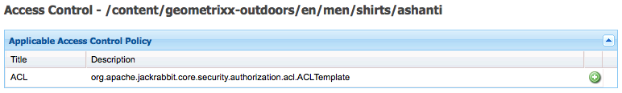

# 用户、组和访问权限管理{#user-group-and-access-rights-administration}

启用对CRX存储库的访问涉及几个主题：

* [访问权限](#how-access-rights-are-evaluated) -定义和评估权限的概念
* [用户管理](#user-administration) -管理用于访问的单个帐户
* [组管理](#group-administration) -通过组合组简化用户管理

* [访问权限管理](#access-right-management) -定义控制这些用户和组访问资源的方式的策略

基本元素有：

**用户帐户** CRX根据用户帐户中的详细信息，通过识别和验证用户（由该人或其他应用程序）来验证访问权限。

在CRX中，每个用户帐户都是工作区中的节点。 CRX用户帐户具有以下属性：

* 它代表CRX的一个用户。
* 它包含用户名和密码。
* 适用于该工作区。
* 它不能有子用户。 对于分层访问权限，您应使用组。

* 您可以指定用户帐户的访问权限。

   但是，为简化管理，我们建议（在大多数情况下）您为组帐户分配访问权限。 为每个用户分配访问权限会很快变得非常难以管理（仅存在一两个实例时，某些系统用户除外）。

**组帐户** 组帐户是用户和／或其他组的集合。 当分配给组的访问权限发生更改时，这些更改会自动应用于该组中的所有用户，这些更改用于简化管理。 用户不必属于任何组，但通常属于多个组。

在CRX中，组具有以下属性：

* 它表示一组具有共同访问权限的用户。 例如，作者或开发人员。
* 适用于该工作区。
* 它可以有成员； 这些组可以是单个用户或其他用户组。
* 可通过成员关系实现分层分组。 不能将组直接放在存储库中的另一个组下。

* 您可以为所有用户组成员定义访问权限。

**访问权限** CRX使用访问权限控制对存储库特定区域的访问。

为此，请为存储库中的资源（节点或路径）分配权限，以允许或拒绝访问。 由于可以分配各种权限，因此必须评估这些权限以确定哪个组合适用于当前请求。

CRX允许您配置用户帐户和用户组帐户的访问权限。 评估的基本原则也适用于这两种情况。

## 如何评估访问权限 {#how-access-rights-are-evaluated}

>[!NOTE]
>
>CRX实现 [由JSR-283定义的访问控制](https://docs.adobe.com/content/docs/en/spec/jcr/2.0/16_Access_Control_Management.html)。
>
>CRX存储库的标准安装被配置为使用基于资源的访问控制列表。 这是JSR-283访问控制的一个可能实现，以及Jackrabbit提供的一个实现。

### 主体与主体 {#subjects-and-principals}

CRX在评估访问权限时使用两个关键概念：

* 主体 **是** 具有访问权限的实体。 承担者包括：

   * 用户帐户。
   * 组帐户

      如果用户帐户属于一个或多个用户组，则该用户帐户也与这些用户组主体中的每个用户关联。

* 主 **体** 用于表示请求源。

   它用于合并适用于该请求的访问权限。 这些选项取自：

   * 用户主体

      直接分配给用户帐户的权限。

   * 与该用户关联的所有用户组主体

      分配给用户所属的任何组的所有权限。
   然后，结果用于允许或拒绝对所请求资源的访问。

#### 主体访问权列表的编制 {#compiling-the-list-of-access-rights-for-a-subject}

在CRX中，主题取决于：

* 用户主体
* 与该用户关联的所有用户组主体

适用于主体的访问权列表由以下各项构成：

* 直接分配给用户帐户的权限
* 加上分配给用户所属的任何组的所有权限


>[!NOTE]
>
>* CRX编译列表时不考虑任何用户层次结构。
>* CRX仅在将组作为另一个组的成员加入时使用组层次结构。 组权限没有自动继承。
>* 指定用户组的顺序不会影响访问权限。

>


### 解析请求和访问权限 {#resolving-request-and-access-rights}

当CRX处理请求时，它会将来自主题的访问请求与存储库节点上的访问控制列表进行比较：

因此，如果Linda请求更新以 `/features` 下存储库结构中的节点：


### 优先顺序 {#order-of-precedence}

CRX中的访问权限评估如下：

* 用户承担者始终优先于组承担者，而不考虑以下情况：

   * 访问控制列表
   * 在节点层次结构中的位置

* 对于给定的主体，在给定节点上存在1个拒绝和1个允许进入。 实现始终清除冗余条目，并确保允许和拒绝条目中未列出相同的权限。

>[!NOTE]
>
>此评估过程适用于标准CRX安装的基于资源的访问控制。

举两个用户是 `aUser` 组成员的示例 `aGroup`:

```xml
   + parentNode
     + acl
       + ace: aUser - deny - write
     + childNode
       + acl
         + ace: aGroup - allow - write
       + grandChildNode
```

在上述情况下：

* `aUser` 未授予对的写入权限 `grandChildNode`。

```xml
   + parentNode
     + acl
       + ace: aUser - deny - write
     + childNode
       + acl
         + ace: aGroup - allow - write
         + ace: aUser - deny - write
       + grandChildNode
```

在本例中：

* `aUser` 未授予对的写入权限 `grandChildNode`。

* 第二个ACE `aUser` 冗余。

根据多个组主体的顺序(在层次结构中和在单个访问控制列表中)评估多个组主体的访问权限。

### 最佳实践 {#best-practices}

下表列表了一些建议和最佳做法：

<table> 
 <tbody> 
  <tr> 
   <td>推荐...</td> 
   <td>原因...</td> 
  </tr> 
  <tr> 
   <td><i>使用组</i></td> 
   <td><p>避免按用户分配访问权限。 原因有几：</p> 
    <ul> 
     <li>用户比组多，因此组可以简化结构。</li> 
     <li>组帮助提供所有帐户的概述。</li> 
     <li>对于组，继承更简单。</li> 
     <li>用户来来去。 群体是长期的。</li> 
    </ul> </td> 
  </tr> 
  <tr> 
   <td><i>积极</i></td> 
   <td><p>始终使用“允许”语句指定组主体的访问权限（尽可能）。 避免使用Deny语句。</p> <p>组主体按顺序评估，在层次中和在单个访问控制列表中按顺序评估。</p> </td> 
  </tr> 
  <tr> 
   <td><i>保持简单</i></td> 
   <td><p>在配置新安装时投入一些时间和思考将得到很好的回报。</p> <p>应用清晰的结构将简化持续的维护和管理，确保您的当前同事和／或未来继任者都能轻松了解正在实施的内容。</p> </td> 
  </tr> 
  <tr> 
   <td><i>测试</i></td> 
   <td>使用测试安装来练习并确保您了解不同用户和组之间的关系。</td> 
  </tr> 
  <tr> 
   <td><i>默认用户／用户组</i></td> 
   <td>始终在安装后立即更新默认用户和用户组，以帮助防止出现任何安全问题。</td> 
  </tr> 
 </tbody> 
</table>

## 用户管理 {#user-administration}

标准对话框用于用 **户管理**。

您必须登录到相应的工作区，然后您可以从以下两者访问对话框：

* CRX **主控制台** 上的“用户管理”链接
* CRX **Explorer** 的“安全”菜单


**属性**

* **UserID**&#x200B;帐户的短名称，在访问CRX时使用。

* **主体名**&#x200B;称帐户的全文名称。

* **使用**&#x200B;此帐户访问CRX时需要密码。

* **ntlmhash**&#x200B;为每个新帐户自动分配并在密码更改时更新。

* 您可以通过定义名称、类型和值添加新属性。 单击“保存”（绿色勾号），作为每个新属性。

**组成员** 。此组件显示帐户所属的所有组。 “继承”列指示因其他用户组的成员资格而继承的成员资格。

单击GroupID（如果可用）将打开该 [组的](#group-administration) “组管理”。

**模拟者** 借助模拟功能，用户可以代表其他用户工作。

这意味着用户帐户可以指定其他帐户（用户或组），这些帐户可以与其帐户一起操作。 换言之，如果允许用户-B模拟用户-A，则用户-B可以使用用户-A的完整帐户详细信息（包括ID、名称和访问权限）执行操作。

这允许模拟者帐户完成任务，就像他们正在使用模拟的帐户一样； 例如，在缺勤期间或共享过多负荷的短期情况。

如果某个帐户假冒他人，则很难查看。 日志文件不包含有关在事件上发生模拟的事实的信息。 因此，如果用户- B是模拟用户- A所有事件看起来就像是由用户- A个人执行。

### 创建用户帐户 {#creating-a-user-account}

1. 打开“用 **户管理** ”对话框。
1. 单击“ **创建用户**”。
1. 然后，您可以输入属性：

   * **用作帐户** 名的用户ID。
   * **登录** 时需要口令。
   * **主体名称** ，用于提供完整的文本名称。
   * **中间路径** ，可用于形成树结构。

1. 单击“保存”（绿色勾号）。
1. 对话框将展开，这样您可以：

   1. Configure **Properties**.
   1. 请参 **阅组成员**。
   1. 定义 **模拟**。

>[!NOTE]
>
>在安装中注册新用户时，有时会出现性能损失，这些用户同时具有以下两种功能：
>
>* 用户
>* 组 有许多成员

>


### 更新用户帐户 {#updating-a-user-account}

1. 使用“用 **户管理** ”对话框打开所有帐户的列表视图。

1. 在树结构中导航。
1. 单击所需的帐户以打开进行编辑。
1. 进行更改，然后单击该条目的“保存”（绿色勾号）。
1. 单击 **关闭** 以完成，或 **列表..** .以返回所有用户帐户的列表。

### 删除用户帐户 {#removing-a-user-account}

1. 使用“用 **户管理** ”对话框打开所有帐户的列表视图。

1. 在树结构中导航。
1. 选择所需的帐户，然后单击“ **删除用户”**; 帐户将立即删除。

>[!NOTE]
>
>此操作将从存储库中删除此主体的节点。
>
>访问权限条目不会被删除。 这保证了历史的完整性。

### 定义属性 {#defining-properties}

您可以为新 **帐户** 或现有帐户定义属性：

1. 打开相应 **帐户的** “用户管理”对话框。
1. 定义属 **性** 名称。
1. Select the **Type** from the drop-down list.
1. 定义 **值**。
1. 单击“保存”（绿色单击符号）作为新属性。

可以使用垃圾桶符号删除现有属性。

除密码外，属性无法编辑，必须删除并重新创建。

#### 更改密码 {#changing-the-password}

Password **是** （密码）的特殊属性，可单击Change Password（更改密码）链 **接进行更** 改。

您还可以从CRX Explorer的“安全”菜单将密码 **更改** 为您自己的用户帐户。

### 定义模拟器 {#defining-an-impersonator}

您可以为新帐户或现有帐户定义模拟器：

1. 打开相应 **帐户的** “用户管理”对话框。
1. 指定允许模拟该帐户的帐户。

   您可以使用浏览……来选择现有帐户。

1. 单击“保存”（绿色勾号）作为新属性。

## 组管理 {#group-administration}

“组管理”使用标 **准对话框**。

您必须登录到相应的工作区，然后您可以从以下两者访问对话框：

* CRX **主控制台** 上的“组管理”链接
* CRX **Explorer** 的“安全”菜单


**属性**

* **组ID**&#x200B;组帐户的短名称。

* **主体名**&#x200B;称组帐户的全文名称。

* 您可以通过定义名称、类型和值添加新属性。 单击“保存”（绿色勾号），作为每个新属性。
* **成员**&#x200B;您可以添加用户或其他用户组作为此用户组的成员。

**组成员** 。这将显示当前组帐户所属的所有组。 “继承”列指示因其他用户组的成员资格而继承的成员资格。

单击GroupID将打开该组的对话框。

**成员** 列表属于当前组成员的所有帐户（用户和／或组）。

“继 **承** ”列指示由于其他用户组的成员关系而继承的成员关系。

>[!NOTE]
>
>当向任何资产文件夹上的用户分配了“所有者”、“编辑者”或“查看者”角色时，系统会创建一个新组。 组名称的格式适 `mac-default-<foldername>` 用于定义角色的每个文件夹。

### 创建组帐户 {#creating-a-group-account}

1. 打开“组 **管理** ”对话框。
1. 单击 **创建组**。
1. 然后，您可以输入属性：

   * **主体名称** ，用于提供完整的文本名称。
   * **中间路径** ，可用于形成树结构。

1. 单击“保存”（绿色勾号）。
1. 对话框将展开，这样您可以：

   1. Configure **Properties**.
   1. 请参 **阅组成员**。
   1. 管理 **成员**。

### 更新组帐户 {#updating-a-group-account}

1. 使用“ **组管理** ”对话框打开所有帐户的列表视图。

1. 在树结构中导航。
1. 单击所需的帐户以打开进行编辑。
1. 进行更改，然后单击该条目的“保存”（绿色勾号）。
1. 单击 **关闭** 以完成，或 **列表..** .以返回所有组帐户的列表。

### 删除组帐户 {#removing-a-group-account}

1. 使用“ **组管理** ”对话框打开所有帐户的列表视图。

1. 在树结构中导航。
1. 选择所需的帐户，然后单击“ **删除组”**; 帐户将立即删除。

>[!NOTE]
>
>此操作将从存储库中删除此主体的节点。
>
>访问权限条目不会被删除。 这保证了历史的完整性。

### 定义属性 {#defining-properties-1}

您可以为新帐户或现有帐户定义属性：

1. 打开相应 **帐户的** “组管理”对话框。
1. 定义属 **性** 名称。
1. Select the **Type** from the drop-down list.
1. 定义 **值**。
1. 单击“保存”（绿色勾号）作为新属性。

可以使用垃圾桶符号删除现有属性。

### 成员 {#members}

您可以向当前组添加成员：

1. 打开相应 **帐户的** “组管理”对话框。
1. 可以任选其一：

   * 输入所需成员的名称（用户或组帐户）。
   * 或者使 **用浏览。.** .搜索并选择要添加的主体（用户或用户组帐户）。

1. 单击“保存”（绿色勾号）作为新属性。

或删除具有垃圾桶符号的现有成员。

## 访问权限管理 {#access-right-management}

使用访问控制 **的CRXDE Lite** 选项卡，您可以定义访问控制策略并分配相关权限。

例如，对于“ **当前路径** ”，请在左窗格中选择所需的资源，然后在右下窗格中选择“访问控制”选项卡：


这些策略按以下方式进行分类：

* **适用的访问控制**&#x200B;策略可以应用这些策略。

   这些策略可用于创建本地策略。 选择并添加适用的策略后，该策略将变为本地策略。

* **本地访问控制**&#x200B;策略您已应用这些访问控制策略。 然后，您可以更新、订购或删除它们。

   本地策略将覆盖从父级继承的所有策略。

* **有效的访问控制**&#x200B;策略这些是现在对任何访问请求有效的访问控制策略。 它们显示从本地策略和从父级继承的任何策略派生的聚合策略。

### 策略选择 {#policy-selection}

可以为以下对象选择策略：

* **当前路**&#x200B;径如上例所示，在存储库中选择一个资源。 将显示此“当前路径”的策略。

* **存储库**&#x200B;选择存储库级别访问控制。 例如，在 
`jcr:namespaceManagement` 权限，仅与存储库相关，而与节点无关。

* **主体**&#x200B;在存储库中注册的主体。

   您可以键入“主体 **名** ”(Principal name)或单击字段右侧的图标以打开“选 **择主体”(Select Principal** )对话框。

   这允许您 **搜索** “用 **户****”**&#x200B;或“组”。 从生成的列表中选择所需的主体，然 **后单击** “确定”以将值返回到上一个对话框。


>[!NOTE]
>
>为简化管理，我们建议您为组帐户而非单个用户帐户分配访问权限。
>
>管理几个组比管理许多用户帐户更容易。

### 权限 {#privileges}

在添加访问控制条目时，可以选择以下权限(有关完整 [详细信息](https://docs.adobe.com/docs/en/spec/javax.jcr/javadocs/jcr-2.0/javax/jcr/security/Privilege.html) ，请参阅安全API):

<table> 
 <tbody> 
  <tr> 
   <th><strong>权限名称</strong></th> 
   <th><strong>它控制对……</strong></th> 
  </tr> 
  <tr> 
   <td><code>jcr:read</code></td> 
   <td>检索节点并读取其属性及其值。</td> 
  </tr> 
  <tr> 
   <td><code>rep:write</code></td> 
   <td>这是jcr:write和jcr:nodeTypeManagement的一个jackrabbit特定聚合权限。<br /> </td> 
  </tr> 
  <tr> 
   <td><code>jcr:all</code></td> 
   <td>这是包含所有其他预定义权限的聚合权限。</td> 
  </tr> 
  <tr> 
   <td><strong>高级</strong></td> 
   <td> </td> 
  </tr> 
  <tr> 
   <td><code>crx:replicate</code></td> 
   <td>执行节点复制。</td> 
  </tr> 
  <tr> 
   <td><code>jcr:addChildNodes</code></td> 
   <td>创建节点的子节点。</td> 
  </tr> 
  <tr> 
   <td><code>jcr:lifecycleManagement</code></td> 
   <td>在节点上执行生命周期操作。</td> 
  </tr> 
  <tr> 
   <td><code>jcr:lockManagement</code></td> 
   <td>锁定和解锁节点； 刷新锁。</td> 
  </tr> 
  <tr> 
   <td><code>jcr:modifyAccessControl</code></td> 
   <td>修改节点的访问控制策略。</td> 
  </tr> 
  <tr> 
   <td><code>jcr:modifyProperties</code></td> 
   <td>创建、修改和删除节点的属性。</td> 
  </tr> 
  <tr> 
   <td><code>jcr:namespaceManagement</code></td> 
   <td>注册、注销和修改命名空间定义。</td> 
  </tr> 
  <tr> 
   <td><code>jcr:nodeTypeDefinitionManagement</code></td> 
   <td>将节点类型定义导入存储库。</td> 
  </tr> 
  <tr> 
   <td><code>jcr:nodeTypeManagement</code></td> 
   <td>添加和删除混合节点类型并更改节点的主节点类型。 这还包括对Node.addNode和XML导入方法的任何调用，其中显式指定了新节点的混音或主类型。</td> 
  </tr> 
  <tr> 
   <td><code>jcr:readAccessControl</code></td> 
   <td>阅读节点的访问控制策略。</td> 
  </tr> 
  <tr> 
   <td><code>jcr:removeChildNodes</code></td> 
   <td>删除节点的子节点。</td> 
  </tr> 
  <tr> 
   <td><code>jcr:removeNode</code></td> 
   <td>删除节点。</td> 
  </tr> 
  <tr> 
   <td><code>jcr:retentionManagement</code></td> 
   <td>在节点上执行保留管理操作。</td> 
  </tr> 
  <tr> 
   <td><code>jcr:versionManagement</code></td> 
   <td>对节点执行版本控制操作。</td> 
  </tr> 
  <tr> 
   <td><code>jcr:workspaceManagement</code></td> 
   <td>通过JCR API创建和删除工作区。</td> 
  </tr> 
  <tr> 
   <td><code>jcr:write</code></td> 
   <td>这是一种聚合权限，它包含：<br /> - jcr:modifyProperties<br /> - jcr:addChildNodes<br /> - jcr:removeNode<br /> - jcr:removeChildNodes</td> 
  </tr> 
  <tr> 
   <td><code>rep:privilegeManagement</code></td> 
   <td>注册新权限。</td> 
  </tr> 
 </tbody> 
</table>

### 注册新权限 {#registering-new-privileges}

您还可以注册新权限：

1. 在工具栏中，选 **择工具**，然后选择 **权限** ，以显示当前注册的权限。

   

1. 使用注 **册权限** 图标&#x200B;**(+**)打开对话框并定义新权限：

   

1. 单击&#x200B;**确定**&#x200B;进行保存。该权限现在可供选择。

### 添加访问控制条目 {#adding-an-access-control-entry}

1. 选择您的资源并打开“ **访问控制** ”选项卡。

1. 要添加新的 **本地访问控制策略**，请单 **击适用访问控制策略** 列表右侧 **的+图标** :

   

1. 新条目显示在“本地 **访问控制策略”下：**

   

1. 单击 **+图** 标以添加新条目：

   

   >[!NOTE]
   >
   >当前需要一种解决方法来指定空字符串。
   >
   >为此，您需要使用“”。

1. 定义访问控制策略，然后单 **击** “确定”保存。 您的新政策将：

   * 列在本地 **访问控制政策下**
   * 更改将反映在有效 **访问控制策略中**。

CRX将验证您的选择； 对于给定的主体，在给定节点上存在1个拒绝和1个允许进入。 实现始终清除冗余条目，并确保允许和拒绝条目中未列出相同的权限。

### Ordering Local Access Control Policies {#ordering-local-access-control-policies}

列表中的顺序指示应用策略的顺序。

1. 在“本地访问控制 **策略** ”(Local Adobe Policies)的表中，选择所需的条目，并将其拖动到表中的新位置。

   

1. 更改将显示在“本地”和“有效 **访问控制** ” **策略的表中**。

### 删除访问控制策略 {#removing-an-access-control-policy}

1. 在“本地 **访问控制策略** ”(Local Sign Policys)表格中，单击条目右侧的红色图标(-)。

1. 该条目将从“本地”和“有效 **访问控制** ”策 **略的表中删除**。

### 测试访问控制策略 {#testing-an-access-control-policy}

1. 从CRXDE Lite工具栏中 **选择**&#x200B;工具， **然后选择测试访问控制...**.

1. 将在右上窗格中打开新对话框。 选择 **要测** 试的路 **径和** /或主体。

1. 单击 **“Test** （测试）”查看选择结果：

   

