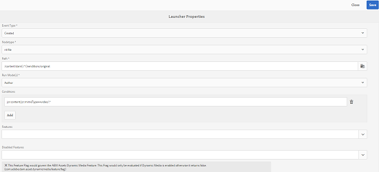

# 资产工作流卸载程序{#assets-workflow-offloader}

资产工作流卸载程序允许您启用Adobe Experience Manager(AEM)资产的多个实例，以减少主（引导）实例的处理负荷。 处理负载分布在引线实例和添加到引线实例的各种卸载程序（工作器）实例之间。 分配资产的处理负荷，提高了AEM Assets处理资产的效率和速度。 此外，它还有助于分配专用资源以处理特定MIME类型的资产。 例如，您可以在拓扑中分配特定节点，以仅处理InDesign资产。

## 配置卸载程序拓扑 {#configure-offloader-topology}

使用Configuration Manager为引线实例添加URL，为引线实例上的连接请求添加卸载程序实例的主机名。

1. 点按／单击AEM徽标，然后选择“ **工具** ”> **“操作** ” **>“** Web控制台”以打开Configuration Manager。
1. 从Web控制台中，选择“ **Sling** ”>“ **拓扑管理**”。

   

1. 在拓扑管理页面中，点按／单 **击配置Discovery.Oak服务** 链接。

   

1. 在“发现服务配置”页中，在“拓扑连接器URL”字段中指定引 **线实例的连接器** URL。

   

1. 在拓扑 **连接器白名单** 字段中，指定允许与引线实例连接的卸载程序实例的IP地址或主机名。 Tap/click **Save**.

   

1. 要查看连接到引线实例的卸载程序实例，请转 **到“工具** ”>“ **部署** ” **>“拓** 扑”，然后点按／单击“群集”视图。

## 禁用卸载 {#disable-offloading}

1. 点按／单击AEM徽标，然后选择“ **工具** ”> **“部署** ” **>“**&#x200B;卸载”。 “卸 **载浏览器** ”页显示主题和可以使用这些主题的服务器实例。

   

1. 在用户 *与之交互以上传或更改AEM资产的领导实例上* ，禁用com/adobe/granite/workflow/offloading主题。

   

## 在引导器实例上配置工作流启动器 {#configure-workflow-launchers-on-the-leader-instance}

将工作流启动器配置为在 **引导实例上使用** DAM更新资产卸载工作流，而 **不是Dam更新资产工作流** 。

1. 点按／单击AEM徽标，然后选择“工 **具** ”>“工 **作流** ” **>“启** 动器 **”以打开Workflow** Launchers控制台。

   

1. 找到两个已分别创建事件类型节 **点和已修改****节点的启动器配置** ，它们运行 **DAM更新资产工作流** 。
1. 对于每个配置，选中前面的复选框，然后点按／单 **击工具栏中的** “视图属性”图标 **，以显示“启动** 器属性”对话框。

   

1. 从“工 **作流** ”列表中 **，选择“** DAM更新资产卸载 **”，然后点按／单**&#x200B;击保存。

   

1. 点按／单击AEM徽标，然后选择“工 **具** ”>“工 **作流** ” **>“模** 型 **”以打开“工作流** 模型”页。
1. 选择DAM **更新资产分载工作流** ，然后点按／单击工 **具栏中的** 编辑，以显示其详细信息。

   

1. 显示“DAM工作流卸载” **步骤的上下文菜单** ，然后选择“ **编辑”**。 验证配置对话 **框“通用** 参数”选 **项卡的“作** 业主题”字段中的条目。

   

## 在卸载程序实例上禁用工作流启动程序 {#disable-the-workflow-launchers-on-the-offloader-instances}

禁用在引导实例上运行 **DAM更新资产工作流** 的工作流启动程序。

1. 点按／单击AEM徽标，然后选择“工 **具** ”>“工 **作流** ” **>“启** 动器 **”以打开Workflow** Launchers控制台。

   

1. 找到两个已分别创建事件类型节 **点和已修改****节点的启动器配置** ，它们运行 **DAM更新资产工作流** 。
1. 对于每个配置，选中前面的复选框，然后点按／单 **击工具栏中的** “视图属性”图标 **，以显示“启动** 器属性”对话框。

   

1. 在**激活**部分，拖动滑块以禁用工作流启动器，然后点按／单击 **保存** 以禁用它。

   

1. 在引导实例上传任何图像类型的资产。 验证卸载的实例为资产生成并移回的缩略图。

