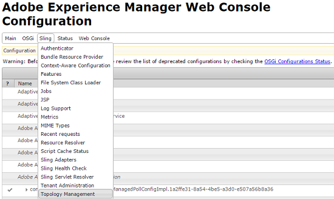
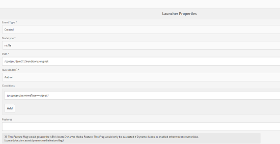

# 资产工作流卸载程序{#assets-workflow-offloader}

>[!CAUTION]
>
>AEM 6.4已结束扩展支持，本文档将不再更新。 有关更多详细信息，请参阅 [技术支助期](https://helpx.adobe.com/cn/support/programs/eol-matrix.html). 查找支持的版本 [此处](https://experienceleague.adobe.com/docs/).

资产工作流卸载程序允许您启用Adobe Experience Manager(AEM)资产的多个实例，以减少主（领导）实例的处理负载。 处理负载分布在领导实例和您添加到该实例的各种卸载程序（工作程序）实例之间。 分配资产的处理负载可提高AEM Assets处理资产的效率和速度。 此外，它还有助于分配专用资源以处理特定MIME类型的资产。 例如，您可以在拓扑中分配特定节点，以仅处理InDesign资产。

## 配置卸载程序拓扑 {#configure-offloader-topology}

使用配置管理器为引导实例添加URL，为引导实例上的连接请求添加卸载程序实例的主机名。

1. 点按/单击AEM徽标，然后选择 **工具** > **操作** > **Web控制台** 打开配置管理器。
1. 从Web控制台中，选择 **Sling** >  **拓扑管理**.

   

1. 在拓扑管理页面中，点按/单击 **配置Discovery.Oak服务** 链接。

   

1. 在发现服务配置页面中，为中的领导实例指定连接器URL **拓扑连接器URL** 字段。

   

1. 在 **拓扑连接器白名单** 字段中，指定允许与领导实例连接的卸载程序实例的IP地址或主机名。 点按/单击 **保存**.

   

1. 要查看与引线实例连接的卸载程序实例，请转到 **工具** > **部署** > **拓扑** ，然后点按/单击“群集”视图。

## 禁用卸载 {#disable-offloading}

1. 点按/单击AEM徽标，然后选择 **工具** > **部署** > **卸载**. 的 **卸载浏览器** 页面显示主题和服务器实例，这些主题可以使用。

   

1. 禁用 *com/adobe/granite/workflow/offloading* 主题介绍用户通过交互上传或更改AEM资产的领导实例。

   

## 在领导实例上配置工作流启动器 {#configure-workflow-launchers-on-the-leader-instance}

配置工作流启动器以使用 **DAM更新资产卸载** 在领导实例而不是 **Dam更新资产** 工作流。

1. 点按/单击AEM徽标，然后选择 **工具** > **工作流** > **启动器** 打开 **工作流启动器** 控制台。

   

1. 找到事件类型的两个启动器配置 **已创建节点** 和 **已修改节点** 分别运行 **DAM更新资产** 工作流。
1. 对于每个配置，选中其前面的复选框，然后点按/单击 **查看属性** 图标来显示 **启动器属性** 对话框。

   

1. 从 **工作流** 列表，选择 **DAM更新资产卸载** 然后点按/单击 **保存**.

   

1. 点按/单击AEM徽标，然后选择 **工具** > **工作流** > **模型** 打开 **工作流模型** 页面。
1. 选择 **DAM更新资产卸载** 工作流，然后点按/单击 **编辑** 来显示其详细信息。

   

1. 显示 **DAM工作流卸载** 步骤，然后选择 **编辑**. 验证 **作业主题** 字段 **通用参数** 选项卡。

   

## 在卸载程序实例上禁用工作流启动器 {#disable-the-workflow-launchers-on-the-offloader-instances}

禁用运行 **DAM更新资产** 工作流。

1. 点按/单击AEM徽标，然后选择 **工具** > **工作流** > **启动器** 打开 **工作流启动器** 控制台。

   

1. 找到事件类型的两个启动器配置 **已创建节点** 和 **已修改节点** 分别运行 **DAM更新资产** 工作流。
1. 对于每个配置，选中其前面的复选框，然后点按/单击 **查看属性** 图标来显示 **启动器属性** 对话框。

   

1. 在**激活**部分中，拖动滑块以禁用工作流启动器，然后点按/单击 **保存** 来禁用它。

   

1. 在领导者实例上传图像类型的任何资产。 验证已卸载的实例为资产生成并移回的缩略图。
